## Выпуск документации

Параметры выпуска документации редактируются по тому же принципу, что и в предыдущих разделах. В этом разделе мы рассмотрим редактирование параметров, которые не влияют на геометрические свойства элементов, но необходимы для подготовки файла Revit к выпуску документации.

#### Отклонение

В упражнении ниже, чтобы создать лист Revit для документации, будет использоваться стандартный узел Deviation from Plane (отклонение от плоскости). Каждая панель в конструкции крыши, определенной параметрически, имеет собственное значение отклонения. Необходимо указать диапазон значений, используя цвет и составив спецификацию адаптивных точек, для передачи консультанту, инженеру или подрядчику, работающим с фасадом.


> Узел Deviation from Plane вычисляет расстояние, на которое отклоняется набор из четырех точек относительно оптимально вписанной между ними плоскости. Это простой и быстрый способ проверки технологичности конструкции.

### Упражнение

> Скачайте файлы примера для этого упражнения (щелкните правой кнопкой мыши и выберите «Сохранить ссылку как...»). Полный список файлов примеров можно найти в приложении.

> 1. [Documenting.dyn](datasets/8-6/Documenting.dyn)
2. [ARCH-Documenting-BaseFile.rvt](datasets/8-6/ARCH-Documenting-BaseFile.rvt)

Начнем с файла Revit (можно также продолжить работу с файлом из предыдущего раздела). В этом файле представлен массив панелей ETFE на крыше. Мы будем использовать эти панели в ходе выполнения упражнения.

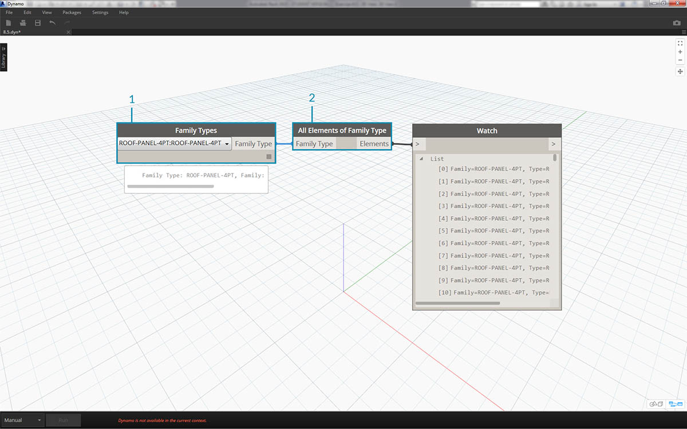

> 1. Добавьте узел *Family Types* в рабочую область и выберите *ROOF-PANEL-4PT*.
2. Соедините этот узел с узлом *All Elements of Family Type*, чтобы перенести все элементы из Revit в Dynamo.

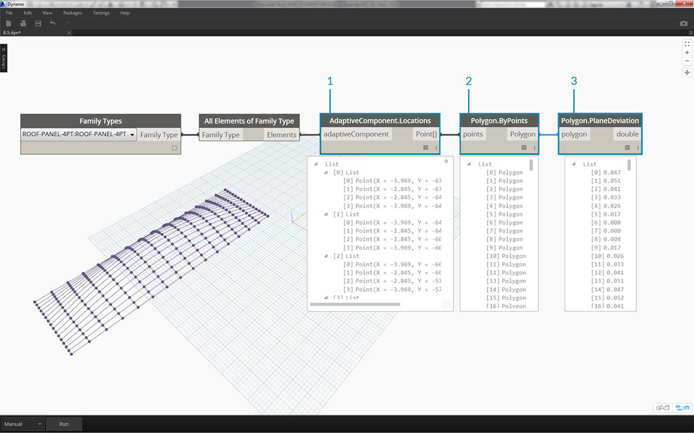

> 1. Запросите местоположение адаптивных точек каждого элемента с помощью узла *AdaptiveComponent.Locations*.
2. Создайте полигон по этим четырем точкам с помощью узла *Polygon.ByPoints*. Обратите внимание, что в Dynamo используется абстрактная версия системы панелей (без необходимости импорта всей геометрии элемента Revit).
3. Вычислите отклонение от плоскости с помощью узла *Polygon.PlaneDeviation*.


> Просто в качестве дополнения, как и в предыдущем упражнении, укажем *коэффициент апертуры* каждой панели на основе отклонения от плоскости.

> 1. Добавьте узел *Element.SetParameterByName* в активное окно и соедините адаптивные компоненты с входным параметром *element*. Соедините *блок кода*, содержащий строку *Aperture Ratio*, с входным параметром *parameterName*.
2. Напрямую соединить результаты отклонения с входным параметром значения невозможно, так как необходимо перенастроить значения на другой диапазон параметров.


> 1. С помощью узла *Math.RemapRange* перенастройте значения отклонения на область между *.15* и *.45*.
2. Соедините эти результаты с входным параметром value узла *Element.SetParameterByName*.

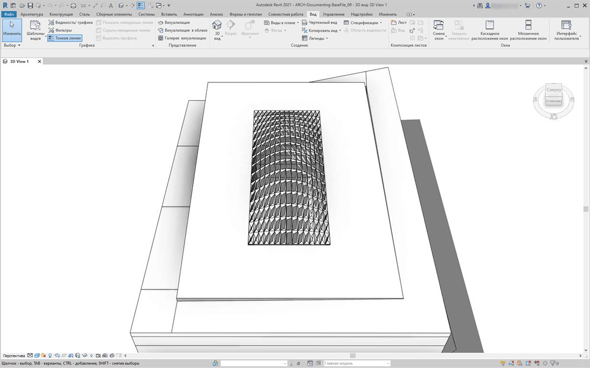

> Вернувшись в Revit, можно *примерно* оценить изменение в апертуре на поверхности.

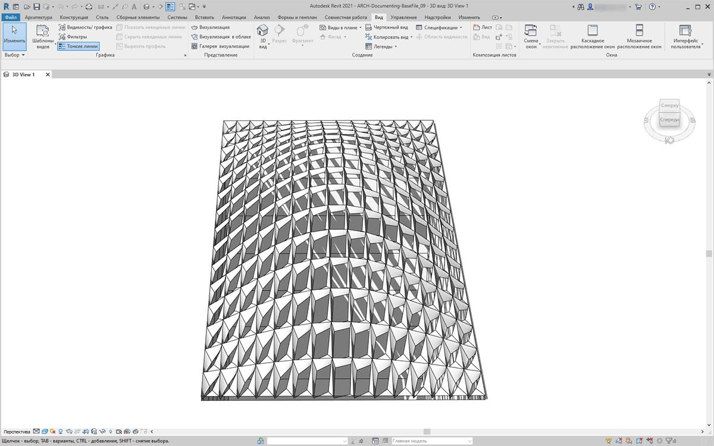

> При увеличении масштаба становится понятно, что вес замкнутых панелей направлен к углам поверхности. Незамкнутые углы направлены вверх. Углы представляют собой участки более значительных отклонений, в то время как выпуклость имеет минимальную кривизну, что вполне оправдано.

### Цвет и документация

Указание коэффициента апертуры не дает четкой картины отклонения панелей на крыше. Кроме того, изменяется геометрия самого элемента. Предположим, нужно просто изучить отклонение с точки зрения технической осуществимости изготовления. Для этого в документации можно окрасить панели в различные цвета в зависимости от диапазона отклонений. Это можно сделать при помощи следующих шагов, которые очень похожи на действия, описанные выше.


> 1. Удалите узлы *Element.SetParameterByName* и добавьте узел *Element.OverrideColorInView*.
2. Добавьте узел *Color Range* в рабочую область и соедините с входным параметром color узла *Element.OverrideColorInView*. Для создания градиента необходимо также соединить значения отклонения с цветовым диапазоном.
3. При наведении курсора на входной параметр *value* видно, что значения входного параметра должны быть в диапазоне от *0* до *1*. Только в этом случае можно сопоставить цвета со значениями. Необходимо перенастроить значения отклонения, задав этот диапазон.


> 1. С помощью узла *Math.RemapRange* перенастройте значения отклонения от плоскости, задав диапазон от *0* до *1*. (Примечание. Чтобы задать исходную область, можно также использовать узел *MapTo*).
2. Соедините результаты с узлом *Color Range*.
3. Обратите внимание, что в результате получается диапазон цветов, а не диапазон чисел.
4. Если используется режим «Вручную», нажмите кнопку *Запуск*. С этого момента необходимо избегать работы в автоматическом режиме.

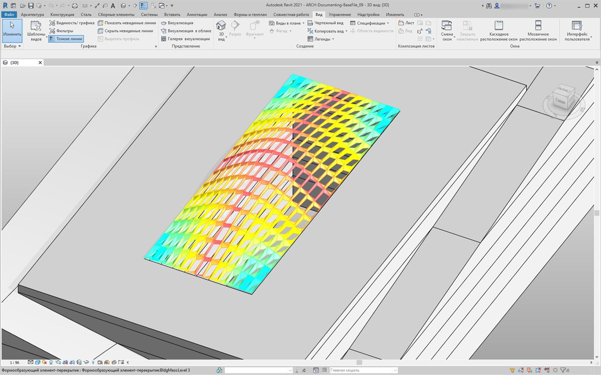

> Вернувшись в Revit, видим значительно более наглядный градиент, характеризующий отклонение от плоскости на основе цветового диапазона. Но что, если требуется изменить цвета? Обратите внимание, что минимальные значения отклонения обозначены красным цветом, что не вполне логично. Необходимо, чтобы максимальному отклонению соответствовал красный, а минимальному — более спокойный цвет. Вернемся в Dynamo и устраним этот недостаток.


> 1. Используя *блок кода*, добавьте два числа в две разные строки: ```0;``` и ```255;```.
2. Создайте красный и синий цвета, соединив соответствующие значения с двумя узлами *Color.ByARGB*.
3. Создайте список из этих двух цветов.
4. Соедините этот список с входным параметром *colors* узла *Color Range*, наблюдая за изменением пользовательского цветового диапазона.

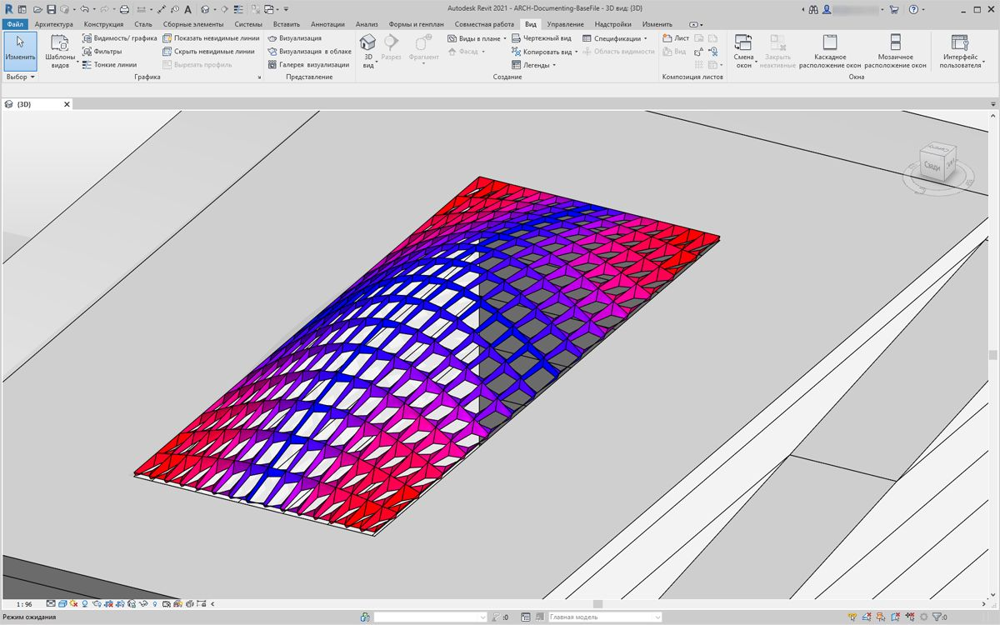

> Вернувшись в Revit, теперь можно получить более наглядное представление о максимальном отклонении в углах. Помните, что этот узел служит для переопределения цвета на виде, поэтому он может оказаться действительно полезным, если в наборе чертежей определенный лист предназначен для определенного типа расчета.

### Создание спецификаций

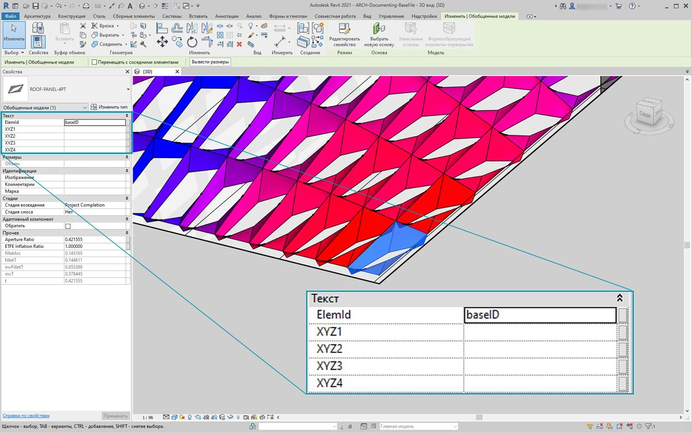

> 1. При выборе в Revit одной панели ETFE отображаются четыре параметра экземпляра: *XYZ1, XYZ2, XYZ3* и *XYZ4*. После создания все они будут пустыми. Это текстовые параметры, для которых требуется задать значения. С помощью Dynamo создадим местоположения адаптивных точек для каждого параметра. Это способствует взаимодействию, если необходимо отправить геометрический объект инженеру или консультанту по фасадам.

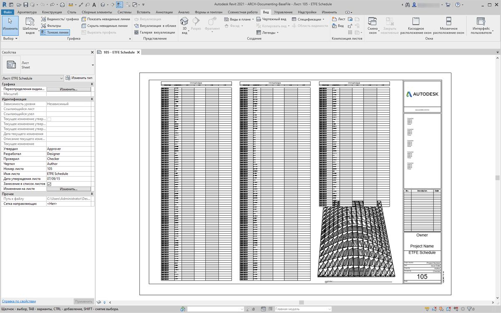

> На образце листа представлена большая пустая спецификация. Параметры XYZ являются общедоступными параметрами в файле Revit, что позволяет добавить их в спецификацию.

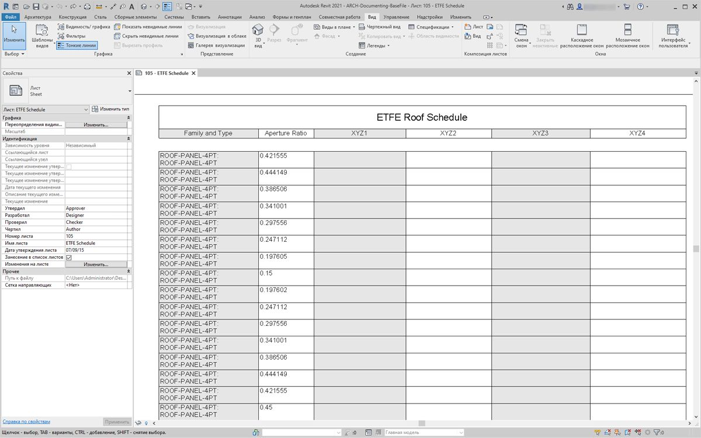

> Если увеличить масштаб, видно, что параметры XYZ еще не заполнены. Первые два столбца автоматически заполняются из Revit.


> Для ввода этих значений выполним сложную операцию со списком. Сам график довольно прост, но его логика строится на основе сопоставления списков, которое рассматривалось в разделе, посвященном спискам.

> 1. Выберите все адаптивные компоненты с двумя узлами.
2. Извлеките местоположение каждой точки с помощью узла *AdaptiveComponent.Locations*.
3. Преобразуйте эти точки в строки. Следует помнить, что параметр является текстовым, поэтому необходимо ввести правильный тип данных.
4. Создайте список из четырех строк, которые определяют изменяемые параметры: *XYZ1, XYZ2, XYZ3* и *XYZ4*.
5. Соедините этот список с входным параметром *parameterName* узла *Element.SetParameterByName*.
6. Соедините узел *Element.SetParameterByName* с входным параметром *combinator* узла *List.Combine.*
7. Соедините *адаптивные компоненты* с входным параметром *list1*.
8. Соедините узел *String from Object* с входным параметром *list2*.
9. В данном случае мы сопоставляем списки, так как вводим четыре значения для каждого элемента, что создает сложную структуру данных. Узел *List.Combine* управляет операцией, выполняемой на один шаг вниз по иерархии данных. Именно поэтому входные параметры element и value остаются пустыми. Узел *List.Combine* соединяет вложенные списки своих входных данных с пустыми входными параметрами узла *List.SetParameterByName* в зависимости от порядка их подсоединения.

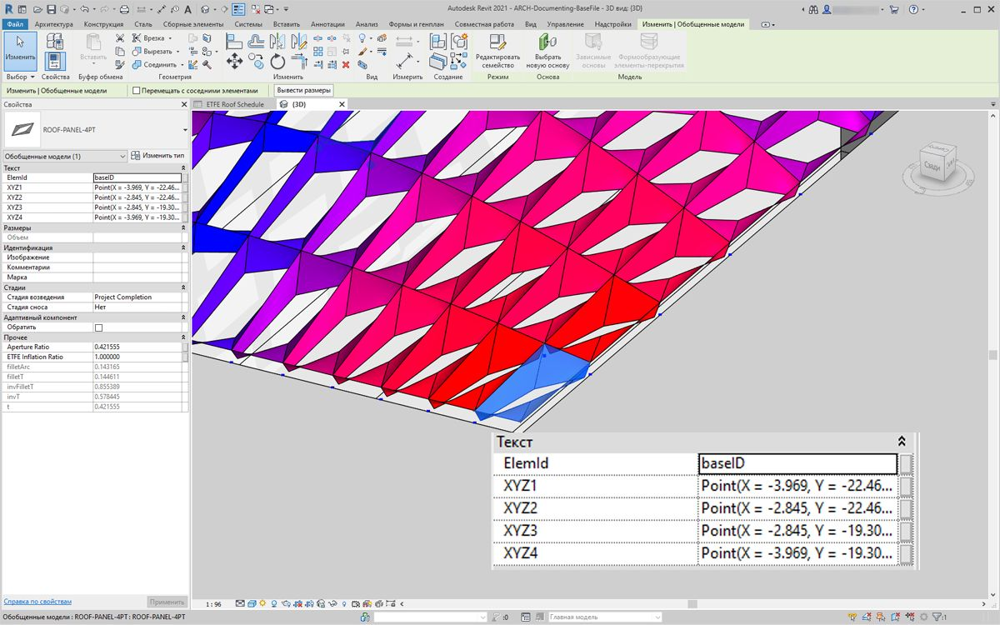

> При выборе панели в Revit видим, что для каждого параметра есть строковые значения. В реальном проекте для создания точки (X,Y,Z) использовался бы более простой формат. Это можно сделать с помощью строковых операций в Dynamo, но этот метод не рассматривается в рамках данного раздела.

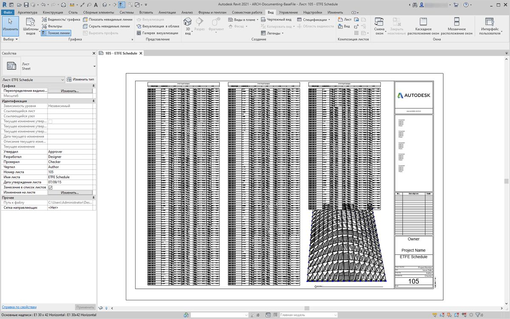

> Вид образца спецификации с заполненными параметрами.

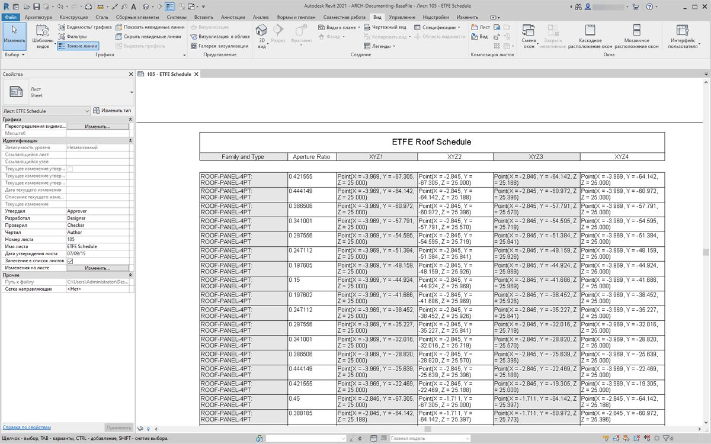

> Каждая панель ETFE теперь имеет координаты XYZ, которые были созданы для каждой адаптивной точки, соответствующей углам изготавливаемой панели.

