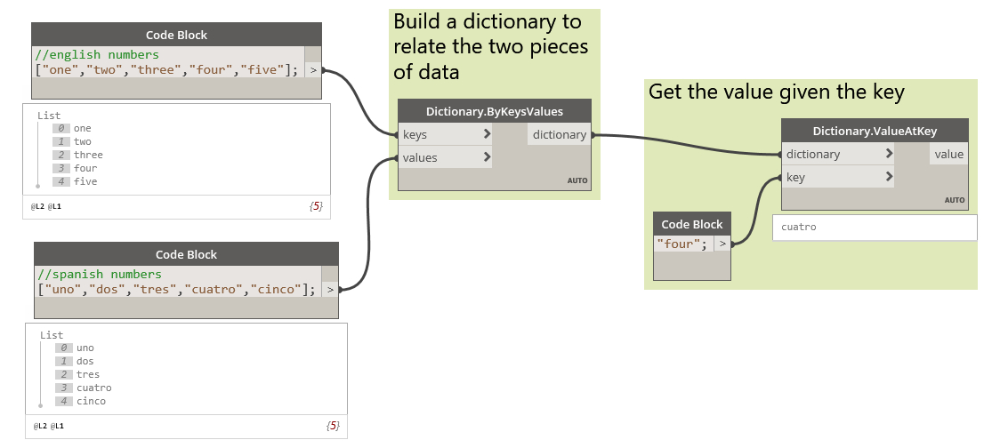

# Словари
Dynamo 2.0 включает новый тип данных — список, являющийся ответвлением типа данных словаря. Это нововведение может повлечь за собой существенные изменения в подходах к созданию и использованию данных в рамках рабочих процессов. До версии 2.0 словари и списки относились к одному типу данных. Если говорить коротко, то списки — это словари с целочисленными ключами.

* #### Что такое словарь
Словарь — это тип данных, образуемый набором пар «ключ — значение». Ключ каждого набора является уникальным. Содержимое словаря не упорядочено. Поиск данных осуществляется с использованием ключа, а не по значению индекса, как в списке. *В Dynamo 2.0 поддерживаются только строковые ключи.*

* #### Что такое список
Список — это тип данных, образуемый набором упорядоченных значений. В списках Dynamo в качестве индексов используются целочисленные значения.

* #### Зачем были сделаны эти изменения и как это касается пользователей
В результате разделения словарей и списков словари получили своеобразный статус высшего класса: они позволяют легко и быстро хранить и находить значения, и для этого не нужно запоминать значения индекса или поддерживать строгую структуру списка на протяжении всего рабочего процесса. На этапе тестирования было выявлено значительное уменьшение размеров графиков при использовании словарей вместо нескольких узлов ```GetItemAtIndex```.

* #### В чем заключаются изменения
  * *Синтаксис*: обновления привели к изменениям в процессах запуска и использования словарей и списков в блоках кода.
    * В словарях используется следующий синтаксис: ```{ключ:значение}```
    * В списках используется следующий синтаксис: ```[значение,значение,значение]```
  * В библиотеку добавлены *новые узлы*, которые позволяют создавать, изменять и запрашивать словари.
  * Списки, созданные в блоках кода версии 1.x, при загрузке сценария автоматически обновляются до нового синтаксиса списка, в котором используются квадратные скобки ```[ ]``` вместо фигурных ```{ }```. 

* #### Как эти изменения повлияют на пользователей и что они им дают
С точки зрения информатики как науки, словари, как и списки, являются наборами объектов. Элементы в списках хранятся с соблюдением определенного порядка. Содержимое словарей *не упорядочивается*. В словарях не используется последовательная нумерация (индексы). Вместо этого в них используются *ключи.*

На изображении ниже представлен пример возможного использования словаря. Во многих случаях словари используются для соотнесения двух элементов данных, которые могут не иметь прямой корреляции. В нашем случае испанский перевод английского слова соотносится с его оригиналом для поиска в дальнейшем. 

