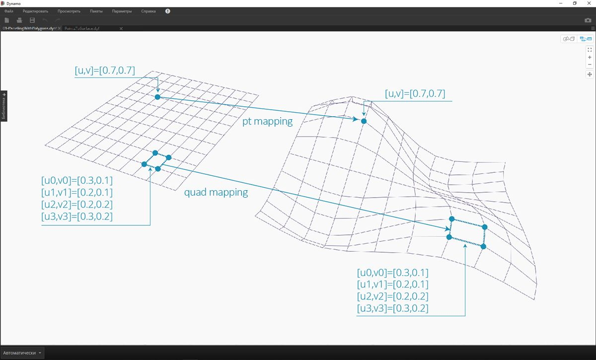
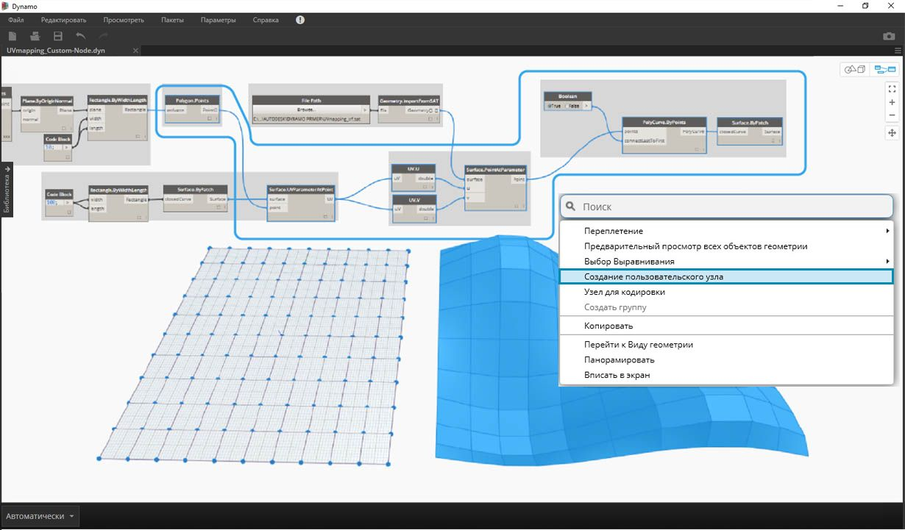
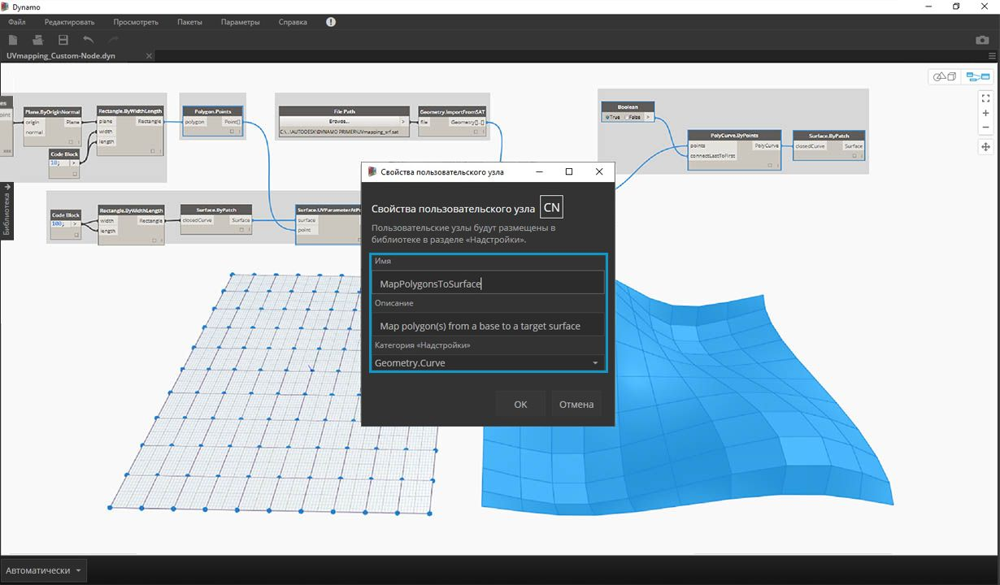

## Создание пользовательских узлов

В Dynamo предусмотрено несколько способов создания пользовательских узлов. Их можно создавать с нуля на основе существующего графика или непосредственно на языке C#. В этом разделе рассматривается создание пользовательского узла в интерфейсе Dynamo на основе существующего графика. Этот метод идеально подходит для очистки рабочего пространства, а также для упаковки последовательности узлов с целью их повторного использования в другом месте.

### Пользовательские узлы для UV-наложения

На изображении ниже точка одной поверхности сопоставляется с другой точкой с помощью UV-координат. Этот принцип будет использоваться для создания панелей поверхности, ссылающихся на кривые в плоскости XY. В данном случае сформируем прямоугольные панели, но этим же способом можно создавать разнообразные панели с использованием UV-наложения. Это отличная возможность для разработки пользовательских узлов, так как данную процедуру можно повторять в этом же графике или в других рабочих процессах Dynamo.

### Создание пользовательского узла на основе существующего графика

> Скачайте и распакуйте файлы примеров для этого упражнения (щелкните правой кнопкой мыши и выберите «Сохранить ссылку как...»). Полный список файлов примеров можно найти в приложении. [UV-CustomNode.zip](datasets/10-2/UV-CustomNode.zip)

Начните с создания графика, который будет вложен в пользовательский узел. В этом примере с помощью UV-координат мы создадим график, который сопоставляет полигоны базовой поверхности с целевой поверхностью. Эта процедура UV-наложения используется часто, благодаря чему хорошо подходит для создания пользовательских узлов. Дополнительные сведения о поверхностях и UV-пространстве см. в разделе 5.5. Полная версия графика представлена в файле *UVMapping_Custom-Node.dyn* (в скачанном ранее ZIP-файле).

> 1. **Блок кода.** Создайте диапазон из 10 чисел от 45 до -45 с помощью блока кода.
2. **Point.ByCoordinates.** Соедините выходные данные блока кода с входными данными x и y, в качестве переплетения выбрав перекрестную ссылку. При этом будет создана сетка точек.
3. **Plane.ByOriginNormal.** Соедините выходные данные *Point* с входными данными *origin*, чтобы создать плоскость в каждой из точек. Будет использован вектор нормали по умолчанию (0,0,1).
4. **Rectangle.ByWidthLength.** Соедините плоскости из предыдущего шага с выходными данными *plane* и с помощью блока кода со значением *10* задайте ширину и длину.

При этом появится сетка прямоугольников. Сопоставьте эти прямоугольники с целевой поверхностью, используя UV-координаты.

> 1. **Polygon.Points.** Соедините выходные данные Rectangle из предыдущего шага с входными данными *polygon*, чтобы извлечь угловые точки каждого прямоугольника. Именно эти точки будут сопоставляться с целевой поверхностью.
2. **Rectangle.ByWidthLength.** С помощью блока кода со значением *100* задайте ширину и длину прямоугольника. Это будет граница базовой поверхности.
3. **Surface.ByPatch.** Соедините выходные данные Rectangle из предыдущего шага с входными данными *closedCurve* для создания базовой поверхности.
4. **Surface.UVParameterAtPoint.** Соедините выходные данные *Point* узла *Polygon.Points* с выходными данными *Surface* узла *Surface.ByPatch* для получения параметра UV в каждой точке.

Теперь, имея базовую поверхность и набор UV-координат, можно импортировать целевую поверхность и сопоставить точки между поверхностями.

> 1. **Путь к файлу.** Выберите путь к файлу поверхности, которую требуется импортировать. Файл должен иметь тип SAT. Нажмите кнопку *Обзор...* и перейдите к файлу *UVMapping_srf.sat* из скачанного ранее ZIP-файла.
2. **Geometry.ImportFromSAT.** Для импорта поверхности присоедините путь к файлу. При этом в области предварительного просмотра геометрии должна появиться импортированная поверхность.
3. **UV.** Соедините выходные данные параметра UV с узлами *UV.U* и *UV.V*.
4. **Surface.PointAtParameter.** Присоедините импортированную поверхность, а также координаты u и v. Теперь на целевой поверхности должна появиться сетка 3D-точек.

Последний шаг — построение прямоугольных участков поверхности с помощью 3D-точек.

> 1. **PolyCurve.ByPoints.** Соедините точки на поверхности, чтобы построить поликривую через точки.
2. **Логический оператор.** Добавьте в рабочее пространство логический оператор (Boolean) и соедините его с входными данными *connectLastToFirst*, задав значение «Истина» (True), чтобы замкнуть поликривые. При этом должны появиться прямоугольники, сопоставленные с поверхностью.
3. **Surface.ByPatch.** Соедините поликривые с входными данными *closedCurve* для создания участков поверхности.

Теперь выберите узлы, которые необходимо вложить в пользовательский узел, учитывая, какие входные и выходные данные должны быть у конечного узла. Пользовательский узел должен быть максимально гибким и пригодным для сопоставления любых полигонов, а не только прямоугольников.

> Выберите указанные выше узлы (начиная с *Polygon.Points*), щелкните правой кнопкой мыши в рабочем пространстве и выберите *создание узла из выбранных объектов*.

> В диалоговом окне «Свойства пользовательского узла» присвойте пользовательскому узлу имя, укажите описание и категорию.

> Пользовательский узел в значительной мере очистил рабочее пространство. Обратите внимание, что входным и выходным данным были присвоены имена, соответствующие исходным узлам. Отредактируйте пользовательский узел, чтобы сделать имена более описательными.

> Дважды щелкните пользовательский узел, чтобы отредактировать его. Откроется рабочее пространство с желтым фоном, представляющее собой внутреннюю часть узла.

> 1. **Входные данные.** Измените имена входных параметров, задав *baseSurface* и *targetSurface*.
2. **Выходные данные.** Добавьте дополнительных выходной параметр для сопоставленных полигонов.
> Сохраните пользовательский узел и вернитесь в исходное рабочее пространство.

> Внесенные изменения отражаются в узле **MapPolygonsToSurface**.

Для наглядности можно добавить к узлу **Пользовательские комментарии**. В комментариях можно задать сведения о типах входных и выходных данных или разъяснить функции узла. Комментарии отображаются при наведении курсора на входной или выходной параметр пользовательского узла.

> Дважды щелкните пользовательский узел, чтобы отредактировать его. Снова откроется рабочее пространство с желтым фоном.

> 1. Начните редактирование блока кода Input. Чтобы создать комментарий, введите символы «//», а затем текст комментария. Добавьте любые пояснения к узлу. В данном случае будет дано описание входного параметра *targetSurface*.
2. Кроме того, задайте значение по умолчанию для входного параметра *inputSurface*, указав это значение в качестве типа входных данных. В данном случае в качестве значения по умолчанию будет задан исходный набор Surface.ByPatch.

> Комментарии также можно применить к выходным параметрам. Начните редактирование текста в блоке кода Output. Чтобы создать комментарий, введите символы «//», а затем текст комментария. Добавьте пояснения к выходным параметрам *Polygons* и *surfacePatches*, добавив для них подробное описание.

 >

1. Наведите курсор на пользовательский узел Inputs, чтобы просмотреть комментарии.
2. Так как для входного параметра *inputSurface* задано значение по умолчанию, при запуске определения можно не вводить значение поверхности.

