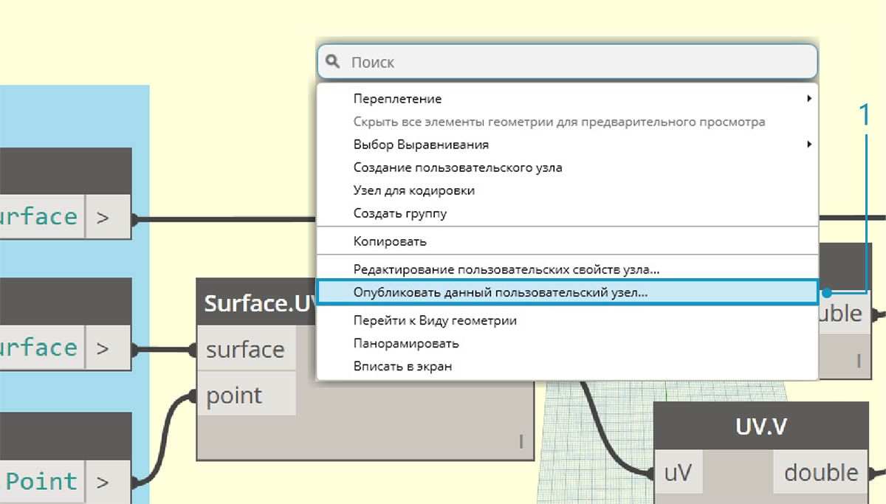
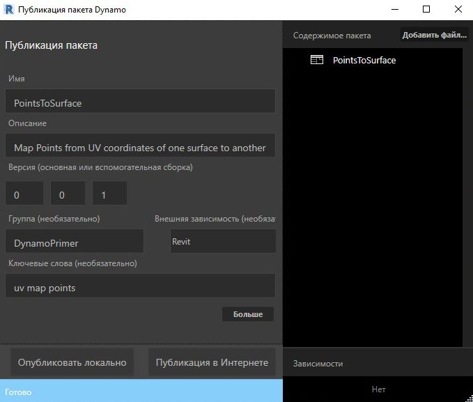
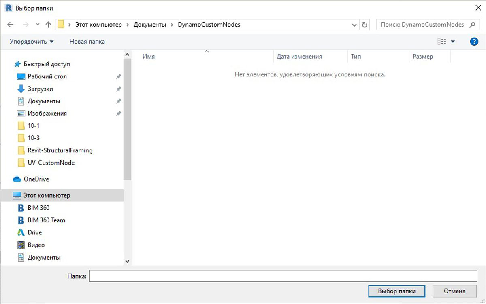
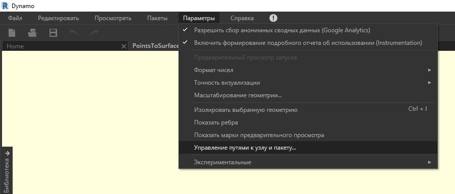
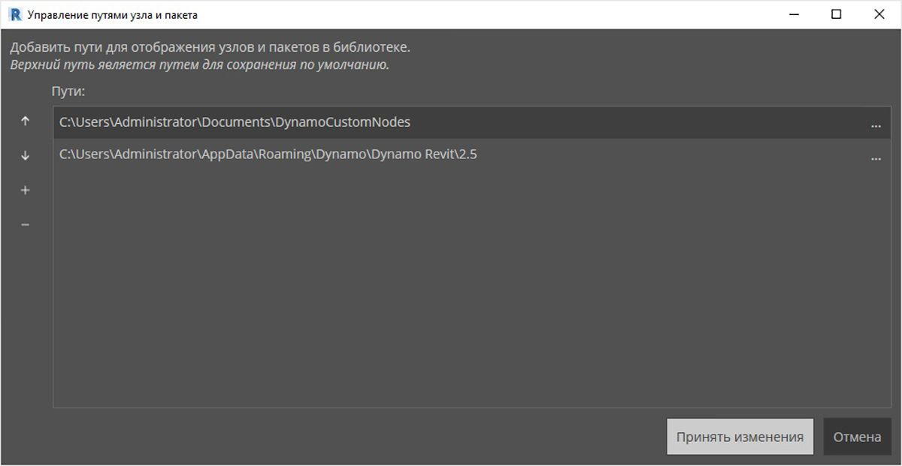
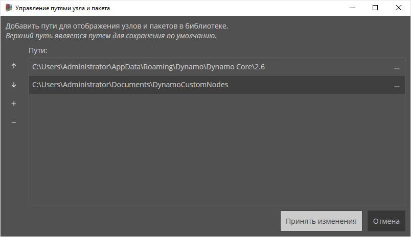
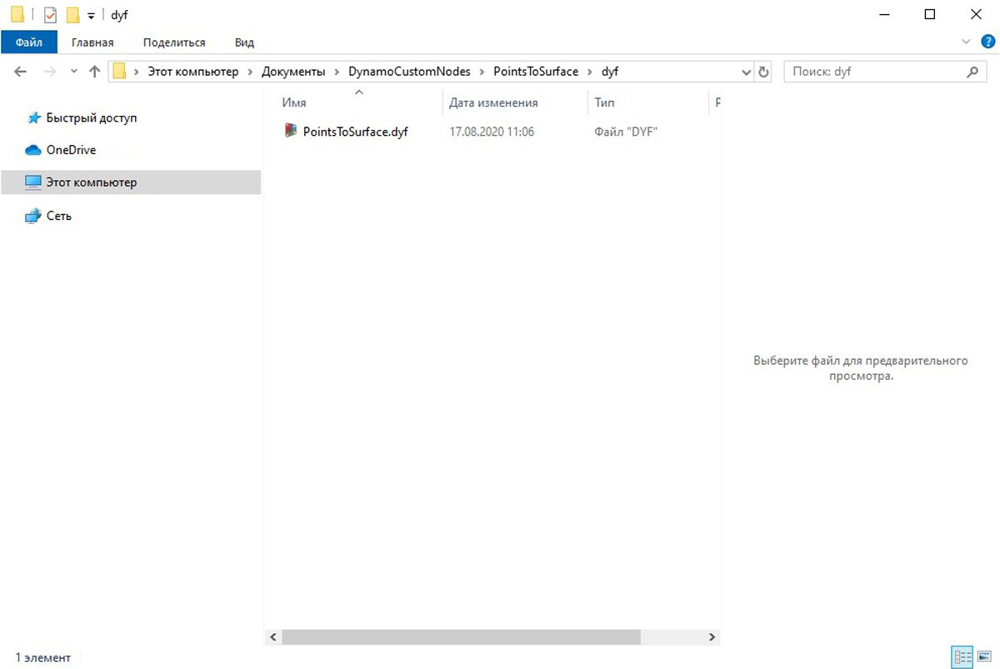

## Добавление узлов в библиотеку

Вы создали пользовательский узел и применили его к определенному процессу на графике Dynamo. Это очень полезный узел, поэтому его надо сохранить в библиотеке Dynamo для использования в других графиках. Для этого нужно опубликовать узел локально. Этот процесс аналогичен публикации пакета, который будет рассмотрен подробнее в следующей главе.

### Локальная публикация пользовательского узла

Продолжайте работу с пользовательским узлом, созданным в предыдущем разделе. Узел, опубликованный локально, станет доступен в библиотеке Dynamo после запуска нового сеанса. Если пользовательский узел не опубликован, его необходимо разместить в папке графика Dynamo, ссылающегося на этот узел (либо этот узел нужно импортировать в Dynamo с помощью меню *Файл > Импорт библиотеки*).

> Скачайте файл примера для этого упражнения (щелкните правой кнопкой мыши и выберите «Сохранить ссылку как...»). Полный список файлов примеров можно найти в приложении. [PointsToSurface.dyf](datasets/10-3/PointsToSurface.dyf)

> После открытия пользовательского узла PointsToSurface в редакторе пользовательских узлов Dynamo отобразится показанный график. Пользовательский узел также можно открыть, дважды щелкнув его в редакторе графика Dynamo.

> 1. Чтобы опубликовать пользовательский узел локально, щелкните правой кнопкой мыши в рабочей области и выберите *Опубликовать данный пользовательский узел...*

> Укажите все необходимые сведения, как показано на изображении выше, и выберите *Опубликовать локально*. Обратите внимание, что в поле «Группа» задается основной элемент, который будет доступен в меню Dynamo.

> Выберите папку для хранения всех пользовательских узлов, которые планируется опубликовать локально. Приложение Dynamo будет проверять эту папку каждый раз при загрузке, поэтому она должна находиться в постоянном расположении. Перейдите к этой папке и нажмите *Выбрать папку*. Пользовательский узел Dynamo публикуется локально и теперь будет отображаться на панели инструментов Dynamo при каждой загрузке программы.

> 1. Чтобы проверить расположение папки пользовательского узла, откройте меню *Параметры > Управление путями к узлу и пакету...*

> В этом окне отображаются два пути. *AppData\Roaming\Dynamo...* — расположение по умолчанию для пакетов Dynamo, установленных через интернет. *Documents\DynamoCustomNodes...* — расположение пользовательских узлов, которые были опубликованы локально*.

> 1. Рекомендуется переместить путь к локальной папке вниз по списку (для этого выберите путь к папке и щелкните стрелку вниз на панели слева от строк с путями). Верхняя папка всегда по умолчанию используется как расположение для установки пакетов. Поэтому если в качестве верхней папки будет указан путь для установки пакетов Dynamo, все полученные через интернет пакеты будут храниться отдельно от узлов, опубликованных локально*

> Порядок путей к папкам изменен, чтобы в качестве пути по умолчанию в Dynamo использовалась папка установки пакетов.

> Перейдите в эту локальную папку. Исходный пользовательский узел находится в папке *dyf*, имя которой является расширением для файлов пользовательских узлов Dynamo. Если отредактировать файл в этой папке, соответствующий узел будет обновлен в пользовательском интерфейсе. Кроме того, можно добавить дополнительные узлы в главную папку *DynamoCustomNode*, и после перезапуска Dynamo они появятся в библиотеке.

> Теперь при каждой загрузке Dynamo узел *PointsToSurface* будет отображаться в группе *DynamoPrimer* библиотеки Dynamo.

