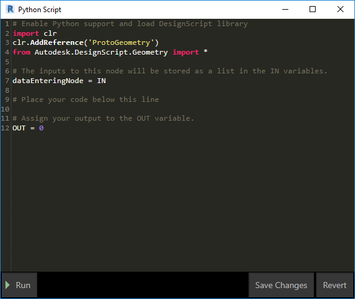
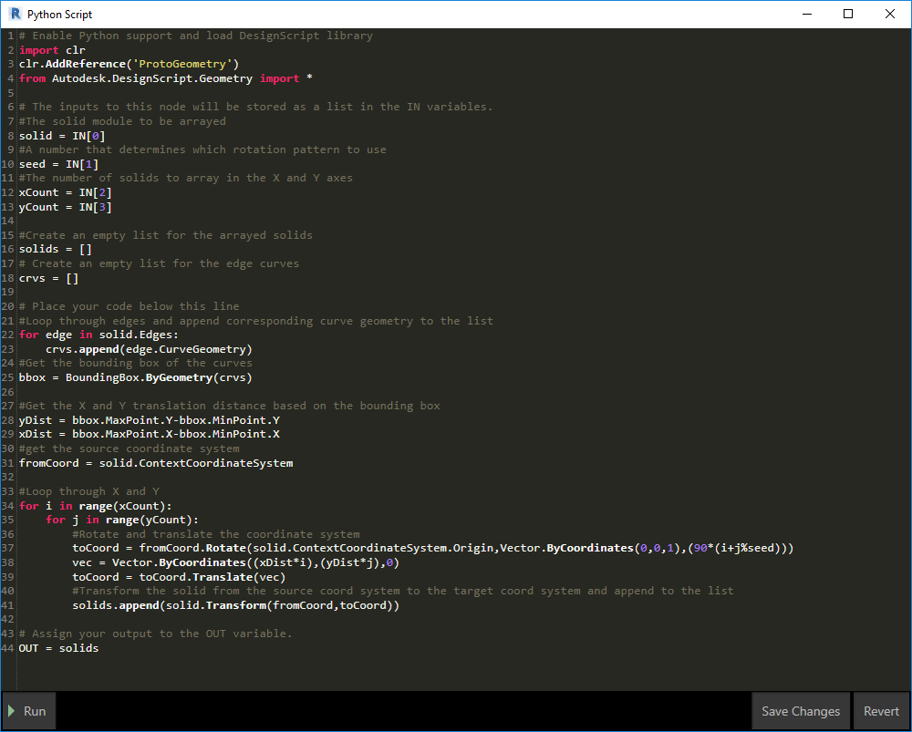
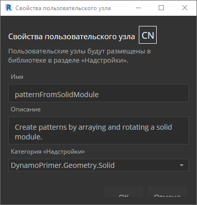

## Python

Python — это широко распространенный язык программирования, получивший большую популярность благодаря стилю используемого синтаксиса. Этот язык значительно доступнее и проще, чем многие другие языки программирования. Python поддерживает модули и пакеты, а также может быть внедрен в существующие приложения. Примеры в этом разделе предполагают наличие базовых знаний о языке Python. Тем, кто только начинает работу с Python, мы рекомендуем посетить страницу [Getting Started](https://www.python.org/about/gettingstarted/) на веб-сайте [Python.org](https://www.python.org/).

### Визуальное и текстовое программирование

Зачем использовать текстовое программирование в среде визуального программирования Dynamo? Как уже говорилось в главе 1.1, визуальное программирование имеет ряд преимуществ. Оно позволяет создавать программы в интуитивно-понятном визуальном интерфейсе, не обладая навыками работы со специальным синтаксисом. Однако визуальная программа может оказаться перегруженной, а порой и недостаточно функциональной. Для сравнения, в Python реализованы гораздо более доступные способы записи условных выражений (если/то) и создания циклов. Python — это мощный инструмент, который позволяет расширить возможности Dynamo и заменить большое количество узлов компактными строками кода.

**Визуальная программа**

**Текстовая программа**

```
import clr
clr.AddReference('ProtoGeometry')
from Autodesk.DesignScript.Geometry import *

solid = IN[0]
seed = IN[1]
xCount = IN[2]
yCount = IN[3]

solids = []

yDist = solid.BoundingBox.MaxPoint.Y-solid.BoundingBox.MinPoint.Y
xDist = solid.BoundingBox.MaxPoint.X-solid.BoundingBox.MinPoint.X

for i in xRange:
for j in yRange:
fromCoord = solid.ContextCoordinateSystem
toCoord = fromCoord.Rotate(solid.ContextCoordinateSystem.Origin,Vector.ByCoordinates(0,0,1),(90*(i+j%val)))
vec = Vector.ByCoordinates((xDist*i),(yDist*j),0)
toCoord = toCoord.Translate(vec)
solids.append(solid.Transform(fromCoord,toCoord))

OUT = solids
```

### Узел Python

Подобно блокам кода узлы Python представляют собой интерфейс сценариев в среде визуального программирования. Узел Python находится в разделе *Core > Scripting* в библиотеке. Двойной щелчок на узле приводит к открытию редактора сценариев Python (можно также щелкнуть узел правой кнопкой мыши и выбрать команду *Редактировать...*).



> Сверху находится подсказка, которая поможет обратиться к нужным библиотекам. Входные данные хранятся в массиве IN. Значения возвращаются в Dynamo путем назначения переменной OUT.

Библиотека Autodesk.DesignScript.Geometry позволяет использовать точечные обозначения, аналогичные блокам кода. Дополнительные сведения о синтаксисе Dynamo см. в главе 7.2, а также в [Руководстве по DesignScript](http://dynamobim.org/wp-content/links/DesignScriptGuide.pdf). При вводе определенного типа геометрии (например, Point.) отображается список методов, доступных для создания и запроса точек.


> Методы включают в себя конструкторы (например, *ByCoordinates*), действия (например, *Add*) и запросы (например, координаты *X*, *Y* и *Z*).

### Упражнение

> Скачайте файл примера для этого упражнения (щелкните правой кнопкой мыши и выберите «Сохранить ссылку как...»). Полный список файлов примеров можно найти в приложении. [Python_Custom-Node.dyn](datasets/10-4/Python-CustomNode.dyn)

В этом примере мы напишем сценарий Python для создания образцов на основе твердотельного модуля и преобразуем этот сценарий в пользовательский узел. Сначала создадим твердотельный модуль с помощью узлов Dynamo.


> 1. **Rectangle.ByWidthLength.** Создайте прямоугольник, который будет служить основой твердого тела.
2. **Surface.ByPatch.** Соедините прямоугольник с входным параметром *closedCurve* для создания нижней поверхности.


> 1. **Geometry.Translate.** Соедините прямоугольник с входным параметром *geometry* для его перемещения вверх, используя блок кода для указания толщины основания тела.
2. **Polygon.Points.** Запросите извлечение угловых точек из преобразованного прямоугольника.
3. **Geometry.Translate.** Используйте блок кода для создания списка из четырех значений, соответствующих четырем точкам, перемещающим один угол тела вверх.
4. **Polygon.ByPoints.** С помощью преобразованных точек воссоздайте верхний полигон.
5. **Surface.ByPatch.** Присоедините полигон для создания верхней поверхности.

Теперь, имея в распоряжении верхнюю и нижнюю поверхности, выполним лофтинг между двумя профилями, чтобы создать стороны тела.


> 1. **List.Create.** Соедините нижний прямоугольник и верхний полигон с входными параметрами индекса.
2. **Surface.ByLoft.** Выполните лофтинг двух профилей для создания сторон тела.
3. **List.Create.** Соедините верхнюю, боковую и нижнюю поверхности с входными параметрами индекса для создания списка поверхностей.
4. **Solid.ByJoinedSurfaces.** Соедините поверхности для создания твердотельного модуля.

Теперь, получив твердое тело, перетащите в рабочее пространство узел сценария Python.


> Чтобы добавить дополнительные входные параметры к узлу, закройте редактор и щелкните значок «+» на узле. Входным параметрам присваиваются имена IN[0], IN[1] и т. д. Это говорит о том, что они представляют элементы в списке.

Начнем с определения входных и выходных параметров. Дважды щелкните узел, чтобы открыть редактор Python.


```
# Enable Python support and load DesignScript library
import clr
clr.AddReference('ProtoGeometry')
from Autodesk.DesignScript.Geometry import *

# The inputs to this node will be stored as a list in the IN variables.
#The solid module to be arrayed
solid = IN[0]
#A number that determines which rotation pattern to use
seed = IN[1]
#The number of solids to array in the X and Y axes
xCount = IN[2]
yCount = IN[3]

#Create an empty list for the arrayed solids
solids = []

# Place your code below this line

# Assign your output to the OUT variable.
OUT = solids
```

Смысл этого кода будет понятен позже по мере выполнения упражнения. Далее необходимо подумать о том, какая информация необходима для создания массива на основе имеющегося твердотельного модуля. Во-первых, необходимо знать размеры тела, чтобы определить расстояние переноса. Из-за ошибки, связанной с ограничивающей рамкой, для ее создания необходимо использовать геометрию кривой кромки.


> Пример узла Python в Dynamo. Обратите внимание, что используется тот же синтаксис, что и в заголовках узлов Dynamo. Код с комментариями показан ниже.

```
# Enable Python support and load DesignScript library
import clr
clr.AddReference('ProtoGeometry')
from Autodesk.DesignScript.Geometry import *

# The inputs to this node will be stored as a list in the IN variables.
#The solid module to be arrayed
solid = IN[0]
#A number that determines which rotation pattern to use
seed = IN[1]
#The number of solids to array in the X and Y axes
xCount = IN[2]
yCount = IN[3]

#Create an empty list for the arrayed solids
solids = []
# Create an empty list for the edge curves
crvs = []

# Place your code below this line
#Loop through edges and append corresponding curve geometry to the list
for edge in solid.Edges:
crvs.append(edge.CurveGeometry)
#Get the bounding box of the curves
bbox = BoundingBox.ByGeometry(crvs)

#Get the X and Y translation distance based on the bounding box
yDist = bbox.MaxPoint.Y-bbox.MinPoint.Y
xDist = bbox.MaxPoint.X-bbox.MinPoint.X

# Assign your output to the OUT variable.
OUT = solids
```

Поскольку твердотельные модули будут не только преобразовываться, но и поворачиваться, воспользуемся операцией Geometry.Transform. Если посмотреть на узел Geometry.Transform, становится понятно, что для преобразования тела потребуется исходная система координат и целевая система координат. В качестве первой выступает контекстная система координат тела, а в качестве второй — система координат, которая различна для каждого модуля массива. Таким образом, чтобы система координат каждый раз преобразовывалась по-разному, необходимо перебирать значения координат по осям X и Y.



> Пример узла Python в Dynamo. Код с комментариями показан ниже.

```
# Enable Python support and load DesignScript library
import clr
clr.AddReference('ProtoGeometry')
from Autodesk.DesignScript.Geometry import *

# The inputs to this node will be stored as a list in the IN variables.
#The solid module to be arrayed
solid = IN[0]
#A number that determines which rotation pattern to use
seed = IN[1]
#The number of solids to array in the X and Y axes
xCount = IN[2]
yCount = IN[3]

#Create an empty list for the arrayed solids
solids = []
# Create an empty list for the edge curves
crvs = []

# Place your code below this line
#Loop through edges and append corresponding curve geometry to the list
for edge in solid.Edges:
crvs.append(edge.CurveGeometry)
#Get the bounding box of the curves
bbox = BoundingBox.ByGeometry(crvs)

#Get the X and Y translation distance based on the bounding box
yDist = bbox.MaxPoint.Y-bbox.MinPoint.Y
xDist = bbox.MaxPoint.X-bbox.MinPoint.X
#get the source coordinate system
fromCoord = solid.ContextCoordinateSystem

#Loop through X and Y
for i in range(xCount):
for j in range(yCount):
#Rotate and translate the coordinate system
toCoord = fromCoord.Rotate(solid.ContextCoordinateSystem.Origin,Vector.ByCoordinates(0,0,1),(90*(i+j%seed)))
vec = Vector.ByCoordinates((xDist*i),(yDist*j),0)
toCoord = toCoord.Translate(vec)
#Transform the solid from the source coord system to the target coord system and append to the list
solids.append(solid.Transform(fromCoord,toCoord))

# Assign your output to the OUT variable.
OUT = solids
```


> Чтобы выполнить код, щелкните кнопку Run (запуск) в узле Python.


> Попробуйте изменить начальное значение для создания различных образцов. Кроме того, можно изменять параметры самого твердотельного модуля для получения различных эффектов. В Dynamo 2.0 можно просто изменить прототип и запустить его, не закрывая окно Python.

Создав нужный сценарий Python, сохраним его как пользовательский узел. Выберите узел сценария Python, щелкните правой кнопкой мыши и выберите создание узла из выбранных объектов.



> Присвойте имя, добавьте описание и категорию.

При этом откроется новое рабочее пространство для редактирования пользовательского узла.


> 1. **Входные параметры.** Измените имена входных параметров, сделав их более описательными, и добавьте типы данных и значения по умолчанию.
2. **Выходной параметр.** Измените имя выходного параметра и сохраните узел в виде файла DYF.


> Внесенные изменения появятся в пользовательском узле.

