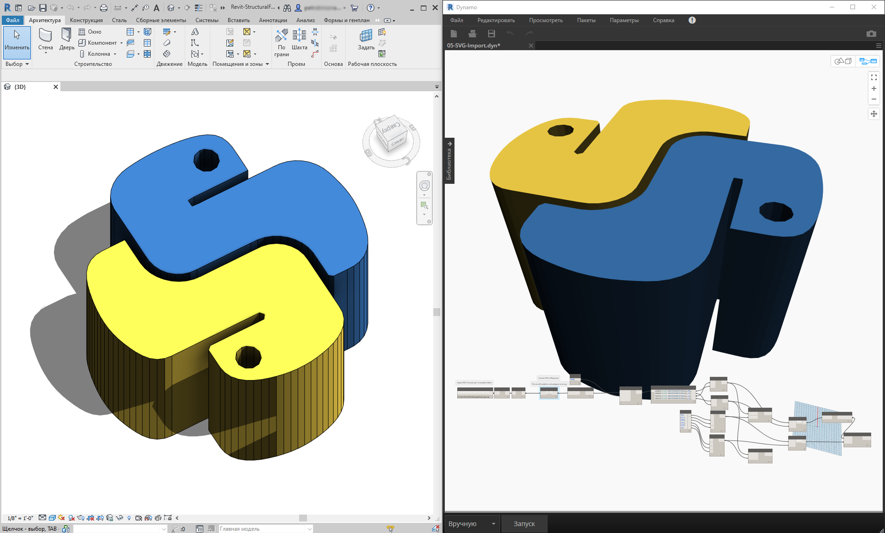
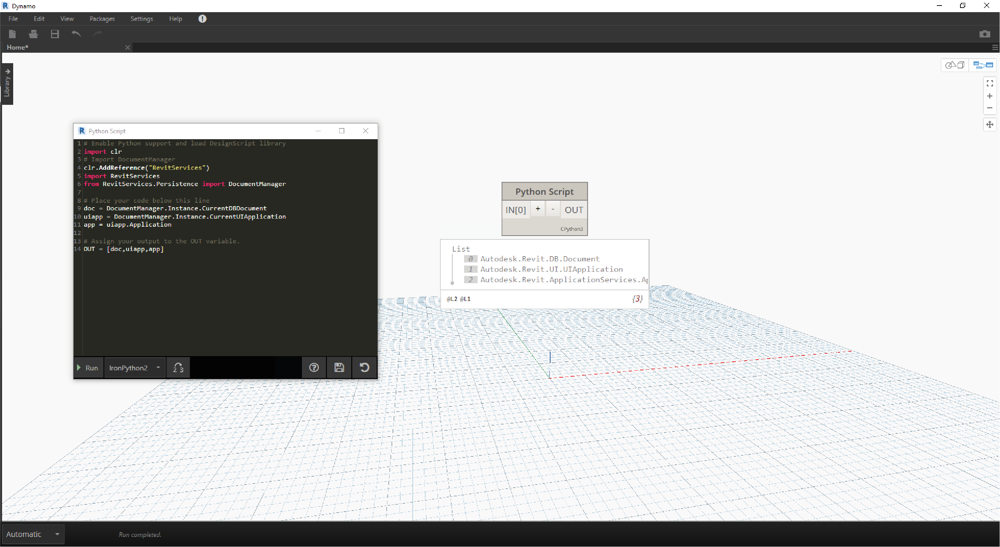
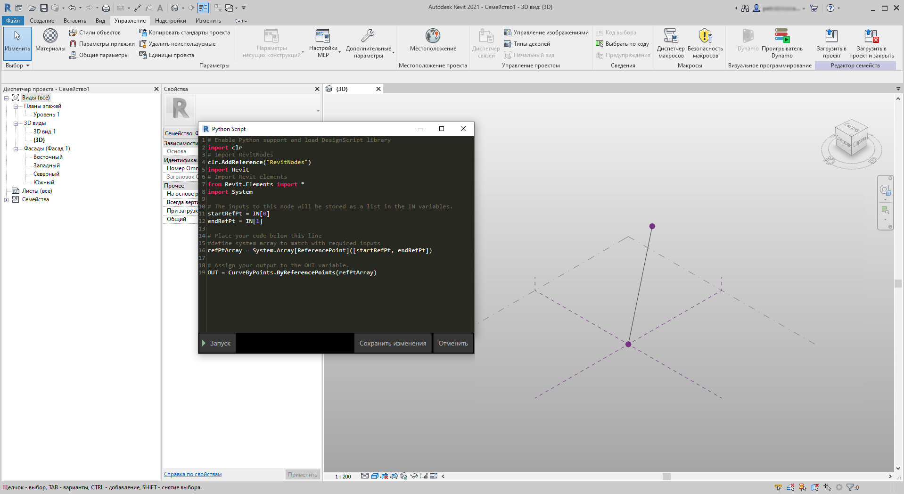
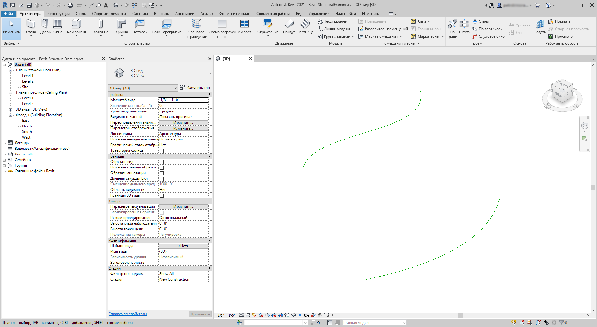
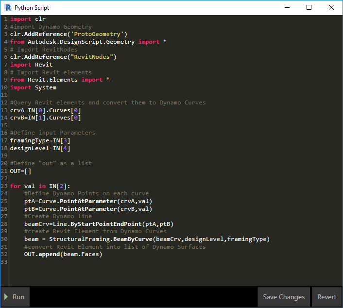
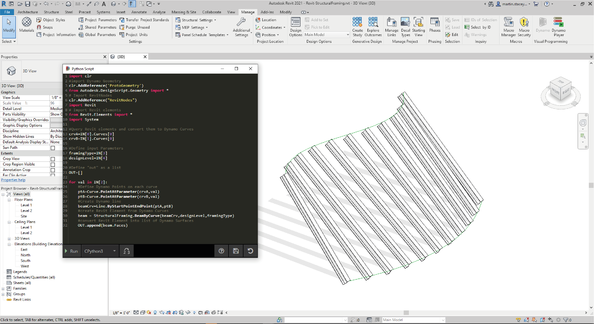

## Python и Revit

В предыдущем разделе был приведен пример использования сценариев Python в Dynamo. Теперь рассмотрим подключение библиотек Revit в среде сценариев. Как вы помните, базовые узлы Dynamo были импортированы с помощью первых трех строк в блоке кода, представленном ниже. Для импорта узлов Revit, элементов Revit и диспетчера документов Revit необходимо добавить еще несколько строк:

```
import clr
clr.AddReference('ProtoGeometry')
from Autodesk.DesignScript.Geometry import *

# Import RevitNodes
clr.AddReference("RevitNodes")
import Revit

# Import Revit elements
from Revit.Elements import *

# Import DocumentManager
clr.AddReference("RevitServices")
import RevitServices
from RevitServices.Persistence import DocumentManager

import System
```

Это обеспечит доступ к API Revit и позволит создавать пользовательские сценарии для любых задач Revit. Благодаря объединению процесса визуального программирования с написанием сценариев в API Revit возможности совместной работы и разработки инструментов значительно увеличиваются. Например, специалист по BIM и проектировщик схем могут совместно работать над одним и тем же графиком. В результате эффективность проектирования и реализации модели повысится.



### API-интерфейсы для конкретных платформ

В основе проекта Dynamo лежит план по расширению масштабов внедрения платформ. По мере добавления в Dynamo поддержки новых программ пользователи получают доступ к API-интерфейсам для конкретных платформ из среды создания сценариев Python. Хотя этот раздел посвящен работе с Revit, в будущем можно ожидать появления новых разделов, содержащих учебные пособия по созданию сценариев для других платформ. Кроме того, в данный момент доступно множество библиотек [IronPython](http://ironpython.net/), которые можно импортировать в Dynamo.

В приведенных ниже примерах иллюстрируются способы выполнения операций в Revit из модуля Dynamo с использованием языка программирования Python. Дополнительные сведения об особенностях использования Python в Dynamo и Revit см. на [странице Wiki, посвященной Dynamo](https://github.com/DynamoDS/Dynamo/wiki/Python-0.6.3-to-0.7.x-Migration). Еще один полезный ресурс по Python и Revit — проект [Revit Python Shell](https://github.com/architecture-building-systems/revitpythonshell).

### Упражнение 01

> Создайте новый проект Revit. Скачайте файл примера для этого упражнения (щелкните правой кнопкой мыши и выберите «Сохранить ссылку как...»). Полный список файлов примеров можно найти в приложении. [Revit-Doc.dyn](datasets/10-5/Revit-Doc.dyn)

В этих упражнениях рассматриваются простейшие сценарии Python, которые можно использовать в модуле Dynamo для Revit. Данное упражнение посвящено работе с файлами и элементами Revit, а также взаимодействию между Revit и Dynamo.



> Рассмотрим стандартный способ извлечения элементов *doc*, *uiapp* и *app* из файла Revit, связанного сеансом Dynamo. Программистам, которые уже работали с API Revit, могут быть знакомы элементы в списке наблюдения. Однако даже если эти элементы встречаются в первый раз, в последующих упражнениях будут и другие примеры.

Ниже описывается процедура импорта служб Revit и извлечения данных документа в Dynamo. 

> Пример узла Python в Dynamo. Код с комментариями показан ниже.

```
# Enable Python support and load DesignScript library
import clr
# Import DocumentManager
clr.AddReference("RevitServices")
import RevitServices
from RevitServices.Persistence import DocumentManager

# Place your code below this line
doc = DocumentManager.Instance.CurrentDBDocument
uiapp = DocumentManager.Instance.CurrentUIApplication
app = uiapp.Application

# Assign your output to the OUT variable.
OUT = [doc,uiapp,app]
```

### Упражнение 02

> Скачайте файлы примера для этого упражнения (щелкните правой кнопкой мыши и выберите «Сохранить ссылку как...»). Полный список файлов примеров можно найти в приложении. [Revit-ReferenceCurve.dyn](datasets/10-5/Revit-ReferenceCurve.dyn)

В этом упражнении будет создана простая кривая модели в Revit с помощью узла Python в Dynamo.


> Начните с набора узлов, представленных на изображении выше. Сначала создайте две опорные точки в Revit с помощью узлов Dynamo.

> Далее добавьте в Revit новое семейство концептуальных формообразующих элементов. Запустите Dynamo и сформируйте набор узлов, как показано на изображении выше. Сначала создайте в Revit две опорные точки с помощью узлов Dynamo.

> 1. Создайте блок кода и присвойте ему значение «0;».
2. Соедините это значение с входными параметрами X, Y и Z узла ReferencePoint.ByCoordinates.
3. Создайте три регулятора в диапазоне от -100 до 100 с шагом 1.
4. Соедините каждый из регуляторов с узлом ReferencePoint.ByCoordinates.
5. Добавьте в рабочее пространство узел Python, нажмите кнопку «+» в узле, чтобы добавить еще один входной параметр, и соедините опорные точки с входными параметрами. Откройте узел Python.


> Пример узла Python в Dynamo. Код с комментариями показан ниже.

> 1. **System.Array.** Приложению Revit в качестве входного параметра требуется системный массив (а не список Python). Для этого необходима лишь еще одна строка кода, но следует уделить особое внимание типам аргументов, чтобы упростить программирование на языке Python в Revit.

```
import clr

# Import RevitNodes
clr.AddReference("RevitNodes")
import Revit
# Import Revit elements
from Revit.Elements import *
import System

#define inputs
startRefPt = IN[0]
endRefPt = IN[1]

#define system array to match with required inputs
refPtArray = System.Array[ReferencePoint]([startRefPt, endRefPt])
#create curve by reference points in Revit
OUT = CurveByPoints.ByReferencePoints(refPtArray)
```



> В Dynamo с помощью Python мы создали две опорные точки, соединенные линией. Продолжим работу с этим примером в следующем упражнении.

### Упражнение 03

> Скачайте и распакуйте файлы примеров для этого упражнения (щелкните правой кнопкой мыши и выберите «Сохранить ссылку как...»). Полный список файлов примеров можно найти в приложении. [Revit-StructuralFraming.zip](datasets/10-5/Revit-StructuralFraming.zip)

> Это упражнение довольно несложное, однако оно хорошо иллюстрирует процесс обмена данными и геометрией между Revit и Dynamo. Сначала откройте файл Revit-StructuralFraming.rvt. Затем загрузите Dynamo и откройте файл Revit-StructuralFraming.dyn.



> Этот файл Revit содержит лишь самые базовые данные. Имеется две опорные кривые: одна на уровне 1, другая — на уровне 2. Эти кривые необходимо добавить в Dynamo, сохранив динамическую связь.


> В файле имеется набор узлов, соединяемых с пятью входными параметрами узла Python.

> 1. **Выбор узлов для элементов модели.** Нажмите кнопку выбора для каждого узла и выберите соответствующую кривую в Revit.
2. **Блок кода.** Используя синтаксис *0..1..#x;*, соедините регулятор целых чисел от 0 до 20 с входным параметром *x*. Этот регулятор задает количество балок, которые будут построены между двумя кривыми.
3. **Типы несущих каркасов.** В раскрывающемся меню выберите балку по умолчанию W12x26.
4. **Уровни.** Выберите Level 1.



> Этот код Python более сложен, но весь процесс снабжен подробными комментариями:

```
import clr
#import Dynamo Geometry
clr.AddReference('ProtoGeometry')
from Autodesk.DesignScript.Geometry import *
# Import RevitNodes
clr.AddReference("RevitNodes")
import Revit
# Import Revit elements
from Revit.Elements import *
import System

#Query Revit elements and convert them to Dynamo Curves
crvA=IN[0].Curves[0]
crvB=IN[1].Curves[0]

#Define input Parameters
framingType=IN[3]
designLevel=IN[4]

#Define "out" as a list
OUT=[]

for val in IN[2]:
#Define Dynamo Points on each curve
ptA=Curve.PointAtParameter(crvA,val)
ptB=Curve.PointAtParameter(crvB,val)
#Create Dynamo line
beamCrv=Line.ByStartPointEndPoint(ptA,ptB)
#create Revit Element from Dynamo Curves
beam = StructuralFraming.BeamByCurve(beamCrv,designLevel,framingType)
#convert Revit Element into list of Dynamo Surfaces
OUT.append(beam.Faces)
```



> Итак, в Revit имеется массив балок, расположенных между двумя кривыми, служащими несущими элементами. Примечание. Данный пример не вполне реалистичен. Несущие элементы используются всего лишь в качестве примера собственных экземпляров Revit, созданных в Dynamo.  В Dynamo можно также увидеть результаты. Балки в узле Watch3D ссылаются на геометрию, запрошенную из элементов Revit.

Обратите внимание на непрерывный процесс преобразования данных из среды Revit в среду Dynamo. Вкратце этот процесс происходит следующим образом:

1. выбор элемента Revit;
2. преобразование элемента Revit в кривую Dynamo;
3. разделение кривой Dynamo на серию точек Dynamo;
4. использование точек Dynamo между двумя кривыми для создания линий Dynamo;
5. создание балок Revit на основе линий Dynamo;
6. вывод поверхностей Dynamo путем запроса геометрии балок Revit.

На вид процесс может казаться довольно сложным, но при использовании сценария достаточно всего лишь отредактировать кривую в Revit и повторно запустить решатель (хотя при этом может потребоваться удалить ранее созданные балки). *Дело в том, что когда балки размещаются в Python, связи стандартных узлов по умолчанию разрываются.*


> Обновив опорные кривые в Revit, мы получим новый массив балок.

