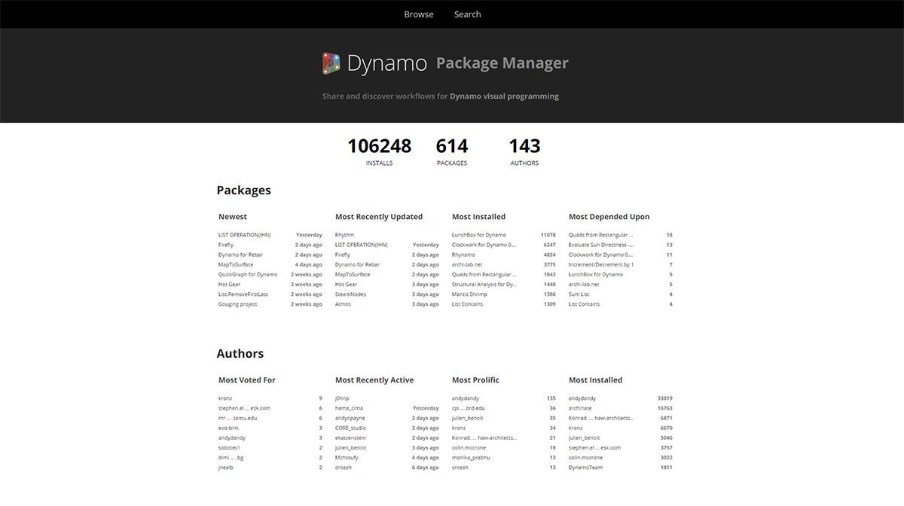
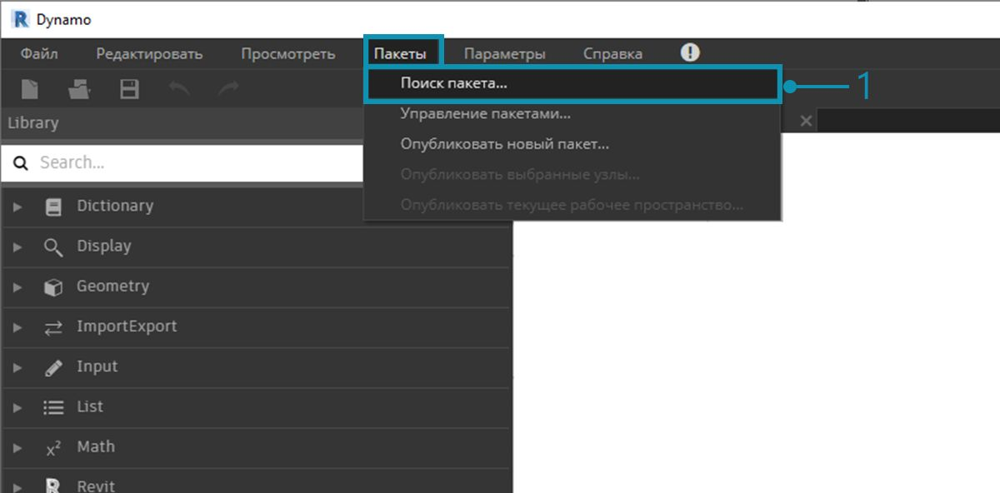
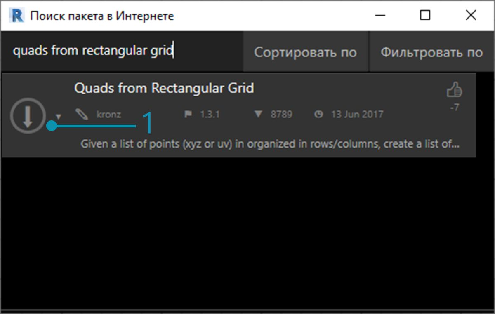
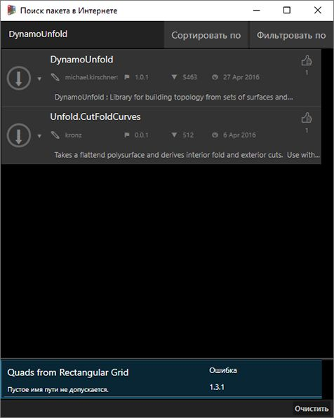
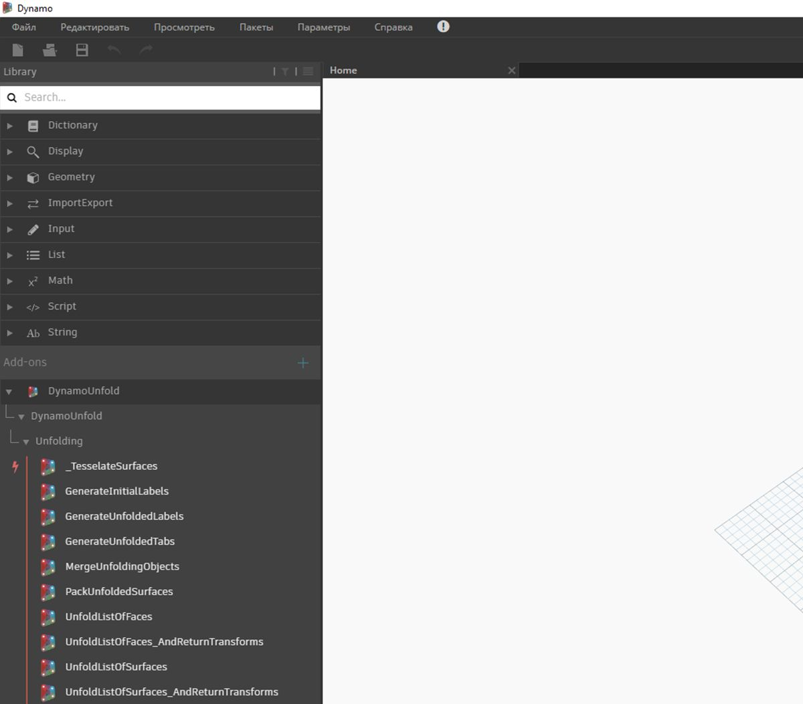
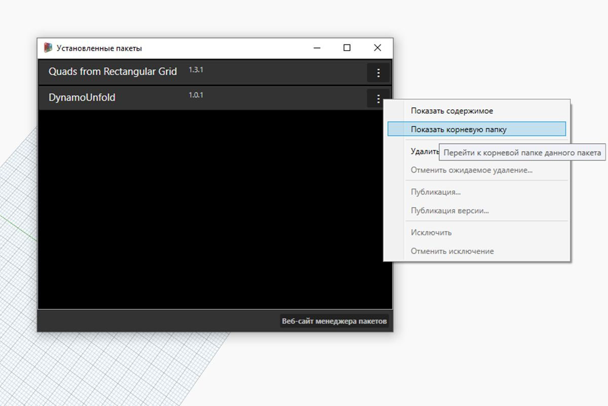
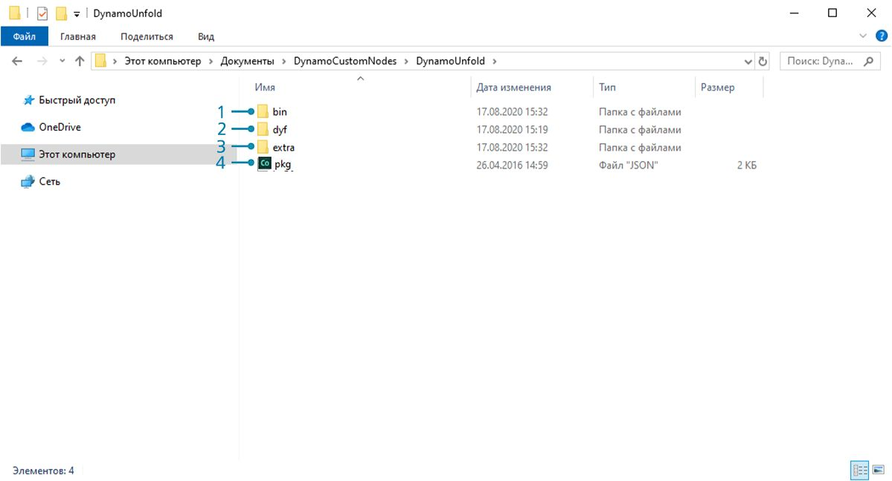
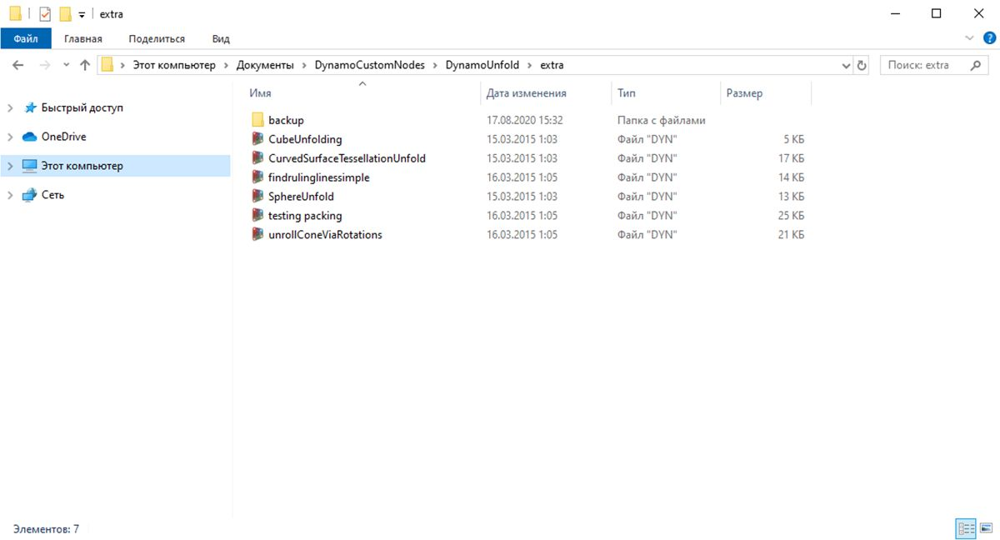
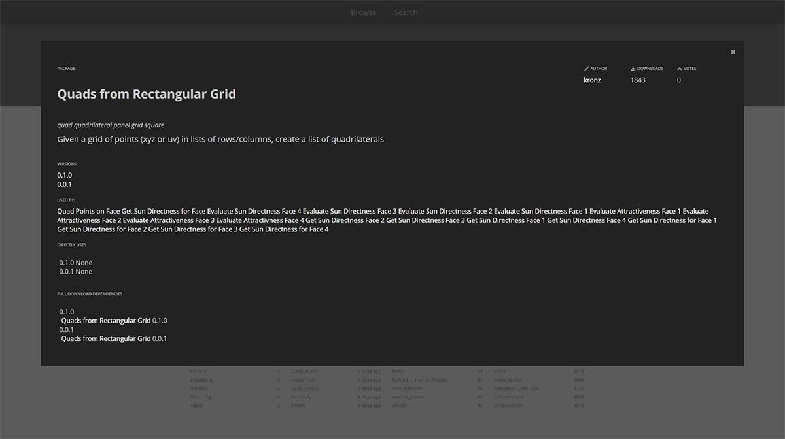

## Пакеты

В целом пакет представляет собой набор пользовательских узлов. Dynamo Package Manager — это портал для сообщества пользователей, где можно скачать любые пакеты, которые были опубликованы в интернете. Эти инструментарии разрабатываются сторонними поставщиками и предназначены для расширения базовых функций Dynamo, доступных каждому пользователю по первому требованию.

Проекты с открытым исходным кодом, такие как Dynamo, активно развиваются благодаря подобному участию сообщества. Благодаря узкоспециализированным сторонним разработчикам Dynamo может использоваться в самых различных отраслях. По этой причине команда Dynamo сконцентрировала свои усилия на оптимизации разработки и публикации пакетов (подробнее эта тема будет обсуждаться в следующих разделах).

### Установка пакетов

Самый простой способ установки пакета — воспользоваться панелью инструментов «Пакеты» в интерфейсе Dynamo. Перейдем на эту панель и установим один из пакетов. В этом небольшом примере будет установлен популярный пакет для создания прямоугольных панелей на сетке. 

> 1. В Dynamo выберите *«Пакеты» > «Поиск пакета...»*.

> В строке поиска введите quads from rectangular grid. Через некоторое время отобразятся все пакеты, соответствующие поисковому запросу. Выберем первый пакет с соответствующим именем.

> 1. Щелкните стрелку скачивания слева от имени пакета, чтобы установить пакет. Готово!

> 1. Обратите внимание, что в библиотеке Dynamo появилась группа с именем *buildz*. Это имя [разработчика](http://buildz.blogspot.com/) пакета, а в группе содержится пользовательский узел. Его можно сразу использовать.

> С помощью блока кода быстро определите прямоугольную сетку и создайте список прямоугольных панелей.

### Папки пакетов

В приведенном выше примере описан пакет с одним пользовательским узлом. Та же самая процедура используется для скачивания пакетов с несколькими пользовательскими узлами и вспомогательными файлами данных. Продемонстрируем это на примере более крупного пакета: Dynamo Unfold.

> Как и в приведенном выше примере, начните с выбора команды *«Пакеты» > «Поиск пакета...»*. На этот раз в строке поиска введите *DynamoUnfold* без пробела с учетом регистра. После отображения пакета скачайте его, щелкнув стрелку слева от имени. Пакет Dynamo Unfold будет установлен в библиотеке Dynamo.

> В библиотеке Dynamo появилась группа *DynamoUnfold* с несколькими категориями и пользовательскими узлами.

> Рассмотрим структуру файлов и папок пакета. В Dynamo выберите *«Пакеты» > «Управление пакетами...»*. Откроется окно, в котором отображаются две установленные библиотеки. Нажмите кнопку справа от элемента *DynamoUnfold* и выберите *Показать корневую папку*.

> Откроется корневая папка пакета. Обратите внимание, что в ней содержится три папки и файл.

> 1. В папке *bin* находятся файлы DLL. Этот пакет Dynamo был разработан с помощью функции Zero-Touch, поэтому пользовательские узлы хранятся в этой папке.
2. В папке *dyf* находятся пользовательские узлы. Так как данный пакет был разработан без пользовательских узлов Dynamo, папка пуста.
3. В папке extra хранятся дополнительные файлы, включая файлы примеров.
4. Файл pkg — это базовый текстовый файл, определяющий параметры пакета. Пока мы не будем его рассматривать.

> Если открыть папку *extra*, в ней можно увидеть несколько файлов примеров, которые были скачаны при установке. Если пакет сопровождается файлами примеров (что бывает не всегда), их следует искать в этой папке. Откроем файл *SphereUnfold*.

> Нажав после этого кнопку *Запуск* в решателе, получим развернутую сферу. Файлы примеров, подобные этим, используются для обучения работе с новыми пакетами Dynamo.

### Dynamo Package Manager

Еще один способ найти пакеты Dynamo — использовать онлайн-ресурс [Dynamo Package Manager](http://dynamopackages.com/). Искать пакеты в этом хранилище очень удобно, так как они отсортированы по количеству скачиваний и популярности. Кроме того, здесь можно легко получить информацию о последних обновлениях пакетов, что очень важно, так как некоторые пакеты Dynamo имеют разные версии и зависимости от сборок Dynamo.

> Если в Dynamo Package Manager выбрать пакет *Quads from Rectangular Grid*, откроется его описание, данные о версиях, имя разработчика, а также сведения о возможных зависимостях.

Кроме того, из Dynamo Package Manager можно скачивать файлы пакетов Dynamo, но делать это непосредственно из Dynamo проще.

### Местоположение файлов пакетов на локальном компьютере

Если необходимо скачать файлы с портала Dynamo Package Manager или узнать, где хранятся все файлы пакетов, щелкните *«Параметры» > «Управление путями к узлу и пакету..»*. Щелкнув значок многоточия рядом с папкой, можно скопировать корневую папку и ознакомиться с пакетом в окне проводника. По умолчанию пакеты устанавливаются в следующей папке: *C:/Users/[имя пользователя]/AppData/Roaming/Dynamo/[версия Dynamo]*.

### Дальнейшая работа с пакетами

Сообщество Dynamo постоянно развивается. Если периодически посещать портал Dynamo Package Manager, можно обнаружить там новые интересные разработки. В следующих разделах пакеты Dynamo будут рассматриваться более подробно и не только с точки зрения конечного пользователя, но и в контексте их самостоятельной разработки.

