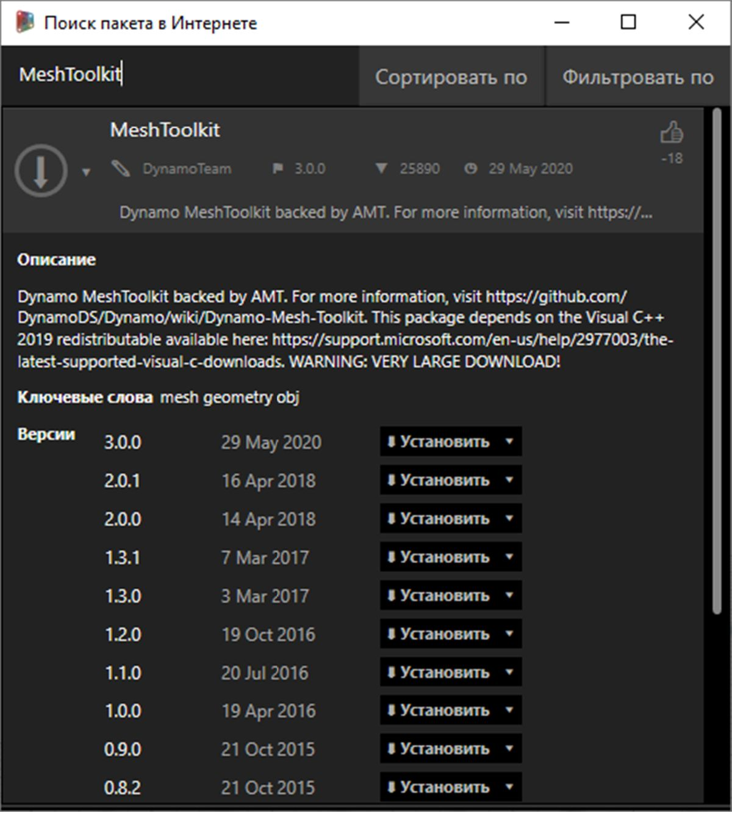

## Практикум по работе с пакетом: Mesh Toolkit

Dynamo Mesh Toolkit содержит инструменты для импорта сетей из внешних файлов других форматов, создания сетей из геометрических объектов Dynamo и построения сетей вручную по вершинам и индексам. В библиотеке также содержатся инструменты для редактирования и восстановления сетей, а также для извлечения горизонтальных срезов, используемых в ходе изготовления изделий.

Пакет Dynamo Mesh Toolkit создан в рамках непрерывной работы специалистов Autodesk, направленной на исследование сетей, и в ближайшие годы функциональные возможности пакета будут постоянно улучшаться и пополняться. Разработчики Dynamo с нетерпением ждут ваших отзывов и предложений по новым функциям, а также сообщений об обнаруженных ошибках.

### Сети и тела

В упражнении ниже демонстрируются некоторые базовые операции с сетями, выполняемые с помощью Mesh Toolkit. В этом упражнении сеть рассекается на несколько частей при помощи плоскостей, что при использовании тел потребовало бы больших вычислительных мощностей. Сеть, в отличие от тела, имеет заданное «разрешение». Кроме того, она определяется не математически, а топологически. Благодаря этому определение сети можно адаптировать в соответствии с поставленной задачей. Дополнительные сведения о взаимоотношениях сетей и тел см. в разделе [Геометрия для машинного проектирования](../05_Geometry-for-Computational-Design/5_geometry-for-computational-design.md) данного руководства. Подробный обзор пакета Mesh Toolkit см. в [справке Wiki по Dynamo](https://github.com/DynamoDS/Dynamo/wiki/Dynamo-Mesh-Toolkit). Выполните следующее упражнение, чтобы узнать, как использовать этот пакет на практике.

### Установка Mesh Toolkit

> В строке меню Dynamo выберите *Пакеты > Поиск пакета...* В поле поиска введите *MeshToolkit* без пробелов и с соблюдением регистра. Щелкните стрелку скачивания рядом с пакетом, соответствующим установленной версии Dynamo. Проще простого.

### Упражнение

> Скачайте и распакуйте файлы примеров для этого упражнения (щелкните правой кнопкой мыши и выберите «Сохранить ссылку как...»). Полный список файлов примеров можно найти в приложении. [MeshToolkit.zip](datasets/11-2/MeshToolkit.zip)

Для начала откройте в Dynamo файл *Mesh-Toolkit_Intersect-Mesh.dyn*. В этом примере рассматривается работа с узлом Intersect в составе MeshToolkit. Вам потребуется импортировать сеть, а затем рассечь ее с использованием нескольких входных плоскостей для получения срезов. Это первый этап подготовки модели изделия к изготовлению с помощью лазерной или водоструйной резки либо фрезерного станка с ЧПУ.

> 1. **File Path:** найдите файл сети, который требуется импортировать (*stanford_bunny_tri.obj*). Поддерживаются файлы MIX и OBJ.
2. **Mesh.ImportFile:** соедините этот узел с узлом File Path, чтобы импортировать сеть.

> 1. **Point.ByCoordinates:** создайте точку, которая станет центром дуги.
2. **Arc.ByCenterPointRadiusAngle**: создайте дугу на основе заданной точки. Эта кривая будет использована для размещения набора плоскостей.

> 1. Code Block: задайте диапазон чисел от нуля до единицы.
2. **Curve.PointAtParameter:** соедините порт вывода Arc с портом ввода *curve*, а порт вывода Code Block — с портом ввода *param*, чтобы получить набор точек вдоль кривой.
3. **Curve.TangentAtParameter:** соедините порты этого узла аналогично портам предыдущего.
4. **Plane.ByOriginNormal:** соедините порт вывода Point с портом ввода *origin*, а порт вывода Vector — с портом ввода *normal*, чтобы создать набор плоскостей на основе полученных точек.

В окне должен появиться набор плоскостей, размещенных вдоль дуги. Рассеките сеть с помощью этих плоскостей.

> 1. **Mesh.Intersect:** плоскости рассекают импортированную сеть, в результате чего создается набор контуров, состоящих из поликривых.
2. **PolyCurve.Curves:** поликривые разбиваются на составляющие их кривые.
3. **Curve.EndPoint:** извлеките значения конечных точек для каждой кривой.
4. **NurbsCurve.ByPoints:** постройте NURBS-кривую на основе полученных точек. Добавьте узел Boolean и установите для него значение *True*, чтобы замкнуть кривые.

> 1. **Surface.ByPatch:** создайте участки поверхности для каждого контура, чтобы сформировать срезы сети.

> Добавьте второй набор срезов для получения «вафельного» эффекта.

Как вы могли заметить, операции пересечения при работе с сетями выполняются гораздо быстрее, чем при работе с аналогичным телом. Использование сетей позволяет ускорить многие рабочие процессы, подобные представленному в этом упражнении.

