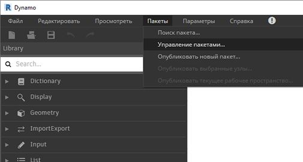
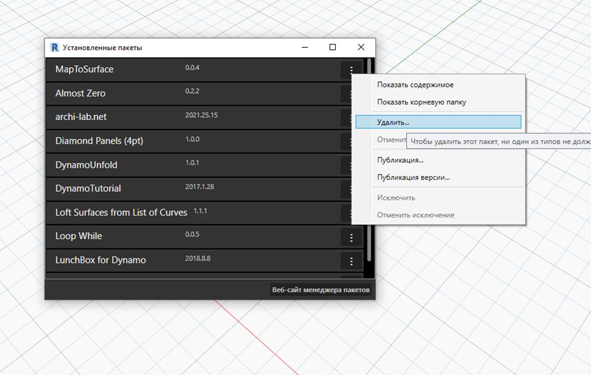
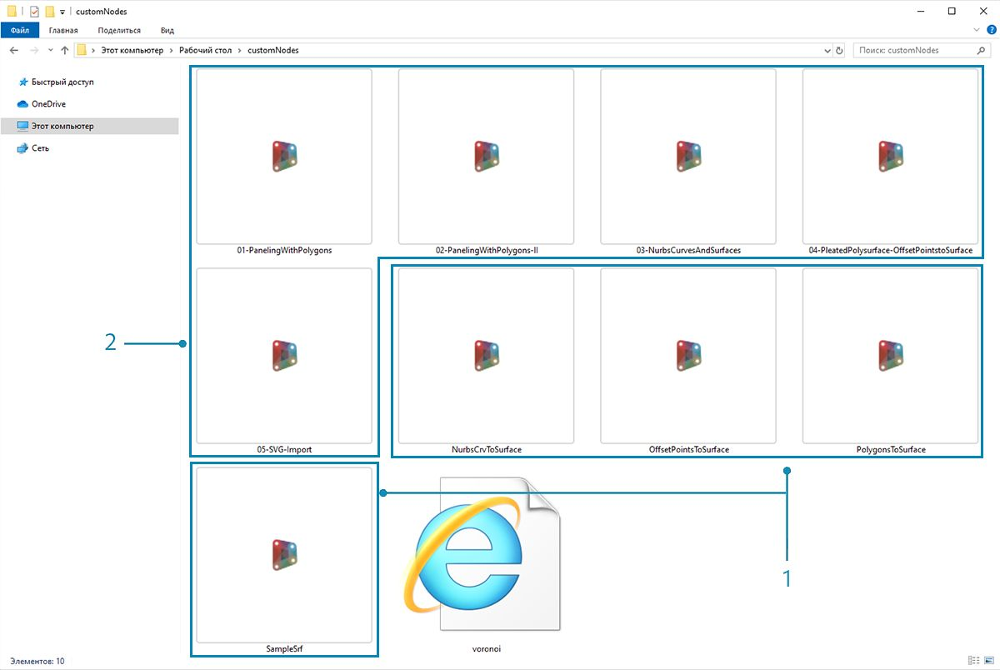
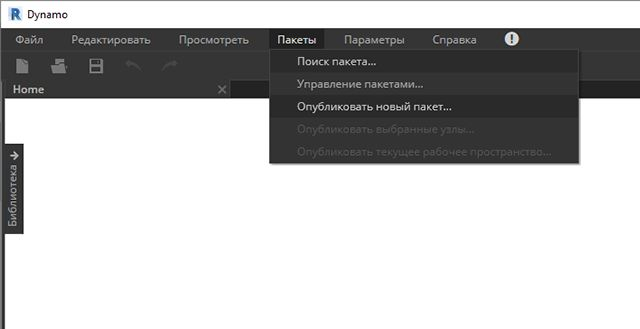
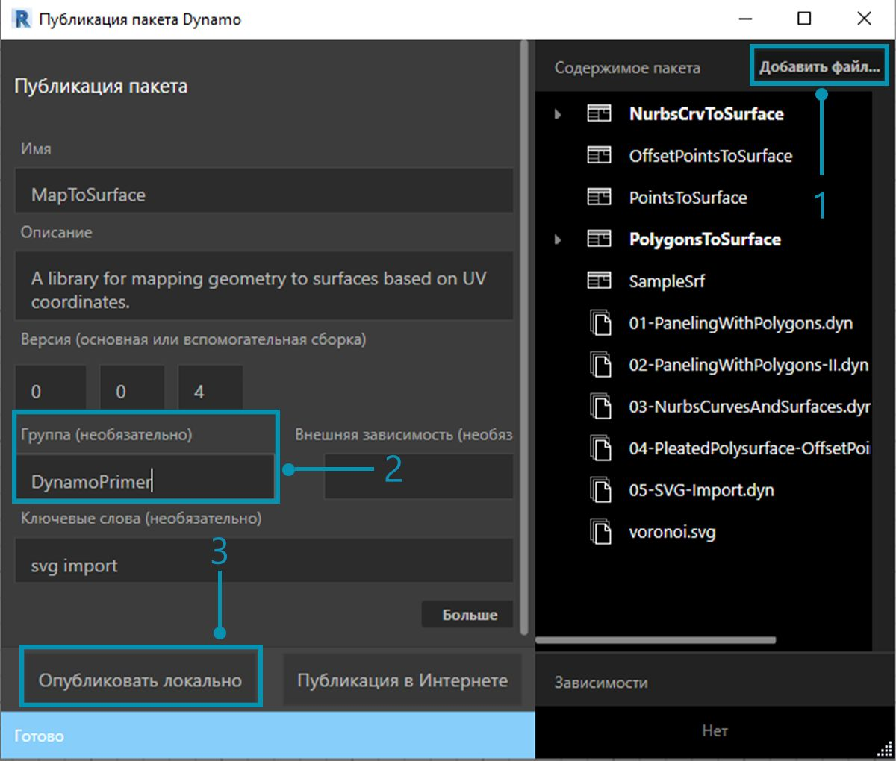
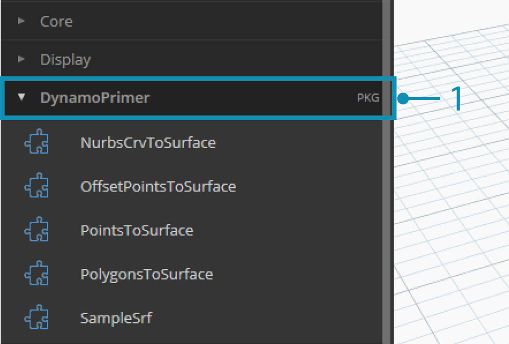
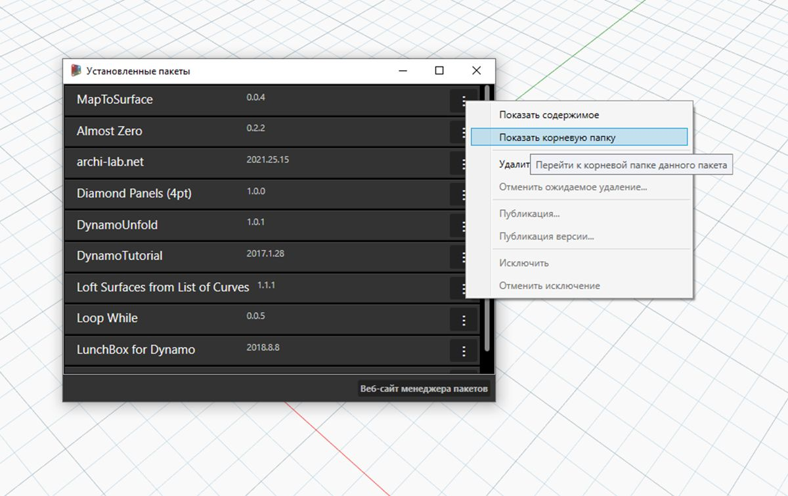
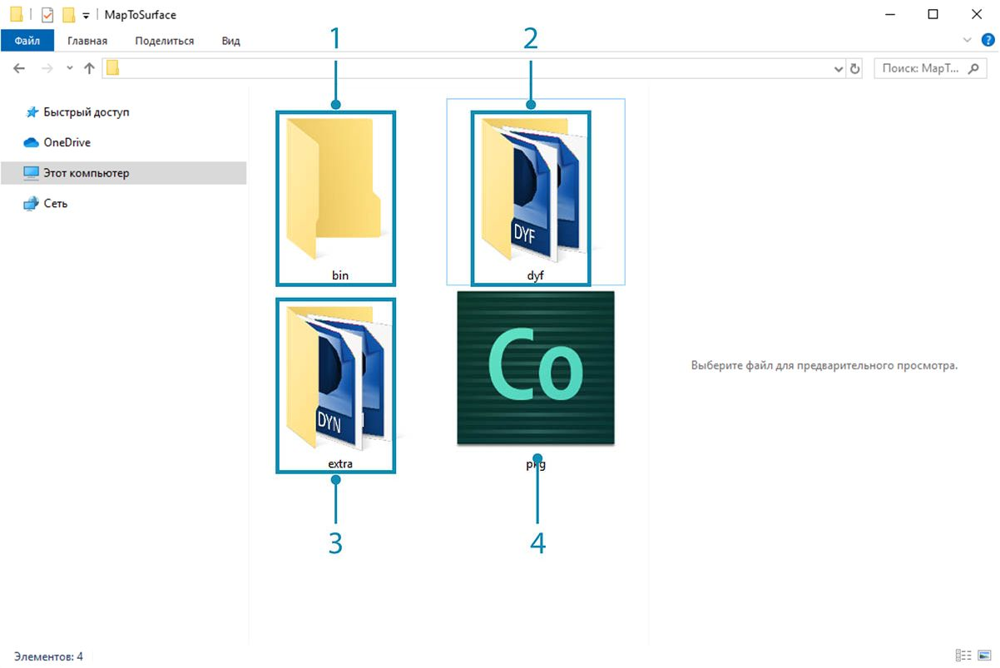
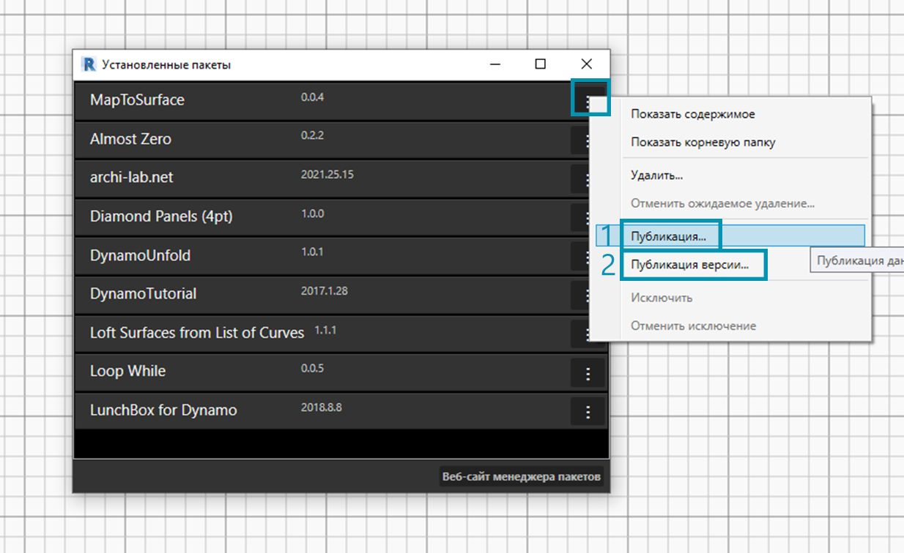

## Публикация пакетов

В предыдущих разделах мы подробно рассмотрели процесс настройки пакета *MapToSurface* с использованием пользовательских узлов и файлов примеров. Но как опубликовать пакет, разработка которого была выполнена на локальном компьютере? В этом примере мы рассмотрим процесс публикации пакета из набора файлов в локальной папке.  Существует множество способов публикации пакетов. Мы рекомендуем придерживаться следующего процесса: **сначала опубликуйте пакет на локальном компьютере, там же выполните его разработку и, наконец, опубликуйте пакет в интернете**. В рамках примера мы будем работать с папкой, содержащей все файлы пакета.

### Удаление пакета

Если пакет MapToSurface уже был установлен в рамках предыдущего урока, его необходимо удалить, прежде чем приступать к публикации в рамках этого урока, чтобы избежать дублирования пакетов.

> Выберите *«Пакеты» > «Управление пакетами...»*.

> Нажмите кнопку напротив *MapToSurface* и выберите *Удалить...*. Перезапустите Dynamo. Проверьте окно *Управление пакетами* убедитесь, что пакет *MapToSurface* отсутствует. Теперь все готово к началу работы.

### Публикация пакета на локальном компьютере

*Примечание. На момент создания этого документа функция публикации пакетов Dynamo доступна только в Dynamo Studio и Dynamo for Revit. В Dynamo Sandbox функция публикации отсутствует.*

> Скачайте и распакуйте файлы примеров для этого упражнения по работе с пакетами (щелкните правой кнопкой мыши и выберите «Сохранить ссылку как...»). Полный список файлов примеров можно найти в приложении. [MapToSurface.zip](datasets/11-4/MapToSurface.zip)

> Это первая версия данного пакета. Все файлы примеров и пользовательские узлы размещены в одной папке. Поскольку папка готова к использованию, можно сразу приступать к выгрузке в менеджер пакетов Dynamo.

> 1. Эта папка содержит пять пользовательских узлов (DYF).
2. В ней также есть пять файлов примеров (DYN) и один импортированный файл векторов (SVG). Эти файлы будут задействованы в рамках вводных упражнений по обучению работе с пользовательскими узлами.

> В Dynamo выберите *«Пакеты» > «Опубликовать новый пакет...»*.

> В левой части окна *Публикация пакета Dynamo* отобразятся предварительно заданные сведения о пакете.

> 1. В правой части экрана отображаются файлы, добавленные из структуры папок с помощью кнопки *Добавить файл*. Чтобы добавить файлы, которые не являются файлами DYF, необходимо изменить тип файла, заданный в окне обозревателя, на **Все файлы(*.*)"**. Обратите внимание, что добавлены все файлы — и файлы пользовательских узлов (DYF), и файлы примеров (DYN). При публикации пакета программа Dynamo автоматически разобьет их по категориям.
2. В поле «Группа» указывается, в какой группе можно будет найти пользовательские узлы в интерфейсе Dynamo.
3. Нажмите кнопку «Опубликовать локально» для публикации пакета. Обратите внимание, что нужно нажать именно *Опубликовать локально*, а **не** *Публикация в Интернете*, чтобы избежать появления повторяющихся пакетов в менеджере пакетов.

> 1. После публикации пользовательские узлы должны быть доступны в группе DynamoPrimer или в библиотеке Dynamo.

> Теперь перейдем в корневую папку и посмотрим, как только что созданный пакет был отформатирован в Dynamo. Для этого выберите *«Пакеты» > «Управление пакетами...»*.

> В окне «Управление пакетами» щелкните три вертикально расположенные точки справа от элемента *MapToSurface* и выберите команду *Показать корневую папку*.

> Обратите внимание, что поскольку пакет был опубликован локально, корневая папка находится в локальной папке пакета. Dynamo ссылается на эту папку для чтения пользовательских узлов. Поэтому при локальной публикации пакета важно указывать постоянную папку (а не рабочий стол, например). Структура папок пакета Dynamo выглядит следующим образом.

> 1. В папке *bin* хранятся файлы DLL, созданные с помощью библиотек C# или Zero-Touch. В этот пакет такие файлы не входят, поэтому данная папка пуста.
2. В папке *dyf* хранятся пользовательские узлы. Открыв ее, можно просмотреть все пользовательские узлы (файлы DYF), входящие в пакет.
3. В папке extra хранятся все дополнительные файлы. Сюда входят файлы Dynamo (DYN), а также дополнительные файлы других форматов (SVG, XLS, JPEG, SAT и т. д.).
4. Файл PKG — это стандартный текстовый файл, определяющий параметры пакета. Он создается в Dynamo автоматически, но если требуется подробная настройка, то параметры можно отредактировать.

### Публикация пакета в интернете

> **Примечание. Данная процедура предназначена только для публикации пакетов, разработанных пользователями.**

> 1. Когда пакет будет готов к публикации, откройте окно «Управление пакетами», нажмите кнопку справа от MapToSurface и выберите *Публикация...*.
2. Если требуется обновить ранее опубликованный пакет, выберите «Публикация версии», и приложение Dynamo обновит пакет в интернете с учетом новых файлов в корневой папке этого пакета. Проще простого.

### Публикация версии...

Если файлы в корневой папке опубликованного пакета были изменены, можно опубликовать новую версию этого пакета, выбрав параметр *Публикация версии...* в окне *Управление пакетами*. Эта функция позволяет с легкостью вносить в содержимое необходимые обновления и обмениваться данными с сообществом пользователей. Пользоваться функцией *Публикация версии* могут только разработчики соответствующего пакета.

