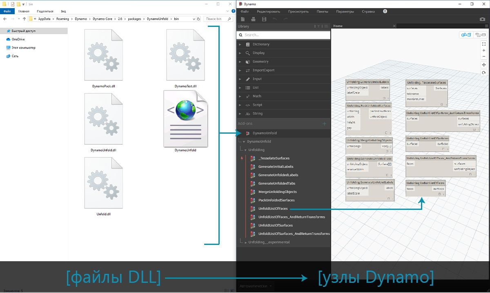
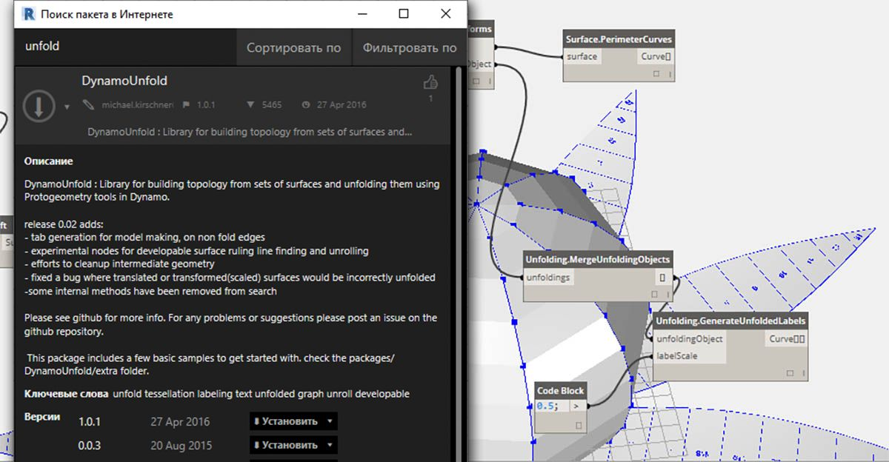
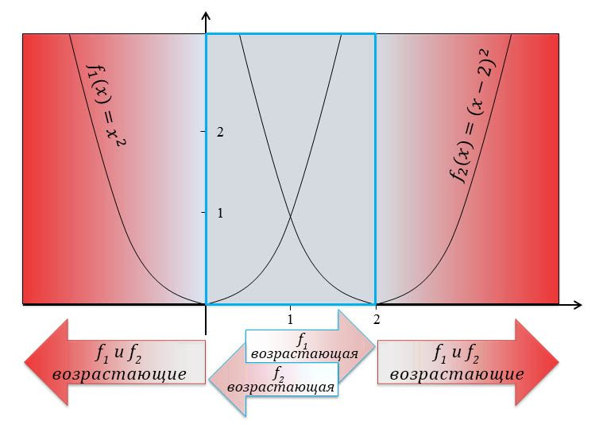
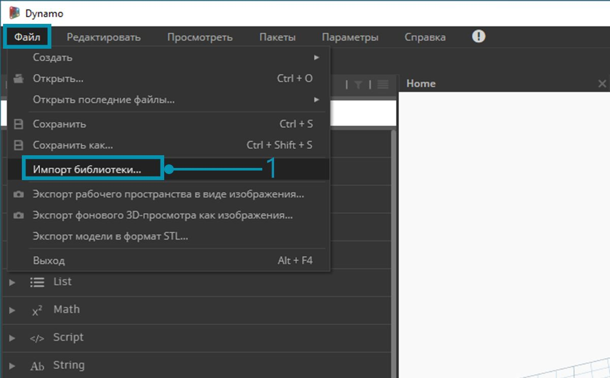
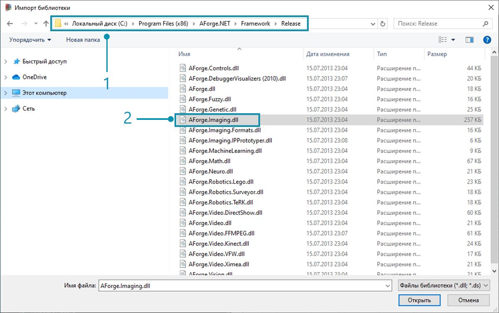
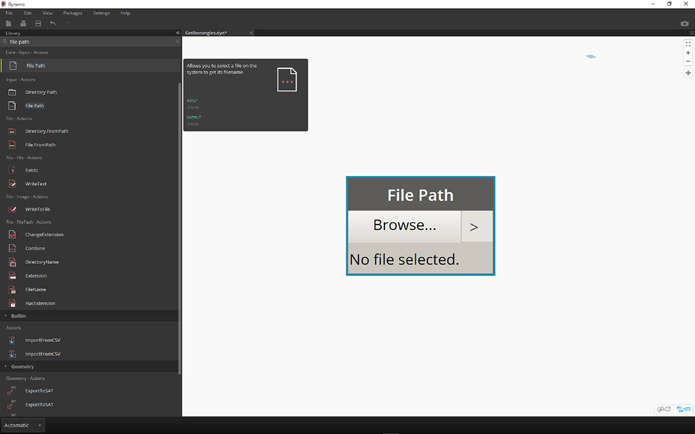
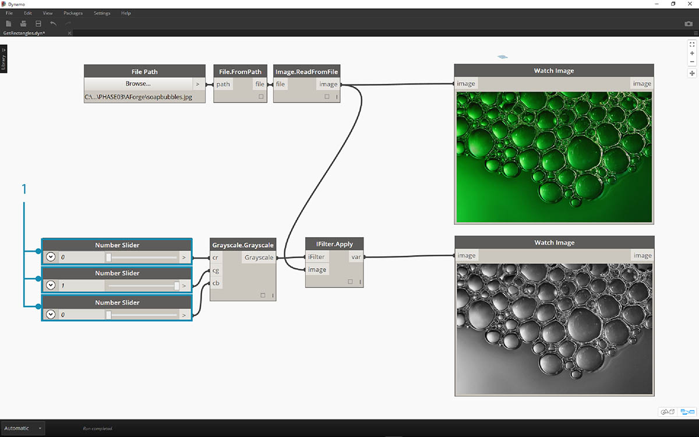
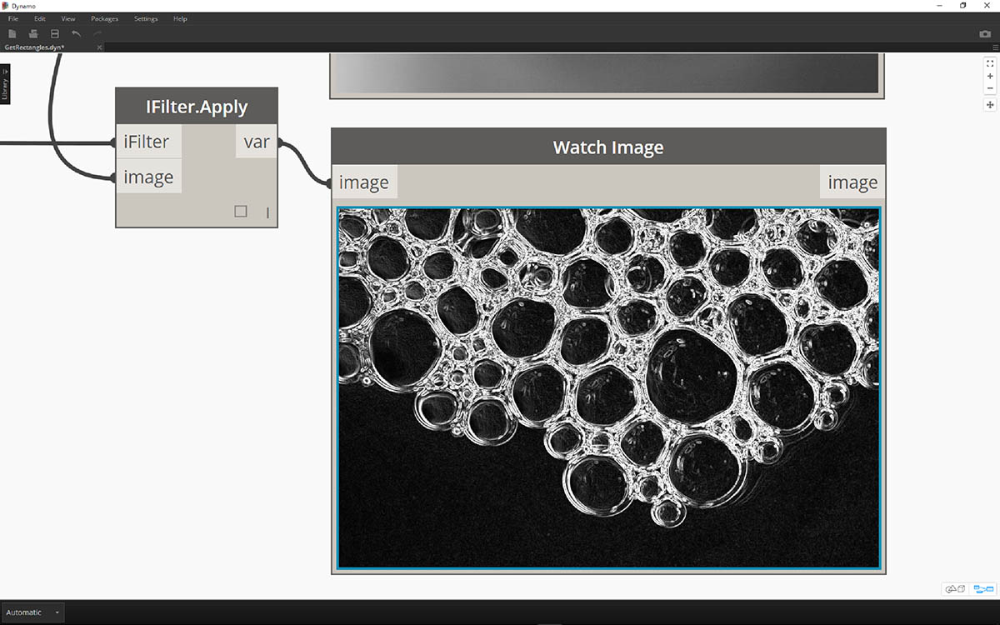
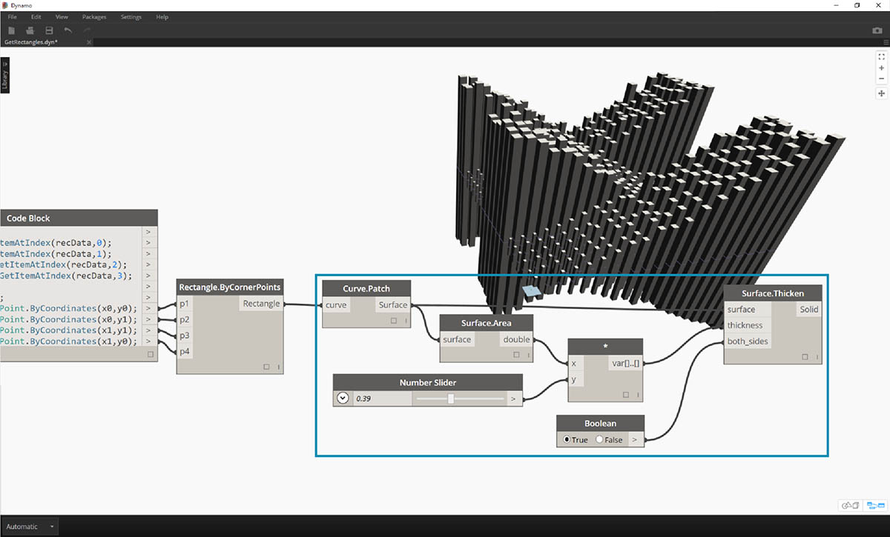

<style>
table{box-shadow: 2px 2px 2px #BBBBBB;max-width:75%;display:block;margin-left: auto;   margin-right: auto }
thead {display: none}
img{display:block;margin-left: auto;   margin-right: auto }
</style>

## Что такое Zero-Touch

Импорт Zero-Touch — это метод, позволяющий легко и быстро импортировать библиотеки C# одним щелчком мыши. Приложение Dynamo считывает общие методы из файла *DLL* и преобразует их в узлы Dynamo. Функцию Zero-Touch можно использовать для разработки пользовательских узлов и пакетов, а также для импорта внешних библиотек в среду Dynamo.



Zero-Touch позволяет импортировать библиотеки, в том числе разработанные не в Dynamo, и создавать наборы новых узлов. Эта функция является воплощением принципа кросс-платформенности, на котором основывается проект Dynamo.

В этом разделе показан процесс импорта сторонней библиотеки с помощью функции Zero-Touch. Дополнительные сведения о разработке пользовательской библиотеки Zero-Touch см. на [странице справки Wiki по работе с Dynamo](https://github.com/DynamoDS/Dynamo/wiki/Zero-Touch-Plugin-Development).

### Пакеты Zero-Touch

Пакеты Zero-Touch являются хорошим дополнением к пользовательским узлам. В таблице ниже приведены некоторые пакеты, в которых используются библиотеки C#. Дополнительные сведения о пакетах см. в [соответствующем разделе приложения](../Appendix/A-3_packages.md).


<table width="100%">
    <tr>
    <td width="20%"><b>Логотип/изображение</b></td>
    <td><b>Название</b></td>
</tr>
  <tr>
    <td></img></td>
    <td><a href="https://github.com/DynamoDS/Dynamo/wiki/Dynamo-Mesh-Toolkit">Mesh Toolkit</td></a>
  </tr>
  <tr>
    <td></img></td>
    <td><a href="http://dynamobim.com/dynamounfold/">Dynamo Unfold</td></a>
  </tr>
  <tr>
    <td></img></td>
    <td><a href="http://www.case-inc.com/blog/what-is-rhynamo">Rhynamo</td></a>
  </tr>
  <tr>
    <td></img></td>
    <td><a href="https://github.com/BPOpt/Optimo">Optimo</td></a>
  </tr>
</table>

### Практикум. Импорт AForge

В этом примере мы рассмотрим процесс импорта внешней библиотеки [AForge](http://www.aforgenet.com/) в формате *DLL*. AForge — это мощная библиотека, поддерживающая широкий спектр функциональных возможностей — от обработки изображений до искусственного интеллекта. При выполнении приведенных ниже упражнений по обработке изображений мы будет обращаться к классу Imaging этой библиотеки.

> Скачайте и распакуйте файлы примеров, идущие в комплекте с данным пакетом (щелкните правой кнопкой мыши и выберите «Сохранить ссылку как...»). Полный список файлов примеров можно найти в приложении. [Zero-Touch-Examples.zip](datasets/11-5/Zero-Touch-Examples.zip).

> 1. Для начала скачайте AForge. На [странице загрузки AForge](http://www.aforgenet.com/framework/downloads.html) нажмите *[ Download Installer ]*, дождитесь завершения загрузки и выполните установку.



> 1. Создайте новый файл в Dynamo и выберите *«Файл» > «Импорт библиотеки...»*.



> 1. В появившемся окне перейдите к подпапке Release в папке установки AForge. Путь к папке, скорее всего, будет выглядеть таким образом: *C:\Program Files (x86)\AForge.NET\Framework\Release*.
2. **AForge.Imaging.dll:** в рамках данного примера нам требуется только этот файл библиотеки AForge. Выберите этот файл *DLL* и нажмите *Открыть*.


> 1. В Dynamo на панели инструментов «Библиотека» должна появиться группа узлов *AForge*. Теперь библиотека для работы с изображениями AForge доступна непосредственно в приложении для визуального программирования.

### Упражнение 1. Выделение границ

Выполнив импорт библиотеки, можно приступать к первому несложному упражнению. Сначала мы выполним базовую обработку стандартного изображения и посмотрим, как AForge осуществляет фильтрацию изображений. Затем мы воспользуемся узлом *Watch Image* для отображения результатов и применим к изображению фильтры Dynamo, аналогичные фильтрам приложения Photoshop.

> Скачайте и распакуйте файлы примеров, идущие в комплекте с данным пакетом (щелкните правой кнопкой мыши и выберите «Сохранить ссылку как...»). Полный список файлов примеров можно найти в приложении. [ZeroTouchImages.zip](datasets/11-5/ZeroTouchImages.zip)

Выполнив импорт библиотеки, можно приступать к первому несложному упражнению (*01-EdgeDetection.dyn*). Сначала мы выполним базовую обработку стандартного изображения и посмотрим, как AForge осуществляет фильтрацию изображений. Затем мы воспользуемся узлом *Watch Image* для отображения результатов и применим к изображению фильтры Dynamo, аналогичные фильтрам приложения Photoshop.



> Для начала нужно импортировать изображение, с которым мы будем работать. Добавьте узел *File Path* в рабочую область и выберите файл soapbubbles.jpg в папке загруженных материалов для упражнения (источник изображения: [flickr](https://www.flickr.com/photos/wwworks/667298782)).


> 1. Узел File Path предоставляет путь к выбранному изображению в виде строки. Необходимо преобразовать эту строку в изображение в среде Dynamo.
2. Соедините узел File Path с узлом File.FromPath.
3. Чтобы преобразовать файл в изображение, используйте узел Image.ReadFromFile.
4. Наконец, чтобы увидеть результат, перетащите узел Watch Image в рабочую область и соедините его с Image.ReadFromFile. Мы еще не воспользовались библиотекой AForge, но уже успешно импортировали изображение в Dynamo.


> В разделе AForge.Imaging.AForge.Filters (в меню навигации) доступен широкий выбор фильтров. Мы воспользуемся одним из них, чтобы обесцветить изображение в соответствии с пороговыми значениями.

> 1. Перетащите в рабочую область три регулятора и задайте для них диапазоны от 0 до 1 с шагом 0,01.
2. Добавьте в рабочую область узел Grayscale.Grayscale. Это фильтр AForge, который позволяет применить к изображению оттенки серого. Соедините три регулятора, добавленные в шаге 1, с элементами cr, cg и cb. Задайте для верхнего и нижнего регуляторов значение 1, а для среднего — 0.
3. Чтобы применить оттенки серого, нам нужно задать действие, которое будет выполняться с изображением. Для этого мы используем узел IFilter.Apply. Соедините порт ввода image этого узла с узлом Image, а порт ввода iFilter — с узлом Grayscale.Grayscale.
4. Соедините этот узел с новым узлом Watch Image, и вы получите обесцвеченное изображение.



> Путем задания пороговых значений для красного, зеленого и синего цветов можно управлять тем, как именно будет обесцвечиваться изображение. Пороговые значения задаются через порты ввода узла Grayscale.Grayscale. Обратите внимание, что изображение выглядит довольно тусклым. Это вызвано тем, что для регулятора зеленого цвета задано значение 0.

> 1. Задайте для верхнего и нижнего регуляторов значение 0, а для среднего — 1. В результате полученное обесцвеченное изображение становится более контрастным.


> Теперь применим к полученному обесцвеченному изображению еще один фильтр. Поскольку изображение обладает определенной контрастностью, мы попробуем применить к нему функцию выделения границ.

> 1. Добавьте узел SobelEdgeDetector.SobelEdgeDetector в рабочую область. Добавьте новый узел IFilter и соедините его порт ввода IFilter с узлом SobelEdgeDetector, а порт ввода image — с узлом IFilter обесцвеченного изображения.
2. В результате мы получаем новое изображение, в котором оператор Собеля выделил все обнаруженные границы.



> В результате применения инструмента выделения границ мы получили увеличенное изображение пузырьков, границы которых выделены с помощью пикселей. В библиотеке AForge есть инструменты, которые позволяют использовать подобные результаты для создания геометрии Dynamo. Мы рассмотрим их в следующем упражнении.

### Упражнение 2. Создание прямоугольников

> Скачайте и распакуйте файлы примеров, идущие в комплекте с данным пакетом (щелкните правой кнопкой мыши и выберите «Сохранить ссылку как...»). Полный список файлов примеров можно найти в приложении. [ZeroTouchImages.zip](datasets/11-5/ZeroTouchImages.zip)

Теперь, когда мы ознакомились с базовыми возможностями обработки изображений, можно приступить к использованию изображений для создания геометрии Dynamo. Ваша минимальная задача в рамках этого упражнения — выполнить так называемую *быструю трассировку* изображения с помощью AForge и Dynamo. Пока что в целях простоты мы ограничимся извлечением прямоугольников из опорного изображения, однако в AForge доступны инструменты и для более сложных операций. В этом упражнении мы используем файл *02-RectangleCreation.dyn* из загруженного набора материалов для упражнения.


> 1. С помощью узла File Path задайте путь к файлу grid.jpg в папке материалов для упражнения.
2. Соедините последовательно оставшиеся узлы, как показано выше, чтобы отобразить грубую параметрическую сетку.

На следующем шаге мы зададим белые прямоугольники из этого изображения в качестве опорных объектов и преобразуем их в геометрию Dynamo. Библиотека AForge включает множество мощных инструментов компьютерного распознавания образов. В этом упражнении будет использован один из ключевых инструментов под названием [BlobCounter](http://www.aforgenet.com/framework/docs/html/d7d5c028-7a23-e27d-ffd0-5df57cbd31a6.htm).


> 1. После добавления узла BlobCounter в рабочую область нам нужно выполнить обработку изображения (аналогично использованию инструмента IFilter в предыдущем упражнении). К сожалению, найти узел обработки изображений Process Image в библиотеке Dynamo может быть затруднительно. Это связано с тем, что эта функция может быть не видна в исходном коде библиотеки AForge. Чтобы обойти эту проблему, потребуется временное решение.


> 1. Добавьте узел Python в рабочую область.

```
import clr
clr.AddReference('AForge.Imaging')
from AForge.Imaging import *

bc= BlobCounter()
bc.ProcessImage(IN[0])
OUT=bc
```

> Добавьте в узел Python приведенный выше код. Этот код позволяет импортировать библиотеку AForge, а затем обработать импортированное изображение.


> При соединении порта вывода image с портом ввода узла Python последний выдает результат AForge.Imaging.BlobCounter.

Следующие шаги включают в себя операции, требующие определенного опыта работы с [API-интерфейсом обработки изображений AForge](http://www.aforgenet.com/framework/docs/html/d087503e-77da-dc47-0e33-788275035a90.htm). Это не значит, что для работы с Dynamo обязательно нужно обладать этими знаниями. Мы сделали это в целях демонстрации гибких возможностей работы с внешними библиотеками в среде Dynamo.


> 1. Соедините порт вывода узла сценария Python с узлом BlobCounterBase.GetObjectRectangles. При этом объекты изображения считываются в соответствии с заданным пороговым значением, после чего квантифицированные прямоугольники извлекаются из пиксельного пространства.


> 1. Добавьте еще один узел Python в рабочую область, соедините его с узлом GetObjectRectangles и введите в него код, указанный ниже. В результате создается упорядоченный список объектов Dynamo.

```
OUT = []
for rec in IN[0]:
subOUT=[]
subOUT.append(rec.X)
subOUT.append(rec.Y)
subOUT.append(rec.Width)
subOUT.append(rec.Height)
OUT.append(subOUT)
```


> 1. Добавьте узел Transpose к порту вывода узла Python из предыдущего шага. Создаются четыре списка, содержащие значения координат X и Y, а также ширины и высоты для каждого прямоугольника.
2. С помощью узла Code Block упорядочим данные таким образом, чтобы их можно было использовать в узле Rectangle.ByCornerPoints (см. код ниже).

```
recData;
x0=List.GetItemAtIndex(recData,0);
y0=List.GetItemAtIndex(recData,1);
width=List.GetItemAtIndex(recData,2);
height=List.GetItemAtIndex(recData,3);
x1=x0+width;
y1=y0+height;
p0=Autodesk.Point.ByCoordinates(x0,y0);
p1=Autodesk.Point.ByCoordinates(x0,y1);
p2=Autodesk.Point.ByCoordinates(x1,y1);
p3=Autodesk.Point.ByCoordinates(x1,y0);
```


> Уменьшив масштаб отображения, вы увидите массив прямоугольников, представляющих белые квадраты на изображении. Таким образом, с помощью программирования мы смогли выполнить операцию, аналогичную быстрой трассировке в программе Adobe Illustrator.


> Теперь нам нужно удалить из изображения все лишнее. Увеличив масштаб, вы увидите маленькие прямоугольники, которые требуется удалить.


> 1. Чтобы удалить лишние прямоугольники, вставьте новый узел Python между узлом GetObjectRectangles и узлом Python, следующим за ним. Приведенный ниже код для этого узла позволяет удалить все прямоугольники, размер которых меньше заданного значения.

```
rectangles=IN[0]
OUT=[]
for rec in rectangles:
if rec.Width>8 and rec.Height>8:
OUT.append(rec)
```



> Удалив лишние прямоугольники, мы можем поэкспериментировать и создать поверхность из прямоугольников, а затем выдавить их на глубину, соответствующую их площади.


> 1. Наконец, измените значение both_sides на false, чтобы получить выдавливание в одном направлении. Если залить то, что у нас здесь получилось, эпоксидной смолой, то у нас был бы модный столик в стиле хай-тек.

Мы выполнили несколько простых упражнений, однако процедуры, которые здесь рассматривались, можно использовать гораздо более интересным образом для самых разных целей. Возможности компьютерного распознавания образов применимы в широчайшем спектре процессов, таких как сканирование штрихкодов, подгонка перспективы, [наложение данных проекции](https://www.youtube.com/watch?v=XSR0Xady02o), [дополненная реальность](http://aforgenet.com/aforge/articles/gratf_ar/) и многое другое. Дополнительные темы по работе с библиотекой AForge, связанные с этим упражнением, см. в [данной статье](http://aforgenet.com/articles/shape_checker/).

