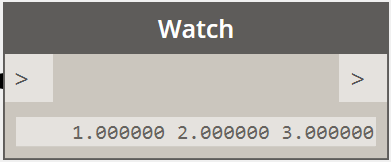

# Векторная математика

В машинном проектировании редко бывает так, что объекты создаются сразу в своей конечной форме и конечном положении. Чаще всего созданные объекты приходится переносить, поворачивать и иным образом позиционировать относительно существующей геометрии. Векторная математика играет роль своего рода геометрического каркаса, определяющего направление и ориентацию геометрии, а также позволяющего осмыслять перемещения геометрии по 3D-пространству без их визуального представления.

Если отбросить все лишнее, можно сказать, что вектор представляет собой то или иное положение в 3D-пространстве. Под вектором чаще всего подразумевают конечную точку стрелки, исходящей из начала координат (0, 0, 0) и указывающей на это местоположение. Векторы создаются с помощью конструктора *ByCoordinates*, в котором используются координаты X, Y и Z для нового объекта Vector. Обратите внимание, что объекты Vector не являются геометрическими объектами и не отображаются в окне Dynamo. При этом информацию о созданном или измененном векторе можно вывести на печать в окне консоли:



```
// construct a Vector object
v = Vector.ByCoordinates(1, 2, 3);

s = v.X + " " + v.Y + " " + v.Z;
```

Объекты Vector поддерживают определенный набор математических операций, которые позволяют складывать, вычитать, умножать и иным образом преобразовывать объекты в 3D-пространстве точно так же, как и при работе с вещественными числами в одномерном пространстве числовой оси.

Операция сложения объектов Vector позволяет получить сумму компонентов двух векторов. Визуально представить себе результат сложения векторов можно, поместив начало второго вектора в конечную точку первого. Операция сложения объектов Vector выполняется с использованием метода *Add* и представлена на схеме слева.


```
a = Vector.ByCoordinates(5, 5, 0);
b = Vector.ByCoordinates(4, 1, 0);

// c has value x = 9, y = 6, z = 0
c = a.Add(b);
```

Аналогичным образом можно вычесть один объект Vector из другого, используя метод *Subtract*. Результат вычитания двух векторов можно представить как расстояние от конечной точки одного вектора до конечной точки другого.


```
a = Vector.ByCoordinates(5, 5, 0);
b = Vector.ByCoordinates(4, 1, 0);

// c has value x = 1, y = 4, z = 0
c = a.Subtract(b);
```

При умножении объекта Vector на какое-либо число его конечная точка перемещается в направлении, соответствующем направлению вектора, на расстояние, соответствующее длине вектора и множителю.


```
a = Vector.ByCoordinates(4, 4, 0);

// c has value x = 20, y = 20, z = 0
c = a.Scale(5);
```

Зачастую при масштабировании вектора требуется, чтобы его длина стала равна значению коэффициента масштабирования. Этого можно легко добиться, выполнив нормализацию вектора, то есть приведя значение его длины к единице.


```
a = Vector.ByCoordinates(1, 2, 3);
a_len = a.Length;

// set the a's length equal to 1.0
b = a.Normalized();
c = b.Scale(5);

// len is equal to 5
len = c.Length;
```

Вектор С указывает в том же направлении, что и вектор А (1, 2, 3), но его длина теперь равна 5.

Векторная материка включает два дополнительных метода, не имеющих точных аналогов в одномерной математике: это векторное произведение и скалярное произведение. При векторном произведении создается объект Vector, который ортогонален (т. е. находится под углом 90 градусов) к двум существующим объектам Vector. В качестве примера можно привести ось Z, которая является векторным произведением осей X и Y (хотя исходные объекты Vector, на основе которых вычисляется векторное произведение, не обязательно должны быть ортогональны друг другу). Для вычисления векторного произведения используется метод *Cross*.


```
a = Vector.ByCoordinates(1, 0, 1);
b = Vector.ByCoordinates(0, 1, 1);

// c has value x = -1, y = -1, z = 1
c = a.Cross(b);
```

Скалярное произведение — это еще одна дополнительная и чуть более сложная функция векторной математики. Результатом скалярного произведения двух векторов является вещественное число (а не объект Vector), соответствующее углу между этими векторами (но не равняющееся ему). Одним из полезных свойств этой функции является возможность определить, являются ли векторы перпендикулярными, поскольку только в этом случае их скалярное произведение равняется нулю. Для вычисления скалярного произведения используется метод *Dot*.


```
a = Vector.ByCoordinates(1, 2, 1);
b = Vector.ByCoordinates(5, -8, 4);

// d has value -7
d = a.Dot(b);
```

