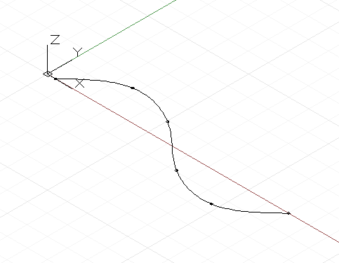
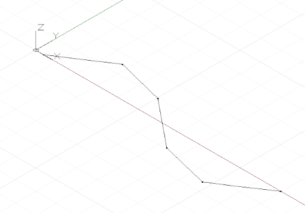

# Кривые: интерполяционные и по управляющим точкам

Создавать кривые произвольной формы в Dynamo можно двумя основными способами: задать набор точек и создать сглаженную кривую между ними путем интерполяции либо, если требуется получить кривую с конкретной степенью сглаживания, задать построение по управляющим точкам. Интерполяционные кривые подходят для случаев, когда проектировщик точно знает, какой формы должна быть линия, или когда в проекте заданы конкретные зависимости, определяющие то, где кривая может проходить, а где не может. Кривые по управляющим точкам представляют собой набор прямолинейных сегментов, который путем применения алгоритма сглаживается до получения требуемой кривой. Построение кривой по управляющим точкам позволяет сравнивать варианты с разными степенями сглаживания, а также обеспечивать последовательное применение сглаживания к криволинейным сегментам.

Для построения интерполяционной кривой достаточно задать набор точек и использовать его в качестве входных данных для метода *NurbsCurve.ByPoints*.



```js
num_pts = 6;

s = Math.Sin(0..360..#num_pts) * 4;

pts = Point.ByCoordinates(1..30..#num_pts, s, 0);

int_curve = NurbsCurve.ByPoints(pts);
```

Полученная кривая пересекает каждую из заданных точек, а ее начало и конец находятся в первой и последней точках заданного набора соответственно. Задав дополнительный параметр периодичности, можно получить замкнутую периодическую кривую. При этом Dynamo автоматически подставит отсутствующий сегмент, так что отдельно задавать конечную точку, совпадающую с начальной точкой, не требуется.


```js
pts = Point.ByCoordinates(Math.Cos(0..350..#10),
    Math.Sin(0..350..#10), 0);

// create an closed curve
crv = NurbsCurve.ByPoints(pts, true);

// the same curve, if left open:
crv2 = NurbsCurve.ByPoints(pts.Translate(5, 0, 0),
    false);
```

Построение объектов NurbsCurve выполняется схожим образом. В качестве первого параметра задается набор точек (а именно конечных точек прямолинейных сегментов), а в качестве второго — величина и тип (т. е. степень) сглаживания кривой.* Кривая со степенью сглаживания 1 не сглаживается и представляет собой полилинию.



```js
num_pts = 6;

pts = Point.ByCoordinates(1..30..#num_pts,
    Math.Sin(0..360..#num_pts) * 4, 0);

// a B-Spline curve with degree 1 is a polyline
ctrl_curve = NurbsCurve.ByControlPoints(pts, 1);
```

Кривая со степенью сглаживания 2 сглаживается таким образом, чтобы она проходила сквозь и по касательной к средним точкам сегментов полилинии:


```js
num_pts = 6;

pts = Point.ByCoordinates(1..30..#num_pts,
    Math.Sin(0..360..#num_pts) * 4, 0);

// a B-Spline curve with degree 2 is smooth
ctrl_curve = NurbsCurve.ByControlPoints(pts, 2);
```

В Dynamo поддерживаются NURBS-кривые (неоднородные рациональные B-сплайны) со степенью сглаживания от 1 до 20. Приведенный ниже сценарий демонстрирует, как повышение степени сглаживания влияет на форму кривой.


```js
num_pts = 6;

pts = Point.ByCoordinates(1..30..#num_pts,
    Math.Sin(0..360..#num_pts) * 4, 0);

def create_curve(pts : Point[], degree : int) 
{
	return = NurbsCurve.ByControlPoints(pts,
        degree);
}

ctrl_crvs = create_curve(pts, 1..11);
```

Обратите внимание, что число управляющих точек должно превышать значение степени сглаживания как минимум на единицу.

Еще одно преимущество построения кривых по управляющим вершинам — возможность сохранения касательности между отдельными криволинейными сегментами. Для этого программа определяет направление при движении от предпоследней управляющей точки сегмента к последней, а затем размещает две первые управляющие точки следующего сегмента в соответствии с этим направлением. В следующем примере показаны две отдельные NURBS-кривые, которые при этом выглядят как единая сглаженная кривая.


```js
pts_1 = {};

pts_1[0] = Point.ByCoordinates(0, 0, 0);
pts_1[1] = Point.ByCoordinates(1, 1, 0);
pts_1[2] = Point.ByCoordinates(5, 0.2, 0);
pts_1[3] = Point.ByCoordinates(9, -3, 0);
pts_1[4] = Point.ByCoordinates(11, 2, 0);

crv_1 = NurbsCurve.ByControlPoints(pts_1, 3);

pts_2 = {};

pts_2[0] = pts_1[4];
end_dir = pts_1[4].Subtract(pts_1[3].AsVector());

pts_2[1] = Point.ByCoordinates(pts_2[0].X + end_dir.X,
    pts_2[0].Y + end_dir.Y, pts_2[0].Z + end_dir.Z);

pts_2[2] = Point.ByCoordinates(15, 1, 0);
pts_2[3] = Point.ByCoordinates(18, -2, 0);
pts_2[4] = Point.ByCoordinates(21, 0.5, 0);

crv_2 = NurbsCurve.ByControlPoints(pts_2, 3);
```

* В данной главе приведено упрощенное описание геометрии NURBS-кривых. Для получения подробных сведений см. Pottmann, et al, 2007 г., в списке литературы.

