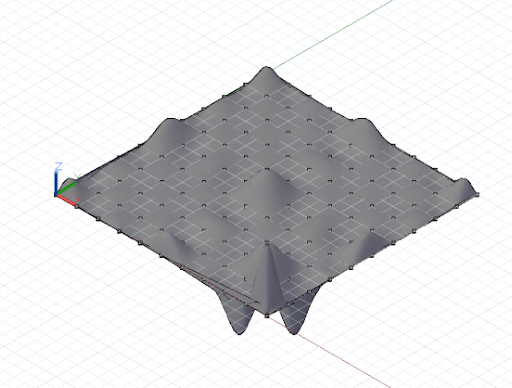
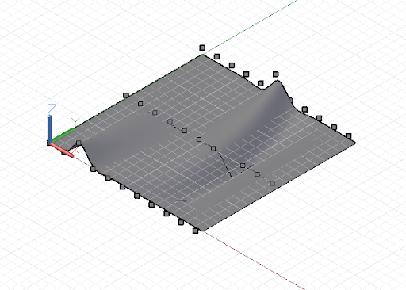

# Поверхности: интерполяционные, лофтированные, по управляющим точкам и поверхности вращения

Объект NurbsSurface является двумерным аналогом объекта NurbsCurve. Как и объекты NurbsCurve, объекты NurbsSurfaces создаются двумя основными способами: путем интерполяции набора базовых точек либо указания управляющих точек поверхности. Аналогично кривым произвольной формы интерполяционные поверхности подходят для случаев, когда проектировщик точно знает, какой формы должна быть поверхность, или когда в проекте заданы конкретные точки зависимости, через которые плоскость должна проходить. Поверхности по управляющим точкам подходят для случаев, требующих анализа поведения поверхности при различных уровнях сглаживания.

Для создания интерполяционной поверхности достаточно задать двумерный набор точек, приблизительно соответствующий форме поверхности. Набор должен быть прямоугольным, без изломов. Чтобы создать поверхность из этих точек, используйте метод *NurbsSurface.ByPoints*.


```
// python_points_1 is a set of Points generated with
// a Python script found in Chapter 12, Section 10

surf = NurbsSurface.ByPoints(python_points_1);
```

Кроме того, объекты NurbsSurface произвольной формы можно создавать путем задания базовых управляющих точек. Как и в случае с объектами NurbsCurve, управляющие точки образуют четырехугольную сеть, состоящую из прямолинейных сегментов, к которой применена та или иная степень сглаживания. Для создания объекта NurbsSurface по управляющим точкам в метод *NurbsSurface.ByPoints* необходимо добавить два дополнительных параметра, которые позволяют указать степень сглаживания базовых кривых по обеим сторонам поверхности.


```
// python_points_1 is a set of Points generated with
// a Python script found in Chapter 12, Section 10

// create a surface of degree 2 with smooth segments
surf = NurbsSurface.ByPoints(python_points_1, 2, 2);
```

Увеличив степень сглаживания объекта NurbsSurface, можно изменить итоговую геометрию поверхности.



```
// python_points_1 is a set of Points generated with
// a Python script found in Chapter 12, Section 10

// create a surface of degree 6
surf = NurbsSurface.ByPoints(python_points_1, 6, 6);
```

Интерполяционные поверхности можно создавать не только на основе наборов точек, но и на основе наборов кривых. Это называется лофтингом. Для построения лофтированных поверхностей используется конструктор *Surface.ByLoft*, где в качестве единственного входного параметра указывается набор кривых.



```
// python_points_2, 3, and 4 are generated with
// Python scripts found in Chapter 12, Section 10

c1 = NurbsCurve.ByPoints(python_points_2);
c2 = NurbsCurve.ByPoints(python_points_3);
c3 = NurbsCurve.ByPoints(python_points_4);

loft = Surface.ByLoft([c1, c2, c3]);
```

Поверхности вращения — это дополнительный тип поверхностей, который создается путем сдвига базовой кривой относительно центральной оси. Такие поверхности являются двумерным аналогом окружностей и дуг, точно так же как интерполяционные поверхности являются двумерным аналогом интерполяционных кривых.

Для построения поверхности вращения необходимо задать базовую кривую («кромку» поверхности), начало координат оси (базовую точку поверхности), направление оси (направление «центра», вокруг которого строится поверхность), начальный и конечный углы сдвига. Все эти данные используются в качестве входных параметров конструктора *Surface.Revolve*.


```
pts = {};
pts[0] = Point.ByCoordinates(4, 0, 0);
pts[1] = Point.ByCoordinates(3, 0, 1);
pts[2] = Point.ByCoordinates(4, 0, 2);
pts[3] = Point.ByCoordinates(4, 0, 3);
pts[4] = Point.ByCoordinates(4, 0, 4);
pts[5] = Point.ByCoordinates(5, 0, 5);
pts[6] = Point.ByCoordinates(4, 0, 6);
pts[7] = Point.ByCoordinates(4, 0, 7);

crv = NurbsCurve.ByPoints(pts);

axis_origin = Point.ByCoordinates(0, 0, 0);
axis = Vector.ByCoordinates(0, 0, 1);

surf = Surface.ByRevolve(crv, axis_origin, axis, 0,
360);
```

