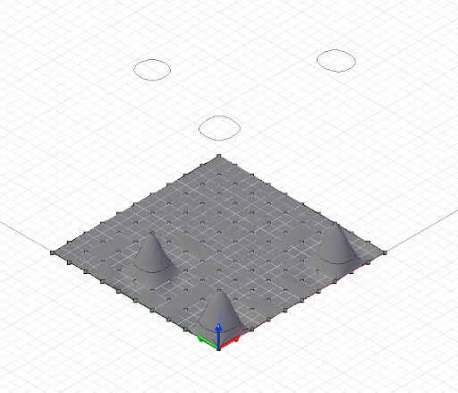

# Пересечение и обрезка

Во многих рассмотренных примерах основное внимание было уделено построению более сложных геометрических объектов на основе более простых объектов. Методы Intersect позволяют делать обратное, а именно получать простые геометрические объекты из сложных. Команды Trim и SelectTrim позволяют использовать сценарии для масштабных преобразований геометрических форм после их создания.

Метод *Intersect* поддерживается всеми геометрическими объектами в Dynamo. В теории это значит, что любой геометрический объект может пересекаться с любым другим геометрическим объектом. Разумеется, построение определенных пересечений, таких как пересечение объектов Point, не имеет смысла, поскольку результатом пересечения будет тот же объект Point, который был задан на входе. Другие возможные комбинации пересекающихся объектов приведены в следующей таблице. В ней указаны возможные результаты различных операций пересечения.

**Пересечение**

|*Пересекающиеся объекты*|Поверхность|Кривая|Плоскость|Тело|
| -- | -- | -- | -- | -- |
|**Поверхность**|Кривая|Точка|Точка, кривая|Поверхность|
|**Кривая**|Точка|Точка|Точка|Кривая|
|**Плоскость**|Кривая|Точка|Кривая|Кривая|
|**Тело**|Поверхность|Кривая|Кривая|Тело|

Приведенный ниже пример иллюстрирует пересечение плоскости с поверхностью NurbsSurface. В результате пересечения получается массив NurbsCurve, который можно использовать как любой другой объект NurbsCurve.



```
// python_points_5 is a set of Points generated with
// a Python script found in Chapter 12, Section 10

surf = NurbsSurface.ByPoints(python_points_5, 3, 3);

WCS = CoordinateSystem.Identity();

pl = Plane.ByOriginNormal(WCS.Origin.Translate(0, 0,
0.5), WCS.ZAxis);

// intersect surface, generating three closed curves
crvs = surf.Intersect(pl);

crvs_moved = crvs.Translate(0, 0, 10);
```

Метод *Trim* очень похож на метод Intersect. Он поддерживается почти для всех геометрических объектов. Однако в отношении метода *Trim* действует больше ограничений, чем в отношении метода *Intersect*.

**Обрезка**

||*Объект, с помощью которого выполняется обрезка:* точка|Кривая|Плоскость|Поверхность|Тело|
| -- | -- | -- | -- | -- | -- |
|*Объект, на котором выполняется обрезка:* кривая|Да|Нет|Нет|Нет|Нет|
|Полигон|-|Нет|Да|Нет|Нет|
|Поверхность|-|Да|Да|Да|Да|
|Тело|-|-|Да|Да|Да|

Особенностью методов *Trim* является обязательное наличие точки «выбора», определяющей, какая геометрия будет обрезана, а какая сохранена. Dynamo использует точку выбора для выявления геометрии, находящейся ближе всего к этой точке, и затем обрезает эту геометрию.


```
// python_points_5 is a set of Points generated with
// a Python script found in Chapter 12, Section 10

surf = NurbsSurface.ByPoints(python_points_5, 3, 3);

tool_pts = Point.ByCoordinates((-10..20..10)<1>,
(-10..20..10)<2>, 1);

tool = NurbsSurface.ByPoints(tool_pts);

pick_point = Point.ByCoordinates(8, 1, 3);

result = surf.Trim(tool, pick_point);
```

