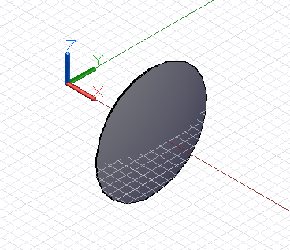

# Логические операции с геометрическими объектами

Методы *Intersect*, *Trim* и *SelectTrim* в основном используются при работе с простыми геометрическими объектами, такими как точки, кривые и поверхности. Для твердотельных геометрических объектов доступны дополнительные методы изменения формы после ее построения. Эти методы включают как удаление материала аналогично методу *Trim*, так и объединение нескольких элементов для получения единого большого элемента.

Метод *Union* позволяет создать новый твердотельный объект на основе двух исходных объектов. Итоговый объект занимает в пространстве столько же места, сколько занимали оба исходных. Если объекты накладываются друг на друга в пространстве, то в итоговой форме накладывающиеся участки объединяются. В этом примере из сферы и кубоида путем объединения была получена единая кубо-сферическая твердотельная форма:


```
s1 = Sphere.ByCenterPointRadius(
CoordinateSystem.Identity().Origin, 6);

s2 = Sphere.ByCenterPointRadius(
CoordinateSystem.Identity().Origin.Translate(4, 0,
0), 6);

combined = s1.Union(s2);
```

Метод *Difference*, аналогично методу *Trim*, позволяет удалить из базового тела материал, объем которого соответствует используемому на входе твердотельному инструменту. В этом примере в сфере был создан небольшой вырез:


```
s = Sphere.ByCenterPointRadius(
CoordinateSystem.Identity().Origin, 6);

tool = Sphere.ByCenterPointRadius(
CoordinateSystem.Identity().Origin.Translate(10, 0,
0), 6);

result = s.Difference(tool);
```

Результатом использования метода *Intersect* является тело, образованное наложением двух других тел. В следующем примере вместо метода *Difference* был использован метод *Intersect*, в результате чего было получено тело, объем которого соответствует вырезу в предыдущем примере:



```
s = Sphere.ByCenterPointRadius(
CoordinateSystem.Identity().Origin, 6);

tool = Sphere.ByCenterPointRadius(
CoordinateSystem.Identity().Origin.Translate(10, 0,
0), 6);

result = s.Intersect(tool);
```

