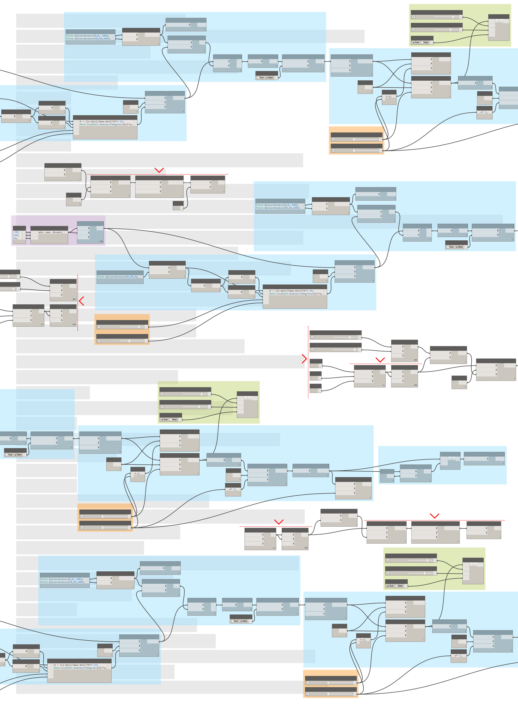

# Практические рекомендации

Этот раздел данного руководства является своеобразным сборником полезных советов. В нем рассказывается о разных стратегиях, разработанных на основе опыта и результатов исследований и позволяющих повысить качество параметрических рабочих процессов. Как проектировщики и программисты, мы измеряем качество наших инструментов их стабильностью, надежностью, удобством и эффективностью. В этом разделе вы найдете отдельные примеры для визуальных и текстовых сценариев, однако основополагающие принципы являются универсальными для всех сред программирования и могут использоваться в самых разных вычислительных рабочих процессах.

