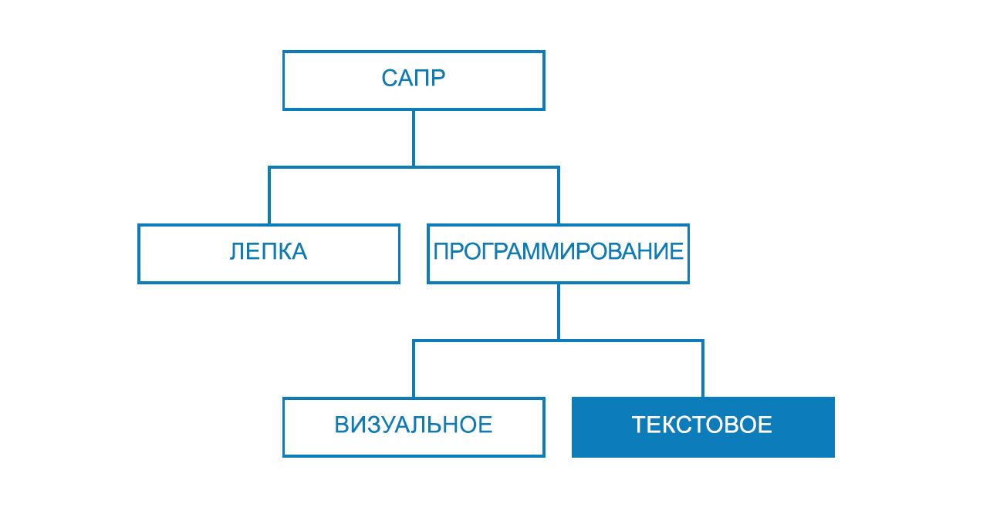
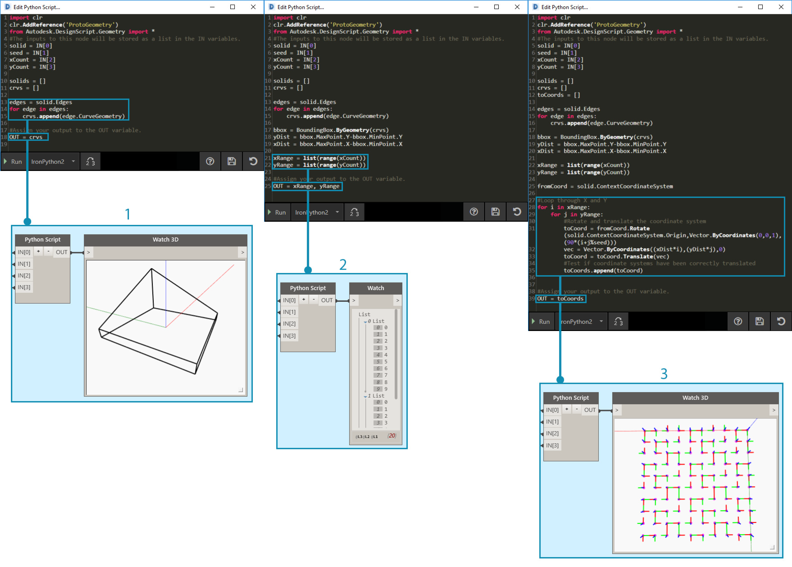

## Методы создания сценариев

Создание сценариев на основе текста в среде разработки визуальных сценариев обеспечивает возможность построения эффективных наглядных взаимосвязей с использованием языков DesignScript, Python и ZeroTouch (C#). В DesignScript можно отображать такие элементы, как регуляторы ввода, и сжимать сложные операции. В том же рабочем пространстве с помощью Python или C# можно получить доступ к мощным инструментам и библиотекам. При грамотном использовании сочетание этих методов может обеспечить высокую степень адаптированности, ясности и эффективности всей программы. Ниже приводится набор рекомендаций по дополнению визуальных сценариев текстовыми.



### Своевременное использование сценариев

Текстовые сценарии позволяют устанавливать более сложные взаимосвязи, чем визуальное программирование, хотя их возможности во многом пересекаются. Это следует учитывать, так как узлы представляют собой эффективные пакеты кода, что позволяет написать целую программу для Dynamo в DesignScript или Python. Однако визуальные сценарии используются по причине того, что интерфейс, состоящий из узлов и проводов, позволяет создать интуитивно понятный поток графической информации. Информация о том, в каких случаях возможности текстовых сценариев превосходят возможности визуальных сценариев, — ключ к их использованию без отказа от работы с интуитивно понятными узлами и проводами. Ниже приводятся рекомендации в отношении того, когда следует использовать сценарии и какой при этом выбрать язык программирования.

**Текстовые сценарии используются в следующих случаях:**

* организация циклов;

* использование рекурсии;

* доступ к внешним библиотекам.

**Выбор языка**

||Циклы|Рекурсия|Сжатие узлов|Внешн. библиотеки|Сокращение|
| -- | -- | 
|**DesignScript**|Да|Да|Да|Нет|Да|
|**Python**|Да|Да|Частично|Да|Нет|
|**ZeroTouch (C#)**|Нет|Нет|Нет|Да|Нет|

> Список ресурсов, доступных в библиотеках Dynamo, см. в [Справке по сценариям](http://primer.dynamobim.org/en/12_Best-Practice/12-3_Scripting-Reference.html).

### Параметрическое мышление

При написании сценариев в Dynamo — параметрической среде — имеет смысл структурировать код с учетом системы узлов и проводов, в которой он будет размещен. Рассматривайте узел, содержащий текстовый сценарий, как любой другой узел в программе с некоторыми определенными входными данными, функцией и ожидаемыми выходными данными. При этом код внутри узла получает небольшой набор переменных, на основе которых можно строить работу, а это — ключ к безупречной параметрической системе. Далее приводятся некоторые рекомендации, позволяющие успешнее встроить код в визуальную программу.

**Определите внешние переменные.**

* Попробуйте определить заданные параметры в проектной задаче, чтобы можно было построить модель непосредственно на этих данных.

* Перед написанием кода необходимо указать следующие переменные:

  * минимальный набор входных данных;

  * ожидаемые выходные данные;

  * константы.


> Перед написанием кода было определено несколько переменных.

> 1. Поверхность, на которую будет моделироваться выпадение осадков.
2. Желаемое количество капель дождя (агентов).
3. Расстояние перемещения капель дождя.
4. Переключение между режимом спуска по траектории с наибольшей крутизной и режимом пересечения поверхности.
5. Узел Python с соответствующим количеством входных данных.
6. Блок кода для окрашивания возвращаемых кривых синим цветом.

**Разработайте внутренние взаимосвязи.**

* Параметрическая архитектура позволяет редактировать определенные параметры или переменные для настройки или изменения конечного результата уравнения или работы системы.

* Если объекты в сценарии логически связаны между собой, следует указать, что один является функцией другого и наоборот. Таким образом, при изменении одного объекта другой также будет обновлен.

* Сократите количество входных данных, оставив только ключевые параметры.

  * Если набор параметров может быть сформирован из дополнительных родительских параметров, в качестве входных данных сценария оставьте только эти родительские параметры. Это повышает удобство работы со сценарием за счет некоторого упрощения его интерфейса.


> «Модули» кода из примера в [узле Python](http://primer.dynamobim.org/en/09_Custom-Nodes/9-4_Python.html).

> 1. Входные данные.
2. Внутренние переменные сценария.
3. Цикл, для выполнения функции которого используются эти входные данные и переменные.
> Совет. Уделите столько же внимания процессу, сколько и самому решению.

**Не повторяйтесь (следуйте принципу DRY — Don't repeat yourself).**

* Если один и тот же фрагмент в сценарии выражается несколькими способами, рано или поздно произойдет десинхронизация этих совпадений, что потребует значительных исправлений, приведет к ошибкам в расчетах и внутренним противоречиям.

* Принцип DRY звучит следующим образом: «Информация, вводимая в компьютер должна быть конкретной и однозначной».

  * При успешном применении этого принципа все взаимосвязанные элементы в сценарии будут изменяться предсказуемо и единообразно, а все несвязанные элементы не будут иметь логических последствий друг для друга.

```
### BAD
for i in range(4):
for j in range(4):
point = Point.ByCoordinates(3*i, 3*j, 0)
points.append(point)
```

```
### GOOD
count = IN[0]
pDist = IN[1]

for i in range(count):
for j in range(count):
point = Point.ByCoordinates(pDist*i, pDist*j, 0)
points.append(point)
```

> Совет. Перед дублированием объектов в сценарии (например, константы в примере выше) подумайте, можно ли вместо этого установить связь с источником.

### Модульная структура

По мере расширения и усложнения кода основная идея (ключевой алгоритм) становится все менее и менее читаемой. При этом все сложнее отслеживать, что и где может произойти, выявлять ошибки при возникновении проблем, встраивать другой код и назначать задачи по разработке. Чтобы избежать этих сложностей, для написания кода рекомендуется использовать модули. При этой организационной методике код разбивается на части в зависимости от выполняемой задачи. Далее представлены некоторые советы по расширению возможностей управления сценариями благодаря модульности.

**Записывайте код в виде модулей.**

* «Модуль» — это группа данных кода, выполняющая определенную задачу (аналогично узлу Dynamo в рабочем пространстве).

* Это может быть любой объект, который визуально отделен от близлежащего кода (функция, класс, группа входных данных или импортируемые библиотеки).

* Разработка кода в форме модулей повышает визуальное и интуитивное качество узлов, позволяя строить сложные взаимосвязи, реализуемые только с помощью текстовых сценариев.


> Эти циклы вызывают класс с именем agent (агент), который мы будем разрабатывать в упражнении.

> 1. Модуль кода, определяющий начальную точку каждого агента.
2. Модуль кода, обновляющий агента.
3. Модуль кода, который строит маршрут траектории агента.

**Ищите повторяющийся код.**

* Если выясняется, что код выполняет одно и то же (или почти одно и то же) действие в нескольких местах, рекомендуется кластеризовать его в функцию, доступную для вызова.

* Функции Manager управляют ходом выполнения программы и содержат вызовы функций Worker для обработки низкоуровневых задач, например для перемещения данных между конструкциями.


> В этом примере создаются сферы с радиусами и цветом, зависящими от значения Z центров.

> 1. Имеется две родительские функции Worker: одна из них создает сферы с радиусами и отображает цвета в зависимости от значения Z центра.
2. В родительской функции Manager объединены две функции Worker. При ее вызове вызываются и обе находящиеся в ней функции.

**Отображайте только нужные элементы.**

* В интерфейсе модуля отображаются элементы, как предоставляемые самим модулем, так и необходимые ему.

* После того как интерфейсы между блоками определены, детальная разработка каждого блока может выполняться отдельно.

**Разделимость и заменяемость.**

* Модули никаким образом не зависимы друг от друга.

**Основные формы модульной организации.**

* Группировка кодов

```
# IMPORT LIBRARIES
import random
import math
import clr
clr.AddReference('ProtoGeometry')
from Autodesk.DesignScript.Geometry import *

# DEFINE PARAMETER INPUTS
surfIn = IN[0]
maxSteps = IN[1]
```

* Функции

```
def get_step_size():
area = surfIn.Area
stepSize = math.sqrt(area)/100
return stepSize

stepSize = get_step_size()
```

* Классы

```
class MyClass:
i = 12345

def f(self):
return 'hello world'

numbers = MyClass.i
greeting = MyClass.f
```

### Зондирование на всех этапах работы

При написании текстовых сценариев в Dynamo важно всегда быть уверенным, что создаваемое соответствует ожидаемому. Благодаря этому непредвиденные события — синтаксические ошибки, логические несоответствия, неточности значений, непредвиденные выходные данные и т. д. —можно быстро выявлять и устранять отдельно по мере появления, а не общей массой по завершении работы. Так как текстовые сценарии размещаются в узлах рабочей области, они автоматически встроены в поток данных визуальной программы. Благодаря этому последующий мониторинг сценария ограничивается лишь назначением данных для вывода, запуском программы и оценкой результатов, выводимых из сценария с помощью узла наблюдения (Watch). Ниже приводятся советы по непрерывной проверке сценариев в процессе их создания.

**Проверка во время работы.**

* Каждый раз по завершении работы над группой функций рекомендуется выполнять следующие действия.

  * Сделайте паузу и уделите время проверке кода.

  * Проявляйте критичность. Ваши коллеги смогут понять, для чего он предназначен? Эта функция действительно необходима? Можно ли повысить ее эффективность? Не создаю ли я лишних копий или зависимостей?

  * Проведите экспресс-проверку данных на целесообразность.

* В качестве выходных данных назначайте наиболее актуальную информацию, обрабатываемую в сценарии, чтобы при обновлении сценария узел всегда выводил релевантные данные.



> Зондирование образца кода из [узла Python](http://primer.dynamobim.org/en/09_Custom-Nodes/9-4_Python.html).

> 1. Убедитесь, что все кромки тела возвращаются в виде кривых, в результате чего вокруг него создается ограничивающая рамка.
2. Проверьте, чтобы входные данные количества успешно преобразовывались в диапазоны.
3. Убедитесь, что системы координат в данном цикле правильно преобразованы и повернуты.

**Учитывайте пограничные случаи.**

* При написании сценариев присвойте входным параметрам минимальные и максимальные значения в отведенной им области, чтобы проверить, будет ли программа функционировать при экстремальных условиях.

* Даже если программа работает с предельными установками, проверьте, не возвращает ли она нежелательные нулевые или пустые значения.

* Иногда неисправности и ошибки, позволяющие обнаружить скрытую проблему в сценарии, проявляются только в таких пограничных случаях.

  * Определите, что вызывает ошибку, а затем решите, следует ли исправить ее изнутри или перенастроить всю область параметров, чтобы избежать проблемы.

> Совет. Всегда исходите из того, что пользователь может выбрать любую комбинацию с любым доступным входным значением. Это поможет избежать неприятных сюрпризов.

### Эффективная отладка

Отладкой называется процесс устранения ошибок в сценарии. Под ошибками подразумеваются неполадки, недоработки, неточности и любые нежелательные результаты. Иногда чтобы исправить ошибку, достаточно скорректировать неправильно написанное имя переменной. В других случаях речь может идти о более глобальной проблеме, связанной со структурой сценария. В идеале зондирование сценария в процессе его создания поможет сразу выявить потенциальные проблемы, хотя это и не гарантирует полное отсутствие ошибок. Ниже приведены некоторые практические советы, которые помогут устранять ошибки систематически.

**Используйте марки наблюдения.**

* Проверяйте данные, возвращаемые в различных местах кода, назначая их переменной OUT (аналогично методу зондирования программы).

**Оставляйте подробные комментарии.**

* Модуль кода будет намного проще отладить, если предполагаемый результат его работы будет точно описан.

```
# Loop through X and Y
for i in range(xCount):
for j in range(yCount):

# Rotate and translate the coordinate system
toCoord = fromCoord.Rotate(solid.ContextCoordinateSystem.Origin,Vector.ByCoordinates(0,0,1),(90*(i+j%seed)))
vec = Vector.ByCoordinates((xDist*i),(yDist*j),0)
toCoord = toCoord.Translate(vec)

# Transform the solid from the source coord system to the target coord system and append to the list
solids.append(solid.Transform(fromCoord,toCoord))
```

> Обычно это приводит к увеличению количества информации и пустых строк, но при отладке позволяет анализировать данные, разбив их на отдельные части.

**Используйте модульный принцип организации кода.**

* Источник проблемы можно свести к определенным модулям.

* После того как проблемный модуль определен, исправить проблему будет значительно проще.

* Если необходимо изменить программу, код, который был разработан в отдельных модулях, будет намного проще скорректировать.

  * Можно вставить в существующую программу новый или отлаженный модуль с уверенностью в том, что остальная часть программы не изменится.


> Отладка файла примера из [узла Python](http://primer.dynamobim.org/en/09_Custom-Nodes/9-4_Python.html).

> 1. Входная геометрия возвращает ограничивающую рамку слишком большого размера. Это можно видеть, назначив переменной OUT значения xDist и yDist.
2. Кривые ребра входной геометрии имеют подходящую ограничивающую рамку и правильные расстояния xDist и yDist.
3. Вставлен модуль кода, позволяющий решить проблему со значениями xDist и yDist.

### Упражнение «Траектория с наибольшей крутизной»

> Скачайте файл примера, прилагаемый к этому упражнению (щелкните правой кнопкой мыши и выберите «Сохранить ссылку как...»). Полный список файлов примеров можно найти в приложении. [SteepestPath.dyn](datasets/13-1/SteepestPath.dyn)

Напишите сценарий для моделирования дождевых осадков с учетом представленных здесь практических советов по созданию текстовых сценариев. Несмотря на то, что практические советы были успешно применены к плохо организованной визуальной программе в разделе «Методы создания графиков», данные операции значительно сложнее выполнять с текстовыми сценариями. Логические связи, существующие в текстовых сценариях, сложнее отслеживаются и почти не распознаются в запутанном коде. Вместе с возможностями, которые дают текстовые сценарии, повышаются и требования к организации кода. Рассмотрим каждый из этапов, применяя на деле практические советы.


> Наш сценарий применялся к поверхности, деформированной точкой притяжения.

Сначала следует импортировать необходимые библиотеки Dynamo. Сделав это в первую очередь, мы предоставим глобальный доступ к функциональным возможностям Dynamo в Python.


> Сюда необходимо импортировать все библиотеки, которые планируется использовать.

Затем следует определить входные и выходные данные сценария, которые будут отображаться в качестве входных портов узла. Эти внешние входные данные являются основой сценария и ключом к созданию параметрической среды.


> Необходимо определить входные данные, соответствующие переменным в сценарии Python, и определить желаемый результат.

> 1. Поверхность, по которой будут спускаться агенты.
2. Количество движущихся агентов.
3. Максимальное количество шагов, которые могут сделать агенты.
4. Возможность использования кратчайшего пути вниз по поверхности или ее пересечения.
5. Узел Python с идентификаторами ввода, соответствующими входным данным в сценарии (IN[0], IN[1]).
6. Выходные кривые, которые могут отображаться другим цветом.

Теперь воспользуемся принципом модульной организации и создадим основную часть сценария. Важной задачей является моделирование кратчайшей траектории вниз по поверхности для нескольких начальных точек. Для этого требуется использование нескольких функций. Вместо того чтобы вызывать различные функции в сценарии, можно создать модули кода, собрав функции в одном классе (агенте). Различные функции этого класса (или модуля) можно вызывать с помощью различных переменных или даже использовать в других сценариях.


> Для агента необходимо определить класс (макет), который позволит спускаться по поверхности, выбирая перемещения в направлении с наибольшей крутизной при каждом шаге.

> 1. Имя.
2. Глобальные атрибуты, общие для всех агентов.
3. Атрибуты экземпляра, уникальные для каждого агента.
4. Функция для выполнения шага.
5. Функция каталогизации положения каждого шага в списке маршрутов.

Теперь инициализируйте агентов, определив их начальное положение. Это хорошая возможность для зондирования сценария с целью проверки работоспособности класса агентов.


> Необходимо создать экземпляры всех агентов, спуск которых по поверхности будет отслеживаться, и определить их исходные атрибуты.

> 1. Новый пустой список маршрутов.
2. Место начала движения по поверхности.
3. Мы назначили список агентов в качестве выходных данных, чтобы проверить результат, возвращаемый сценарием. Возвращается правильное количество агентов, но позднее потребуется снова выполнить зондирование сценария для проверки полученной с помощью него геометрии.

Обновляйте агентов при каждом шаге.


> Затем необходимо вставить вложенный цикл, где положение каждого агента и шага будет обновляться и записываться в списке маршрутов. Кроме того, при выполнении каждого шага нужно проверять, не достиг ли агент точки на поверхности, где невозможно выполнить следующий шаг с направлением вниз. Если это условие выполняется, движение агента прекращается.

Теперь, когда все агенты полностью обновлены, получим соответствующую им геометрию.


> После того как все агенты достигнут предельного значения спуска или максимального количества шагов, следует создать сложную кривую (PolyCurve), проходящую через точки в списке их маршрутов, и выведем маршруты сложной кривой.

Сценарий для поиска траекторий с наибольшей крутизной.


> 1. Набор параметров для моделирования осадков на базовой поверхности.
2. Вместо поиска траектории с наибольшей крутизной можно переключить агентов на пересечение базовой поверхности.


> Полный текстовый сценарий Python.

