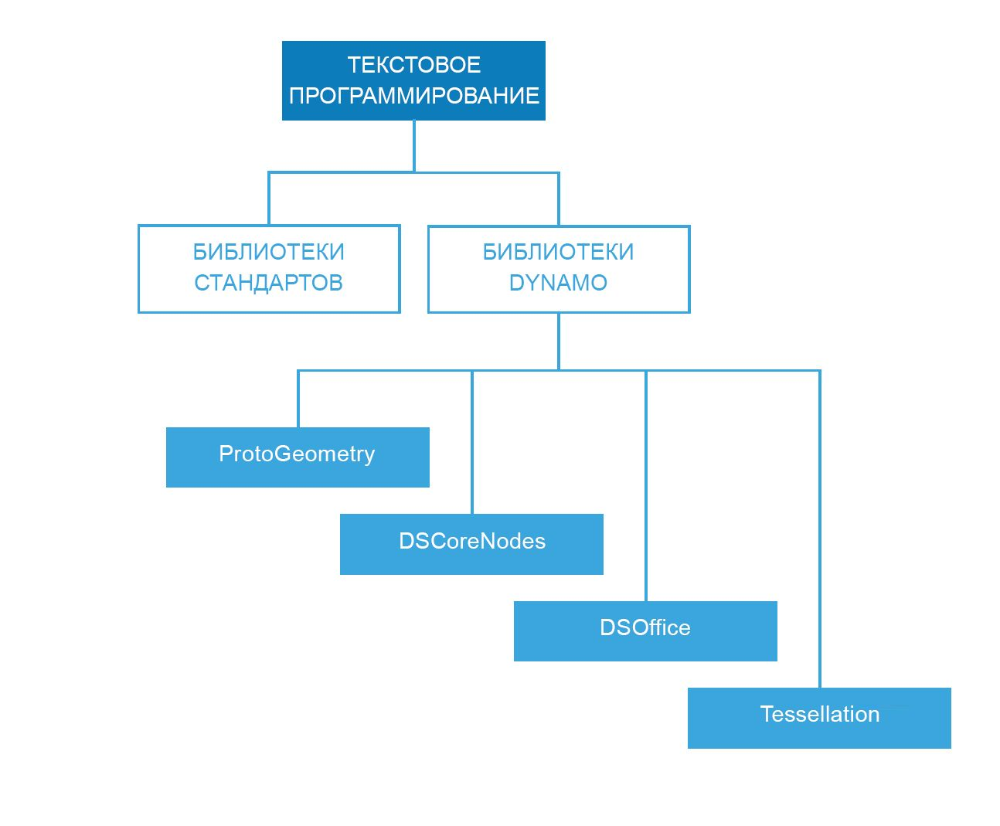

## Справочник по созданию сценариев

Данный справочник представляет собой дополнение к практическим рекомендациям, рассмотренным в главе «Методы создания сценариев». В нем содержатся дополнительные сведения о библиотеках кодов, метках и стиле. Для иллюстрации будет использоваться язык Python, однако принципы являются общими для Python и C# (Zero Touch) с учетом различий в синтаксисе.

### Используемые библиотеки

Стандартные библиотеки не входят в состав Dynamo и написаны на языках программирования Python и C# (Zero Touch). В Dynamo также имеется собственный набор библиотек, которые точно отражают иерархию узлов модуля. Благодаря этому пользователи могут создавать программы с помощью узлов и проводов в форме кода. В представленном ниже руководстве описано содержимое каждой из библиотек Dynamo и случаи использования стандартных библиотек.



**Стандартные библиотеки и библиотеки Dynamo**

* Для формирования данных и процессов со сложной структурой в среде Dynamo можно использовать стандартные библиотеки Python и C#.
* Библиотеки Dynamo в точности следуют иерархии узлов, что удобно при создании геометрических и других объектов Dynamo.

**Библиотеки Dynamo**

* ProtoGeometry
  * Функции: дуга, ограничивающая рамка, окружность, конус, система координат, кубоид, кривая, цилиндр, ребро, эллипс, дуга эллипса, грань, геометрия, спираль, группа индексов, линия, сеть, NURBS-кривая, NURBS-поверхность, плоскость, точка, полигон, прямоугольник, тело, сфера, поверхность, топология, T-сплайн, UV, вектор, вершина.
  * Импорт: ```import Autodesk.DesignScript.Geometry```
  * **Обратите внимание, что при работе с библиотекой ProtoGeometry в Python или C#** создаются неуправляемые объекты, память которых можно освободить только вручную. Дополнительные сведения см. в разделе **Неуправляемые объекты** ниже.
* DSCoreNodes
  * Функции: цвет, диапазон цветов 2D, дата и время, интервал времени, ввод/вывод, формула, логика, список, математическое вычисление, квадрадерево, строка, поток.
  * Импорт: ```import DSCore```
* Tessellation
  * Функции: выпуклая оболочка, Делоне, Вороной.
  * Импорт ```import Tessellation```
* DSOffice
  * Функции: Excel.
  * Импорт: ```import DSOffice```

### Осторожное использование меток

При написании сценариев постоянно используются идентификаторы, которые служат для обозначения переменных, типов, функций и других элементов. Благодаря этой системе условных обозначений можно строить алгоритмы, ссылаясь на данные посредством меток, которые обычно представляют собой последовательность символов. Правильное присвоение имен очень важно при написании кода, так как позволяет сделать его понятным не только другим пользователям, но и самому автору в будущем. Ниже приводятся рекомендации по присвоению имен элементам сценария.

**Использование сокращений допускается, но с поясняющим комментарием:**

```
### BAD
csfX = 1.6
csfY= 1.3
csfZ = 1.0
```

```
### GOOD
# column scale factor (csf)
csfX = 1.6
csfY= 1.3
csfZ = 1.0
```

**Избегайте избыточных меток:**

```
### BAD
import car
seat = car.CarSeat()
tire = car.CarTire()
```

```
### GOOD
import car
seat = car.Seat()
tire = car.Tire()
```

**В именах переменных используйте положительную, а не отрицательную логику:**

```
### BAD
if 'mystring' not in text:
print 'not found'
else:
print 'found'
print 'processing'
```

```
### GOOD
if 'mystring' in text:
print 'found'
print 'processing'
else:
print 'not found'
```

**Старайтесь использовать обратный порядок слов в обозначениях:**

```
### BAD
agents = …
active_agents = …
dead_agents ...
```

```
### GOOD
agents = …
agents_active = …
agents_dead = ...
```

> Это более целесообразно с точки зрения структуры.

**Для сокращения длинных или часто повторяющихся цепочек наименований используйте псевдонимы:**

```
### BAD
from RevitServices.Persistence import DocumentManager

DocumentManager = DM

doc = DM.Instance.CurrentDBDocument
uiapp = DM.Instance.CurrentUIApplication
```

```
### GOOD
from RevitServices.Persistence import DocumentManager as DM

doc = DM.Instance.CurrentDBDocument
uiapp = DM.Instance.CurrentUIApplication
```

> Однако помните, что использование псевдонимов может сделать программу непонятной и нестандартной.

**Используйте только необходимые слова:**

```
### BAD
rotateToCoord = rotateFromCoord.Rotate(solid.ContextCoordinateSystem.Origin,Vector.ByCoordinates(0,0,1),5)
```

```
### GOOD
toCoord = fromCoord.Rotate(solid.ContextCoordinateSystem.Origin,Vector.ByCoordinates(0,0,1),5)
```

> «Все должно быть изложено так просто, как только возможно, но не проще». — Альберт Эйнштейн

### Единообразие стиля

Любую программу можно написать несколькими способами, то есть персональный стиль создания сценариев формируется в результате принятия (или непринятия) бесчисленных мелких решений по ходу работы. Это означает, что читаемость и возможность доработки кода — прямой результат внутренней согласованности и соблюдения общих стилистических правил. Главное правило: одинаковый код в двух разных местах должен работать одинаково. Ниже приводятся советы по созданию понятного единообразного кода.

**Правила именования** (выберите одно из следующих правил для каждого типа объекта в коде и придерживайтесь его)

* Переменные, функции, методы, пакеты, модули:
`нижний_регистр_с_нижним_подчеркиванием`

* Классы и исключения:
`СловаСЗаглавнойБуквы`

* Защищенные методы и внутренние функции:
`_одно_нижнее_подчеркивание_в_начале(self, ...)`

* Собственные методы:
`___двойное_нижнее_подчеркивание_в_начале(self, ...)`

* Константы:
`ВСЕ_ПРОПИСНЫЕ_С_НИЖНИМИ_ПОДЧЕРКИВАНИЯМИ`

> Совет. Следует избегать использования переменных из одной буквы (особенно l, O, I). Исключением могут быть очень короткие блоки, когда значение легко понять из ближайшего контекста.

**Использование пустых строк**

* До и после определения функции верхнего уровня или класса следует оставлять две пустые строки.

  * До и после определения метода внутри класса следует оставлять одну пустую строку.

  * Для разделения групп связанных функций можно использовать дополнительные пустые строки (в разумных количествах).

**Избегайте ненужных пробелов**

* После открывающейся или перед закрывающейся круглой скобкой, квадратной скобкой или фигурной скобкой:

```
### BAD
function( apples[ 1 ], { oranges: 2 } )
```

```
### GOOD:
function(apples[1], {oranges: 2})
```

* Перед запятой, точкой с запятой или двоеточием:

```
### BAD
if x == 2 : print x , y ; x , y = y , x
```

```
### GOOD
if x == 2: print x, y; x, y = y, x
```

* Перед открывающейся скобкой, за которой следует список аргументов вызываемой функции:

```
### BAD
function (1)
```

```
### GOOD
function(1)
```

* Перед открывающейся скобкой, за которой следует индексирование или членение:

```
### BAD
dict ['key'] = list [index]
```

```
### GOOD
dict['key'] = list[index]
```

* До и после следующих двоичных операторов всегда вставляйте одиночный пробел:

```
assignment ( = )
augmented assignment ( += , -= etc.)
comparisons ( == , < , > , != , <> , <= , >= , in , not in , is , is not )
Booleans ( and , or , not )
```

**Следите за длиной строки**

* Она не должна превышать 79 символов.

* Если ограничить ширину окна редактора, можно открыть несколько файлов рядом. Это также удобно при использовании инструментов проверки кода, когда обе версии кода представлены в соседних столбцах.

* Длинные строки можно разбить на несколько строк, заключив выражения в круглые скобки:

**Избегайте очевидных и лишних комментариев**

* Иногда меньшее количество комментариев делает код более читабельным, особенно если вместо них используются понятные идентификаторы.

* Хороший стиль написания кода уменьшает зависимость от комментариев:

```
### BAD
# get the country code
country_code = get_country_code(address)

# if country code is US
if (country_code == 'US'):
# display the form input for state
print form_input_state()
```

```
### GOOD
# display state selection for US users
country_code = get_country_code(address)
if (country_code == 'US'):
print form_input_state()
```

> Совет. Комментарии отвечают на вопрос «Почему?», код — на вопрос «Как?».

**Просматривайте открытый исходный код**

* Проекты с открытым исходным кодом создаются совместными усилиями многих разработчиков. Код, на котором пишутся эти проекты, должен быть максимально понятным, чтобы обеспечить эффективную работу всей группы. Поэтому рекомендуется просматривать исходный код подобных проектов, чтобы понять ход мыслей разработчиков.

* Совершенствуйте правила:

  * Задавайте вопросы о том, срабатывает ли то или иное правило в отношении текущих задач.

  * Не ухудшается ли функциональность или эффективность?

### Стандарты C# (Zero Touch)

**Посетите эти страницы Wiki, чтобы узнать об особенностях написания кода на C# для Zero Touch и его вставки в Dynamo.**

  * На этой странице рассматриваются некоторые общие стандарты, касающиеся документирования и проверки кода: [https://github.com/DynamoDS/Dynamo/wiki/Coding-Standards](https://github.com/DynamoDS/Dynamo/wiki/Coding-Standards)

  * На этой странице рассматриваются стандарты именования для библиотек, категорий, имен узлов, имен портов и сокращений: [https://github.com/DynamoDS/Dynamo/wiki/Naming-Standards](https://github.com/DynamoDS/Dynamo/wiki/Naming-Standards)

  **Неуправляемые объекты**

  При использовании библиотеки геометрических объектов Dynamo *(ProtoGeometry)* в Python или C# управлять геометрическими объектами с помощью виртуальной машины будет невозможно, и память многих из этих объектов необходимо освобождать вручную. Для удаления локальных или неуправляемых объектов можно использовать метод **Dispose** или ключевое слово **using**. Дополнительные сведения см. на следующей странице Wiki: [https://github.com/DynamoDS/Dynamo/wiki/Zero-Touch-Plugin-Development#dispose--using-statement](https://github.com/DynamoDS/Dynamo/wiki/Zero-Touch-Plugin-Development#dispose--using-statement).

  Удалять следует только неуправляемые ресурсы, которые не возвращаются в график или на которые не указывают ссылки. Далее в этом разделе подобные объекты будут называться *промежуточной геометрией*. Этот класс объектов используется в примере кода, приведенном ниже. Функция C# Zero Touch c именем **singleCube** возвращает один куб, но в процессе выполнения создает еще 10 000 кубов. Предположим, что оставшиеся геометрические объекты были использованы в качестве некой промежуточной вспомогательной геометрии.

  **Скорее всего, эта функция вызовет аварийное завершение работы Dynamo.**В результате ее использования было создано 10 000 тел, а сохранено и возвращено одно из них. В этом случае необходимо удалить все промежуточные кубы, кроме возвращаемого. Возвращаемый объект удалять не нужно, так как он будет распространен по графику и использован в других узлах.

```
public Cuboid singleCube(){

var output = Cuboid.ByLengths(1,1,1);

for(int i = 0; i<10000;i++){
output = Cuboid.ByLengths(1,1,1);
}
return output;
}
```

Постоянный код должен выглядеть примерно так:

```
public Cuboid singleCube(){

var output = Cuboid.ByLengths(1,1,1);
var toDispose = new List<Geometry>();

for(int i = 0; i<10000;i++){
toDispose.Add(Cuboid.ByLengths(1,1,1));
}

foreach(IDisposable item in toDispose ){
item.Dispose();
}

return output;
}
```

Обычно требуется удалять только такие геометрические объекты, как ```поверхности```, ```кривые``` и ```тела```. Однако в целях безопасности можно удалить все типы геометрии (```векторы```, ```точки```, ```системы координат```).

