

# УКАЗАТЕЛЬ УЗЛОВ

##### В этом указателе представлена дополнительная информация обо всех узлах, используемых в учебнике, а также о других компонентах, которые могут оказаться полезными. Это лишь краткое описание некоторых из 500 узлов Dynamo.

## Встроенные функции

||||
| -- | -- | -- |
||**Количество** Получение числа элементов в заданном списке.||
|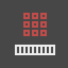|**Выровнять** Получение плоского одномерного списка из заданного многомерного списка.||
||**Map** Сопоставление значения с диапазоном входных данных.||

## Core

#### Core.Color

||||
| -- | -- | -- |
||СОЗДАНИЕ||
||**Color.ByARGB** Создание цвета с помощью компонентов «альфа», «красный», «зеленый» и «синий».||
||**Набор цветов** Получение цвета на основе цветового градиента между начальным и конечным цветом.||
||ДЕЙСТВИЯ||
||**Color.Brightness** Получение значения яркости для данного цвета.|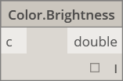|
||**Color.Components** Вывод списка компонентов цвета в следующем порядке: альфа, красный, зеленый, синий.||
||**Color.Saturation** Получение значения насыщенности для данного цвета.||
||**Color.Hue** Получение значения оттенка для данного цвета.||
||ЗАПРОС||
||**Color.Alpha** Поиск альфа-компонента цвета (от 0 до 255).||
||**Color.Blue** Поиск синего компонента цвета (от 0 до 255).|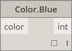|
||**Color.Green** Поиск зеленого компонента цвета (от 0 до 255).||
||**Color.Red** Поиск красного компонента цвета (от 0 до 255).||

#### Core.Display

||||
| -- | -- | -- |
||СОЗДАНИЕ||
||**Display.ByGeometryColor** Отображение геометрии с помощью цвета.||

#### Core.Input

||||
| -- | -- | -- |
||ДЕЙСТВИЯ||
||**Boolean** Выбор между значениями True и False.||
||**Code Block** Непосредственная разработка кода DesignScript.||
||**Directory Path** Выбор папки в системе и получение пути к ней.||
||**File Path** Выбор файла в системе и получение его имени.||
||**Integer Slider** Регулятор, создающий целые значения.||
||**Number**  Создание числа.||
||**Number Slider**  Регулятор, создающий числовые значения.||
||**String**Создание строки.||

#### Core.List

||||
| -- | -- | -- |
||СОЗДАНИЕ||
||**List.Create** Создание нового списка из заданных входных значений.||
||**List.Combine** Применение комбинатора к каждому элементу в двух последовательностях.||
||**Number Range** Создание последовательности чисел в заданном диапазоне.||
||**Number Sequence** Создание последовательности чисел.||
||ДЕЙСТВИЯ||
||**List.Chop** Разделение списка на набор списков, содержащих заданное количество элементов.||
||**List.Count** Получение количества элементов, хранящихся в данном списке.|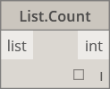|
||**List.Flatten** Выравнивание вложенного списка списков по определенному количественному значению.||
||**List.FilterByBoolMask** Фильтрация последовательности путем поиска соответствующих индексов в отдельном списке логических операций.||
||**List.GetItemAtIndex** Получение элемента из данного списка, расположенного по заданному индексу.||
||**List.Map** Применение функции ко всем элементам списка с созданием нового списка на основе результатов.||
||**List.Reverse** Создание нового списка, содержащего элементы из заданного списка, расположенные в обратном порядке.||
||**List.ReplaceItemAtIndex** Замена элемента из данного списка, расположенного по заданному индексу.||
||**List.ShiftIndices** Смещение индексов в списке вправо на заданную величину.||
||**List.TakeEveryNthItem** Извлечение элементов из данного списка по индексам, которые являются множителями заданного значения, после заданного смещения.||
||**List.Transpose** Перестановка строк и столбцов в списке списков. Если некоторые строки короче других, то в конечный массив в качестве заполнителей вставляются нулевые значения, чтобы он оставался прямоугольным.||

#### Core.Logic

||||
| -- | -- | -- |
||ДЕЙСТВИЯ||
||**If** Условное выражение. Проверка логического значения тестового ввода. Если тестовый ввод истинен, в результате выводится значение True; противном случае выводится значение False.||

#### Core.Math

||||
| -- | -- | -- |
||ДЕЙСТВИЯ||
||**Math.Cos** Нахождение косинуса угла.||
||**Math.DegreesToRadians** Преобразование единиц угла из градусов радианы.||
||**Math.Pow** Возведение числа в заданную степень.||
||**Math.RadiansToDegrees** Преобразование единиц угла из радианов в градусы.||
||**Math.RemapRange** Корректировка диапазона списка чисел при сохранении коэффициента распределения.||
||**Math.Sin** Поиск синуса угла.||

#### Core.Object

||||
| -- | -- | -- |
||ДЕЙСТВИЯ||
||**Object.IsNull** Определение того, имеет ли данный объект нулевое значение.||

#### Core.Scripting

||||
| -- | -- | -- |
||ДЕЙСТВИЯ||
||**Формула** Оценка математических формул. Для оценки используется NCalc. См. страницу [http://ncalc.codeplex.com](http://ncalc.codeplex.com)||

#### Core.String

||||
| -- | -- | -- |
||ДЕЙСТВИЯ||
||**String.Concat** Объединение нескольких строк в одну строку.||
||**String.Contains** Определение того, содержит ли данная строка подстроку.||
||**String.Join** Объединение нескольких строк в одну строку со вставкой данного разделителя между ними.||
||**String.Split** Разделение одной строки на список строк, деления которого определяются заданными строками-разделителями.||
||**String.ToNumber** Преобразование строки в целое или двойное число.||

#### Core.View

||||
| -- | -- | -- |
||ДЕЙСТВИЯ||
||**View.Watch** Визуализация выходных данных узла.||
||**View.Watch 3D** Динамический предварительный просмотр геометрии.||

## Геометрия

#### Geometry.Circle

||||
| -- | -- | -- |
||СОЗДАНИЕ||
||**Circle.ByCenterPointRadius** Построение окружности с входным центром и радиусом в плоскости XY мировой системы координат с осью Z мировой системы координат в качестве нормали.||
||**Circle.ByPlaneRadius** Создание окружности с входным центром в начале координат плоскости, находящейся в заданной плоскости, с заданным радиусом.||

#### Geometry.CoordinateSystem

||||
| -- | -- | -- |
||СОЗДАНИЕ||
||**CoordinateSystem.ByOrigin** Создание объекта CoordinateSystem с началом координат во входной точке, с осями X и Y, соответствующими осям X и Y МСК.||
||**CoordinateSystem.ByCyclindricalCoordinates** Создание объекта CoordinateSystem с заданными параметрами цилиндрических координат относительно заданной системы координат.||

#### Geometry.Cuboid

||||
| -- | -- | -- |
||СОЗДАНИЕ||
||**Cuboid.ByLength** (начало координат) Создание кубоида с центром во входной точке с определенной шириной, длиной и высотой.||

#### Geometry.Curve

||||
| -- | -- | -- |
||ДЕЙСТВИЯ||
||**Curve.Extrude** (расстояние) Выдавливание кривой в направлении вектора нормали.||
||**Curve.PointAtParameter** Получение точки на кривой по заданному параметру между StartParameter() и EndParameter().||

#### Geometry.Geometry

||||
| -- | -- | -- |
||ДЕЙСТВИЯ||
||**Geometry.DistanceTo** Получение расстояния от этого до другого геометрического объекта.||
||**Geometry.Explode** Расчленение составных или неразделенных элементов на компоненты.||
||**Geometry.ImportFromSAT** Список импортированных геометрических объектов.||
||**Geometry.Rotate** (basePlane) Поворот объекта относительно начала координат плоскости и нормали на заданное количество градусов||
||**Geometry.Translate** Перенос любого типа геометрии на заданное расстояние в заданном направлении.||

#### Geometry.Line

||||
| -- | -- | -- |
||СОЗДАНИЕ||
||**Line.ByBestFitThroughPoints** Создание линии, максимально приближенной к графику рассеяния точек.||
||**Line.ByStartPointDirectionLength** Построение прямой линии от начальной точки в направлении вектора на заданную длину.||
||**Line.ByStartPointEndPoint** Построение прямой линии между двумя заданными точками.||
||**Line.ByTangency** Создание линии, касательной к исходной кривой, расположенной в точке параметра исходной кривой.||
||ЗАПРОС||
||**Line.Direction** Направление кривой.|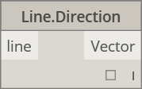|

#### Geometry.NurbsCurve

||||
| -- | -- | -- |
||Создание||
||**NurbsCurve.ByControlPoints** Создание объекта BSplineCurve с использованием явно заданных управляющих точек.||
||**NurbsCurve.ByPoints** Создание элемента BSplineCurve путем интерполяции между точками.|qcomm|

#### Geometry.NurbsSurface

||||
| -- | -- | -- |
||Создание||
||**NurbsSurface.ByControlPoints** Создание объекта NurbsSurface по явно заданным управляющим точкам с заданными значениями кривизны U и V.||
||**NurbsSurface.ByPoints** Создание объекта NurbsSurface с заданными интерполированными точками и значениями кривизны U и V. Полученная поверхность проходит через все точки.||

#### Geometry.Plane

||||
| -- | -- | -- |
||СОЗДАНИЕ||
||**Plane.ByOriginNormal** Создание плоскости с центром в корневой точке с входным вектором нормали.||
||**Plane.XY** Создание плоскости XY в МСК.||

#### Geometry.Point

||||
| -- | -- | -- |
||СОЗДАНИЕ||
|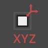|**Point.ByCartesianCoordinates** Построение точки в данной системе координат с тремя декартовыми координатами.||
||**Point.ByCoordinates** (2D)  Построение точки в плоскости XY по двум заданным декартовым координатам. Координата Z равна 0.||
||**Point.ByCoordinates** (3D) Построение точки по трем заданным декартовым координатам.||
|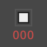|**Point.Origin** Получение точки начала координат (0,0,0).||
||ДЕЙСТВИЯ||
||**Point.Add** Добавление вектора к точке. Аналогично Translate (вектор).||
||ЗАПРОС||
||**Point.X** Получение координаты точки по оси X.||
||**Point.Y** Получение координаты точки по оси Y.||
||**Point.Z** Получение координаты точки по оси Z.||

#### Geometry.Polycurve

||||
| -- | -- | -- |
||СОЗДАНИЕ||
||**Polycurve.ByPoints** Создание объекта PolyCurve из последовательности линий, соединяющих точки. Последняя точка замкнутой кривой должна находиться в том же месте, что и начальная точка.||

#### Geometry.Rectangle

||||
| -- | -- | -- |
||СОЗДАНИЕ||
||**Rectangle.ByWidthLength** (плоскость) Построение прямоугольника с центром во входном корне плоскости с входной шириной (расстояние по оси плоскости X) и длиной (расстояние по оси плоскости Y).||

#### Geometry.Sphere

||||
| -- | -- | -- |
||СОЗДАНИЕ||
||**Sphere.ByCenterPointRadius** Создание твердотельного шара с заданным радиусом с центром во входной точке.||

#### Geometry.Surface

||||
| -- | -- | -- |
||СОЗДАНИЕ||
||**Surface.ByLoft** Создание поверхности посредством лофтинга между входными кривыми поперечного сечения.||
||**Surface.ByPatch** Создание поверхности путем заполнения пространства внутри замкнутой границы, определяемой входными кривыми.||
||ДЕЙСТВИЯ||
||**Surface.Offset** Смещение поверхности в направлении нормали поверхности на заданное расстояние.||
||**Surface.PointAtParameter** Получение точки с заданными параметрами U и V.||
||**Surface.Thicken** Утолщение поверхности до формирования тела с выдавливанием в направлении нормалей поверхности с обеих сторон поверхности.|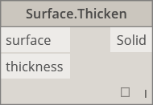|

#### Geometry.UV

||||
| -- | -- | -- |
||СОЗДАНИЕ||
||**UV.ByCoordinates** Создание UV из двух двойных значений.||

#### Geometry.Vector

||||
| -- | -- | -- |
||СОЗДАНИЕ||
||**Vector.ByCoordinates** Построение вектора на основе трех евклидовых координат.||
||**Vector.XAxis** Получение канонического вектора оси X (1,0,0).||
||**Vector.YAxis** Получение канонического вектора оси Y (0,1,0).||
||**Vector.ZAxis** Получение канонического вектора оси Z (0,0,1).||
||ДЕЙСТВИЯ||
||**Vector.Normalized** Получение нормализованной версии вектора.||

## Операторы

||||
| -- | -- | -- |
||**+** Сложение|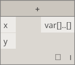|
||**–** Вычитание||
||***** Умножение||
|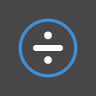|**/** Деление||
||**%** При модульном делении выполняется поиск остатка первых введенных данных после деления на вторые.||
||**<** Меньше, чем|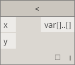|
||**>** Больше, чем|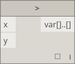|
||**==** Проверка равенства двух значений.||

