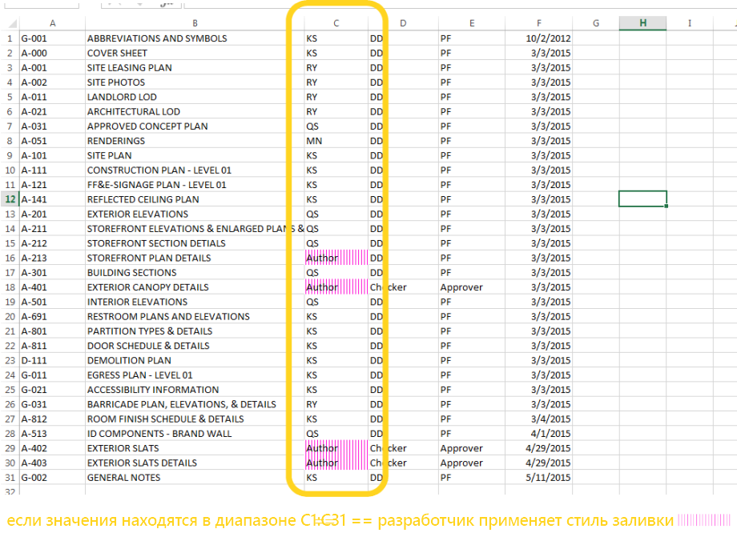
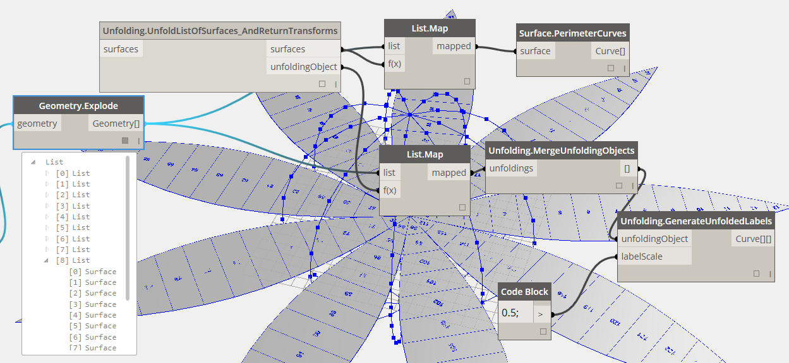

## Пакеты Dynamo
Ниже приведен список пакетов, наиболее популярных среди пользователей Dynamo. Разработчики, не стесняйтесь пополнять этот список. Помните, что [Dynamo Primer](https://github.com/DynamoDS/DynamoPrime) — это ресурс с открытым с исходным кодом.

<table>
   <tr>
      <td width="10%">
         </img>
      </td>
      <td width="55%">
         <b>ARCHI-LAB</b>
      </td>
      <td>
         <a href="http://archi-lab.net/">Официальный сайт archi-lab
      </td>
      </a>
   </tr>
   <tr>
      <td colspan="2">archi-lab — это более 50 пользовательских пакетов, которые позволяют существенно расширить возможности взаимодействия Dynamo с Revit. В пакетах archi-lab доступны как узлы с наборами базовых операций, так и узлы визуальной среды расчетов для Revit. </td>
      <td>
         </img>
      </td>
   </tr>
</table>

<table>
  <tr>
    <td width="10%"></img></td>
    <td width="55%"><b>BIMORPH NODES</b></td>
    <td><a href="https://bimorph.com/bimorph-nodes/">Каталог BimorphNodes</td></a>
  </tr>
  <tr>
    <td colspan="2">BimorphNodes — это универсальная коллекция мощных вспомогательных узлов. Среди них можно найти высокоэффективные узлы для выявления конфликтов и управления пересечениями геометрии, узлы преобразования кривых ImportInstance (САПР) и средства для сбора связанных элементов, решающие проблему ограничений в API Revit. Чтобы подробнее узнать о всех доступных узлах, ознакомьтесь с каталогом BimorphNodes.</td>
    <td></img></td>
  </tr>
</table>

<table>
  <tr>
    <td width="10%"></img></td>
    <td width="55%"><b>BUMBLEBEE FOR DYNAMO</b></td>
    <td><a href="http://archi-lab.net/bumblebee-dynamo-and-excel-interop/">Официальный сайт BumbleBee</td></a>
  </tr>
  <tr>
    <td colspan="2">Bumblee — это подключаемый модуль для обеспечения взаимодействия между Excel и Dynamo, значительно расширяющий возможности Dynamo в плане чтения и записи файлов Excel. </td>
    <td></img></td>
  </tr>
</table>

<table>
  <tr>
    <td width="10%"></img></td>
    <td width="55%"><b>CLOCKWORK FOR DYNAMO</b></td>
    <td><a href="https://github.com/CAAD-RWTH/ClockworkForDynamo">Страница Clockwork For Dynamo на сайте GitHub</td></a>
  </tr>
  <tr>
    <td colspan="2">Clockwork — это набор пользовательских узлов для среды визуального программирования Dynamo. В нем представлено множество узлов для работы с Revit и решения других задач, например управления списками, математических операций, строковых операций, преобразования единиц измерения, геометрических операций (ограничивающие рамки, сетки, плоскости, точки, поверхности, UV и векторы) и разбивки на панели. </td>
    <td></img></td>
  </tr>
</table>

<table>
  <tr>
    <td width="10%"></img></td>
    <td width="55%"><b>DATA|SHAPES</b></td>
    <td><a href="https://github.com/MostafaElAyoubi/Data-shapes">Страница Data|Shapes на сайте GitHub</td></a>
  </tr>
  <tr>
    <td colspan="2"> DataShapes — это пакет для расширения пользовательских функций в сценариях Dynamo. Основной целью пакета является увеличение спектра функциональных возможностей проигрывателя Dynamo. Дополнительные сведения см. на странице https://data-shapes.net/. Если вам нужно создать мощные рабочие процессы для проигрывателя Dynamo, обратите внимание на этот пакет.</td>
    <td></img></td>
  </tr>
</table>

<table>
  <tr>
    <td width="10%"></img></td>
    <td width="55%"><b>DYNAMO SAP</b></td>
    <td><a href="http://core.thorntontomasetti.com/dynamosap-is-now-open-source/">Проект DynamoSAP на сайте Core Studio</td></a>
  </tr>
  <tr>
    <td colspan="2">DynamoSAP — это параметрический интерфейс для SAP2000, встраиваемый в Dynamo. Этот проект позволяет инженерам осуществлять генеративное проектирование и анализ строительных систем в SAP, используя Dynamo для управления моделью SAP. Проект содержит несколько типовых рабочих процессов, описанных в прилагаемых файлах примеров, а также предоставляет возможности для автоматизации типовых задач в SAP. </td>
    <td></img></td>
  </tr>
</table>

<table>
  <tr>
    <td width="10%"></img></td>
    <td width="55%"><b>DYNAMO UNFOLD</b></td>
    <td><a href="https://github.com/mjkkirschner/DynamoUnfold">Страница DynamoUnfold на сайте GitHub</td></a>
  </tr>
  <tr>
    <td colspan="2">Эта библиотека позволяет расширить функциональные возможности Dynamo/Revit за счет развертывания геометрии поверхностей и сложных поверхностей. Библиотека позволяет пользователям сначала преобразовывать поверхности в плоскую мозаичную топологию, а затем выполнить их развертку с помощью инструментов Protogeometry в Dynamo. В этом пакете также содержится несколько экспериментальных узлов и файлов с простыми примерами. </td>
    <td></img></td>
  </tr>
</table>

<table>
  <tr>
    <td width="10%"></img></td>
    <td width="55%"><b>DYNASTRATOR</b></td>
    <td><a href="http://dynamopackages.com/">Страница загрузки Dynastrator на сайте Package Manager</td></a>
  </tr>
  <tr>
    <td colspan="2">Импортируйте векторные изображения из Illustrator или из интернета в формате SVG.  Этот инструмент позволяет импортировать созданные вручную чертежи в модуль Dynamo для параметрических операций. </td>
    <td></img></td>
  </tr>
</table>

<table>
  <tr>
    <td width="10%"></img></td>
    <td width="55%"><b>ENERGY ANALYSIS FOR DYNAMO</b></td>
    <td><a href="https://github.com/tt-acm/EnergyAnalysisForDynamo">Проект Energy Analysis for Dynamo на сайте GitHub</td></a>
  </tr>
  <tr>
    <td colspan="2">Energy Analysis for Dynamo позволяет выполнять параметрическое моделирование энергопотребления и создавать рабочие процессы для расчета энергопотребления всего здания в Dynamo 0.8. Пакет Energy Analysis for Dynamo позволяет настроить модель энергопотребления в Autodesk Revit, отправить ее в Green Building Studio для расчета энергопотребления DOE2 и изучить результаты, полученные после расчета. Пакет разрабатывается компанией Thornton Tomasetti в рамках проекта CORE Studio.  </td>
    <td></img></td>
  </tr>
</table>

<table>
  <tr>
    <td width="10%"></img></td>
    <td width="55%"><b>FIREFLY FOR DYNAMO</b></td>
    <td><a href="http://dynamopackages.com/">Страница загрузки Firefly на сайте Dynamo Package Manager</td></a>
  </tr>
  <tr>
    <td colspan="2">Firefly — это набор узлов, позволяющих Dynamo обмениваться данными с устройствами ввода/вывода, такими как микроконтроллер Arduino. Поскольку поток данных передается в режиме реального времени, Firefly открывает множество возможностей для интерактивного создания прототипов на стыке между цифровыми и физическими системами с помощью веб-камер, мобильных телефонов, игровых контроллеров, датчиков и т. д. </td>
    <td></img></td>
  </tr>
</table>

<table>
  <tr>
    <td width="10%"></img></td>
    <td width="55%"><b>LUNCHBOX FOR DYNAMO</b></td>
    <td><a href="http://provingground.io/tools/lunchbox/">Страница загрузки Lunchbox for Dynamo на сайте Proving Ground</td></a>
  </tr>
  <tr>
    <td colspan="2">LunchBox — это набор узлов для управления повторно используемыми геометрическими объектами и данными. Инструменты были протестированные в Dynamo 0.8.1 и Revit 2016. В пакет входят узлы для разбивки поверхности на панели, работы с геометрией, сбора данных Revit и многого другого.</td>
    <td></img></td>
  </tr>
</table>

<table>
  <tr>
    <td width="10%"></img></td>
    <td width="55%"><b>MANTIS SHRIMP</b></td>
    <td><a href="http://archi-lab.net/mantis-shrimp-getting-started/">Официальный сайт Mantis Shrimp</td></a>
  </tr>
  <tr>
    <td colspan="2">Mantis Shrimp — это проект по поддержке совместимости, который позволяет легко импортировать геометрию Grasshopper и/или Rhino в Dynamo.</td>
    <td></img></td>
  </tr>
</table>

<table>
  <tr>
    <td width="10%"></img></td>
    <td width="55%"><b>MESH TOOLKIT</b></td>
    <td><a href="https://github.com/DynamoDS/Dynamo/wiki/Dynamo-Mesh-Toolkit">Страница Dynamo Mesh Toolkit на сайте GitHub</td></a>
  </tr>
  <tr>
    <td colspan="2">Инструментарий Dynamo Mesh Toolkit содержит множество полезных инструментов для работы с геометрией сети. В этом пакете имеются возможности для импорта сетей из внешних файлов в других форматах, формирования сетей из существующих геометрических объектов Dynamo и построения сетей вручную на основе данных о вершинах и соединениях. Кроме этого, в пакет входят инструменты для изменения и восстановления геометрии сети. </td>
    <td></img></td>
  </tr>
</table>

<table>
  <tr>
    <td width="10%"></img></td>
    <td width="55%"><b>OPTIMO</b></td>
    <td><a href="https://github.com/BPOpt/Optimo/wiki/0_-Home">Страница Optimo на сайте GitHub</td></a>
  </tr>
  <tr>
    <td colspan="2">Optimo обеспечивает пользователей Dynamo возможностями для оптимизации решения самостоятельно поставленных проектных задач с помощью различных адаптируемых алгоритмов. Пользователи могут определять не только одну задачу или несколько задач, но и отдельные функции пригодности. </td>
    <td></img></td>
  </tr>
</table>

<table>
  <tr>
    <td width="10%"></img></td>
    <td width="55%"><b>RHYNAMO</b></td>
    <td><a href="https://bitbucket.org/caseinc/rhynamo">Страница Rhynamo на сайте Bitbucket</td></a>
  </tr>
  <tr>
    <td colspan="2">Библиотека узлов Rhynamo предоставляет пользователям возможность чтения и записи файлов Rhino 3DM из Dynamo. Rhynamo преобразует геометрию Rhino в пригодную к использованию геометрию Dynamo с помощью библиотеки OpenNURBS от компании McNeel, позволяя создавать новые рабочие процессы для беспрепятственного обмена геометрией и данными между Rhino и Revit. Этот пакет также содержит несколько экспериментальных узлов, которые обеспечивают прямой доступ к командной строке Rhino. </td>
    <td></img></td>
  </tr>
</table>

<table>
  <tr>
    <td width="10%"></img></td>
    <td width="55%"><b>RHYTHM</b></td>
    <td><a href="https://github.com/sixtysecondrevit/RhythmForDynamo">Страница Rhythm на сайте GitHub</td></a>
  </tr>
  <tr>
    <td colspan="2"> На первый взгляд Rhythm ничем не выделяется среди других пакетов. У него нет ни сверхсложного кода, ни других подобных свойств. Однако Rhythm — это плод упорного труда, направленного на достижение практических целей. Идея, лежащая в основе этого пакета, — позволить пользователям работать с Rhythm в Revit с помощью модуля Dynamo. Основу Rhythm составляют готовые узлы Dynamo, используемые особым образом в процессе применения к среде Revit. </td>
    <td></img></td>
  </tr>
</table>
