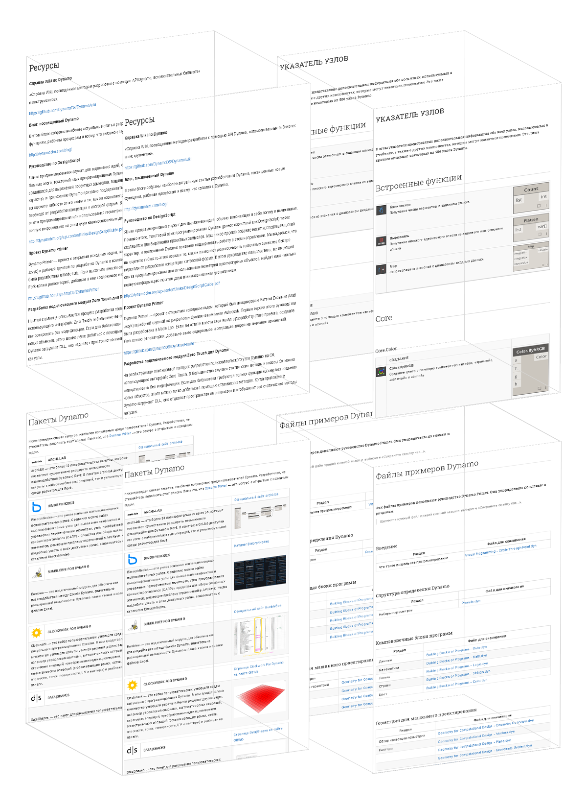

# Приложение A. Ресурсы

В этом разделе указаны дополнительные ресурсы, которые позволят перейти на новый уровень владения Dynamo. Кроме того, мы добавили в это руководство индекс важных узлов, набор полезных пакетов и хранилище файлов примеров. Мы будем рады, если вы примете участие в пополнении этого раздела. Портал [Dynamo Primer](https://github.com/DynamoDS/DynamoPrimer) открыт для всех. 

