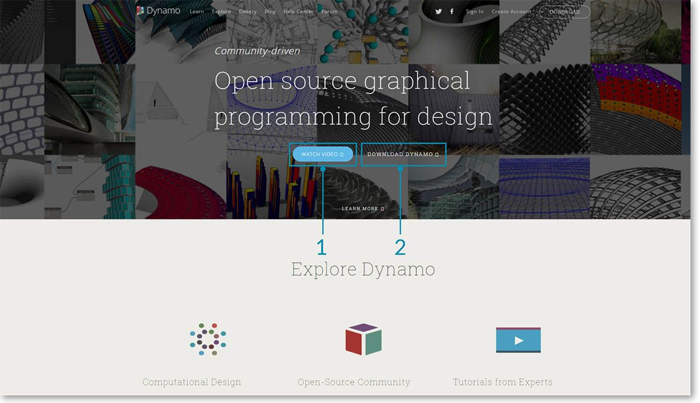
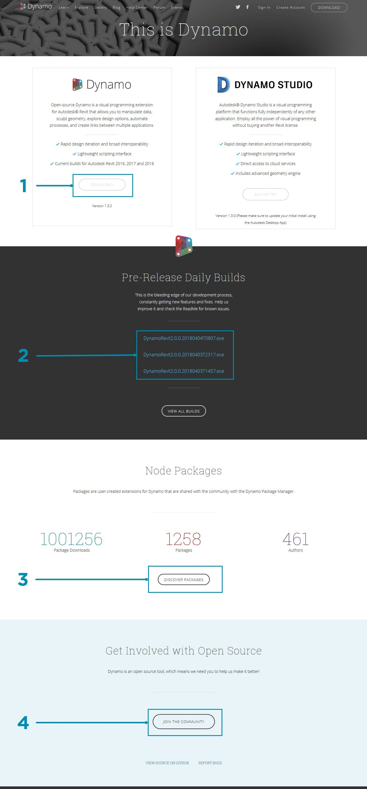
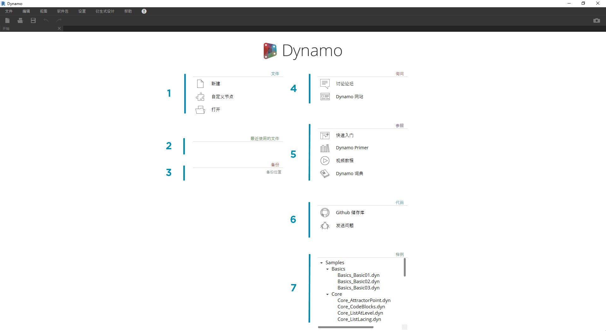
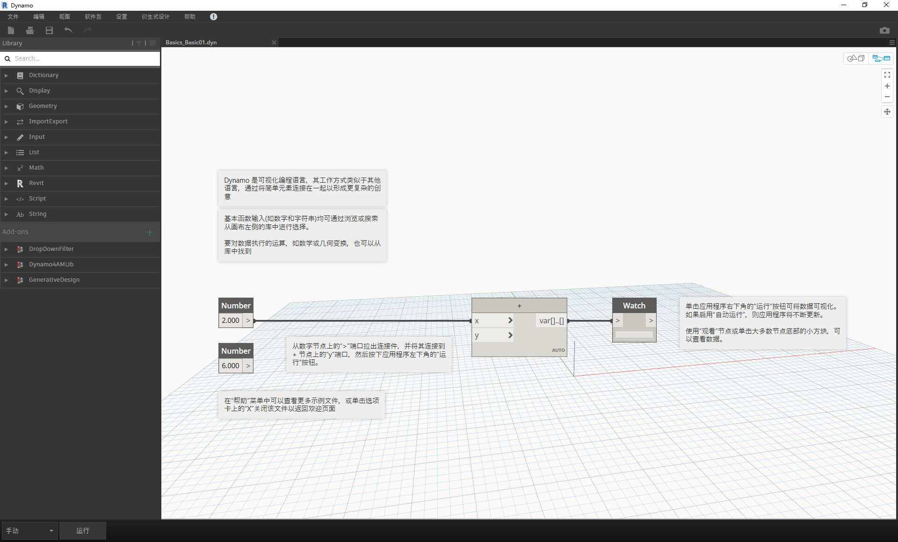

## 安装和启动 Dynamo

Dynamo 是一个活动的开源开发项目，提供正式和预发布版（即“每日构建”版本）的可下载安装程序。下载官方版本以开始使用，或者帮助 Dynamo 在每日构建或 GitHub 项目中的发展。

### 下载

要下载官方发布的 Dynamo 版本，请访问 [Dynamo 网站](http://dynamobim.com/)。通过从主页中单击或浏览到专用的下载页面，立即开始下载。

> 1. 观看有关使用适用于建筑的 Dynamo 进行计算设计的视频
2. 或浏览到下载页面

在这里，您可以下载“溢出边缘 (bleeding edge)”开发版本或转到 [Dynamo Github](https://github.com/DynamoDS/Dynamo) 项目。

> 1. 下载官方版本安装程序
2. 下载每日构建安装程序
3. 从开发人员社区查看自定义软件包
4. 参与在 GitHub 上开发 Dynamo

### 安装

浏览到下载的安装程序的目录，然后运行可执行文件。在安装过程中，安装程序允许您自定义将安装的组件。

> 1. 选择要安装的组件

在这里，我们需要确定是否要包含将 Dynamo 连接到其他已安装应用程序（如 Revit）的组件。有关 Dynamo 平台的详细信息，请参见**第 1.2 章**。

### 启动

要启动 Dynamo，请浏览到 \Program Files\Dynamo\Dynamo Revit\x.y，然后选择 DynamoSandbox.exe。这将打开单机版本，并展示 Dynamo 的*“开始”页面*。在此页面中，我们看到标准菜单和工具栏以及一组快捷方式，我们可以通过这些快捷方式访问文件功能或访问其他资源。

> 1. 文件 - 创建新文件或打开现有文件
2. 最近项 - 滚动您最近使用的文件
3. 备份 - 访问备份
4. 询问 - 直接访问用户论坛或 Dynamo 网站
5. 参考 - 借助其他学习资源进一步探索
6. 代码 - 参与开源开发项目
7. 示例 - 查看安装随附的示例

打开第一个示例文件以打开第一个工作区，并确认 Dynamo 正常工作。单击“示例”>“基础”>**“Basics_Basic01.dyn”**。

> 1. 确认执行栏显示“自动”，或单击“运行”
2. 按照说明操作，并将**“Number”**节点连接到**“+”**节点
3. 确认此 Watch 节点显示结果

如果该文件成功加载，则应能够使用 Dynamo 执行第一个可视化程序。

