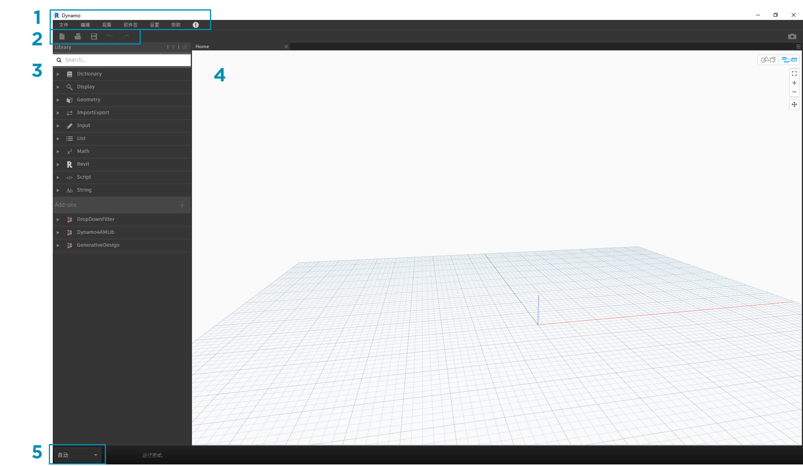
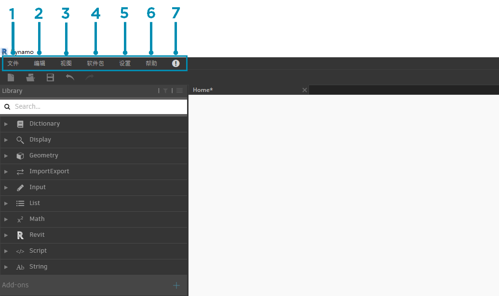
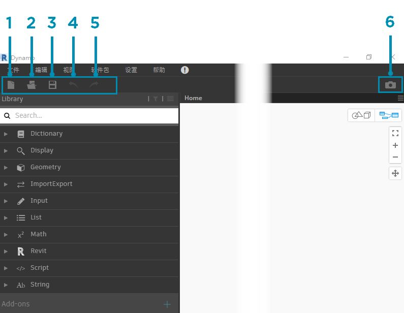
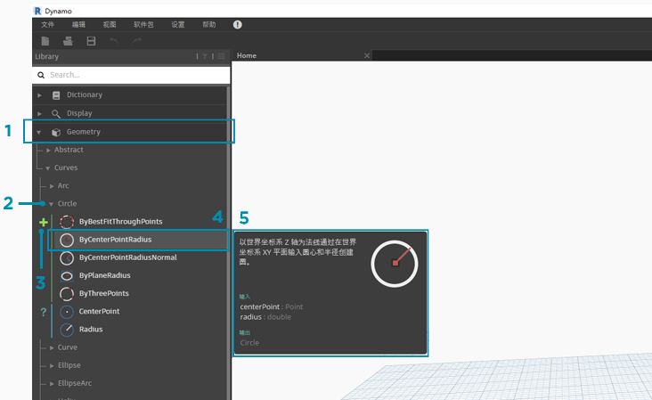
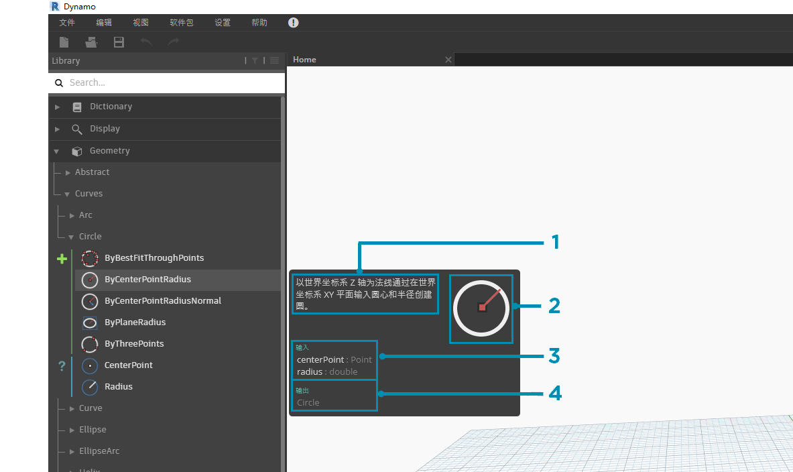
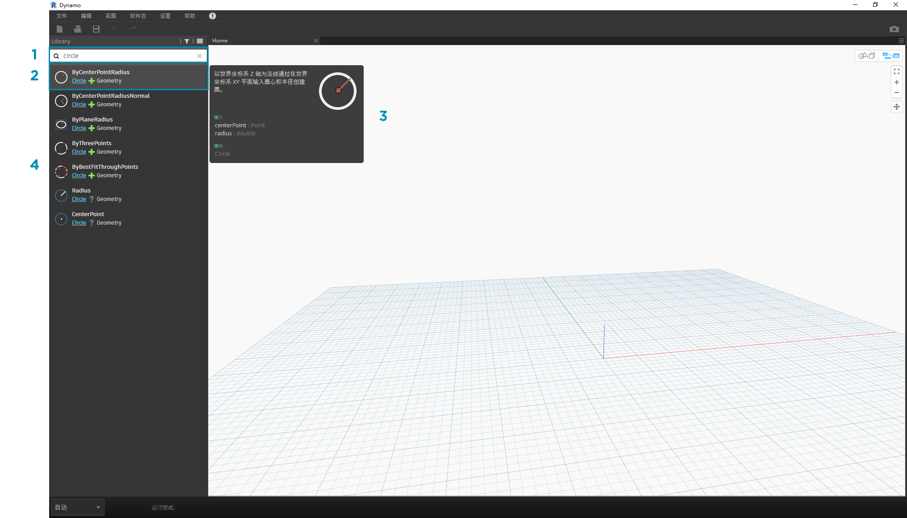
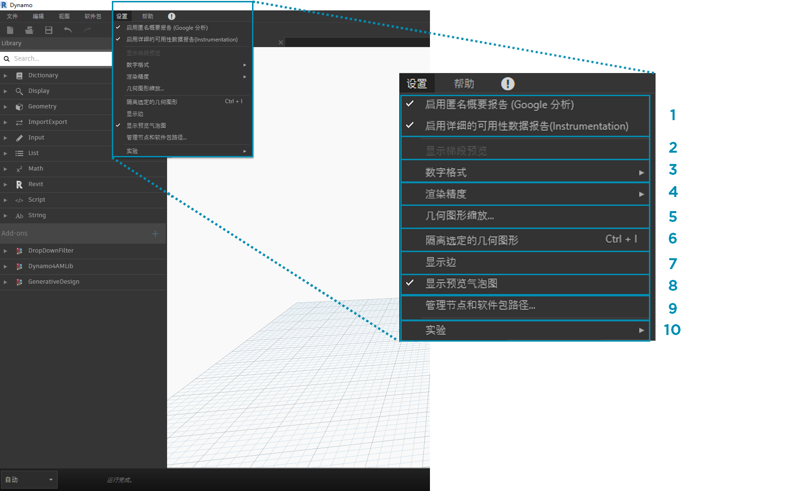
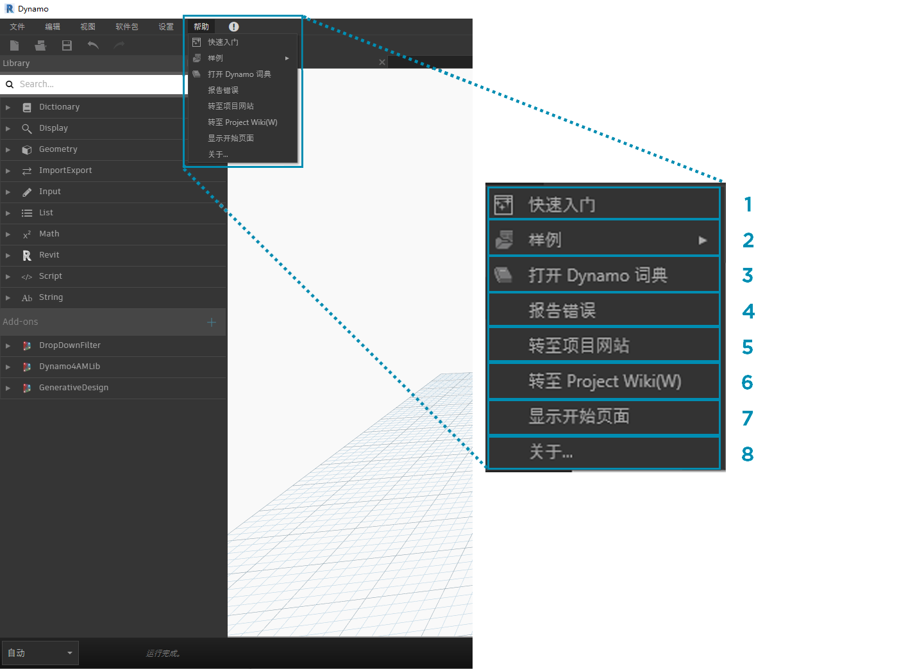

## Dynamo 用户界面

Dynamo 的用户界面 (UI) 分为五个主要区域，最大的区域是“工作空间”（我们在其中编写可视化程序）。

> 1. 菜单
2. 工具栏
3. 图书馆
4. 工作空间
5. 执行栏

让我们深入了解 UI，了解各个区域的功能。

#### 菜单

下拉菜单包含 Dynamo 应用程序的一些基本功能。与大多数 Windows 软件一样，前两个菜单中包含与管理文件相关的操作以及用于选择和内容编辑的操作。其余菜单则更加特定于 Dynamo。

> 1. 文件
2. 编辑
3. 视图
4. 软件包
5. 设置
6. 帮助
7. 通知

#### 工具栏

Dynamo 工具栏包含一系列按钮，可快速处理文件以及访问“Undo [Ctrl + Z]”和“Redo [Ctrl + Y]”命令。最右侧是另一个按钮，它将导出工作空间快照，这对于文档编制和共享非常重要。

> 1. 新建 - 创建新的 .dyn 文件
2. 打开 - 打开现有的 .dyn（工作空间）或 .dyf（自定义节点）文件
3. 保存/另存为 - 保存活动的 .dyn 或 .dyf 文件
4. 撤消 - 撤消上一个操作
5. 重做 - 重做下一个操作
6. 将工作空间输出为图像 - 将可见工作空间输出为 PNG 文件

#### 图书馆

该库中包含所有已加载的节点，包括安装附带的默认节点以及任何额外加载的自定义节点或软件包。库中的节点在库、类别和（如果适用）子类别中根据节点是**“创建”**数据、执行**“操作”**还是**“查询”**数据进行分层组织。

##### 浏览

默认情况下，**“库”**将包含八个类别的节点。**“核心”**和**“几何图形”**是开始探索的绝佳菜单，因为它们包含最多数量的节点。浏览这些类别是了解我们可以向“工作空间”添加的内容层次的最快方法，也是查找之前尚未使用的新节点的最佳方式。

> 现在，我们将重点介绍默认的节点集，但请注意，我们稍后将使用自定义节点、附加库和 Package Manager 扩展此库。

> 1. 词典
2. 显示
3. 几何
4. ImportExport
5. 输入
6. 列出
7. 匹配
8. Revit
9. 脚本
10. 字符串
11. 附加模块

通过单击菜单浏览库。依次单击“几何图形”>“曲线”>“圆”。请注意显示的菜单新部分，特别是**“创建”**和**“查询”**标签。

> 1. 图书馆
2. 种类
3. 子类别：创建/操作/查询
4. 节点
5. 节点描述和特性 - 将光标悬停在节点图标上时，将显示此消息。

在同一“圆”菜单中，将鼠标光标悬停在**“ByCenterPointRadius”**上。该窗口中将显示节点名称和图标以外的更多节点详细信息。这使我们可以快速了解节点的作用、所需输入内容以及输出内容。

> 1. 描述 - 节点的纯语言描述
2. 图标 - 库菜单中图标的较大版本
3. 输入 - 名称、数据类型和数据结构
4. 输出 - 数据类型和结构

##### 搜索

如果您相对具体地了解要添加到工作空间的节点，则可使用**“搜索”**字段。如果不在工作空间中编辑设置或指定值，则光标始终显示在此字段中。如果您开始键入，Dynamo 库将显示所选的最适合匹配项（包含可在节点类别中找到该匹配项的位置）以及与搜索相符的备选匹配项列表。当您点击 Enter 键或单击在浏览器中截断的项目时，亮显的节点将添加到工作空间中心。

> 1. 搜索字段
2. 最佳拟合结果/选定
3. 备选匹配项

### 设置

从几何设置到用户设置，这些选项都可以在**“设置”**菜单中找到。在此处，可以选择加入或退出来共享用户数据以改进 Dynamo，以及定义应用程序的小数点精度和几何图形渲染质量。

> 1. 启用报告 - 用于共享用户数据以改进 Dynamo 的选项。
2. 显示“运行预览”- 预览图形的执行状态。计划执行的节点将在图形中亮显。
3. 数字格式选项 - 将文档设置更改为小数。
4. 渲染精度 - 提高或降低文档渲染质量。
5. 几何图形缩放 - 选择正在处理的几何图形范围。
6. 隔离选定几何图形 - 基于节点选择隔离背景几何图形。
7. 显示/隐藏几何图形边缘 - 切换三维几何图元边缘。
8. 显示/隐藏预览气泡 - 切换节点下方的数据预览气泡。
9. 管理节点和软件包路径 - 管理文件路径以使节点和软件包显示在库中。
10. 启用实验性功能 - 在 Dynamo 中使用新的 Beta 功能。

### 帮助

如果遇到问题，请查看**“帮助”**菜单。在此处，可以找到安装附带的示例文件，以及通过 Internet 浏览器访问其中一个 Dynamo 参考网站。如果需要，请检查已安装 Dynamo 的版本，还可以通过**“关于”**选项检查它是否为最新版本。

> 1. 快速入门 - 简要介绍如何使用 Dynamo。
2. 示例 - 参考示例文件。
3. 打开 Dynamo 词典 - 资源，其中包含有关所有节点的文档。
4. 报告错误 - 在 GitHub 上打开问题。
5. 转到项目网站 - 在 GitHub 上查看 Dynamo 项目。
6. 转到项目 Wiki - 访问 Wiki 以了解如何使用 Dynamo API、支持库和工具进行开发。
7. 显示“开始”页面 - 在文档内时返回 Dynamo 开始页面。
8. 关于 - Dynamo 版本数据。

