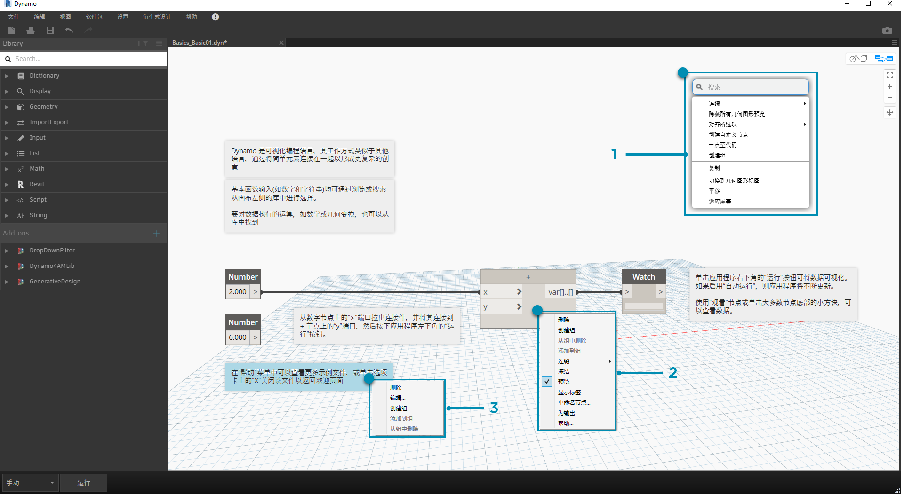
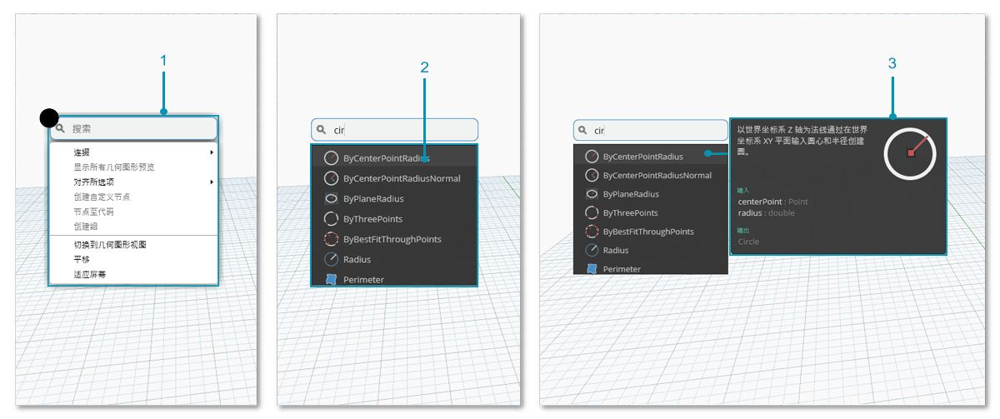

## 工作空间

在 Dynamo**“工作空间”**中，我们可以开发可视化程序，还可以预览任何生成的几何图形。无论我们是在“主工作空间”中还是在“自定义节点”中工作，我们都可以使用鼠标或右上角的按钮进行导航。在右下角的模式之间切换，即可切换我们导航的预览。

> 注意：节点和几何图形具有绘制顺序，因此可能会将对象彼此渲染在一起。在按顺序添加多个节点时，这可能会令人困惑，因为它们可能会在工作空间中的同一位置进行渲染。

> 1. 选项卡
2. “缩放”/“平移”按钮
3. 预览模式
4. 双击工作空间

### 选项卡

通过活动的“工作空间”选项卡，可以导航和编辑程序。打开新文件时，默认打开新的**“主”**工作空间。也可以从“文件”菜单或通过*“从所选项新建节点”*右键单击选项（在已选定节点的情况下，以后会对此功能进行详细介绍），打开新的**“自定义节点”**工作空间。

> 注意：一次只可以打开一个主工作空间，但在其他选项卡中可以打开多个自定义节点工作空间。

### 图形与三维预览导航

在 Dynamo 中，图形和图形的三维结果（如果我们要创建几何图形）均在工作空间中进行渲染。默认情况下，“图形”为活动预览，因此使用导航按钮或鼠标中键进行平移和缩放即可使我们在图形中移动。在活动预览之间切换可通过三种方式实现：

> 1. 工作空间中的预览切换按钮
2. 在工作空间中单击鼠标右键，然后选择*“切换到...视图”*
3. 键盘快捷键 (Ctrl + B)

三维预览导航模式还让我们能够**“直接操纵”**点，这在[“快速入门”](http://primer.dynamobim.org/02_Hello-Dynamo/2-6_the_quick_start_guide.html)中进行了说明。

### 缩放以重新居中

我们可以在三维预览导航模式下轻松地围绕模型自由地平移、缩放和旋转。但是，要特定对由几何图形节点创建的对象进行缩放，我们可以在选定单个节点的情况下使用“全部缩放”图标。

> 1. 选择与将在视图内居中的几何图形对应的节点。
2. 切换到三维预览导航。

> 1. 单击右上角的“全部缩放”图标。
2. 选定的几何图形将居中显示在视图内。

### 你好，鼠标！

根据处于活动状态的具体预览模式，鼠标按钮的作用将有所不同。通常，单击鼠标左键可选择并指定输入、单击鼠标右键可访问选项，而单击鼠标中键可以导航工作空间。鼠标右键单击将向我们提供选项，具体取决于我们单击所在位置的上下文。

> 1. 在工作空间上单击鼠标右键。
2. 在节点上单击鼠标右键。
3. 在注释上单击鼠标右键。

下面是每个预览的鼠标交互表：

|**鼠标操作**|**图形预览**|**三维预览**|
| -- | -- | -- |
|单击鼠标左键|选择|不适用|
|单击鼠标右键|关联菜单|缩放选项|
|单击鼠标中键|平移|平移|
|鼠标滚轮|缩放|缩放|
|双击|创建代码块|不适用|

### 画布内搜索

使用“画布内搜索”将使您能够访问节点描述和工具提示，而又不必离开图形，这样就可以大大加快 Dynamo 的工作流！只需单击鼠标右键，即可从画布上工作的任何位置访问“库搜索”的所有有用功能。

> 1. 在画布上的任意位置单击鼠标右键以显示搜索功能。当搜索栏为空时，下拉列表将是预览菜单。
2. 在搜索栏中键入内容时，下拉菜单将持续更新，以显示最相关的搜索结果。
3. 将光标悬停在搜索结果上，可显示其相应的描述和工具提示。

## 清理节点布局

在复杂情况下构建文件时，使 Dynamo 画布保持井井有条变得越来越重要。尽管我们可以使用**“对齐当前选择”**工具处理少量选定节点，但 Dynamo 还提供了**“清理节点布局”**工具来帮助进行整个文件清理。

#### 节点清理之前

> 1. 选择要自动组织的节点，或取消选中所有节点以清理文件中的所有节点。
2. “清理节点布局”功能位于“编辑”选项卡下。
#### 节点清理之后

3. 将自动重新分布和对齐节点，以便清理任何交错或重叠的节点，并将它们与相邻节点对齐。

