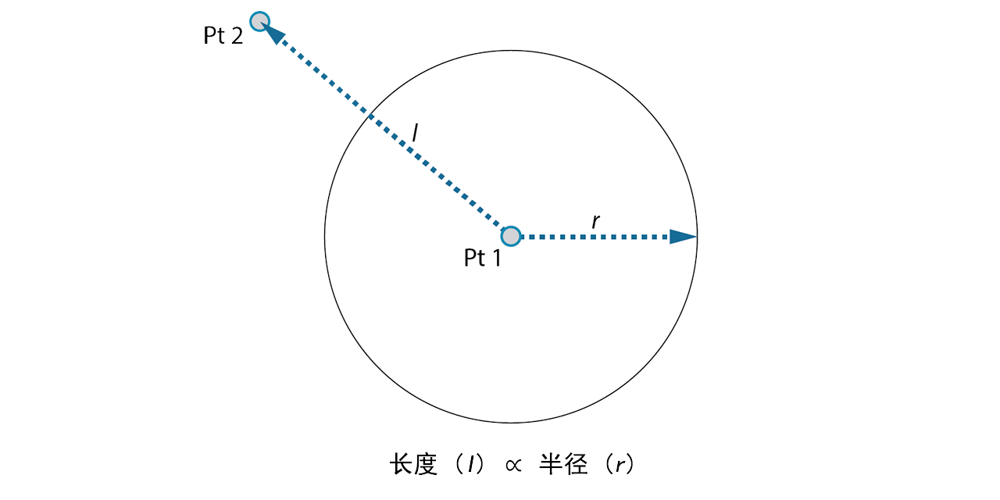
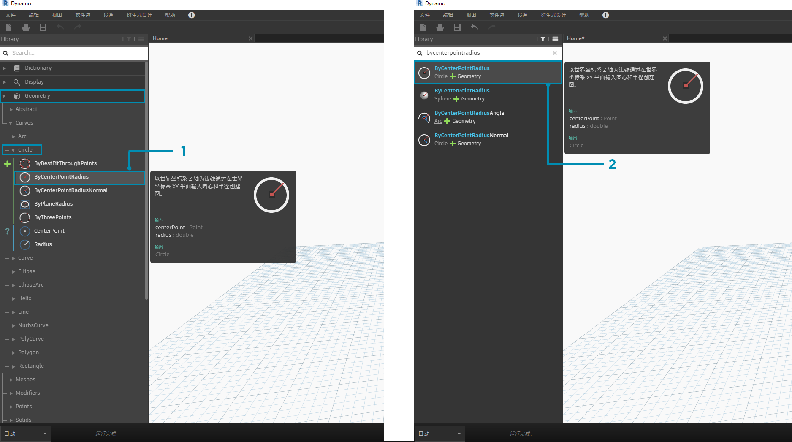
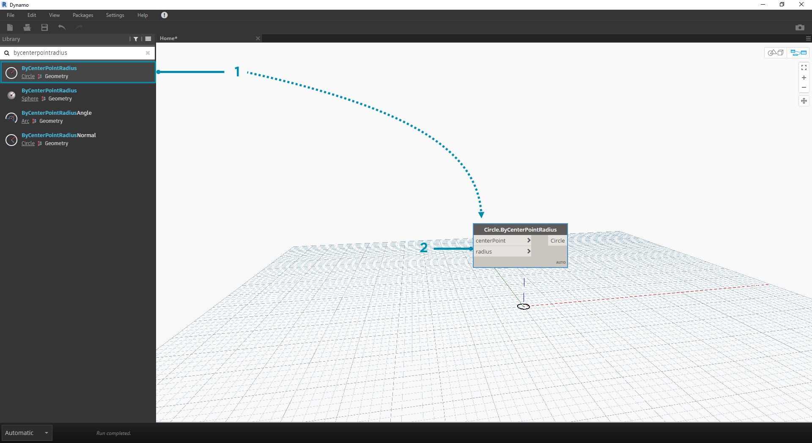

## 快速入门

现在，我们已经熟悉了界面布局和工作空间导航，下一步是了解在 Dynamo 中开发图形的典型工作流。首先，我们创建一个动态大小的圆，然后创建一个半径不同的圆阵列。

### 定义目标和关系

在向 Dynamo 工作空间添加任何内容之前，关键是我们对要实现的目标以及重要的关系有充分了解。请记住，无论何时连接两个节点，我们都会在它们之间创建显式链接 - 我们稍后可以更改数据流，但在建立连接后，我们便会致力于实现该关系。在本练习中，我们要创建一个圆（*“目标”*），其中半径输入由距邻近点的距离定义（*“关系”*）。



> 定义基于距离关系的点通常称为“吸引器”。此处，将使用距吸引器点的距离来指定圆应该有多大。

### 将节点添加到工作空间

现在，我们已经绘制了“目标”和“关系”，可以开始创建图形。我们需要节点来表示 Dynamo 将执行的操作序列。由于我们知道要创建一个圆，因此我们先找到一个执行该操作的节点。通过使用“搜索”字段或浏览库，我们会发现有多种方法可以用于创建圆。



> 1. 浏览到“几何图形”>“曲线”>“圆”>**“Circle.ByPointRadius”**
2. “搜索”>“ByCenterPointRadius...”

让我们将**“Circle.ByPointRadius”**节点添加到工作空间，方法是在库中单击该节点 - 这会将节点添加到工作空间的中心。



> 1. 库中的 Circle.ByPointandRadius 节点
2. 在库中单击节点即可将其添加到工作空间

我们还需要**“Point.ByCoordinates”**、**“Number Input”**和**“Number Slider”**节点。


> 1. “几何图形”>“点”>“点”>**“Point.ByCoordinates”**
2. “几何图形”>“几何图形”>**“DistanceTo”**
3. “输入”>“基本”>**“Number”**
4. “输入”>“基本”>**“Number Slider”**

### 使用线连接节点

现在，我们有几个节点，我们需要将节点端口用线连接起来。这些连接将定义数据流。


> 1. **“Number”**连接到**“Point.ByCoordinates”**
2. **“Number Sliders”**连接到**“Point.ByCoordinates”**
3. **“Point.ByCoordinates”**(2) 连接到**“DistanceTo”**
4. **“Point.ByCoordinates”**和**“DistanceTo”**连接到**“Circle.ByCenterPointRadius”**

### 执行程序

在完成定义程序流后，我们只需告知 Dynamo 执行它即可。在执行程序（“自动”或在“手动”模式下单击“运行”）后，数据将流经这些线，并且我们应该可以在三维预览中看到结果。


> 1. （单击“运行”）- 如果“执行栏”处于“手动”模式，则需要单击“运行”才能执行图形
2. 节点预览 - 将鼠标光标悬停在节点右下角的框上会弹出结果
3. 三维预览 - 如果有节点创建几何图形，我们将在三维预览中看到它。
4. 创建节点上的输出几何图形。

### 添加详细信息

如果程序正常运行，我们应该会在三维预览中看到一个穿过吸引器点的圆。这很棒，但我们可能想要添加更多详细信息或更多控件。我们将调整对圆节点的输入，以便可以校准对半径的影响。将另一个**“Number Slider”**添加到工作空间，然后双击工作空间的空白区域以添加**“Code Block”**节点。编辑代码块中的字段，以便指定 ```X/Y```。


> 1. **代码块**
2. **“DistanceTo”**和**“Number Slider”**连接到**“Code Block”**
3. **“Code Block”**连接到**“Circle.ByCenterPointRadius”**

### 增加复杂性

简单开始后增加复杂性是循序渐进开发程序的有效方法。在一个圆正常工作后，让我们将程序的强大功能应用于多个圆。如果我们使用点栅格（而不是一个中心点）并适应结果数据结构中的变化，那么程序现在将创建多个圆 - 每个圆的唯一半径值由距吸引器点的校准距离进行定义。


> 1. 添加**“Number Sequence”**节点并替换**“Point.ByCoordinates”**的输入 - 在“Point.ByCoordinates”上单击鼠标右键，然后依次选择“连缀”>“叉积”
2. 在 Point.ByCoordinates 后添加**“Flatten”**节点。要完全展平列表，请将 ```amt``` 输入保留为默认值 ```-1```
3. 三维预览将使用圆栅格进行更新

### 使用“直接操纵”调整

有时，数字操作并不是正确的方法。现在，可以在后台三维预览中导航时手动推拉点几何图形。我们还可以控制由点构建的其他几何图形。例如，**“Sphere.ByCenterPointRadius”**也可以直接操纵。我们可以使用**“Point.ByCoordinates”**，通过一系列 X、Y 和 Z 控制点的位置。但是，使用“直接操纵”方法，可以通过在**“三维预览导航”**模式下手动移动点来更新滑块的值。这提供了一种更直观的方法，来控制一组用于标识点位置的离散值。


> 1. 要使用**“直接操纵”**，请选择要移动的点面板 - 箭头将显示在选定点上。
2. 切换到**“三维预览导航”**模式。


> 1. 将光标悬停在点上，X、Y 和 Z 轴将显示。
2. 单击并拖动彩色箭头以移动相应的轴，**“Number Slider”**值将使用手动移动的点实时更新。


> 1. 请注意，在**“直接操纵”**之前，仅有一个滑块连接到**“Point.ByCoordinates”**组件。当我们在 X 方向上手动移动点时，Dynamo 将自动为 X 输入生成新的**“Number Slider”**。

