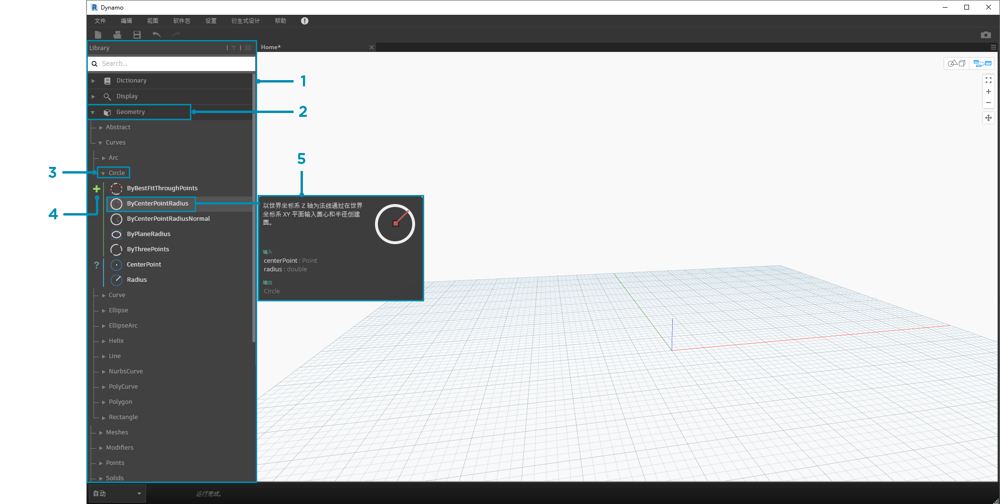
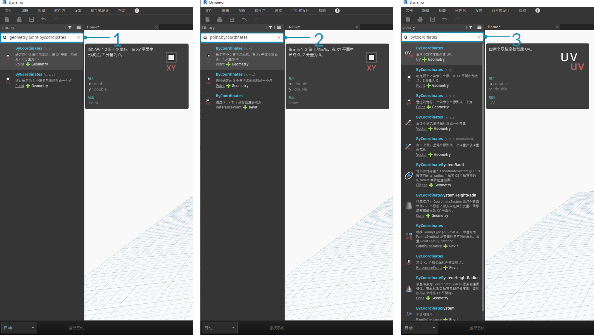
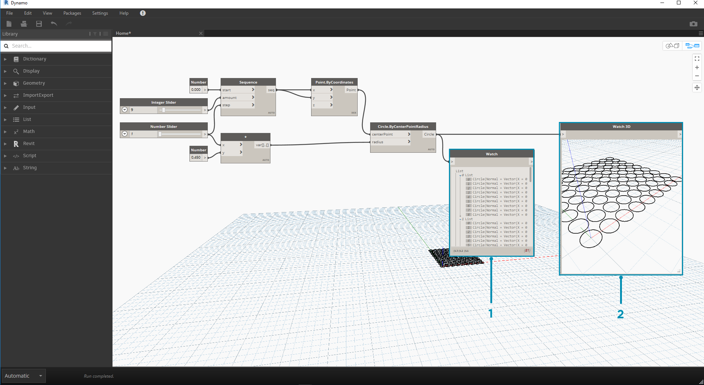

## Dynamo 库

**Dynamo 库**中包含的节点是我们添加到工作空间中用于定义要执行的可视化程序。在库中，我们可以搜索或浏览节点。此处包含的节点（安装的基本节点、我们定义的自定义节点和我们添加到 Dynamo 的 Package Manager 中的节点）按类别以层次进行组织。让我们来回顾一下这一组织，浏览我们将经常使用的关键节点。

### 各库的库

我们在应用程序中与之交互的 Dynamo**“库”**实际上是功能库的集合，每个库中都包含按类别分组的节点。虽然这一开始看起来可能很钝，但它是用于组织默认安装 Dynamo 随附节点的灵活框架 - 当我们开始使用自定义节点和其他软件包扩展此基本功能时，它将是更好的选择。

#### 组织方案

Dynamo UI 的**“库”**部分由按层次组织的库组成。在深入浏览库时，我们会按顺序浏览库、库的类别和类别的子类别来查找节点。



> 1. 库 - Dynamo 界面的区域
2. 库 - 相关类别（例如**“几何图形”**）的集合
3. 类别 - 相关节点的集合，例如与**“Circles”**相关的所有项
4. 子类别 - 该类别中节点的细分，通常按**“创建”**、**“操作”**或**“查询”**
5. 节点 - 添加到工作空间用于执行操作的对象

#### 命名惯例

每个库的层次都会反映在添加到工作空间的节点名称中，我们也可以在“搜索”字段或“代码块”（使用 *Dynamo 文本语言*）中使用它们。除了使用关键字来尝试查找节点外，我们还可以键入用句点分隔的层次。

以 ```library.category.nodeName``` 格式键入“库”层次中节点位置的不同部分将返回不同结果：



> 1. ```library.category.nodeName```
2. ```category.nodeName```
3. ```nodeName``` 或 ```keyword```

通常，工作空间中的节点名称将以 ```category.nodeName``` 格式进行渲染，但存在一些明显例外，尤其是在“输入”和“视图”类别中。小心类似的命名节点，并注意类别差异：


> 1. 大多数库中的节点将包括类别格式
2. ```Point.ByCoordinates``` 和 ```UV.ByCoordinates``` 具有相同的名称，但来自不同的类别
3. 值得注意的例外情况包括内置函数、Core.Input、Core.View 和运算符

### 常用节点

Dynamo 的基本安装中包含数百个节点，哪些节点对于开发可视化程序至关重要？我们将重点介绍以下节点：定义程序的参数（**“Input”**）、查看节点操作的结果（**“Watch”**）以及通过快捷方式定义输入或功能（**“Code Block”**）。

#### 输入

“Input”节点是可视化程序的用户（无论是自己还是他人）与关键参数交互的主要手段。以下是核心库的输入类别中可用的节点：


> 1. 布尔运算
2. 编号
3. 字符串
4. 数字滑块
5. 整数滑块
6. 目录路径
7. 文件路径

#### Watch

“Watch”节点对于管理流经可视化程序的数据至关重要。虽然可以通过节点数据预览查看节点的结果，但您可能希望将其显示在**“Watch”**节点中或通过**“Watch3D”**节点查看几何图形结果。这两个节点均位于核心库的“视图”类别中。

> 提示：如果可视化程序中包含许多节点，三维预览有时可能会分散注意力。请考虑取消选中“设置”菜单中的“显示背景预览”选项，然后使用“Watch3D”节点预览几何图形。



> 1. Watch - 请注意，在“Watch”节点中选择某个项目时，它将在“Watch3D”和三维预览中进行标记
2. Watch3D - 抓取右下部夹点以调整大小，然后使用鼠标进行导航，方法与在三维预览中相同

#### 代码块

**Code Block** 节点可用于定义代码块，其中各行用分号隔开。这可以像 ```X/Y``` 一样简单。我们还可以将“代码块”用作定义“数字输入”或调用另一个节点功能的快捷方式。为此，该语法遵循 Dynamo 文本语言和 DesignScript 的命名约定，并在第 7.2 节中介绍。让我们尝试用此快捷方式创建一个圆：


> 1. 双击以创建**“Code Block”**节点
2. 键入 ```Circle.ByCenterPointRadius(x,y);```
3. 单击要清除选择的工作空间应该会自动添加 ```x``` 和 ```y``` 输入
4. 创建**“Point.ByCoordinates”**节点和**“Number Slider”**，然后将它们连接到“Code Block”的输入
5. 在三维预览中，可视化程序的执行结果应为一个圆

