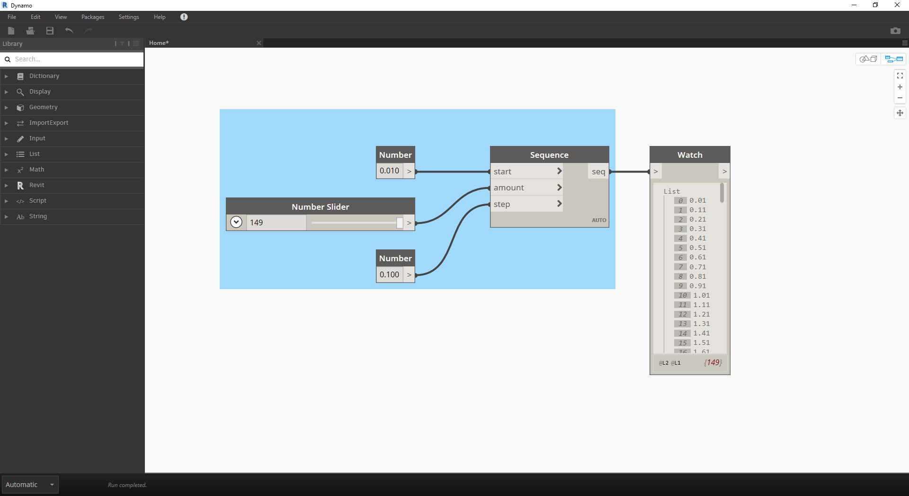
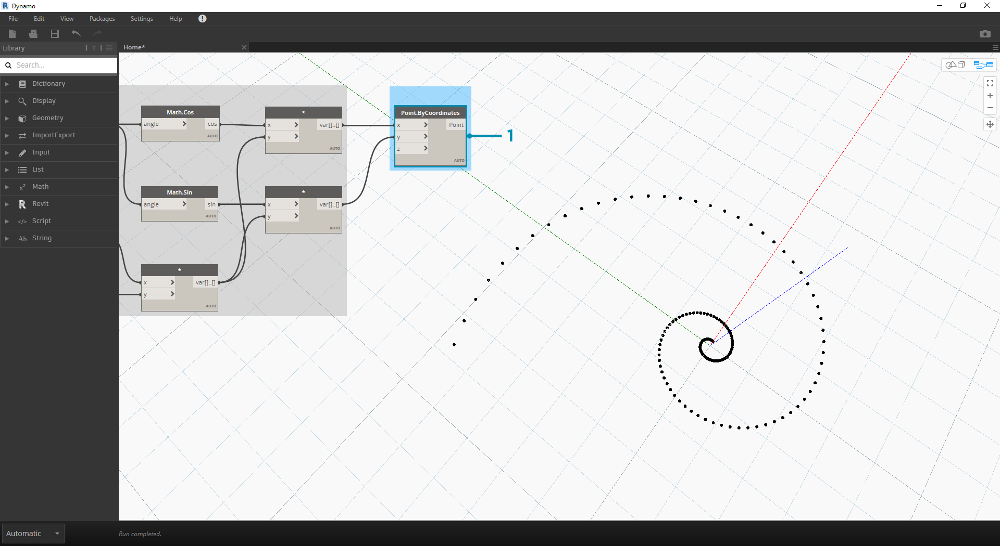

## 数学

如果最简单的数据形式是数字，则将这些数字关联起来的最简单方法是通过数学。从除法等简单的运算符到三角函数，再到更复杂的公式，Math 是开始探索数值关系和模式的好方法。

### 算术运算符

运算符是一组组件，这些组件使用具有两个数字输入值的代数函数，这些结果产生一个输出值（加、减、乘、除等）。这些可在“运算符”>“操作”下找到。

|图标|名称|语法|输入(Inputs)|输出|
| -- | -- | -- | -- | -- |
||添加|+|var[]...[], var[]...[]|var[]...[]|
||相减(Subtract)|-|var[]...[], var[]...[]|var[]...[]|
||相乘(Multiply)|*|var[]...[], var[]...[]|var[]...[]|
||分割|/|var[]...[], var[]...[]|var[]...[]|

### 参数化公式

> 下载本练习随附的示例文件（单击鼠标右键，然后单击“将链接另存为...”）：[构建程序块 - Math.dyn](datasets/4-2/Building Blocks of Programs - Math.dyn)。可以在附录中找到示例文件的完整列表。

通过运算符，下一个逻辑步骤是通过**公式**组合运算符和变量以形成更复杂的关系。让我们创建一个可由输入参数（如滑块）控制的公式。

> 1. **Number Sequence**：基于以下三个输入定义数字序列：*start、amount* 和 *step*。此序列表示参数方程中的“t”，因此我们要使用足够大的列表来定义螺旋。

上述步骤已创建一列数字，来定义参数化域。金螺旋定义为以下方程：= 和 =。下面的节点组以可视化编程形式表示此方程。

> 在逐步查看节点组时，请尝试注意可视程序和编写方程之间的平行性。

> 1. **Number Slider**：向画布添加两个数字滑块。这些滑块将表示参数方程的 *a* 和 *b* 变量。这些表示灵活的常量，或我们可以根据所需结果调整的参数。
2. *****：乘法节点由星号表示。我们将反复使用它来连接乘法变量
3. **Math.RadiansToDegrees**：“*t*”值需要转换为度数，以便在三角函数中进行求值。请记住，Dynamo 默认使用度数来对这些函数求值。
4. **Math.Pow**：作为“*t*”和数字“*e*”的函数，这将创建 Fibonacci 数列。
5. **Math.Cos 和 Math.Sin**：这两个三角函数将分别区分每个参数点的 x 坐标和 y 坐标。
6. **Watch**：现在，我们看到输出为两个列表，它们将是用于生成螺旋的点的 *x* 和 *y* 坐标。

### 从公式到几何图形

现在，上一步中的大部分节点都可以正常工作，但这种工作量很大。要创建更高效的工作流，请查看**“代码块”**（第 3.3.2.3 节），将 Dynamo 表达式的字符串定义到一个节点中。在接下来的一系列步骤中，我们将了解如何使用参数方程绘制 Fibonacci 螺旋。

> 1. **Point.ByCoordinates**：将上乘法节点连接到 *x* 输入，将下乘法节点连接到 *y* 输入。现在，我们在屏幕上会看到点的参数化螺旋。

> 1. **Polycurve.ByPoints**：将上一步的 Point.ByCoordinates 连接到 *points*。我们可以不输入而保留 *connectLastToFirst*，因为我们不会绘制闭合曲线。这将创建穿过上一步中定义的每个点的螺旋。

我们现在已完成 Fibonacci 螺旋！让我们从此处开始进一步研究两个独立的练习，我们称之为 Nautilus 和 Sunflower。这些是自然系统的抽象表示，但 Fibonacci 螺旋的两种不同应用将得到充分体现。

### 从螺旋到 Nautilus

> 1. 作为一个跳跃点，我们从上一练习的相同步骤开始：使用 **Point.ByCoordinates** 节点创建点的螺旋阵列。

> 1. **Polycurve.ByPoints**：同样，这是上一练习中的节点，我们将用作参照。
2. **Circle.ByCenterPointRadius**：我们将在此处使用 Circle 节点，其输入与上一步相同。半径值默认为 *1.0*，因此可以看到圆即时输出。这些点与原点之间的分离程度立即清晰可辩。

> 1. **Circle.ByCenterPointRadius**：要创建更动态的圆阵列，我们会将原始数字序列（即“*t*”序列）插入半径值。
2. **Number Sequence**：这是“*t*”的原始数组。通过将其连接到半径值，圆心仍与原点进一步偏离，但圆的半径不断增大，从而创建一个时髦的 Fibonacci 圆图。如果使其成为三维形式，即可获得奖励积分！

### 从 Nautilus 到 Phyllotaxis 图案

现在，我们已创建一个圆形 Nautilus 壳，接下来我们转到参数化栅格。我们将在 Fibonacci 螺旋上使用基本旋转来创建 Fibonacci 栅格，然后在[向日葵种子生长](http://ms.unimelb.edu.au/~segerman/papers/sunflower_spiral_fibonacci_metric.pdf)后对结果进行建模。

> 1. 同样，作为跳跃点，我们从上一练习的相同步骤开始：使用 **Point.ByCoordinates** 节点创建点的螺旋阵列。

> 1. **Geometry.Rotate**：有多个 Geometry.Rotate 选项；请务必选择将 *geometry*、*basePlane* 和 *degrees* 作为其输入的节点。将 **Point.ByCoordinates** 连接到几何图形输入。
2. **Plane.XY**：连接到 *basePlane* 输入。我们将绕原点旋转，该原点与螺旋的底部位置相同。
3. **Number Range**：对于度数输入，我们要创建多个旋转。我们可以使用“数字范围”组件快速完成此操作。将其连接到 *degrees* 输入。
4. **Number:**：要定义数字范围，请按垂直顺序将三个数字节点添加到画布。从上到下，分别指定值 *0.0,360.0,* 和 *120.0*。这些驱动螺旋的旋转。将三个数字节点连接到相应节点后，请注意 **Number Range** 节点的输出结果。

我们的输出开始类似于旋涡。我们调整一些 **Number Range** 参数，看一看结果如何变化：

> 1. 将 **Number Range** 节点的步长从 *120.0* 更改为 *36.0*。请注意，这将创建更多旋转，因此会为我们提供更密集的栅格。

> 1. 将 **Number Range** 节点的步长从 *36.0* 更改为 *3.6*。现在，我们得到更密集的栅格，但螺旋的方向性尚不清楚。女士们，先生们：我们创建了一个向日葵。

