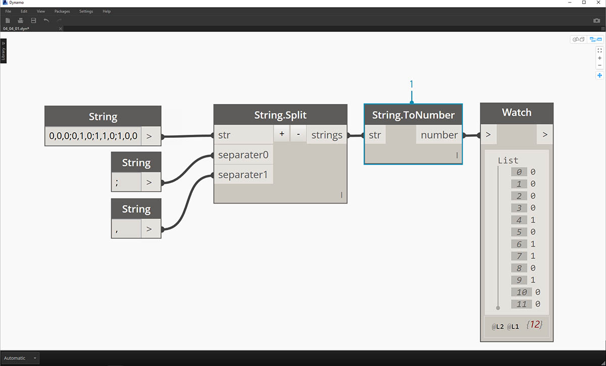
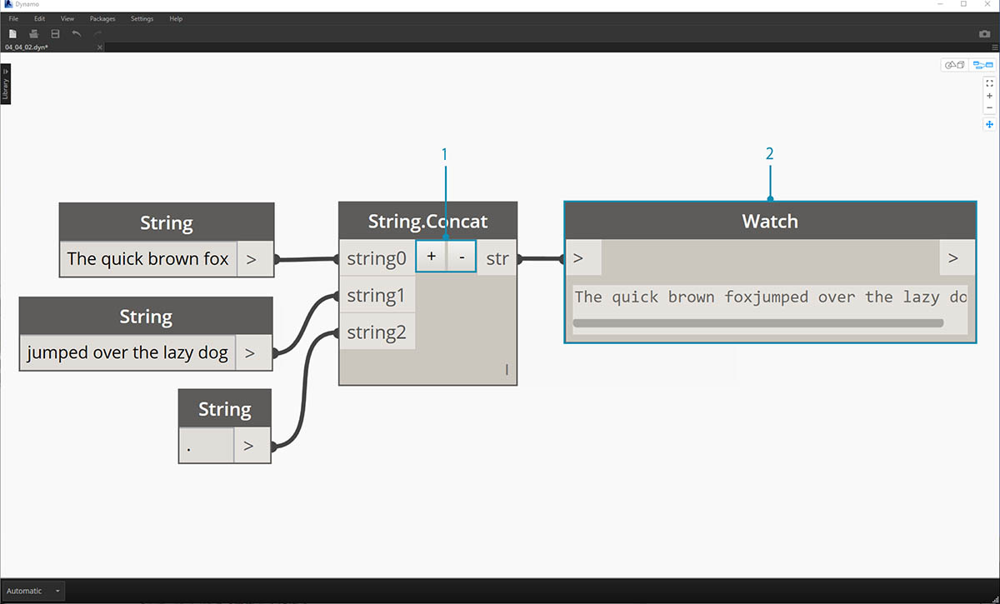
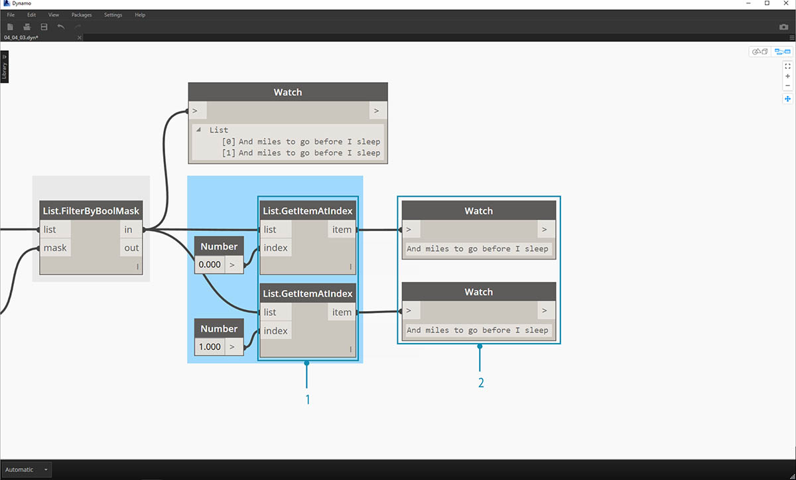
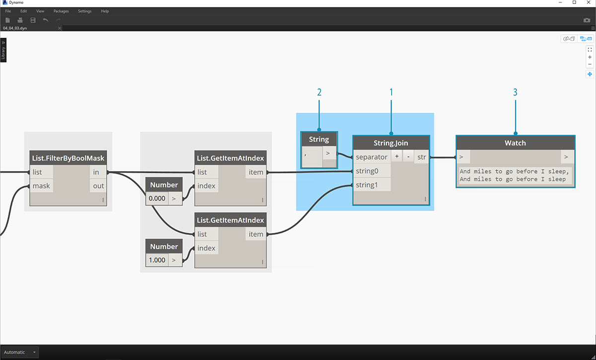

## 字符串

正式地，**字符串**是代表文字常量或某种类型变量的字符序列。非正式，字符串是文本编程术语。我们已使用数字（整数和小数）来驱动参数，可以对文本执行相同操作。

### 创建字符串

字符串可用于各种应用，包括定义自定义参数、注释文档集以及解析基于文本的数据集。字符串节点位于“核心”>“输入类别”中。

> 上面的示例节点都是字符串。数字可以表示为字符串、字母或整个文本数组。

### 查询字符串

> 下载本练习随附的示例文件（单击鼠标右键，然后单击“将链接另存为...”）：[构建程序块 - Strings.dyn](datasets/4-4/Building Blocks of Programs - Strings.dyn)。可以在附录中找到示例文件的完整列表。

通过查询字符串，即可快速解析大量数据。我们将介绍一些基本操作，这些操作可以加快工作流并帮助实现软件互操作性。

下图考虑了来自外部电子表格的数据字符串。该字符串表示矩形在 XY 平面中的顶点。让我们在微型练习中分解一些字符串拆分操作：

> 1. “;”分隔符分割矩形的每个顶点。这将为每个顶点创建一个包含 4 个项目的列表。

> 1. 点击节点中间的“*+*”，即可创建新的分隔符。
2. 向画布添加“*,*”字符串，然后连接到新的分隔符输入。
3. 现在，我们得到了包含十个项目的列表。节点先基于 *separator0* 进行分割，然后基于 *separator1* 进行分割。

虽然上述项目列表看起来像数字，但在 Dynamo 中仍将它们视为单独的字符串。要创建点，需要将点的数据类型从字符串转换为数字。使用 String.ToNumber 节点即可完成此操作

> 1. 此节点简单明了。将 String.Split 结果连接到输入。输出看起来没有什么不同，但数据类型现在是 *number*，而不是 *string*。

> 1. 使用其他一些基本操作，我们现在在原点处基于原始字符串输入绘制了一个矩形。

### 处理字符串

由于字符串是通用文本对象，因此它们承载了各种应用。让我们来了解一下 Dynamo 的“核心”>“字符串类别”中的一些主要操作：

这是一个将两个字符串按顺序合并到一起的方法。这将提取列表中的每个文字字符串，并创建一个合并字符串。

> 上图表示三个字符串的串联：

> 1. 通过单击节点中心的“+/-”按钮，即可在串联中添加或减少字符串。
2. 输出会提供一个串联的字符串，其中包含空格和标点符号。

合并方法与连接方法非常相似，只是它增加了标点图层。

如果您使用过 Excel，则可能遇到过 CSV 文件。这代表逗号分隔值。可以使用逗号（或在本例中，使用两个短划线）作为连接节点的分隔符，以创建类似的数据结构：

> 上图表示两个字符串的合并：

> 1. 分隔符输入允许一个分隔符创建一个字符串，该字符串会分割已合并的字符串。

### 使用字符串

在本练习中，我们将使用查询和操作字符串的方法来解构 Robert Frost 的 [Stopping By Woods on a Snowy Evening](http://www.poetryfoundation.org/poem/171621) 诗的最后一小节。这并非最实用的应用，但在我们将概念性的字符串操作应用于节奏和韵律的清晰各行时，它将有助于我们掌握此类操作。

> 我们先从该诗小节的基本字符串拆分开始。首先，我们注意到书写格式基于逗号设置。我们将使用此格式来将每行分隔为单独的项目。

> 1. 基础字符串将粘贴到字符串节点中。
2. 另一个字符串节点用于表示分隔符。在本例中，我们使用的是逗号。
3. String.Split 节点将添加到画布并连接到两个字符串。
4. 输出表明，我们现在已将各行分成各个元素。

> 现在，让我们了解这首诗的优美部分：最后两行。原始诗小节是一项数据。在第一步中，我们已将该数据分为各个项目。现在，我们需要搜索所需的文字。尽管我们*可以*通过选择列表的最后两项来完成此操作，但如果这是一本书，则我们不希望通读所有内容并手动隔离各元素。

> 1. 我们使用 String.Contains 节点来搜索一组字符，而不是手动搜索。这类似于在文字处理器中执行“查找”命令。在本例中，如果在项目中找到相应子字符串，则返回“true”或“false”。
2. 在“searchFor”输入中，我们定义了要在诗小节中查找的子字符串。我们使用一个带有文字“And miles”的字符串节点。
3. 输出结果为一列 false 或 true。我们将在下一步中使用此布尔逻辑过滤各元素。

> 1. List.FilterByBoolMask 是我们要用来消隐 false 和 true 的节点。“in”输出返回“mask”输入为“true”的语句，而“out”输出返回“mask”输入为“false”的语句。
2. “in”的输出与预期一样，为我们提供了诗小节的最后两行。

> 现在，我们要通过合并这两行，来再现该诗小节。查看上一步的输出时，我们注意到列表中有两个项目：

> 1. 使用两个 List.GetItemAtIndex 节点，我们可以使用值 0 和 1 作为索引输入来隔离项目。
2. 每个节点的输出按顺序为我们提供最后两行。

> 要将这两个项目合并为一个项目，我们将使用 String.Join 节点：

> 1. 在添加 String.Join 节点后，我们注意到需要分隔符。
2. 要创建分隔符，我们向画布中添加一个字符串节点，然后键入逗号。
3. 最终输出已将最后两个项目合并为一个项目。

隔离最后两行看起来可能需要大量工作；确实，字符串操作通常需要一些前期工作。但它们具有可伸缩性，可以相对轻松地应用于大型数据集。如果您以参数方式使用电子表格和互操作性，请务必记住字符串操作。

