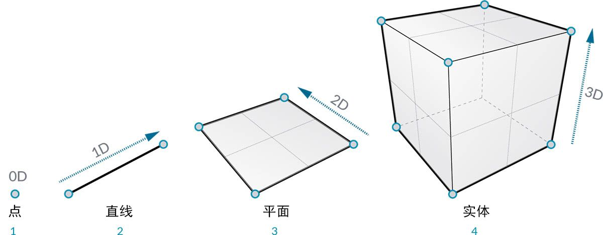
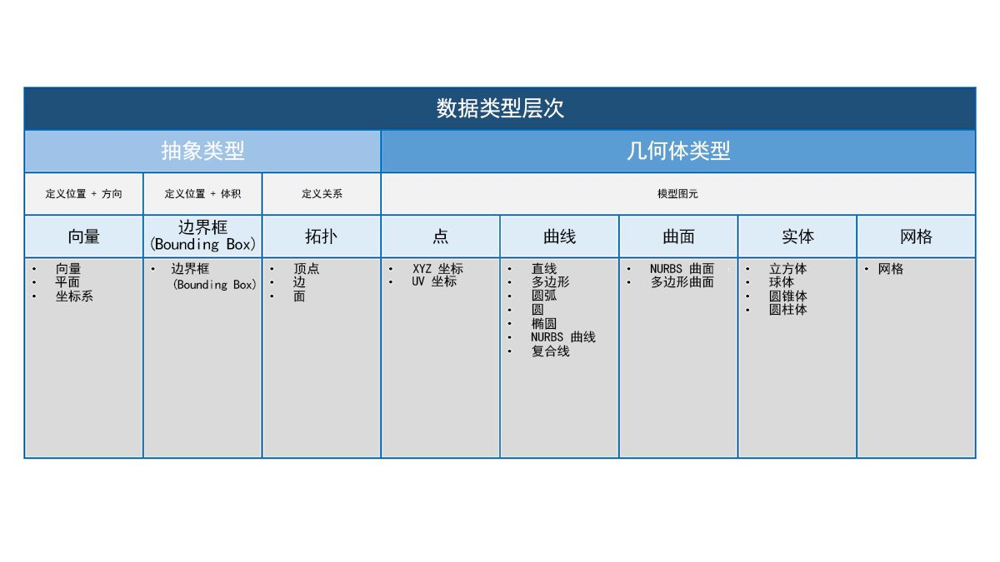
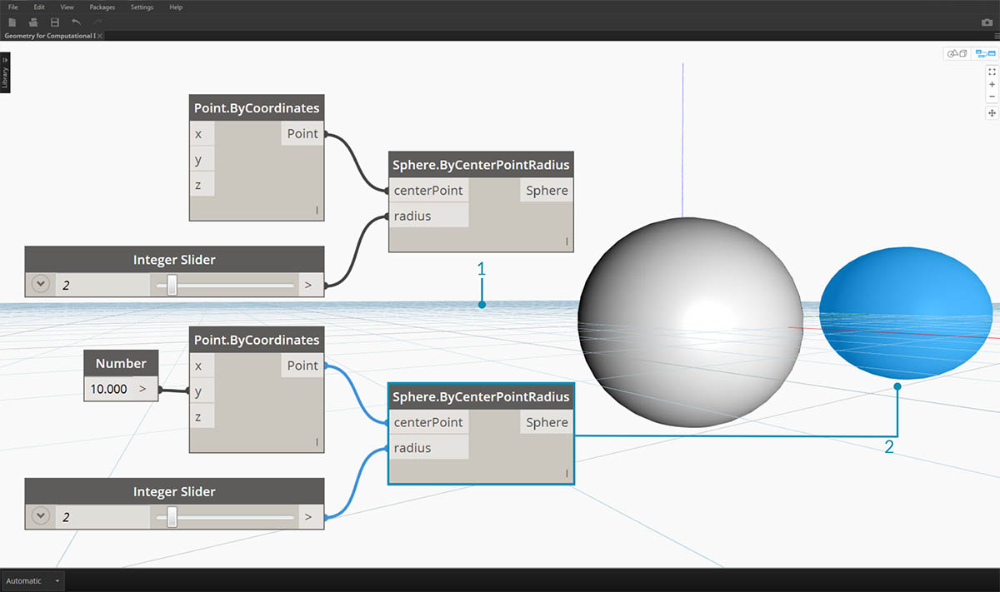

## 几何图形概述
**“几何图形”**是设计语言。当编程语言或环境的核心有几何图形内核时，我们可以针对以下目标开启各种可能性：设计精确而稳健的模型、自动执行设计例程以及使用算法生成设计迭代。

### 基础知识
传统上定义的几何图形是对形状、大小、图形的相对位置和空间特性的研究。这一领域悠久历史，可以追溯到数千年前。随着计算机的出现和普及，我们在定义、浏览和生成几何图形方面获得了强大的工具。现在，可以非常轻松地计算复杂几何交互的结果；实际上，我们所做的几乎是透明的。

> 如果您想知道如何利用计算机的强大功能来获得多样化和复杂的几何图形，请通过 Web 快速搜索“斯坦福兔”（即，一种用于测试算法的规范模型）。

在算法、计算和复杂性的环境中了解几何图形可能会令人望而生畏；但有一些关键和相对简单的原则，我们可以将这些原则确立为基础来开始构建更高级的应用程序：

1. 几何图形是**“数据”**- 对计算机和 Dynamo 而言，兔子与数字没有什么不同之处。
2. 几何图形依赖**“抽象”**- 从根本上来说，几何图元由给定空间坐标系中的数字、关系和公式进行描述
3. 几何图形具有**“层次”**- 点汇聚生成线、线汇聚生成面，以此类推
4. 几何图形同时描述**“零件和整体”**- 如果有曲线，则它既包括形状，也包括沿其的所有可能点

实际上，这些原则意味着我们需要知道我们正在处理的内容（几何图形的类型、如何创建等）因此，我们在开发更复杂的模型时，可以顺畅地构建、分解和重新构建不同的几何图形。

### 在层次中步进
让我们花点时间了解一下几何图形的“抽象”说明和“层次”说明之间的关系。由于这两个概念是相关的，但起初并不总是很明显，因此一旦我们开始开发更深的工作流或模型，我们可能会快速遇到概念上的障碍。首先，我们使用维数作为所建模“素材”的简单描述符。描述形状所需的维数为我们提供了一个窗口，让我们可以了解几何图形是如何按层次组织的。

> 1. **“点”**（由坐标定义）没有任何维数 - 它只是描述每个坐标的数字
2. **“线”**（由两个点定义）现在有*一*个维数 - 我们可以向前（正方向）或向后（负方向）“漫游”直线
3. **“平面”**（由两条直线定义）有*两*个维数 - 现在可以向左或向右更多漫游
4. **“方框”**（由两个平面定义）有*三*个维数 - 我们可以定义相对于上或下的位置

维数是一种开始对几何图形进行分类的便捷方法，但它不一定是最佳方法。毕竟，我们不仅使用“点”、“线”、“平面”和“方框”建模 - 如果我想要弯曲，该怎么办？此外，还有另一类完全抽象的几何类型，即它们定义诸如方向、体积或各部件之间关系之类的特性。我们无法真正抓住向量，那么如何相对于空间中的显示内容定义向量？几何层次的更详细分类应适应“抽象类型”或“辅助对象”之间的差异，我们可以根据它们的帮助内容和有助于描述模型图元形状的类型对它们进行分组。

### Dynamo 沙箱中的几何图形

这对于使用 Dynamo 意味着什么？了解几何图形类型及其之间的关系，将使我们能够浏览库中可用的**“几何图形节点”**的集合。几何图形节点按字母顺序组织，而不是按层次组织 - 它们在此处的显示类似于其在 Dynamo 界面中的布局。

此外，随着时间的流逝，在 Dynamo 中制作模型并将在“背景预览”中所看到内容的预览连接到图形中的数据流应会变得更加直观。

> 1. 请注意，假定坐标系由栅格和彩色轴渲染
3. “选定节点”将在背景中以亮显颜色渲染相应的几何图形（如果节点创建几何图形）

> 下载本图像随附的示例文件（单击鼠标右键，然后单击“将链接另存为...”）：[适用于计算设计的几何图形 - Geometry Overview.dyn](datasets/5-1/Geometry for Computational Design - Geometry Overview.dyn)。可以在附录中找到示例文件的完整列表。

### 进一步探索几何图形
在 Dynamo 中创建模型并不局限于我们可以通过节点所生成的内容。以下是进一步处理几何图形的一些关键方法：

1. Dynamo 允许您输入文件 - 尝试将 CSV 用于点云，或将 SAT 用于引入曲面
2. 使用 Revit 时，我们可以参照要在 Dynamo 中使用的 Revit 图元
3. Dynamo Package Manager 为扩展的几何图形类型和操作提供了附加功能 - 查看 [Mesh Toolkit](https://github.com/DynamoDS/Dynamo/wiki/Dynamo-Mesh-Toolkit) 软件包

