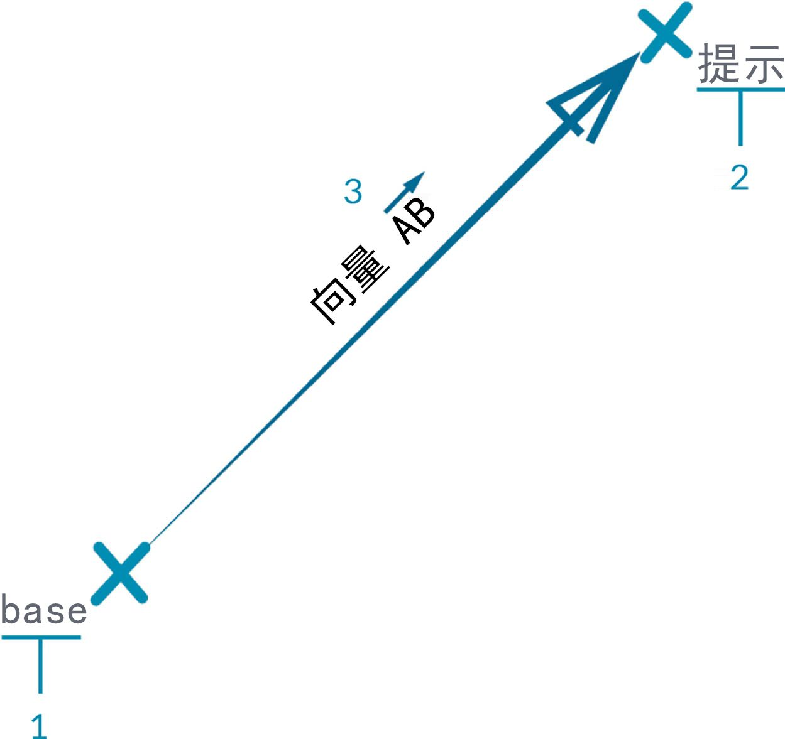
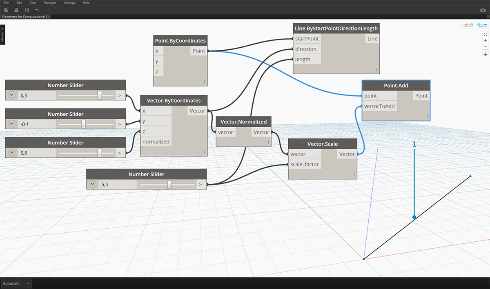

## 向量、平面和坐标系

向量、平面和坐标系构成了抽象几何图形类型的主组。它们帮助我们为描述形状的其他几何图形定义位置、方向和空间环境。如果我说我在纽约市第 42 街的百老汇（坐标系）、站在街道上（平面）、面朝北（向量），我刚刚使用这些“辅助对象”来定义我所在的位置。这同样适用于手机壳产品或摩天大楼 - 我们需要此环境来开发模型。

### 什么是向量？

向量是描述方向和幅值的几何量。向量是抽象概念；即它们表示量，而不是几何图元。向量可能容易与“点”混淆，因为它们都是由一列值组成。不过，有一个关键区别：“点”描述给定坐标系中的位置，而“向量”描述位置中的相对差异（这就是所谓的“方向”）。

如果相对差异的概念令人困惑，请将“向量 AB”想象为“我站在点 A，面朝点 B”。从这里 (A) 到那里 (B) 的方向就是我们所谓的向量。

使用相同 AB 符号将向量详解为其各组成部分：

> 1. 向量的**“起点”**称为**“基底”**。
2. 向量的**“终点”**称为**“尖端”**或**“感官”**。
3. “向量 AB”与“向量 BA”不同 - 它们指向相反的方向。

如果您需要关于向量（及其抽象定义）的喜剧效果，请观看经典喜剧《飞机》，聆听时常引用的半开玩笑台词：

> *Roger, Roger. What's our vector, Victor?*

在 Dynamo 中，向量是模型的关键组件。请注意，由于它们属于“辅助对象”的“抽象”类别，因此当我们创建向量时，不希望在背景预览中看到任何内容。

> 1. 我们可以使用一条线作为向量预览的替代对象。
> 下载本图像随附的示例文件（单击鼠标右键，然后单击“将链接另存为...”）：[适用于计算设计的几何图形 - Vectors.dyn](datasets/5-2/Geometry for Computational Design - Vectors.dyn)。可以在附录中找到示例文件的完整列表。

### 什么是平面？

平面是二维抽象“辅助对象”。更具体地说，平面在概念上是“平”的，在两个方向上无限延伸。通常，它们在其原点附近被渲染为较小的矩形。

您可能会想：“等等！原点？这听起来像是一个坐标系...就像我在 CAD 软件中建模所使用的坐标系！”

您是对的！大多数建模软件都利用构造平面或“标高”来定义要拔模的本地二维环境。XY、XZ、YZ 或北、东南、平面图听起来可能更加熟悉。这些都是“平面”，用于定义无限的“平”环境。平面没有深度，但它们也有助于我们描述方向 - 每个平面都有一个原点、X 方向、Y 方向和一个 Z（向上）方向。

> 1. 尽管它们是抽象的，但平面确实具有原点位置，以便我们可以在空间中定位它们。
2. 在 Dynamo 中，平面在背景预览中渲染。
> 下载本图像随附的示例文件（单击鼠标右键，然后单击“将链接另存为...”）：[适用于计算设计的几何图形 - Planes.dyn](datasets/5-2/Geometry for Computational Design - Plane.dyn)。可以在附录中找到示例文件的完整列表。

### 什么是坐标系？

如果我们对平面感到满意，那么我们只需一小步就能理解坐标系。平面与坐标系一样具有相同的各部分，前提是它是标准的“欧几里德”或“XYZ”坐标系。

但是，还有其他可选坐标系，如圆柱坐标系或球形坐标系。如我们在后续各部分中所见，坐标系也可应用于其他几何图形类型，以定义该几何图形上的位置。

> 添加可选坐标系 - 圆柱坐标系、球形坐标系

> 1. 尽管它们是抽象的，但坐标系也具有原点位置，以便我们可以在空间中定位它们。
2. 在 Dynamo 中，坐标系在背景预览中渲染为一个点（原点）和定义轴（X 为红色、Y 为绿色以及 Z 为蓝色，遵循约定）的线。
> 下载本图像随附的示例文件（单击鼠标右键，然后单击“将链接另存为...”）：[适用于计算设计的几何图形 - Coordinate System.dyn](datasets/5-2/Geometry for Computational Design - Coordinate System.dyn)。可以在附录中找到示例文件的完整列表。

