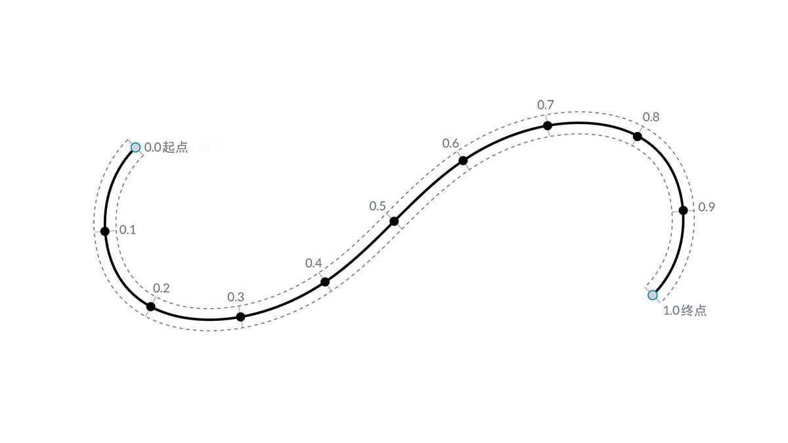
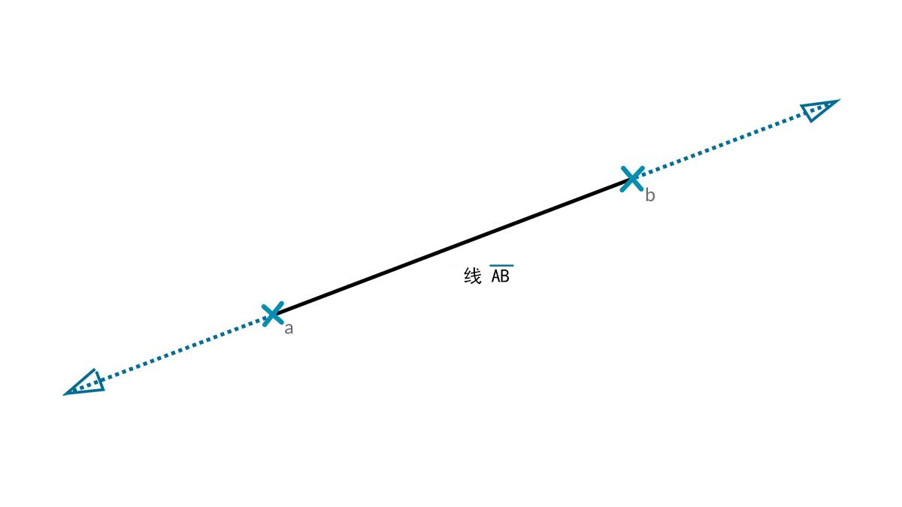

## 曲线

曲线是我们介绍的第一个几何数据类型，具有一组更熟悉的形状描述特性 - 弯曲度或笔直度如何？多长或多短？请记住，点仍然是我们的构建块，用于定义从直线到样条曲线以及它们之间的所有曲线类型。


> 1. 直线
2. 多段线
3. 圆弧
4. 圆
5. 椭圆
6. NURBS 曲线
7. 复合线

### 什么是曲线？

术语**“曲线”**通常是所有不同类型弯曲（即使是笔直）形状的全部捕捉。大写字母“C”（即“Curve”）是所有这些形状类型（直线、圆、样条曲线等）的父分类。从技术上讲，“曲线”描述了通过将“t”输入到函数集合中可以找到的所有可能点，范围可能从简单形式 (```x = -1.26*t, y = t```) 到涉及微积分的函数。不论我们使用何种类型的曲线，这一名为“t”的**“参数”**都是我们可以计算的特性。此外，不论形状的外观如何，所有曲线也都具有起点和终点，它们与用于创建曲线的最小和最大 t 值一致符合。这也有助于我们了解其方向性。



> 请务必注意，Dynamo 假定曲线的“t”值域可理解为 0.0 到 1.0。

所有曲线还拥有许多可用于描述或分析它们的特性或特征。如果起点和终点之间的距离为零，则曲线为“闭合”。此外，每条曲线都有多个控制点，如果所有这些点都位于同一平面中，则该曲线为“平面”的。某些特性整体上适用于曲线，而其他特性仅适用于沿曲线的特定点。例如，平面性是全局特性，而给定 t 值处的切线向量是局部特性。

### 直线

**“线”**是最简单的曲线形式。它们看起来可能不弯曲，但它们实际上是曲线 - 只是没有任何曲率。创建直线的方法有几种，最直观的形式是从点 A 到点 B。在这两个点之间绘制“直线 AB”的形状，但在数学上它在两个方向上无限延伸。



将两条直线连接在一起时，我们得到了**“多段线”**。在此处，我们可以直接了解什么是“控制点”。编辑其中任何点位置都将更改多段线的形状。如果多段线是闭合的，则会得到一个多边形。如果多边形的边长全部相等，则将其描述为常规边。


### 圆弧、圆、椭圆圆弧和椭圆

随着我们为定义形状的参数化函数增加了更多复杂性，我们可以从直线进一步创建**“圆弧”**、**“圆”**、**“椭圆圆弧”**或**“椭圆”**，方法是描述一个或两个半径。“圆弧”版本与“圆”或“椭圆”之间的差异仅在于形状是否是闭合的。


### NURBS + 复合线

**NURBS**（非均匀有理基本样条曲线）是数学表示形式，可以对任何形状进行精确建模（从简单的二维直线、圆、圆弧或矩形到最复杂的三维自由形式有机曲线）。由于其灵活性（相对较少的控制点，但基于“阶数”设置的平滑插值）和精度（受强大的数学约束），NURBS 模型可用于从插图、动画到制造的任何过程。


**阶数**：曲线的阶数确定了控制点对曲线的影响范围；阶数越高，范围越大。“阶数”为正整数。此数字通常为 1、2、3 或 5，但可以是任意正整数。NURBS 直线和多段线通常为 1 阶，并且大多数自由形式曲线为 3 阶或 5 阶。

**控制点**：控制点是一列至少包含 Degree+1 的点。更改 NURBS 曲线形状的最简单方法之一是移动其控制点。

**权重**：控制点具有一个称为“权重”的关联数字。权重通常为正数。当曲线的控制点全都具有相同的权重（通常为 1）时，曲线称为“非有理性曲线”，否则曲线称为“有理曲线”。大多数 NURBS 曲线是非有理性曲线。

**结**：结是一列 (Degree+N-1) 数字，其中 N 是控制点的数量。结与权重一起使用，以控制控制点对生成的曲线的影响。结的一个用途是在曲线中的某些点处创建扭折。


> 1. 阶数 = 1
2. 阶数 = 2
3. 阶数 = 3

请注意，阶数值越高，则用于对生成的曲线进行插值的控制点越多。

让我们在 Dynamo 中使用两种不同方法制作正弦曲线，以创建 NURBS 曲线来比较结果。


> 1. *NurbsCurve.ByControlPoints* 使用一列点作为控制点
2. *NurbsCurve.ByPoints* 通过一列点绘制曲线
> 下载本图像随附的示例文件（单击鼠标右键，然后单击“将链接另存为...”）：[适用于计算设计的几何图形 - Curves.dyn](datasets/5-4/Geometry for Computational Design - Curves.dyn)。可以在附录中找到示例文件的完整列表。

