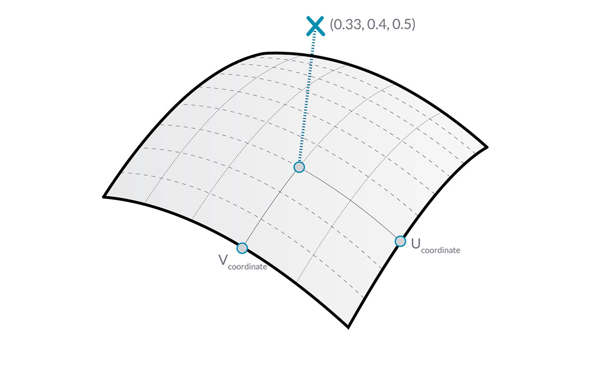
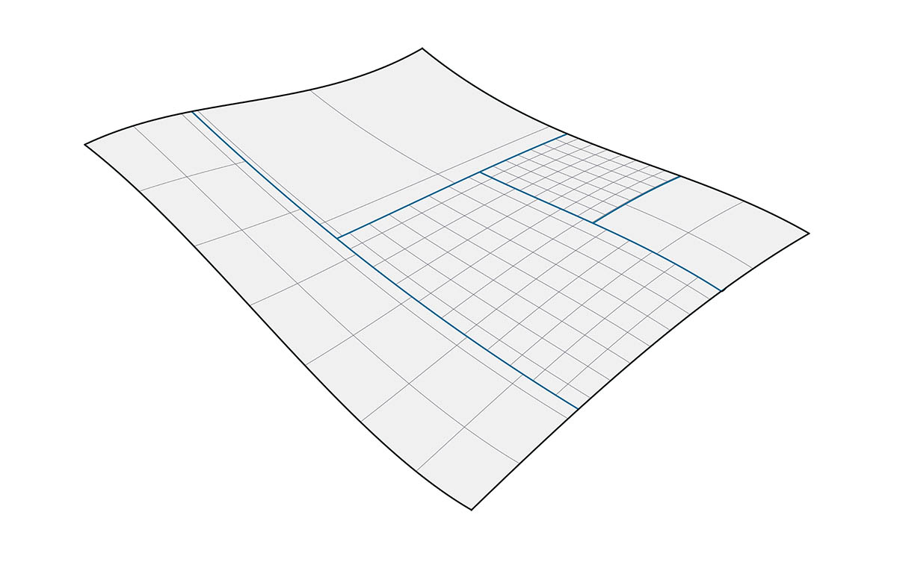

## 曲面

从使用曲线到在模型中使用曲面，我们现在可以开始表示在三维世界中看到的对象。虽然曲线并非总是平面，即它们是三维的，它们定义的空间始终绑定到一个维度。曲面为我们提供了另一个维度和一组附加特性，我们可以在其他建模操作中使用它们。

### 什么是曲面？

曲面是由函数和两个参数定义的数学形状。我们使用 ```U``` 和 ```V``` 而不是曲线的 ```t``` 来描述相应的参数空间。这意味着，在处理此类型的几何体时，我们需要从中绘制更多的几何数据。例如，曲线具有切线向量和法线平面（可以沿曲线的长度旋转或扭曲），而曲面具有在其方向上保持一致的法线向量和切线平面。


> 1. 曲面
2. U 向等参曲线
3. V 向等参曲线
4. UV 坐标
5. 垂直平面
6. 法线向量

**曲面域**：曲面域定义为 (U,V) 参数的范围，这些参数评估为该曲面上的三维点。每个维度中的域（U 或 V）通常描述为两个数字（U 最小值到 U 最大值）和（V 最小值到 V 最大值）。


尽管曲面的形状看起来不是“矩形”，但是局部可能有更紧或更松的等参曲线集，由其域定义的“空间”始终是二维的。在 Dynamo 中，始终可以将曲面理解为使域在 U 和 V 方向上最小为 0.0 且最大为 1.0。平面曲面或修剪曲面可能具有不同的域。

**等参曲线**：由曲面上的恒定 U 或 V 值定义的曲线，以及相应其他 U 或 V 方向的值域。

**UV 坐标**：UV 参数空间中的点由 U、V（有时为 W）定义。



**垂直平面**：在给定 UV 坐标处与 U 向和 V 向等位曲线垂直的平面。

**法线向量**：定义相对于垂直平面的“向上”方向向量。

### NURBS 曲面

**NURBS 曲面**与 NURBS 曲线非常相似。可以将 NURBS 曲面视为位于两个方向上的 NURBS 曲线的栅格。NURBS 曲面的形状由多个控制点以及该曲面在 U 和 V 方向的阶数定义。相同的算法用于通过控制点、权重和阶数来计算形状、法线、切线、曲率和其他属性。


对于 NURBS 曲面，几何体会隐含两个方向，因为无论我们看到的是什么形状，NURBS 曲面都是矩形控制点栅格。尽管这些方向通常与世界坐标系任意相关，但我们将经常使用它们来分析模型或基于曲面生成其他几何体。


> 1. 阶数 (U,V) = (3,3)
2. 阶数 (U,V) = (3,1)
3. 阶数 (U,V) = (1,2)
4. 阶数 (U,V) = (1,1)

### 多边形曲面

**多边形曲面**由跨边连接的曲面组成。多边形曲面提供了超过二维的 UV 定义，现在我们可以通过其拓扑在连接的形状中移动。

> “拓扑”通常描述了有关零件连接方式的概念和/或 Dynamo 中的相关拓扑也是一种几何体类型。特别是，它是“曲面”、“多边形曲面”和“实体”的父类别。



有时称为“面片”，以这种方式连接曲面可以创建更加复杂的形状，并定义跨接缝的细节。我们可以方便地将圆角或倒角操作应用到多边形曲面的边。

让我们在 Dynamo 中导入和评估 Surface At Parameter 节点，以查看我们可以提取的信息类型。


1. *Surface.PointAtParameter* 返回给定 UV 坐标处的点
2. *Surface.NormalAtParameter* 返回给定 UV 坐标处的法线向量
3. *Surface.GetIsoline* 返回 U 或 V 坐标处的等参曲线 - 请注意 isoDirection 输入。
> 下载此图像随附的示例文件（单击鼠标右键，然后单击“将链接另存为...”）。可以在附录中找到示例文件的完整列表。
1. [Geometry for Computational Design - Surfaces.dyn](datasets/5-5/Geometry for Computational Design - Surfaces.dyn)
2. [Surface.sat](datasets/5-5/Surface.sat)

