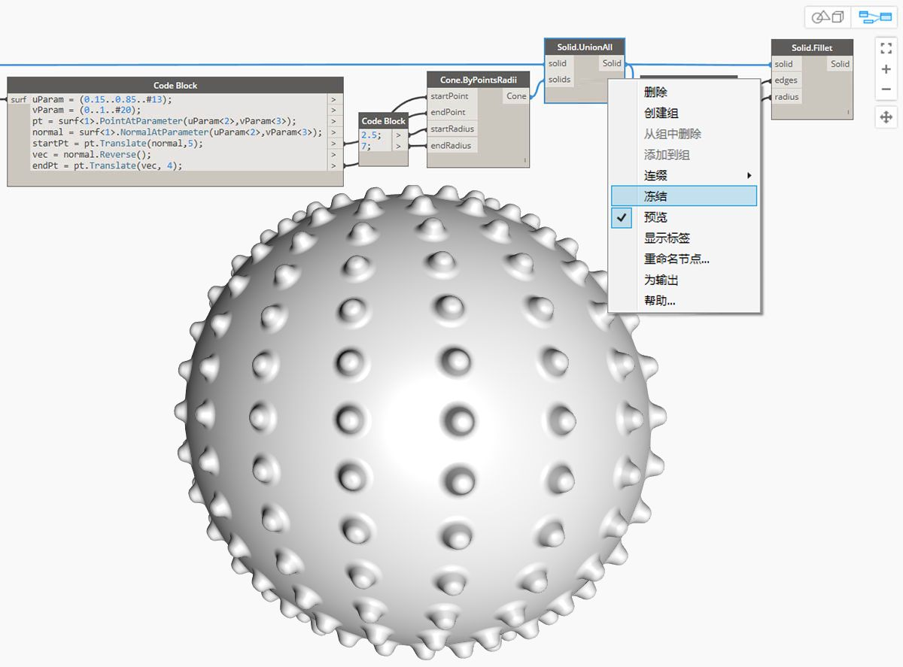
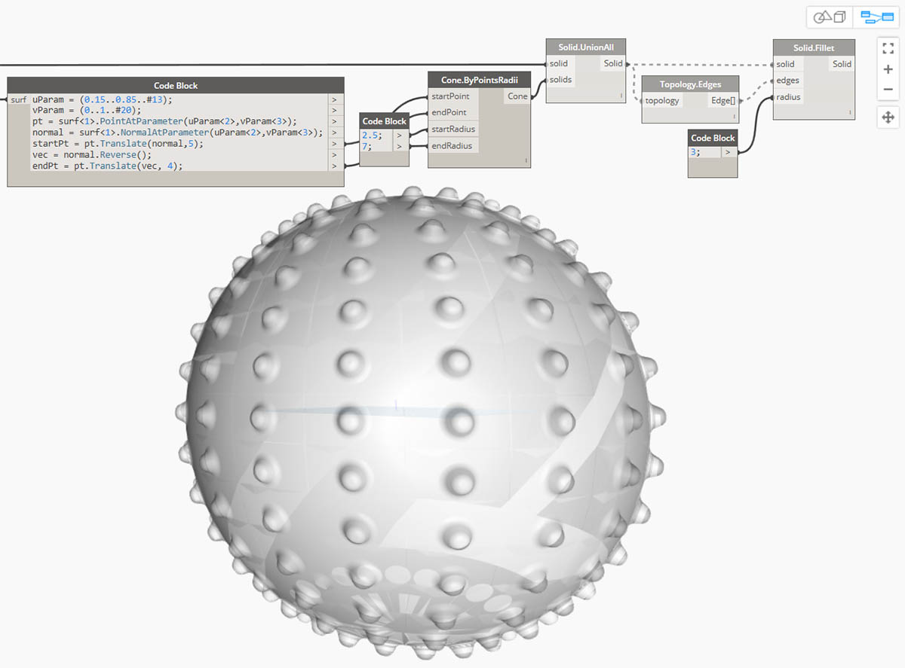
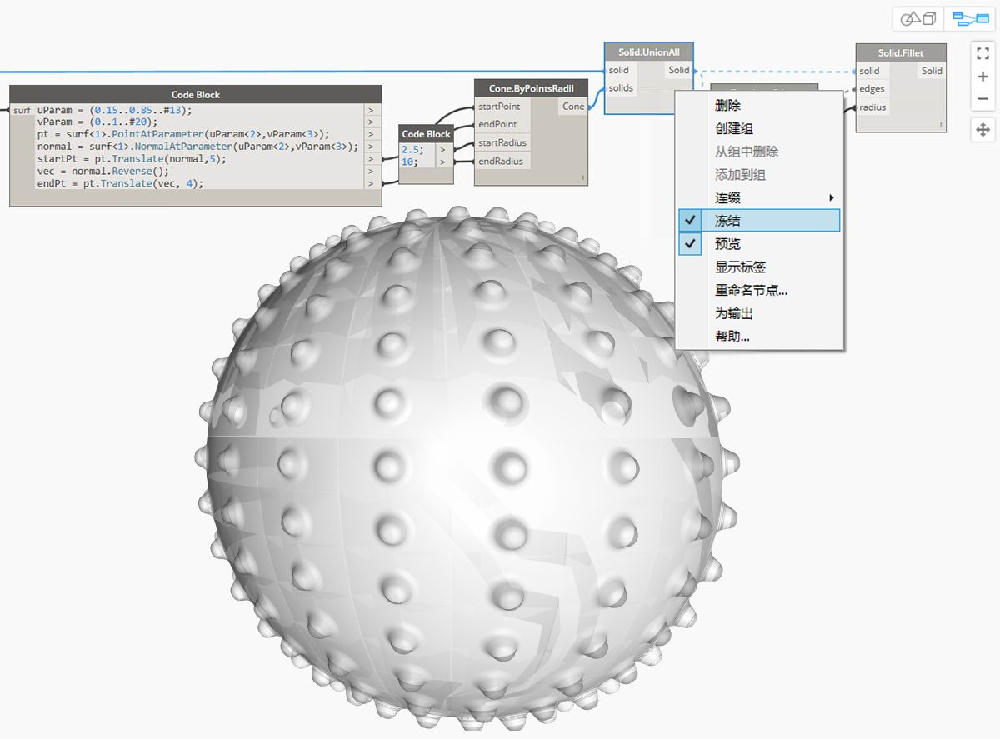

## 实体

如果我们要构建无法从单个曲面创建的更复杂模型，或者如果要定义明确的体积，我们现在必须进入到实体（和多边形曲面）领域。即使简单的立方体也足够复杂，需要六个曲面，每个面一个。实体可用于访问曲面所没有的两个关键概念 - 更加优化的拓扑描述（面、边、顶点）和布尔操作。

### 什么是实体？

实体由一个或多个曲面组成，这些曲面包含通过定义“内”或“外”的闭合边界进行定义的体积。无论这些曲面有多少，它们都必须形成“无间隙”体积才能视为实体。可以通过将曲面或多边形曲面连接在一起，或者使用放样、扫掠和旋转等操作来创建实体。球体、立方体、圆锥体和圆柱体基本体也是实体。至少删除了一个面的立方体视为多边形曲面，它具有一些类似的属性，但它不是实体。

> 1. 平面由单个曲面组成，而且不是实体。
2. 球体由一个曲面组成，但*是*实体。
3. 圆锥体由两个连接在一起以形成实体的曲面组成。
4. 圆柱体由三个连接在一起以形成实体的曲面组成。
5. 立方体由六个连接在一起以形成实体的曲面组成。

### 拓扑

实体由三种类型的元素组成：顶点、边和面。面是组成实体的曲面。边是定义相邻面之间的连接的曲线，顶点是这些曲线的起点和终点。可以使用拓扑节点查询这些元素。

> 1. 面
2. 边
3. 顶点

### 操作

可以通过对实体的边进行圆角或倒角操作来修改实体，以消除锐角和角度。倒角操作可在两个面之间创建规则曲面，而圆角可在面之间过渡以保持相切。

> 1. 实体立方体
2. 倒角立方体
3. 圆角立方体

### 布尔运算

实体布尔运算是用于合并两个或两个以上实体的方法。单个布尔操作实际上意味着执行四项操作：

1. 与两个或多个对象**相交**。
2. 在交点处**分割**它们。
3. **删除**几何体中不需要的部分。
4. 重新**连接**所有内容。

这使实体布尔成为一个强大的省时过程。有三种实体布尔运算，它们可区分保留几何体的哪些部分。

> 1. **并集：**删除实体的重叠部分，并将它们合并为单个实体。
2. **差集：**从一个实体中减去另一个实体。要减去的实体称为工具。请注意，您可以切换哪个实体是保留反向体积的工具。
3. **交集：**仅保留两个实体的相交体积。

除了这三项操作，Dynamo 还具有 **Solid.DifferenceAll** 和 **Solid.UnionAll** 节点，用于对多个实体执行差集和并集操作。

> 1. **UnionAll：**使用球体和朝外的圆锥体进行并集操作
2. **DifferenceAll：**使用球体和朝内圆锥体时的差集运算

让我们使用几个布尔操作来创建一个尖球。

> 1. **Sphere.ByCenterPointRadius**：创建基本体。
2. **Topology.Faces**、**Face.SurfaceGeometry**：查询实体的面并转换为曲面几何体（在本例中，球体仅有一个面）。
3. **Cone.ByPointsRadius**：使用曲面上的点构造圆锥体。
4. **Solid.UnionAll**：使圆锥体和球体合并。
5. **Topology.Edges**：查询新实体的边
6. **Solid.Fillet**：对尖球的边进行圆角处理
> 下载此图像随附的示例文件（单击鼠标右键，然后单击“将链接另存为...”）。可以在附录中找到示例文件的完整列表。[Geometry for Computational Design - Solids.dyn](datasets/5-6/Geometry for Computational Design - Solids.dyn)

### 冻结

布尔运算很复杂，计算速度可能很慢。使用“冻结”功能可暂停选定节点和受影响的下游节点的执行。

> 使用快捷上下文菜单可冻结“实体并集”操作

> 选定节点和所有下游节点将以浅灰色重影模式预览，并且受影响的线将显示为虚线。受影响的几何体预览也将生成重影。现在，您可以在上游修改值，而无需计算布尔并集。

> 要解冻节点，请单击鼠标右键，然后取消选中“冻结”。

> 所有受影响的节点和关联的几何体预览将更新并还原为标准预览模式。

