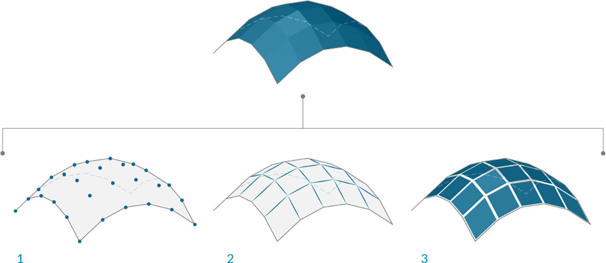

## 网格

在计算建模领域，网格是表示三维几何图形的最普遍形式之一。网格几何图形可以轻巧灵活地替代 NURBS，并且网格广泛用于从渲染和可视化到数字制造和三维打印的各种领域。

### 什么是网格？

网格是表示曲面或实体几何图形的四边形和三角形的集合。像实体一样，网格对象的结构包括顶点、边和面。还有一些使网络独一无二的特性，例如法线。



> 1. 网格顶点
2. 网格边 *仅具有一个邻接面的边称为“裸边”。所有其他边均为“装饰边”
3. 网格面

### 网格元素

Dynamo 使用“面-顶点”数据结构定义网格。在最基本的层次上，此结构只是分组为多边形的点集。网格的点称为“顶点”，而类似曲面的多边形称为“面”。要创建网格，我们需要一列顶点和将这些顶点分组为面的系统（称为“索引组”）。


> 1. 顶点列表
2. 用于定义面的索引组列表

#### 顶点 + 顶点法线

网格的顶点只是一列点。在构建网格或获取网格结构的相关信息时，顶点的索引非常重要。对于每个顶点，还有一个相应的顶点法线（向量），它描述了附加面的平均方向，并帮助我们了解网格的“入”和“出”方向。


> 1. 顶点
2. 顶点法线

#### 面

面是由三个或四个顶点组成的有序列表。因此，根据要建立索引的顶点位置，网格面的“曲面”表示处于隐含状态。我们已经拥有构成网格的顶点列表，因此无需提供单独的点来定义面，只需使用顶点的索引即可。这样，我们还可以在多个面中使用同一顶点。


> 1. 使用索引 0、1、2 和 3 创建的四边形面
2. 使用索引 1、4 和 2 创建的三角形面 请注意，索引组可以按其顺序移动 - 只要该顺序按逆时针顺序排序，相应面将正确定义

### 网格与 NURBS 曲面

网格几何图形与 NURBS 几何图形有何不同？何时可能要使用其中一个而不是另一个？

#### 参数化

在前一章中，我们看到 NURBS 曲面由一系列沿两个方向的 NURBS 曲线进行定义。这些方向标记为 ```U``` 和 ```V```，并允许根据二维曲面域对 NURBS 曲面进行参数化。曲线本身作为方程存储在计算机中，从而允许将生成的曲面计算为任意小的精度。但是，将多个 NURBS 曲面组合在一起可能会非常困难。连接两个 NURBS 曲面将生成多重曲面，其中几何图形的不同部分将具有不同的 UV 参数和曲线定义。


> 1. 曲面
2. 等参（等参线）曲线
3. 曲面控制点
4. 曲面控制多边形
5. 等参点
6. 曲面框架
7. 网格
8. 裸边
9. 网格网络
10. 网格边
11. 顶点法线
12. 网格面/网格面法线

另一方面，网格由许多离散的精确定义的顶点和面组成。顶点网络通常无法通过简单的 ```UV``` 坐标进行定义；并且由于面是离散的，因此精度量内置到网格中，只能通过优化网格和添加更多面来进行更改。由于缺少数学描述，因此网格可以更灵活地处理单个网格内的复杂几何图形。

### 局部影响与全局影响

另一个重要区别是网格或 NURBS 几何图形中的局部更改影响整个形状的程度。移动网格的一个顶点只会影响与该顶点相邻的面。在 NURBS 曲面中，影响范围更加复杂，具体取决于曲面的阶数以及控制点的权重和结。但通常，在 NURBS 曲面中移动单个控制点会在几何图形中产生更平滑、更广泛的更改。


> 1. NURBS 曲面 - 移动控制点具有延伸到形状上的影响
2. 网格几何图形 - 移动顶点仅对相邻图元有影响

一个可能有用的类比是将向量图像（由直线和曲线组成）与光栅图像（由各个像素组成）进行比较。如果放大向量图像，曲线将保持清晰明了，而放大光栅图像的结果是看到各个像素变大。在此类比中，可以将 NURBS 曲面与向量图像进行比较，因为存在平滑的数学关系，而网格的行为与具有设定分辨率的光栅图像类似。

### Mesh Toolkit

Dynamo 的网格功能可通过安装 [Mesh Toolkit](https://github.com/DynamoDS/Dynamo/wiki/Dynamo-Mesh-Toolkit) 软件包进行扩展。Dynamo Mesh Toolkit 包提供了多种工具，可从外部文件格式输入网格、从 Dynamo 几何图形对象创建网格，以及按顶点和索引手动构建网格。该库还提供了一些工具，可用于修改网格、修复网格或提取水平切片以在制造中使用。

有关使用 Mesh Toolkit 的示例，请参见第 10.2 章。


