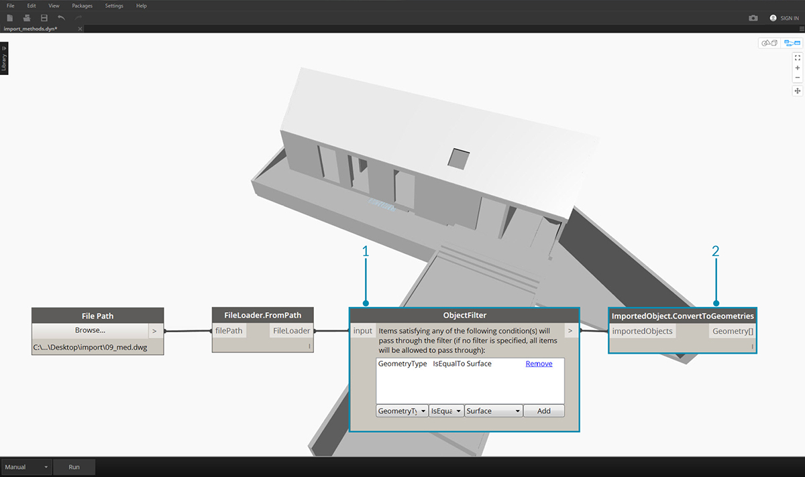
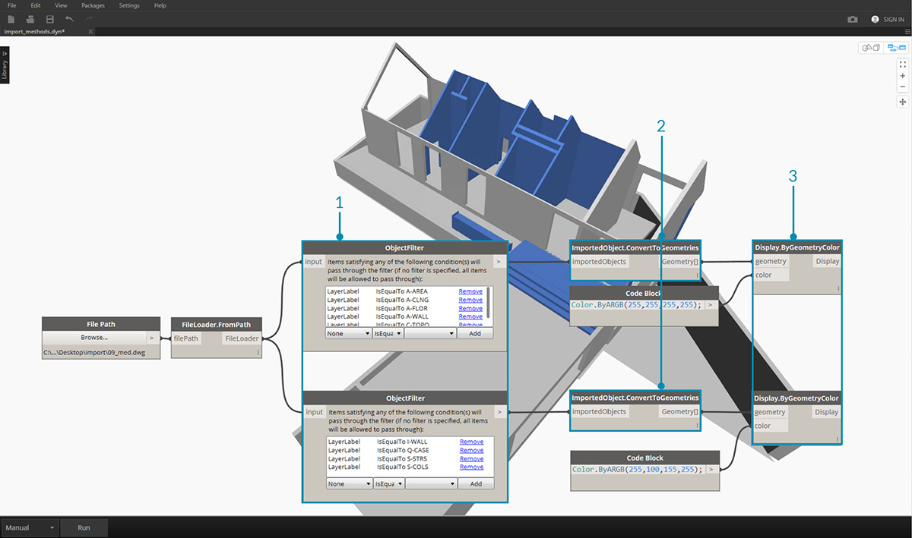

## 导入几何体

有多种方法可以将几何体导入 Dynamo。我们已在上一节中演示了使用 *Mesh Toolkit* 导入网格 - 我们还可以从 .SAT 文件导入实体模型。通过这些流程，我们可以在其他平台中开发几何体，将其加载到 Dynamo 中，并通过可视化编程应用参数化操作。

导入几何体的另一种方法是使用称为*“ATF 平移”*的过程。在本例中，我们不仅可以导入几何体，还可以导入文件的结构。例如，我们可以选择要导入哪些 .DWG 图层，而不是导入整个模型。我们将在下面对此进行详细介绍。

### 从 DWG 文件导入几何体

用于将 DWG 导入 Dynamo 环境的节点位于*“转换”*选项卡下（注意：这些工具仅在 [Dynamo Studio](http://www.autodesk.com/products/dynamo-studio/overview) 中可用）。以下示例显示了一系列组件，用于浏览文件、导入文件内容，以及将其转换为可用的 Dynamo 几何体。Dynamo 还使我们能够过滤和选择要从 DWG 文件导入的特定对象 - 我们将在下面进行演示。有关从 DWG 文件导入几何体的详细信息，请阅读此处 Ben Goh 的[博客帖子](http://dynamobim.org/dwg-import-in-dynamo-studio-0-9-1/)。

### 获取导入的对象

将 DWG 导入 Dynamo Studio 的最简单方法是将整个文件导入到工作空间：

> 1. 使用“File Path”组件浏览要导入到 Dynamo 的 DWG 文件。
2. 连接到 **FileLoader.FromPath** 以读取文件。
3. 使用 **FileLoader.GetImportedObjects** 组件将几何体解析到 Dynamo Studio。
4. **ImportedObject.ConvertToGeometries** 会将对象转换为 Dynamo 工作空间中可用的几何体。

如上图所示，DWG 文件中所有类型的几何体（曲面、网格、曲线和线）都将导入 Dynamo。

### 对象过滤器

要指定从 DWG 文件导入哪些几何体，可以向定义中添加其他 **ObjectFilter** 节点。**ObjectFilter** 节点与 **FileLoader** 或 **ImportedObject** 列表兼容，并输出 **ImportedObject** 列表。

下图显示了每个 **ObjectFilter** 节点内的条件语句。满足任何所列条件的 **ImportedObject** 都将通过过滤器。过滤可以基于图层标签（即图层名称）、几何体类型、漫射颜色等，并且可与其他过滤器结合使用来优化选择。

> 1. 将 **FileLoader.GetImportedObjects** 替换为 **ObjectFilter** 以搜索 DWG 文件中的特定条件。- 在这种情况下，将仅导入曲面几何体，从而删除在上一图像中可见的所有曲线和直线几何体。
2. 将过滤器连接到 **ImportedObject.ConvertToGeometries** 以导入过滤后的几何体。

通过添加两个具有不同条件语句的过滤器，我们可以将几何体列表分为多个流：

> 1. 将 **FileLoader.GetImportedObjects** 替换为不同条件语句的两个 **ObjectFilter** 模块。这会将几何体从一个文件分离到两个不同的流。
2. 将过滤器连接到 **ImportedObject.ConvertToGeometries** 以导入过滤后的几何体。
3. 将 **ImportedObject.ConvertToGeometries** 连接到**Display.ByGeometryColor**，以便以不同的颜色可视化每个流。

### 显式对象选择

**ObjectSelector** 节点为我们提供了一种从 DWG 文件导入对象的替代方法。无需使用过滤器，此方法使我们能够专门选择将哪些对象和图层导入 Dynamo。

> 1. 将 **FileLoader.GetImportedObjects** 替换为**ObjectSelector**，以调用 DWG 文件中的特定图层和对象。
2. 将过滤器连接到 **ImportedObject.ConvertToGeometries**。

