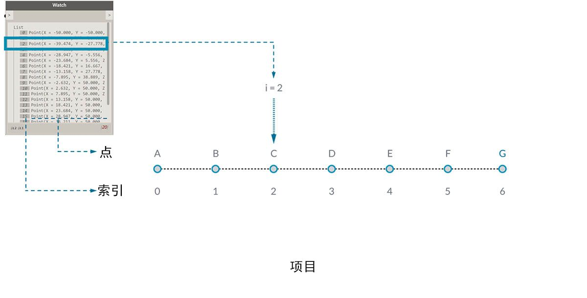
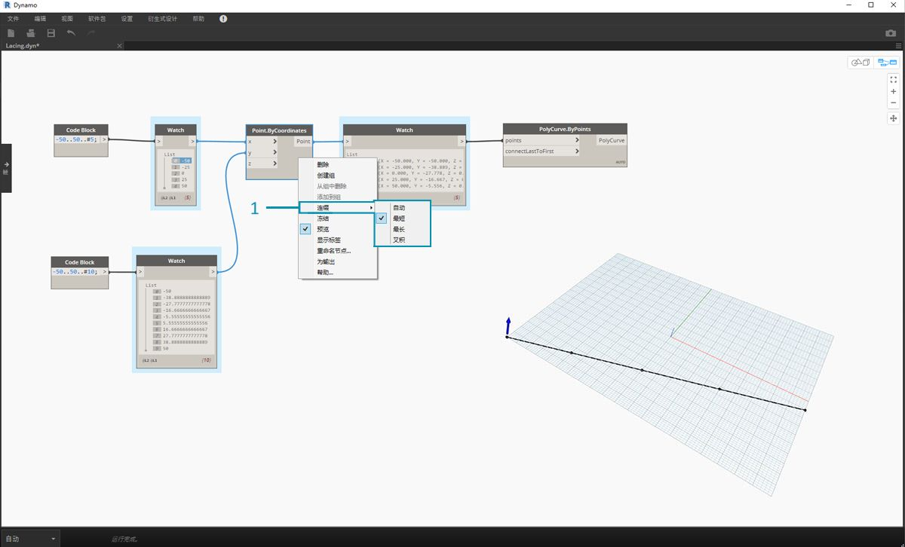
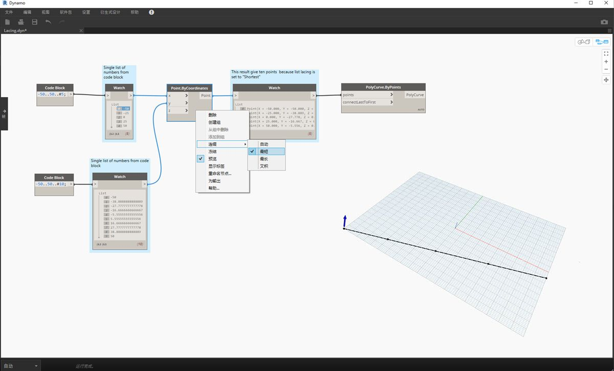
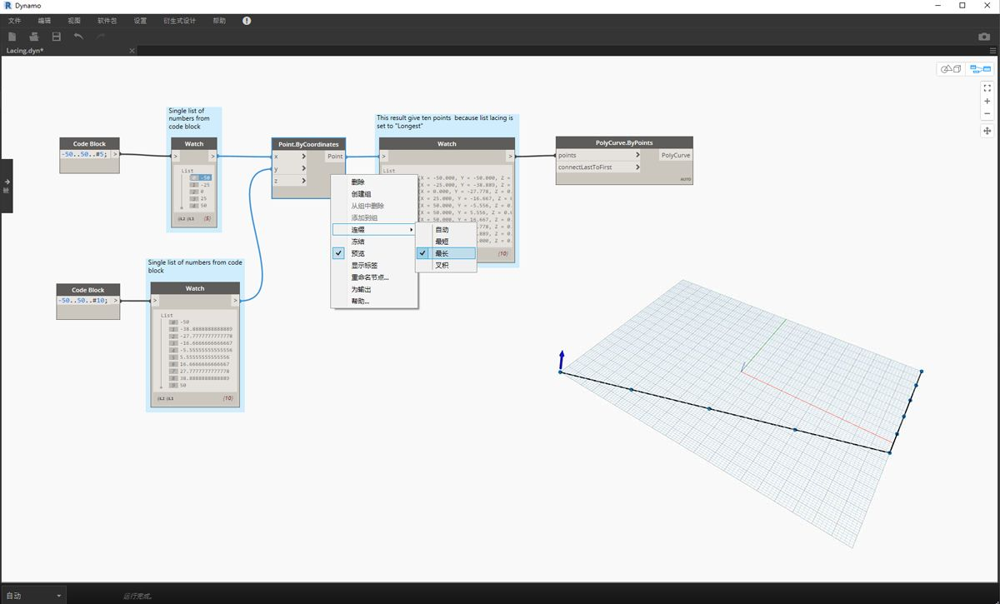
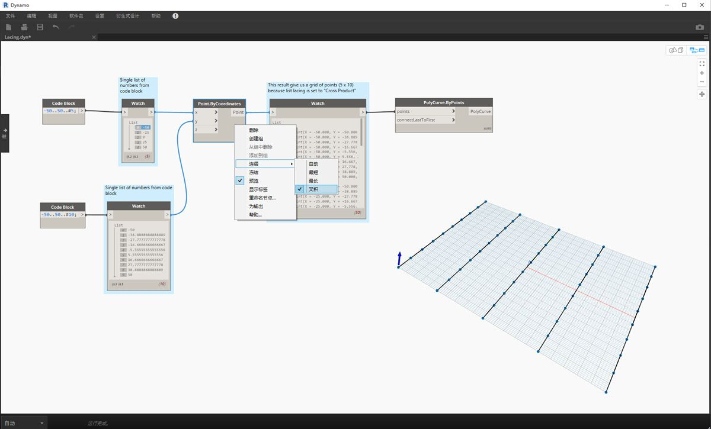

## 什么是列表？

列表是元素或项目的集合。以一串香蕉为例。每个香蕉都是列表（或串）中的一个项目。拾取一串香蕉比单独拾取每个香蕉要容易得多，同样适用于通过数据结构中的参数化关系对元素进行分组。

> 照片由 [Augustus Binu](https://commons.wikimedia.org/wiki/File:Bananas_white_background_DS.jpg?fastcci_from=11404890&c1=11404890&d1=15&s=200&a=list) 提供。

当我们购买生活用品时，我们会将所有购买物品放入一个袋子中。这个袋子也是一个列表。如果我们要制作香蕉面包，需要 3 束香蕉（我们要制作*许多*香蕉面包）。袋子表示一列香蕉串，每串表示一列香蕉。袋子是一列列表（二维），香蕉是一个列表（一维）。

在 Dynamo 中，会对列表数据进行排序，并且每个列表中第一项的索引均为“0”。下面，我们将讨论如何在 Dynamo 中定义列表以及如何将多个列表相互关联。

## 基于零的索引

乍看起来可能有些奇怪的是，列表的第一个索引始终为 0，而不是 1。因此，当我们谈论列表的第一项时，实际上是指对应于索引 0 的项。

例如，如果要计算我们右手的手指数，则很有可能您的计数是 1 到 5。但是，如果要将手指放入列表，Dynamo 会为其指定索引 0 到 4。尽管这对于编程初学者来说似乎有些奇怪，但是从零开始的索引是大多数计算系统中的标准做法。

请注意，列表中仍有 5 个项目；只是列表使用的是基于零的计数系统。而且，列表中存储的项目并不仅限于数字。它们可以是 Dynamo 支持的任何数据类型，例如点、曲线、曲面、族等。

通常，查看列表中存储的数据类型的最简单方法是将观察节点连接到另一个节点的输出。默认情况下，观察节点自动将所有索引显示在列表的左侧，并在右侧显示数据项。

这些索引是使用列表时的关键元素。

### 输入和输出

与列表相关，输入和输出因使用的 Dynamo 节点而异。例如，我们使用一列 5 个点，并将该输出连接到两个不同的 Dynamo 节点：*PolyCurve.ByPoints* 和 *Circle.ByCenterPointRadius*：

> 1. *PolyCurve.ByPoints* 的*点*输入正在查找*“Point[]”*。这表示一列点。
2. *PolyCurve.ByPoints* 的输出是基于一列五个点所创建的单个 PolyCurve。
3. *Circle.ByCenterPointRadius* 的 *centerPoint* 输入要求提供*“点”*。
4. *Circle.ByCenterPointRadius* 的输出是一列五个圆，其中心与点的原始列表相对应。

*PolyCurve.ByPoints* 和 *Circle.ByCenterPointRadius* 的输入数据相同，但 Polycurve 节点会提供一条复合线，而 Circle 节点会提供 5 个圆（中心位于每个点处）。直观地讲，这很有意义：将复合线绘制为连接 5 个点的曲线，而圆在每个点处创建不同的圆。数据发生了什么变化？

将光标悬停在 *Polycurve.ByPoints* 的*点*输入上，我们会看到输入正在查找*“Point[]”*。请注意末端的括号。这表示一列点，并且要创建复合线，输入需要每个复合线是一个列表。因此，该节点会将每个列表压缩为一个复合线。

另一方面，*Circle.ByCenterPointRadius* 的 *centerPoint* 输入要求提供*“点”*。此节点会查找一个点作为项目，以定义圆的圆心。这就是我们基于输入数据获得五个圆的原因。在 Dynamo 中识别输入的这些差异有助于在管理数据时更好地了解节点的运行方式。

### 连缀

在没有清晰解决方案的情况下，数据匹配会是一个问题。当节点有权访问不同大小的输入时，就会发生这种情况。更改数据匹配算法可能会导致结果差异极大。

设想在各点之间创建线段的节点 (Line.ByStartPointEndPoint)。它将有两个输入参数，两个输入参数均提供点坐标：

如您所见，我们可以通过不同的方式在这些点集之间绘制直线。通过在某个节点的中心上单击鼠标右键并选择“连缀”菜单，即可找到连缀选项。

### 基础文件

> 下载本练习随附的示例文件（单击鼠标右键，然后单击“将链接另存为...”）：[Lacing.dyn](datasets/6-1/Lacing.dyn)。可以在附录中找到示例文件的完整列表。

为了演示下面的连缀操作，我们将使用此基础文件定义最短列表、最长列表和叉积。

> 1. 我们将更改 *Point.ByCoordinates* 上的连缀，但不会更改有关上图的其他任何内容。

#### 最短列表

最简单的方法是逐一连接输入，直到其中一个流运行干。这称为“最短列表”算法。这是 Dynamo 节点的默认行为：

> 通过将连缀更改为*“最短列表”*，我们得到一条由五个点组成的基本对角线。五个点是较小列表的长度，因此最短列表连缀在到达一个列表的末尾后即停止。

#### 最长列表

“最长列表”算法会一直连接输入、重用元素，直到所有流都流干为止：

> 通过将连缀更改为*“最长列表”*，我们得到一条垂直延伸的对角线。采用与概念图相同的方法，将重复该列表的 5 个项目中的最后一项，以达到较长列表的长度。

#### 叉积

最后，“叉积”方法可以建立所有可能的连接：

> 通过将连缀更改为*“叉积”*，我们得到每个列表之间的每个组合，从而获得 5x10 点栅格。这是与上述概念图中所示的叉积等效的数据结构，但数据现在是一列列表。通过连接复合线，我们可以看到每个列表均由其 X 值定义，从而得到一行垂直线。

