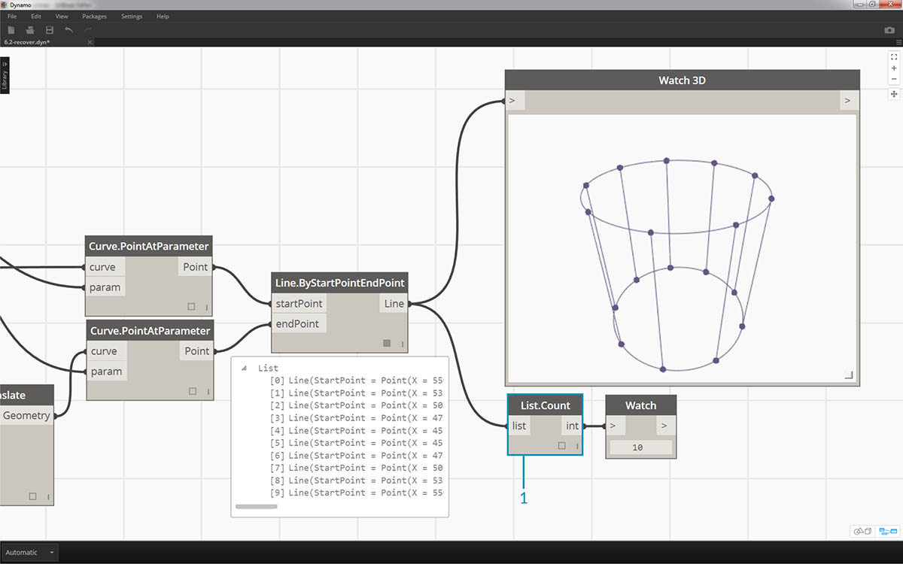
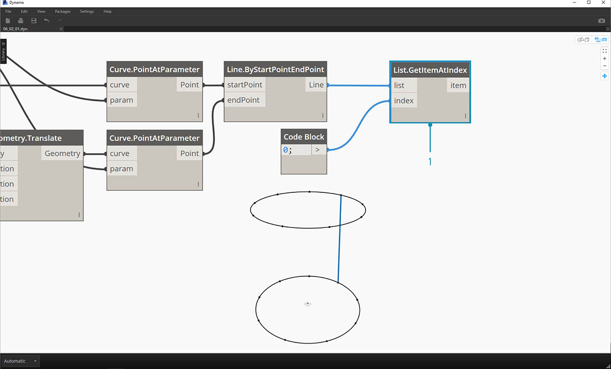
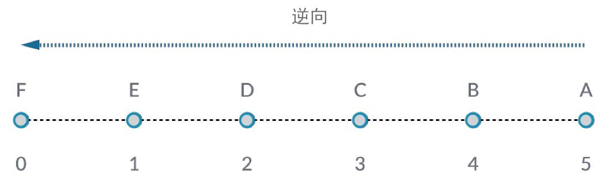
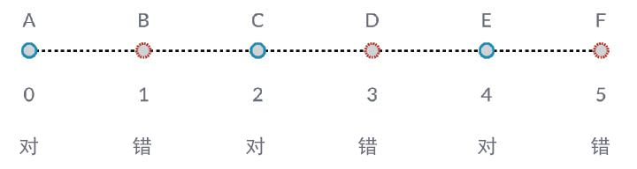

## 使用列表

既然我们已经建立了列表，那么让我们来介绍如何对它执行操作。将一个列表想象为一副纸牌。一副纸牌即是列表，每张纸牌表示一个项目。


> 照片由 [Christian Gidlöf](https://commons.wikimedia.org/wiki/File:Playing_cards_modified.jpg) 提供

我们可以在列表中进行哪些**查询**?这将访问现有特性。

* 一副纸牌中纸牌的张数？52.
* 玩家人数？4.
* 材料？ 纸。
* 长度？3.5" 或 89mm。
* 宽度？2.5" 或 64mm。

我们可以对列表执行哪些**操作**?这将基于给定操作更改列表。

* 我们可以洗牌。
* 我们可以按值对一副纸牌进行排序。
* 我们可以按玩家对一副纸牌进行排序。
* 我们可以拆分一副纸牌。
* 我们可以通过发牌来划分一副纸牌。
* 我们可以选择一副纸牌中某张特定纸牌。

上面列出的所有操作都有类似 Dynamo 节点来用于处理常规数据列表。下面的课程将演示可以对列表执行的一些基本操作。

## 列表操作

下图是我们将用于演示基本列表操作的基本图形。我们将探讨如何管理列表中的数据，并演示可视结果。

#### 练习 - 列表操作

> 下载本练习随附的示例文件（单击鼠标右键，然后单击“将链接另存为...”）：[List-Operations.dyn](datasets/6-2/List-Operations.dyn)。可以在附录中找到示例文件的完整列表。


> 1. 从*代码块*开始，值为 ```500;```
2. 连接到 *Point.ByCoordinates* 节点的 *x* 输入。
3. 将上一步中的节点连接到 *Plane.ByOriginNormal* 节点的原点输入。
4. 使用 *Circle.ByPlaneRadius* 节点，将上一步中的节点连接到平面输入。
5. 使用*代码块*，为*半径*指定值 ```50;```。这是我们将创建的第一个圆。
6. 使用 *Geometry.Translate* 节点，将圆沿 Z 方向向上移动 100 个单位。
7. 使用*代码块*节点，通过以下一行代码定义一个介于 0 和 1 之间包含十个数字的范围：```0..1..#10;```
8. 将上一步中的代码块连接到两个 *Curve.PointAtParameter* 节点的 *param* 输入。将 *Circle.ByPlaneRadius* 插入到顶部节点的曲线输入，并将 *Geometry.Translate* 连接到其下节点的曲线输入。
9. 使用 *Line.ByStartPointEndPoint*，连接两个 *Curve.PointAtParameter* 节点。


> 1. *Watch3D* 节点会显示 *Line.ByStartPointEndPoint* 的结果。我们要在两个圆之间绘制直线来表示基本列表操作，并将使用此基本 Dynamo 图形来逐步介绍下面的列表操作。

### List.Count


> *List.Count* 节点简单明了：它计算列表中值的数量，并返回该数量。随着我们使用列表的列表，此节点会变得更加微妙，但我们会在接下来的各部分中进行演示。

#### 练习 - List.Count

> 下载本练习随附的示例文件（单击鼠标右键，然后单击“将链接另存为...”）：[List-Count.dyn](datasets/6-2/List-Count.dyn)。可以在附录中找到示例文件的完整列表。



> 1. *List.Count* 节点会返回 *Line.ByStartPointEndPoint* 节点中线的数量。在本例中，该值为 10，表示与从原始*代码块*节点创建的点数一致。

### List.GetItemAtIndex


> *List.GetItemAtIndex* 是用于查询列表中项的基本方法。在上图中，我们使用*“2”*索引来查询标记为*“C”*的点。

#### 练习 - List.GetItemAtIndex

> 下载本练习随附的示例文件（单击鼠标右键，然后单击“将链接另存为...”）：[List-GetItemAtIndex.dyn](datasets/6-2/List-GetItemAtIndex.dyn)。可以在附录中找到示例文件的完整列表。



> 1. 使用 *List.GetItemAtIndex* 节点，我们选择索引*“0”*或线列表中的第一项。
2. *Watch3D* 节点显示我们已选择了一条线。注意：要得到上图，请务必禁用 *Line.ByStartPointEndPoint* 的预览。

### List.Reverse



> *List.Reverse* 可反转列表中所有项的顺序。

#### 练习 - List.Reverse

> 下载本练习随附的示例文件（单击鼠标右键，然后单击“将链接另存为...”）：[List-Reverse.dyn](datasets/6-2/List-Reverse.dyn)。可以在附录中找到示例文件的完整列表。


> 1. 要正确显示反转的线列表，请通过将代码块更改为 ```0..1..#100;``` 来创建更多线
2. 在 *Curve.PointAtParameter* 和 *Line.ByStartPointEndPoint* 之间插入 *List.Reverse* 节点，以获得其中一个点列表。
3. *Watch3D* 节点显示了两个不同的结果。第一个显示没有反向列表的结果。这些线垂直连接到相邻点。但是，反转列表会将所有点以相反顺序连接到其他列表。

### List.ShiftIndices


> *List.ShiftIndices* 是适用于创建扭曲或螺旋图案或者任何其他类似数据操作的工具。此节点会将列表中的项目移动给定数量的索引。

#### 练习 - List.ShiftIndices

> 下载本练习随附的示例文件（单击鼠标右键，然后单击“将链接另存为...”）：[List-ShiftIndices.dyn](datasets/6-2/List-ShiftIndices.dyn)。可以在附录中找到示例文件的完整列表。


> 1. 在与反转列表相同的过程中，将 *List.ShiftIndices* 插入到 *Curve.PointAtParameter* 和 *Line.ByStartPointEndPoint* 中。
2. 使用*代码块*，指定值为*“1”*以将列表移动一个索引。
3. 请注意，更改很细微，但在连接到另一组点时，较低 *Watch3D* 节点中的所有线都已移动一个索引。


> 1. 例如，通过将*代码块*更改为较大值（*“30”*），我们注意到对角线存在明显差异。在本例中，该移动类似于照相机的光圈，从而以原始圆柱形式创建扭曲。

### List.FilterByBooleanMask



> *List.FilterByBooleanMask* 将基于布尔值列表移除某些项目，或通过读取“true”或“false”值来移除某些项目。

#### 练习 - List.FilterByBooleanMask

> 下载本练习随附的示例文件（单击鼠标右键，然后单击“将链接另存为...”）：[List-FilterByBooleanMask.dyn](datasets/6-2/List-FilterByBooleanMask.dyn)。可以在附录中找到示例文件的完整列表。


> 为了创建读取“true”或“false”的值列表，我们需要做更多的工作...

> 1. 使用*代码块*，通过以下语法定义一个表达式：```0..List.Count(list);```。将 *Curve.PointAtParameter* 节点连接到 *list* 输入。我们将在代码块章节中详细介绍此设置，但本例中的该行代码会为我们提供一个列表，该列表表示 *Curve.PointAtParameter* 节点的每个索引。
2. 使用*“%”*（求模）节点，将*代码块*的输出连接到 *x* 输入，将值 *4* 连接到 *y* 输入。当将索引列表除以 4 时，这将为我们提供余数。求模节点对于创建图案而言确实非常有用。所有值将读取为 4 的可能余数：0、1、2、3。
3. 在*求模*节点中，我们知道值为 0 意味着索引是 4 的倍数（0、4、8，依此类推）。通过使用*“==”*节点，我们可以针对值*“0”*对其进行测试，以测试其可除性。
4. *Watch* 节点仅显示以下情况：我们有一个“true/false”模式，其读取：*true,false,false,false...*。
5. 使用此 true/false 模式，连接到两个 *List.FilterByBooleanMask* 节点的遮罩输入。
6. 将 *Curve.PointAtParameter* 节点连接到 *List.FilterByBooleanMask* 的每个列表输入。
7. *Filter.ByBooleanMask* 的输出读取*“in”*和*“out”*。*“In”*表示遮罩值为*“true”*的值，而*“out”*表示值为*“false”*的值。通过将*“in”*输出连接到 *Line.ByStartPointEndPoint* 节点的 *startPoint* 和 *endPoint* 输入，我们创建了过滤后的线列表。
8. *Watch3D* 节点显示线数少于点数。通过仅过滤 true 值，我们仅选择了 25% 的节点！

