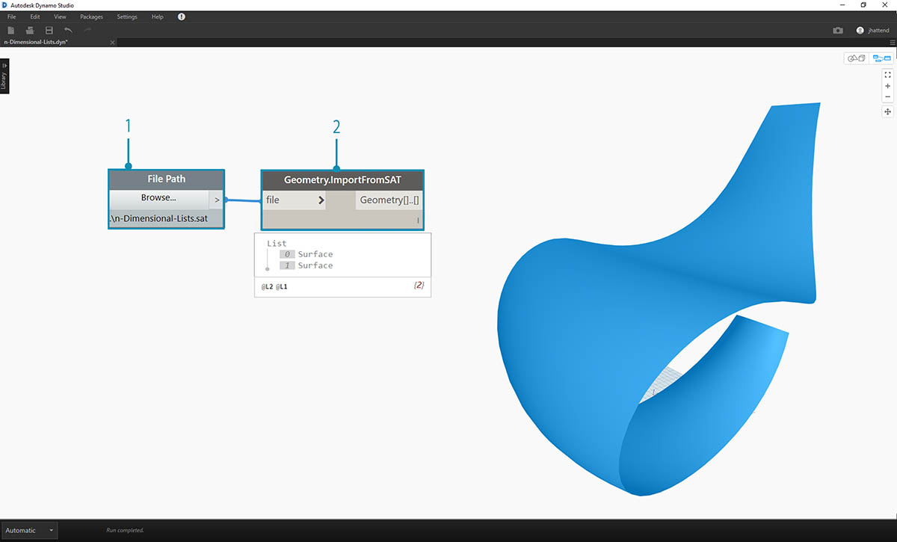
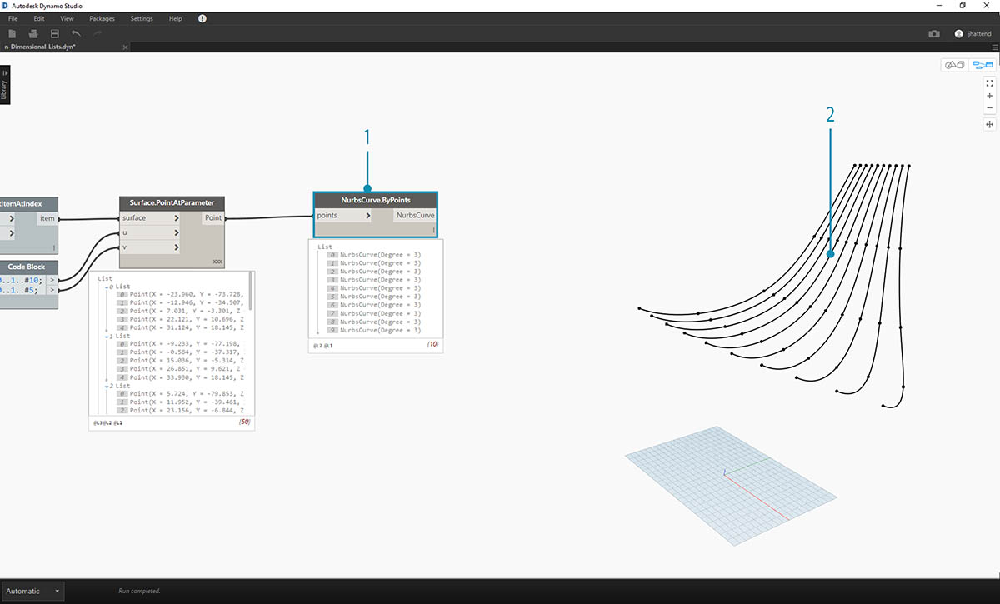
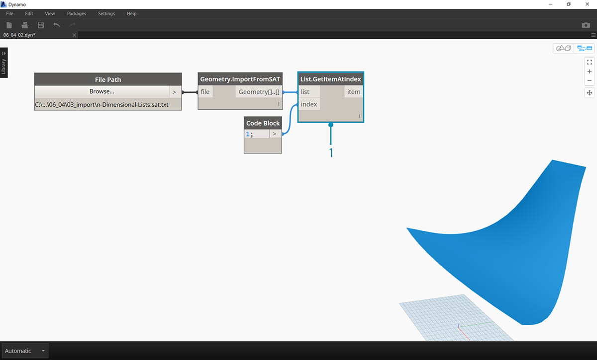
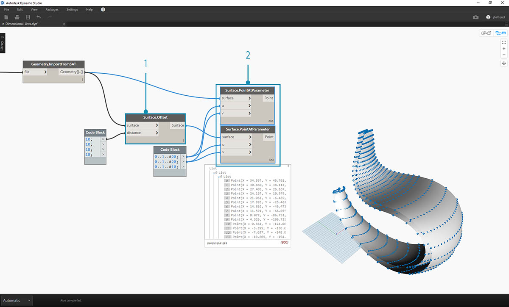
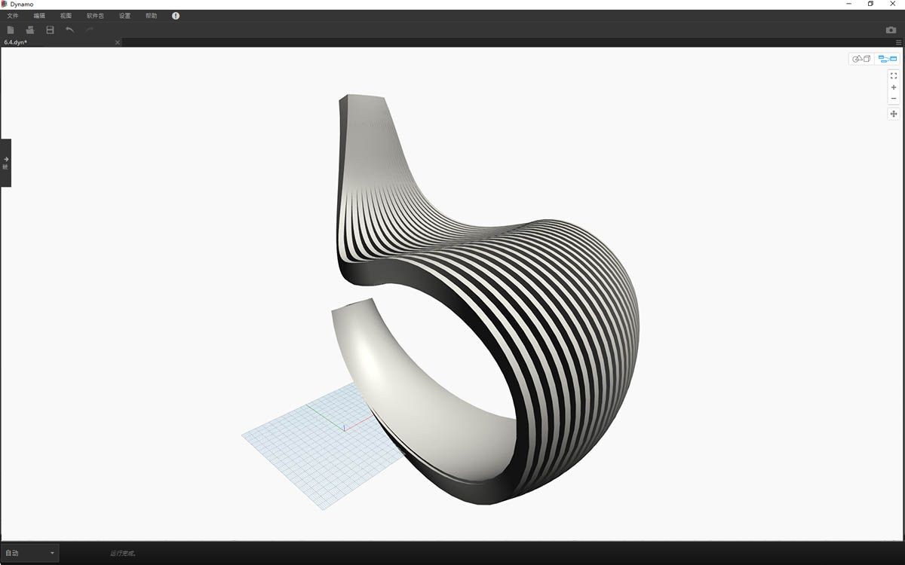
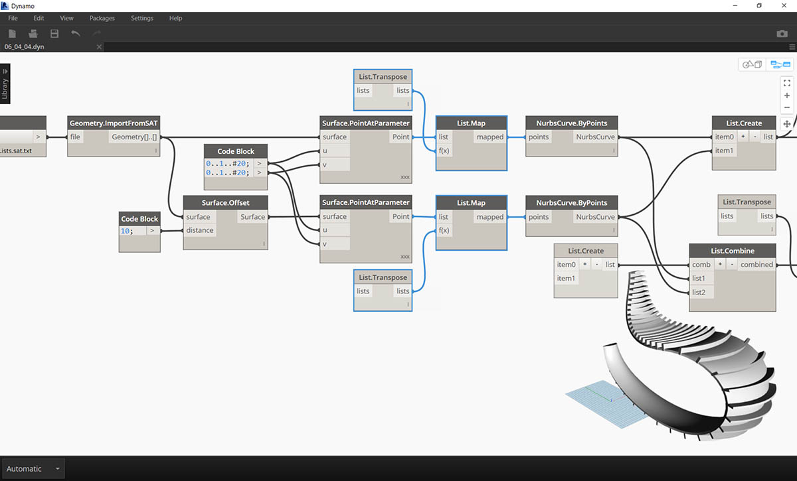
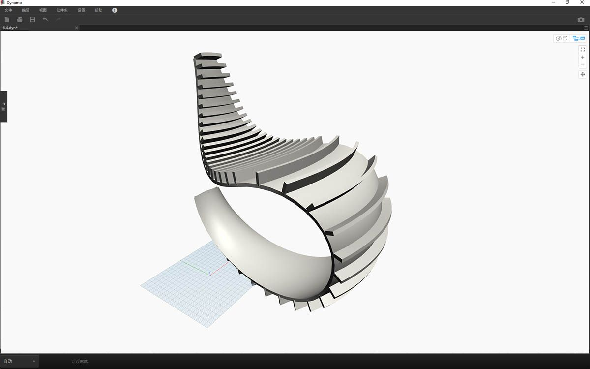

## n 维列表

再往下钻，让我们为层次结构添加更多层。数据结构可以扩展到远超二维列表的列表。由于列表是 Dynamo 中的项目，而且它们本身也是项目，因此我们可以创建尽可能多维的数据。

我们将在此处使用的类比是俄罗斯套娃。每个列表可视为一个包含多个项的容器。每个列表都有自己的属性，也被视为自己的对象。


> 一组俄罗斯套娃（照片由 [Zeta](https://www.flickr.com/photos/beppezizzi/145493363) 提供）是 n 维列表的类比。每个层表示一个列表，每个列表在其中包含项目。在 Dynamo 的情况下，每个容器内可以有多个容器（表示每个列表的项目）。

n 维列表很难用直观的方式进行解释，但是我们在本章中设置了一些练习，这些练习着重于处理超出二维范围的列表。

## 映射和组合

映射无疑是 Dynamo 中数据管理最复杂的部分，并且在处理列表的复杂层次结构时尤其重要。在下面的一系列练习中，我们将演示在数据变为多维时何时使用映射和组合。

在上一节中，可以找到 List.Map 和 List.Combine 的初步介绍。在下面的最后一个练习中，我们将对复杂数据结构使用这些节点。

### 练习 - 二维列表 - 基本

> 下载本练习随附的示例文件（单击鼠标右键，然后单击“将链接另存为...”）。可以在附录中找到示例文件的完整列表。
1.[n-Dimensional-Lists.dyn](datasets/6-4/n-Dimensional-Lists.dyn) 
2.[n-Dimensional-Lists.sat](datasets/6-4/n-Dimensional-Lists.sat)

本练习是三个练习中的第一个，侧重于阐述输入的几何图形。本系列练习中的每个部分都将增加数据结构的复杂性。



> 1. 让我们从练习文件文件夹中的 .sat 文件开始。我们可以使用*“文件路径”(File Path)* 节点抓取此文件。
2. 使用 *Geometry.ImportFromSAT*，该几何图形将作为两个曲面输入到 Dynamo 预览中。


> 在本练习中，我们希望保持简单并处理其中一个曲面。

> 1. 让我们选择索引 *1* 以抓取上方曲面。我们使用 *List.GetItemAtIndex* 节点来执行此操作。


> 下一步是将曲面分割为点栅格。

> 1. 使用*代码块*，插入以下两行代码：
```
0..1..#10;
0..1..#5;
```

2. 使用 *Surface.PointAtParameter*，将两个代码块值连接到 *u* 和 *v*。将此节点的*连缀*更改为*“叉积”*。
3. 输出显示数据结构，这在 Dynamo 预览中也可见。



> 1. 要了解数据结构的组织方式，我们将 *NurbsCurve.ByPoints* 连接到 *Surface.PointAtParameter* 的输出。
2. 注意，我们有十条曲线沿曲面垂直延伸。


> 1. 基本 *List.Transpose* 将翻转一列列表的列和行。
2. 通过将 *List.Transpose* 的输出连接到 *NurbsCurve.ByPoints*，我们现在得到五条曲线在整个曲面上水平延伸。

### 练习 - 二维列表 - 高级

让我们增加复杂性。假定我们要对上一个练习中创建的曲线执行操作。也许，我们希望将这些曲线与其他曲面相关联，并在它们之间进行放样。这需要更加注意数据结构，但基本逻辑是相同的。



> 1. 从上一练习的步骤开始，使用 *List.GetItemAtIndex* 节点隔离已输入几何图形的上曲面。


> 1. 使用 *Surface.Offset*，将曲面偏移值 *10*。


> 1. 按照与上一练习相同的方式，使用以下两行代码定义*代码块*：
```
0..1..#10;
0..1..#5;
```

2. 将这些输出连接到两个 *Surface.PointAtParameter* 节点，每个节点的*连缀*设置为*“叉积”*。其中一个节点连接到原始曲面，而另一个节点连接到偏移曲面。


> 1. 与上一练习中一样，将输出连接到两个 *NurbsCurve.ByPoints* 节点。
2. Dynamo 预览中显示与两个曲面对应的两条曲线。


> 1. 通过使用 *List.Create*，我们可以将两组曲线合并为一列列表。
2. 在输出中注意到，我们有两个列表，每个列表包含十个项目，分别表示每个 NURBS 曲线的连接集。
3. 通过执行 *Surface.ByLoft*，我们可以直观地了解此数据结构。该节点将放样每个子列表中的所有曲线。


> 1. 通过使用 *List.Transpose*，请记住，我们将翻转所有列和行。此节点会将两列（每个列表十条曲线）转换为十列（每个列表两条曲线）。现在，我们得到与另一个曲面上的相邻曲线相关的每条 NURBS 曲线。
2. 使用 *Surface.ByLoft*，我们得到一个带肋的结构。


> 1. 除 *List.Transpose* 之外，还可以使用 *List.Combine*。这将对每个子列表运算*“连结符”*。
2. 在本例中，我们使用 *List.Create* 作为*“连结符”*，这将在子列表中创建每个项目的列表。
3. 使用 *Surface.ByLoft* 节点，我们得到与上一步中相同的曲面。在这种情况下，转置更容易使用，但当数据结构变得更加复杂时，*List.Combine* 更加可靠。


> 1. 如果要切换带肋结构中曲线的方向，请后退几步，我们需要先使用 List.Transpose，然后再连接到 *NurbsCurve.ByPoints*。这将翻转列和行，从而得到 5 个水平加强筋。

### 练习 - 三维列表

现在，我们将更进一步。在本练习中，我们将使用两个输入的曲面，从而创建复杂的数据层次结构。尽管如此，我们的目标是使用相同的基础逻辑来完成相同的操作。


> 1. 从上一练习中输入的文件开始。


> 1. 与上一练习中一样，使用 *Surface.Offset* 节点按值 *10* 进行偏移。
2. 在输出中注意到，我们创建了两个具有偏移节点的曲面。



> 1. 按照与上一练习相同的方式，使用以下两行代码定义代码块：
```
0..1..#20;
0..1..#10;
```

2. 将这些输出连接到两个 *Surface.PointAtParameter* 节点，每个节点的连缀设置为*“叉积”*。其中一个节点连接到原始曲面，而另一个节点连接到偏移曲面。


> 1. 与上一练习中一样，将输出连接到两个 *NurbsCurve.ByPoints* 节点。
2. 查看 *NurbsCurve.ByPoints* 的输出，注意到这是一列两个列表，比上一练习更复杂。数据按基础曲面分类，因此我们为结构化数据添加了另一个层级。
3. 请注意，*Surface.PointAtParameter* 节点中的对象变得更加复杂。在本例中，我们得到一列列表（其中每个元素也是一个列表）。


> 1. 使用 *List.Create* 节点，我们将 NURBS 曲线合并为一个数据结构，从而创建一列列表（其中每个元素也是一个列表）。
2. 通过连接 *Surface.ByLoft* 节点，我们得到原始曲面的版本，因为它们各自保留在由原始数据结构创建的自己列表中。


> 1. 在上一练习中，我们能够使用 *List.Transpose* 创建带肋结构。这在此处不起作用。对二维列表应使用转置，但由于我们有三维列表，因此“翻转列和行”操作不会像之一样轻松。请记住，列表是对象，因此 *List.Transpose* 将翻转包含子列表的列表，但不会将 NURBS 曲线在层次结构中进一步向下翻转一个列表。


> 1. *List.Combine* 在此处将更加适用。当访问更复杂的数据结构时，我们要使用 *List.Map* 和 *List.Combine* 节点。
2. 使用 *List.Create* 作为*“连结符”*，我们可以创建一个数据结构，使其更加适用。


> 1. 数据结构仍需要在层次结构上向下转置一步。为此，我们将使用 *List.Map*。除了使用一个输入列表（而不是两个或更多）之外，这类似于使用 *List.Combine*。
2. 我们将应用于 *List.Map* 的函数是 *List.Transpose*，这将翻转主列表中子列表的列和行。


> 1. 最后，我们可以结合使用正确的数据层次结构放样 NURBS 曲线，从而提供带肋结构。


> 1. 让我们使用 *Surface.Thicken* 节点为几何图形添加一些深度。


> 1. 最好在此结构中后退两步添加曲面，以便将使用 *List.GetItemAtIndex* 来从以前步骤的放样曲面中选择后曲面。


> 1. 加厚这些选定曲面，完成连接。



> 这不是有史以来最舒适的摇椅，但还会进行大量数据处理。



> 最后一步，我们反转带条纹成员的方向。如在上一练习中使用转置一样，我们将在此处执行类似操作。

> 1. 由于我们在层次结构中还有一层级，因此我们需要将 *List.Map* 与 *List.Tranpose* 函数一起使用来更改 NURBS 曲线的方向。


> 1. 我们可能希望增加踏板数，因此可以将代码块更改为
```
0..1..#20;
0..1..#10;
```



> 摇椅的第一个版本很流畅，因此我们的第二个模型提供了越野、运动多功能版本的靠背。

