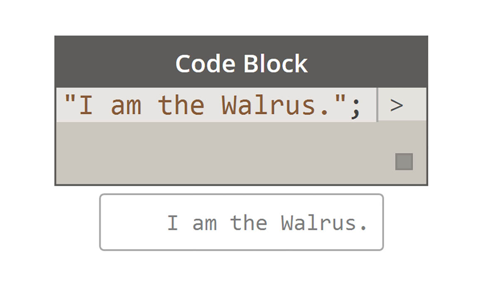
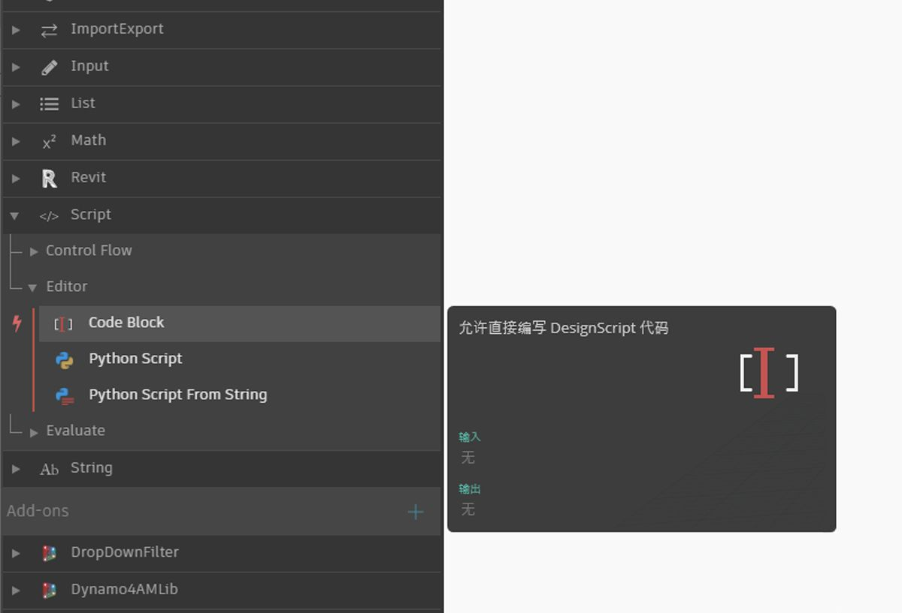

## 什么是代码块？

代码块是深入 Dynamo 的核心编程语言 DesignScript 的窗口。从头进行构建的 DesignScript 可支持探索式设计工作流，它是一种可读且简明的语言，既可提供对少量代码的即时反馈，也可扩展到大型和复杂交互。DesignScript 还构成引擎的支柱，该引擎推动 Dynamo 的大部分方面“处于底层”。由于在 Dynamo 节点和交互中找到的几乎所有功能都与脚本语言有一对一关系，因此有独特的机会在基于节点的交互和脚本之间以流畅的方式进行移动。对于初学者，节点可以自动转换为文本语法以帮助学习 DesignScript，或者只是缩小图形较大部分的大小。这是使用“节点到代码”过程完成的，在[“DesignScript 语法”部分](7-2_Design-Script-syntax.md)中会详细介绍该过程。有经验的用户可以使用代码块创建现有功能的自定义映射，并使用许多标准编码范例创建用户编写的关系。在初学者和高级用户之间，有大量可加快设计速度的快捷方式和代码段。虽然对于非程序员来说，术语“代码块”可能有点令人畏惧，但它既易于使用又功能强大。初学者可以高效地使用代码块（最少编码），高级用户可以定义脚本化定义以在 Dynamo 定义中的其他位置重新调用。

### 代码块：简要概述

简而言之，代码块是可视化脚本环境中的文本脚本界面。它们可以用作数字、字符串、公式和其他数据类型。代码块专为 Dynamo 设计，因此用户可以在代码块中定义任意变量，这些变量会自动添加到节点的输入：

使用代码块，用户可以灵活地确定如何指定输入。以下是通过坐标创建基点的几种不同方法 *(10, 5, 0)*：

了解了库中的更多可用函数时，您甚至会发现键入“Point.ByCoordinates”比在库中搜索和查找正确的节点更快。比如，键入*“Point.”时，*Dynamo 将显示可能应用于点的函数列表。这使脚本更加直观，有助于了解如何在 Dynamo 中应用函数。

### 创建代码块节点

代码块可以在*“核心”>“输入”>“操作”>“代码块”*中找到。但是速度更快，只需双击画布，即可显示代码块。此节点经常被使用，因此赋予其完全双击权限。

### 数字、字符串和公式

代码块在数据类型方面也很灵活。用户可以快速定义数字、字符串和公式，且代码块将提供所需的输出。

在下图中，您可以看到“旧学校”的操作方法有点长：用户在界面中搜索预期节点、将节点添加到画布，然后输入数据。使用代码块，用户可以双击画布来调出节点，然后使用基本语法键入正确的数据类型。

> *数字*、*字符串*和*公式*节点是三个 Dynamo 节点示例，这些节点相较于*代码块*无疑是过时的。

