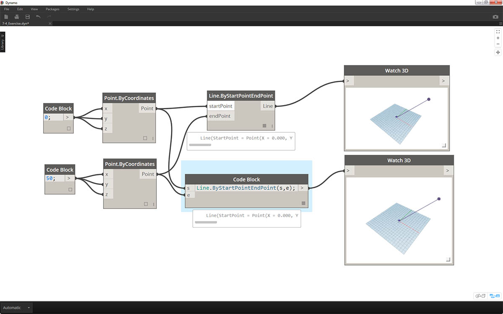
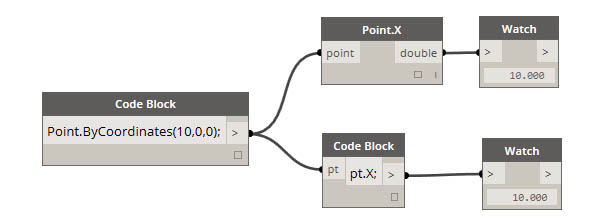
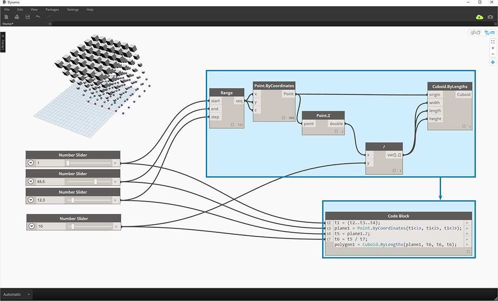
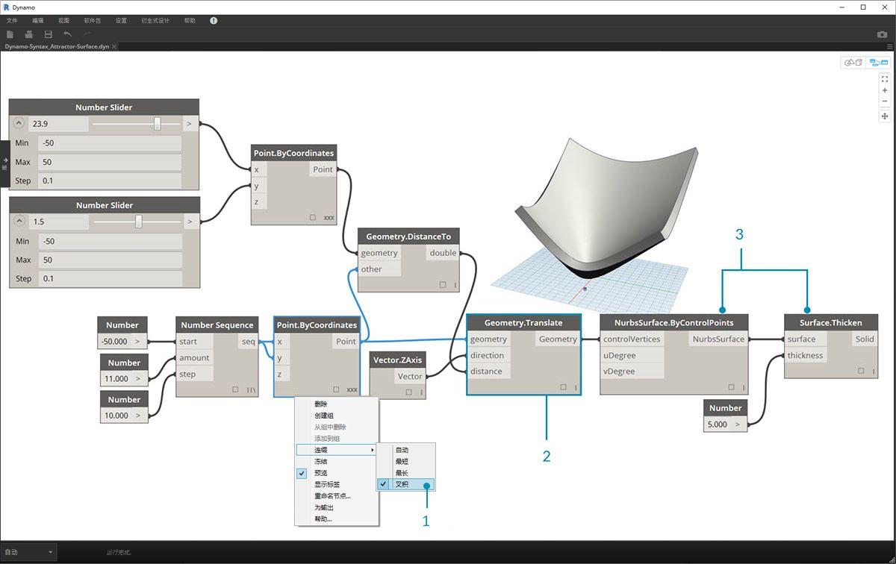
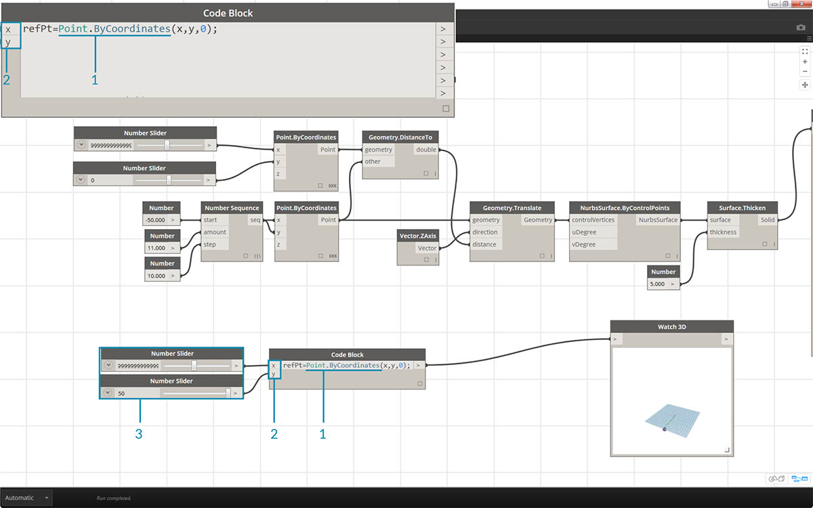
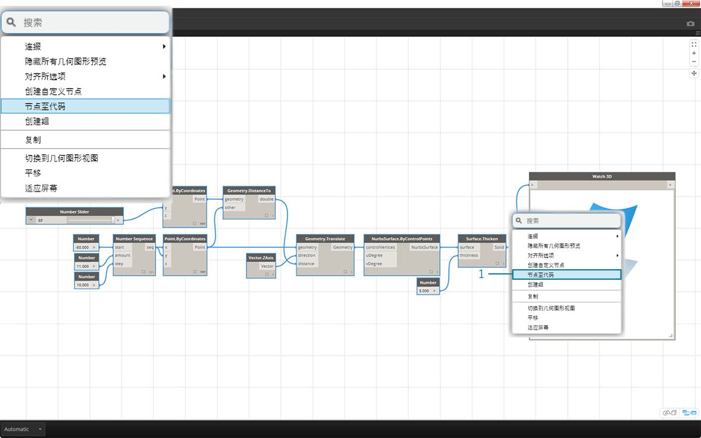

## DesignScript 语法

您可能已注意到 Dynamo 中节点名称的共同主题：每个节点使用*“.”*语法，而不使用空格。这是因为每个节点顶部的文字表示脚本编写的实际语法和*“.”*（或*点符号*）将元素与我们可调用的可能方法分隔开。这样即可轻松地将可视化脚本编写转换为基于文字的脚本编写。


作为点符号的一般类比，我们如何在 Dynamo 中处理参数化苹果？以下是我们在决定食用苹果之前将对苹果运行的几种方法。（注意：这些不是实际的 Dynamo 方法）：

|人类可读|点符号|输出|
| -- | -- | -- |
|苹果是什么颜色？|Apple.color|red|
|苹果成熟了吗？|Apple.isRipe|true|
|苹果的重量是多少？|Apple.weight|6 oz.|
|苹果来自哪里？|Apple.parent|树|
|苹果创建什么？|Apple.children|种子|
|这个苹果是本地种植的吗？|Apple.distanceFromOrchard|60 mi.|

我不了解您，但是从上表中的输出来看，这看起来像一只美味的苹果。我想我会 *Apple.eat()* 它。

### 代码块中的点符号

考虑到苹果的类比，让我们看一下 *Point.ByCoordinates*，并说明如何使用代码块创建点：


> *代码块*语法 ```Point.ByCoordinates(0,10);``` 与 Dynamo 中的 *Point.ByCoordinates* 节点提供的结果相同，但我们能够使用一个节点创建点。这相较于将单独的节点连接到*“X”*和*“Y”*更加高效。

> 1. 通过在代码块中使用 *Point.ByCoordinates*，我们指定输入的顺序与现成节点 *(X,Y)* 相同。

### 调用节点

只要节点不是特殊的*“UI”节点*（具有特殊用户接口功能的节点），即可通过代码块调用库中的任何常规节点。例如，可以调用 *Circle.ByCenterPointRadius*，但调用 *Watch 3D* 节点并没有什么意义。

常规节点（库中的大多数）通常有三种类型：

* **创建** - 创建（或构造）对象
* **操作** - 对某个对象执行操作
* **查询** - 获取已存在对象的特性

您会发现库是按这些类别来组织的。在代码块内调用这三种类型的方法或节点时，它们的处理方式有所不同。


#### 创建

“创建”类别将从头开始构造几何图形。我们在代码块中从左到右输入值。这些输入与节点上从上到下的输入顺序相同：

> 比较 *Line.ByStartPointEndPoint* 节点和代码块中的对应语法，可得到相同的结果。

#### 操作

操作是对该类型的对象所执行的动作。Dynamo 使用许多编码语言通用的*点符号*，来对某个对象应用操作。确定操作对象后，键入一个点，然后键入操作的名称。与创建类方法一样，操作类方法的输入放置在圆括号中，只是您无需在相应节点上指定所见到的第一个输入。相反，我们指定要对其执行操作的元素：


> 1. *Point.Add* 节点是操作类节点，因此语法的作用略有不同。
2. 要添加给它的输入是 (1) *点*和 (2) *矢量*。在*代码块*中，我们已将点（对象）命名为*“pt”*。要将名为*“vec”*的矢量添加到*“pt”*，我们将写入 *pt.Add(vec)* 或：对象、点、操作。“添加”操作仅有一个输入，或 *Point.Add* 节点的所有输入减去第一个输入。*Point.Add* 节点的第一个输入是点本身。

#### 查询

查询类方法可获取对象的特性。由于对象本身是输入，因此不必再指定任何输入。无需输入圆括号。



### 那么连缀呢？

带节点的连缀与带代码块的连缀略有不同。使用节点，用户在相应节点上单击鼠标右键并选择要执行的连缀选项。使用代码块，用户可以更好地控制如何创建数据的结构。代码块简写方法使用*复制指南*，来设置多个一维列表应如何成对。尖括号“<>”中的数字定义所生成的嵌套列表的层次结构：<1>、<2>、<3> 等。


> 1. 在本示例中，我们使用简写来定义两个范围（更多简写位于本章的以下部分中）。简而言之，```0..1;``` 等同于 ```{0,1}```，```-3..-7``` 等同于 ```{-3,-4,-5,-6,-7}```。结果将生成由 2 个 X 值和 5 个 Y 值组成的列表。如果我们不对这些不匹配的列表使用复制指南，则会得到一列两点，即最短列表的长度。使用复制指南，我们可以找出 2 和 5 坐标的所有可能组合（或**“笛卡尔积”**）。
2. 使用语法 ```Point.ByCoordinates(x_vals<1>,y_vals<2>);```，可以得到**两个**列表，每个列表中包含**五个**项目。
3. 使用语法 ```Point.ByCoordinates(x_vals<2>,y_vals<1>);```，可以得到**五个**列表，每个列表中包含**两个**项目。

使用这种表示法，我们还可以指定哪个列表是主列表：2 个列表（每个列表 5 个项目）或 5 个列表（每个列表 2 个项目）。在该示例中，更改复制指南的顺序可在栅格中生成以下结果：一个列表（每个列表包含一行点）或一个列表（每个列表包含一列点）。

### 节点到代码

尽管上面的代码块方法可能需要一些时间来适应，但 Dynamo 中有一个名为“节点到代码”的功能，该功能可使该过程更加容易。要使用此功能，请在 Dynamo 图形中选择一组节点，在画布上单击鼠标右键并选择“节点到代码”。Dynamo 将这些节点以及所有输入和输出压缩到代码块中！这不仅是学习代码块的优秀工具，还支持您更高效地处理参数化 Dynamo 图形。我们将通过使用“节点到代码”来汇总下面的练习，因此不要错过它。



### 练习

> 下载本练习随附的示例文件（单击鼠标右键，然后单击“将链接另存为...”）。可以在附录中找到示例文件的完整列表。[Dynamo-Syntax_Attractor-Surface.dyn](datasets/7-2/Dynamo-Syntax_Attractor-Surface.dyn)

为了展现代码块的强大功能，我们将把现有的吸引器字段定义转换为代码块形式。使用现有定义演示代码块如何与可视化脚本编写相关联，有助于了解 DesignScript 语法。

> 首先，在上图中重新创建定义（或打开样例文件）。

> 1. 请注意，*Point.ByCoordinates* 上的连缀已设置为*“笛卡尔积”*。
2. 在 Z 方向上，栅格中的每个点均基于其距参照点的距离进行上移。
3. 曲面将重新创建并加厚，从而在几何图形中相对于距参照点的距离创建隆起。



> 1. 从起点开始，我们先定义参照点：```Point.ByCoordinates(x,y,0);```。我们使用与基于参照点节点指定的相同 *Point.ByCoordinates* 语法。
2. 变量 *x* 和 *y* 插入到代码块中，以便我们可以使用滑块动态地更新这些变量。
3. 将一些*滑块*添加到*代码块*输入（范围介于 *-50* 到 *50* 之间）。这样，我们就可以跨越默认的 Dynamo 栅格。


> 1. 在*代码块*的第二行中，我们定义简写来替换数字序列节点：```coordsXY = (-50..50..#11);```。我们将在下一节中详细介绍此内容。现在，请注意，此简写与可视化脚本中的*“数字序列”(Number Sequence)* 节点等效。


> 1. 现在，我们要基于 *coordsXY* 序列创建点栅格。为此，我们要使用 *Point.ByCoordinates* 语法，但还需要采用与在可视化脚本中相同的方式初始化列表的*笛卡尔积*。为此，我们键入以下行：```gridPts = Point.ByCoordinates(coordsXY<1>,coordsXY<2>,0);```。尖括号表示笛卡尔积参照。
2. 请注意，在 *Watch3D* 节点中，我们有一个点栅格穿过 Dynamo 栅格。


> 1. 现在，面临的棘手情形是：我们希望根据距参照点的距离向上移动点栅格。首先，我们调用这组新的点 *transPts*。由于平移是对现有元素的操作（而不是使用 ```Geometry.Translate...```），因此我们使用 ```gridPts.Translate```。
2. 从画布上的实际节点读取时，我们会看到有三个输入。由于我们要对该图元执行操作（使用 *gridPts.Translate*），所以已声明要平移的几何图形。其余两个输入将插入函数的圆括号中：*direction* 和 *distance*。
3. 方向足够简单，我们使用 ```Vector.ZAxis()``` 来沿垂直方向移动。
4. 参照点与每个栅格点之间的距离仍需进行计算，因此我们以相同方式对该参照点执行这一计算操作：```refPt.DistanceTo(gridPts)```
5. 代码的最后一行给出平移后的点：```transPts = gridPts.Translate(Vector.ZAxis(),refPt.DistanceTo(gridPts));```


> 1. 现在，我们得到具有相应数据结构的点栅格来创建 Nurbs 曲面。我们使用 ```srf = NurbsSurface.ByControlPoints(transPts);``` 构建曲面


> 1. 最后，要为曲面添加一些深度，我们使用 ```solid = srf.Thicken(5);``` 构建实体；在本例中，我们使用代码将曲面加厚 5 个单位，但我们始终可以将其声明为变量（例如，将它命名为 *thickness*），然后使用滑块控制该值。

### 使用“节点到代码”简化图形

“节点到代码”功能可自动执行我们只需单击按钮完成的整个练习。这不仅对于创建自定义定义和可重复使用的代码块来说是一项强大的功能，而且它对了解如何在 Dynamo 中编写脚本也是一个非常有用的工具：



> 1. 从练习的步骤 1 开始处理现有可视化脚本。选择所有节点，在画布上单击鼠标右键，然后选择*“节点到代码”*。就这么简单。


> Dynamo 具有基于可视化图的版本、连缀和所有功能自动执行的文字。对可视化脚本测试此功能，然后发布该代码块的功能！

