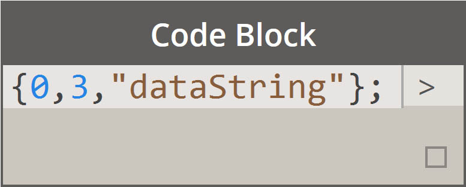
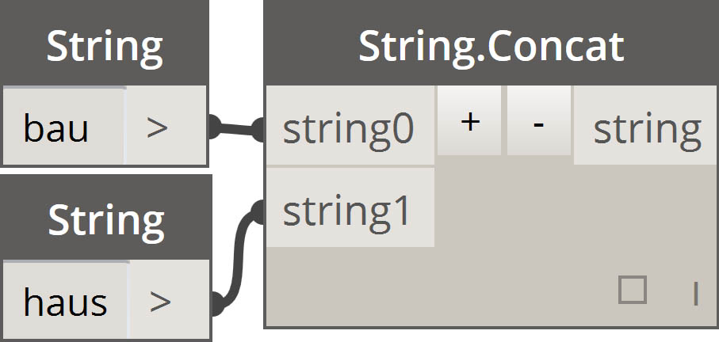
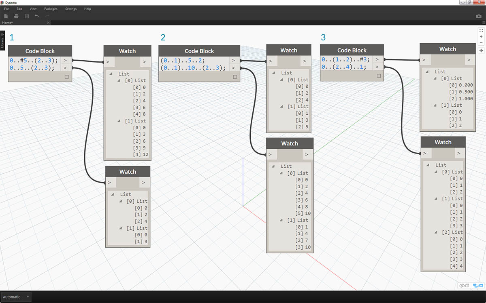
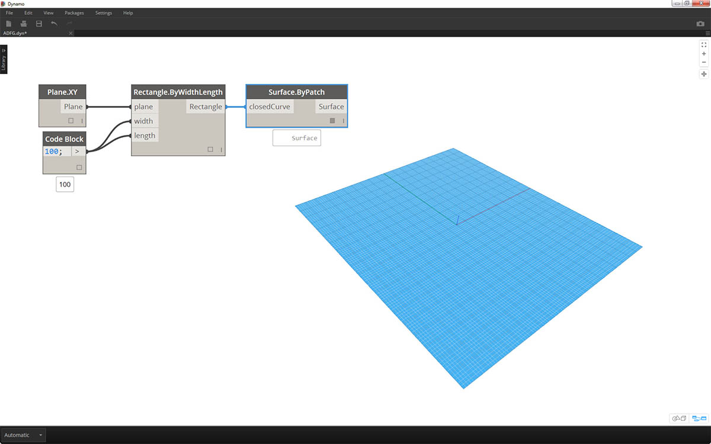

<style>
table{box-shadow: 2px 2px 2px #BBBBBB;max-width:75%;display:block;margin-left: auto;   margin-right: auto }
img{display:block;margin-left: auto;   margin-right: auto }
</style>

## 简写

简单来说，代码块中有一些基本的简写方法，这些方法使数据管理*更加*容易。我们将详细介绍下面的基础知识，并讨论如何使用此简写来创建和查询数据。

<table>
    <tr>
    <td width="50%"><b>数据类型(Data Type)</b></td>
    <td width="25%"><b>标准 Dynamo</b> </td>
    <td width="25%"><b>等效代码块</b></td>
  </tr>
  <tr>
    <td> 数字</td>
    <td></img> </td>
    <td></img></td>
  </tr>
  <tr>
    <td>字符串</td>
    <td></img> </td>
    <td></img></td>
  </tr>
  <tr>
    <td>序列</td>
    <td></img> </td>
    <td></img></td>
  </tr>
  <tr>
    <td>范围</td>
    <td></img> </td>
    <td></img></td>
  </tr>
  <tr>
    <td>获取索引处的项目</td>
    <td></img> </td>
    <td></img></td>
  </tr>
  <tr>
    <td>创建列表</td>
    <td></img> </td>
    <td></img></td>
  </tr>
  <tr>
    <td>连接字符串</td>
    <td></img> </td>
    <td></img></td>
  </tr>
  <tr>
    <td>条件语句</td>
    <td></img> </td>
    <td></img></td>
  </tr>
</table>

### 其他语法

|节点|等效代码块|注释|
| -- | -- | -- |
|任何运算符（+、&&、>=、Not 等）|+、&&、>=、! 等|请注意，“Not”变为“!”但该节点称为“Not”以区分“阶乘”|
|布尔值 True|true;|注意小写|
|布尔值 False|false;|注意小写|

### 范围

定义范围和序列的方法可缩减为基本简写。使用下图作为“..”语法的指导，以使用代码块定义数值数据列表。在完成此标记法后，创建数值数据是一个非常有效的过程：

> 1. 在此示例中，数字范围将替换为定义 ```beginning..end..step-size;``` 的基本代码块语法。通过数字表示，可以得到：```0..10..1;```
2. 请注意，语法 ```0..10..1;``` 等效于 ```0..10;```。步长 1 是简写符号的默认值。因此，```0..10;``` 将给出一个从 0 到 10 的序列（步长为 1）。
3. *数字序列*示例类似，除了我们使用*“#”*来指明我们希望列表中包含 15 个值，而不是列表中的最大值为 15。在本例中，我们如下定义：```beginning..#ofSteps..step-size:```。序列的实际语法为 ```0..#15..2```
4. 使用上一步中的*“#”*，现在将其放置在语法的*“step-size”*部分。现在，我们有一个*数字范围*，从*“beginning”*增长到*“end”*，*“step-size”*表示法指示在这两者之间均匀分布许多值：```beginning..end..#ofSteps```

### 高级范围

创建高级范围后，我们即可简单地处理列表的列表。在下面的示例中，我们将隔离主要范围表示法的变量，并创建该列表的另一个范围。

> 1. 创建嵌套范围，将带*“#”*的表示法与不带符号的表示法进行比较。相同逻辑在基本范围中都适用，但它稍显复杂。
2. 我们可以在主范围内的任意位置处定义子范围，请注意，我们也可以有两个子范围。
3. 通过控制范围中的*“end”*值，我们可以创建长度不同的更多范围。


> 作为逻辑练习，请比较上述两个简写，并尝试解析 *subranges* 和*“#”*表示法如何驱动结果输出。

### 生成列表并从列表中获取项目

除了使用简写生成列表外，我们还可以即时创建列表。这些列表可以包含多种元素类型，也可以进行查询（请记住，列表本身就是对象）。总之，在使用代码块的情况下，可以创建带大括号的列表（也称为“波形括号”），并从带括号（即“方括号”）的列表中查询项目：


> 1. 使用字符串快速创建列表，并使用项目索引进行查询。
2. 使用变量创建列表，并使用范围简写表示法进行查询。

管理嵌套列表的过程类似。请注意列表顺序，并使用多组方括号进行调用：


> 1. 定义一列列表。
2. 使用单括号表示法查询列表。
3. 使用双括号表示法查询项目。

### 练习

> 下载本练习随附的示例文件（单击鼠标右键，然后单击“将链接另存为...”）。可以在附录中找到示例文件的完整列表。[Obsolete-Nodes_Sine-Surface.dyn](datasets/7-3/Obsolete-Nodes_Sine-Surface.dyn)

在本练习中，我们将调整新的简写技能，以创建由范围和公式定义的精美蛋壳曲面。在本练习中，请注意我们如何串联使用代码块和现有 Dynamo 节点：我们将代码块用于繁重的数据提升，而 Dynamo 节点以可视方式布局来使定义清晰易读。



> 首先，通过连接上述节点创建曲面。请勿使用数字节点定义宽度和长度，只需双击画布，然后在代码块中键入 ```100;```。


> 1. 通过在代码块中键入 ```0..1..#50```，定义一个介于 0 和 1 之间的范围（其中包含 50 个划分）。
2. 将该范围连接到 *Surface.PointAtParameter*，该范围在曲面上提取介于 0 和 1 之间的 *u* 和 *v* 值。请记得通过在 *Surface.PointAtParameter* 节点上单击鼠标右键，将*“连缀”*更改为*“叉积”*。


> 在此步骤中，我们将使用第一个函数以在 Z 方向上上移动点栅格。此栅格将基于底层函数驱动生成的曲面。

> 1. 将可视节点添加到画布，如上图中所示。
2. 我们不使用公式节点，而是使用含有以下代码行的代码块：```(0..Math.Sin(x*360)..#50)*5;```。为了对此快速详细介绍，我们定义了一个内部带有公式的范围。此公式为正弦函数。在 Dynamo 中，正弦函数接收度数输入，因此为了获得完整正弦波，我们将*x* 值（这一范围输入介于 0 到 1 之间）乘以 *360*。接下来，我们希望每行都具有与控制栅格点相同数量的划分，因此我们用 *#50* 定义了 50 个细分。最后，乘数 5 只会增加平移幅度，因此我们可以在 Dynamo 预览中查看效果。


> 1. 虽然上一个代码块正常工作，但它并非完全参数化。我们希望动态驱动其参数，因此我们将上一步中的代码行替换为 ```(0..Math.Sin(x*360*cycles)..#List.Count(x))*amp;```。这使我们可以根据输入定义这些值。


> 1. 通过更改滑块（范围介于 0 到 10 之间），我们得到了一些有趣的结果。


> 1. 通过对数字范围执行转置，我们可以反转幕墙波的方向：```transposeList = List.Transpose(sineList);```


> 1. 如果添加 sineList 和 tranposeList，我们会得到一个扭曲的蛋壳曲面：```eggShellList = sineList+transposeList;```


> 1. 再次更改滑块，可以让我们平静地控制此算法的范围。


> 1. 最后，让我们使用代码块查询数据的隔离部分。要使用特定范围的点重新生成曲面，请在 *Geometry.Translate* 和 *NurbsSurface.ByPoints* 节点之间添加上述代码块。这有以下文本行：```sineStrips[0..15..1];```。这将选择前 16 行点（共 50 行）。通过重新创建曲面，可以查看我们生成了点栅格的隔离部分。


> 1. 在最后一步中，为了提高此代码块的参数化，我们使用介于 0 到 1 之间的滑块来驱动查询。我们使用以下代码行来执行此操作：```sineStrips[0..((List.Count(sineStrips)-1)*u)];```。这看起来可能会令人困惑，但代码行提供的方法让我们可以快速地将列表的长度缩放为 0 到 1 之间的乘数。


> 1. 滑块上的值 *.53* 可创建刚好经过栅格中点的曲面。


> 1. 如预期的一样，值为 *1* 的滑块会基于完整的栅格点创建曲面。


> 查看生成的可视图形，我们可以亮显代码块并查看其每个函数。

> 1. 第一个代码块替换 *Number* 节点。
2. 第二个代码块替换了 *Number Range* 节点。
3. 第三个代码块替换 *Formula* 节点（以及 *List.Transpose*、*List.Count* 和 *Number Range*）。
4. 第四个代码块查询一列列表，以便替换 *List.GetItemAtIndex* 节点。

