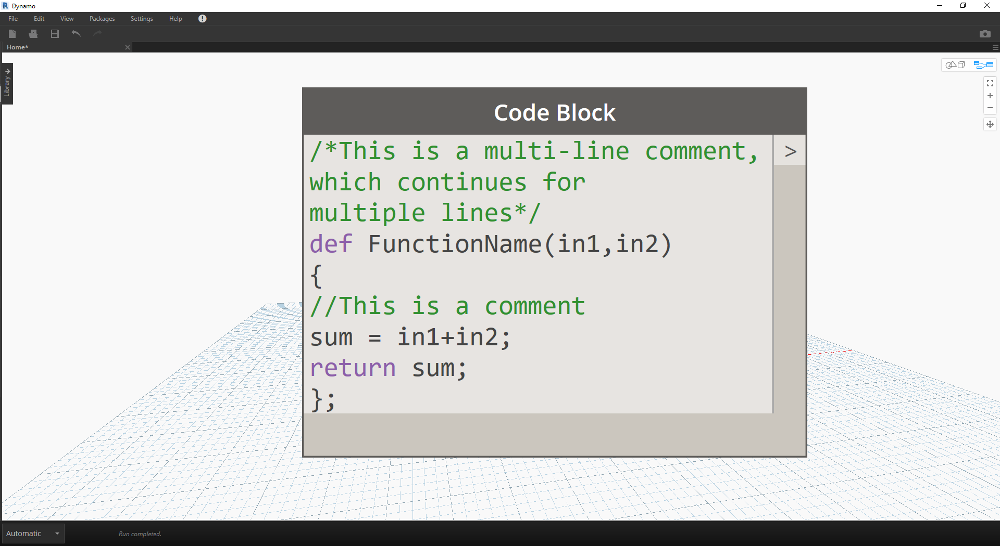
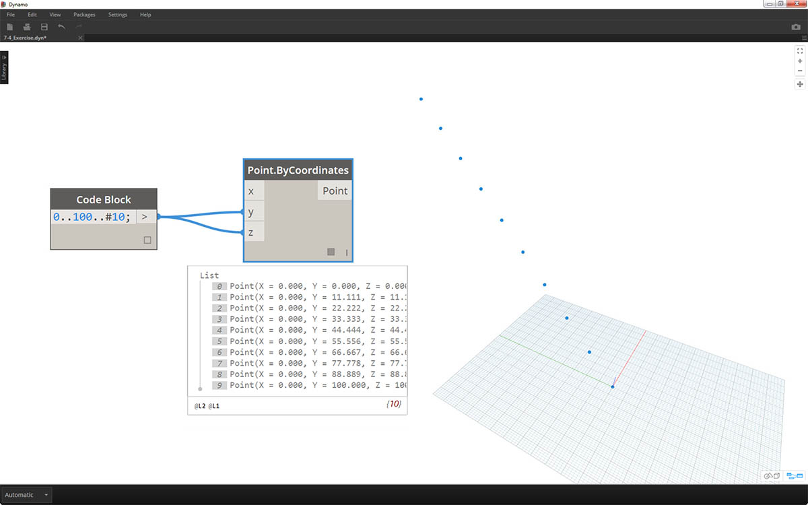
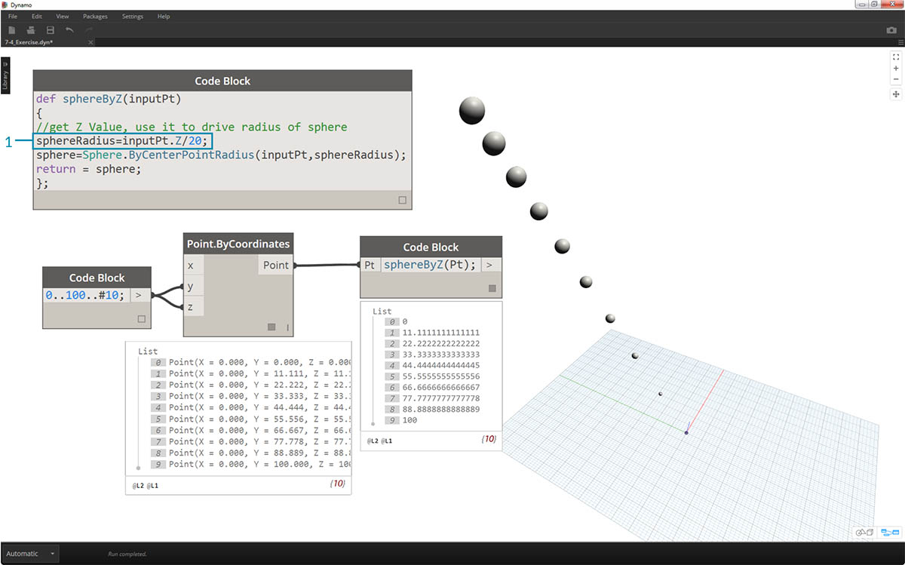
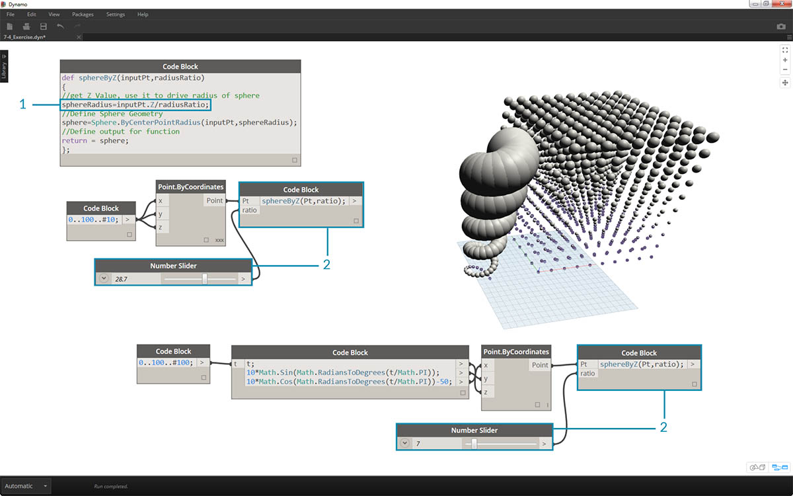

## 代码块函数

函数可以在代码块中创建，并在 Dynamo 定义中的其他位置进行调用。这将在参数化文件中创建另一层控制，并且可以作为基于文本版本的自定义节点进行查看。在这种情况下，“父”代码块可以随时访问，并且可以位于图形上的任意位置。不需要引线！

### 父对象

第一行包含关键字“def”，接着是函数名称，然后是括号中的输入名称。大括号定义函数的主体。使用“return =”返回值。定义函数的代码块没有输入或输出端口，因为它们是从其他代码块调用的。

```
/*This is a multi-line comment,
which continues for
multiple lines*/
def FunctionName(in1,in2)
{
//This is a comment
sum = in1+in2;
return sum;
};
```

### 数目

通过提供名称和相同数量的参数，调用同一文件中具有另一代码块的函数。其工作原理与库中现成的节点一样。


```
FunctionName(in1,in2);
```

### 练习

> 下载本练习随附的示例文件（单击鼠标右键，然后单击“将链接另存为...”）。可以在附录中找到示例文件的完整列表。[Functions_SphereByZ.dyn](datasets/7-4/Functions_SphereByZ.dyn)

在本练习中，我们将创建一个通用定义，该定义将通过输入的点列表创建球体。这些球体的半径由每个点的 Z 特性驱动。



> 首先从 0 到 100 的十个值范围开始。将这些值插入 *Point.ByCoordinates* 节点，以创建对角线。


> 1. 创建*代码块*，然后使用一行代码引入定义：
```
def sphereByZ(inputPt){
};
```

*“inputPt”*是我们提供的名称，该名称用于表示将驱动函数的点。目前，该函数不会执行任何操作，但我们会在即将到来的步骤中构建此函数。


> 1. 添加到*代码块*函数后，我们放置注释和*“sphereRadius”*变量（该变量用于查询每个点的*“Z”*位置）。请记住，*“inputPt.Z”*不需要圆括号以用作方法。这是对现有图元特性的*查询*，因此不需要输入：
```
def sphereByZ(inputPt,radiusRatio)
{
//get Z Value, use it to drive radius of sphere
sphereRadius=inputPt.Z;
};
```


> 1. 现在，我们再次调用在另一个*代码块*中创建的函数。如果双击画布以创建新的*代码块*，然后键入*“sphereB”*，我们会注意到 Dynamo 建议使用已定义的*“sphereByZ”*函数。您的函数已添加到智能库！非常棒。


> 1. 现在，我们调用相应函数并创建一个名为*“Pt”*的变量，以连接在之前步骤中创建的点：
```
sphereByZ(Pt)
```

2. 在输出中，我们注意到所有值都为空值。这是为什么呢？在定义函数后，我们将计算 *sphereRadius* 变量，但是我们未定义函数应*返回*为*输出*的内容。可以在下一个步骤中修复该问题。


> 1. 一个重要步骤是，我们需要定义函数的输出，方法是将一行代码 ```return = sphereRadius;``` 添加到 *sphereByZ* 函数。
2. 现在，我们看到*代码块*的输出为我们提供了每个点的 Z 坐标。


> 现在，让我们通过编辑*父*函数，来创建实际球体。

> 1. 首先，我们使用以下一行代码定义球体：```sphere=Sphere.ByCenterPointRadius(inputPt,sphereRadius);```
2. 接下来，我们将返回值更改为 *sphere* 而不是 *sphereRadius*：```return = sphere;```。这会在 Dynamo 预览中为我们提供一些巨大的球体！



> 1. 为了对这些球体的大小进行调整，我们通过添加除号来更新 *sphereRadius* 值：```sphereRadius = inputPt.Z/20;```。现在，我们可以看到单独的球体，并开始了解半径和 Z 值之间的关系。


> 1. 在 *Point.ByCoordinates* 节点上，通过将连缀从*“最短列表”*更改为*“笛卡尔积”*，我们将创建点栅格。*sphereByZ* 函数仍然完全有效，因此所有点都会使用基于 Z 值的半径创建球体。


> 1. 仅是为了测试水域，我们将原始数字列表连接到 *Point.ByCoordinates* 的 X 输入。现在，我们得到了一个球体的立方体。
2. 注意：如果在计算机上的计算需要较长时间，请尝试将 *#10* 更改为 *#5* 之类的值。


> 1. 请记住，我们创建的 *sphereByZ* 函数是一个通用函数，因此我们可以调用前一课中的螺旋，然后对其应用该函数。



> 最后一步：使用用户定义的参数来控制半径比。为此，我们需要为函数创建新输入，并将 *20* 除号替换为参数。

> 1. 将 *sphereByZ* 定义更新为以下内容：
```
def sphereByZ(inputPt,radiusRatio)
{
//get Z Value, use it to drive radius of sphere
sphereRadius=inputPt.Z/radiusRatio;
//Define Sphere Geometry
sphere=Sphere.ByCenterPointRadius(inputPt,sphereRadius);
//Define output for function
return sphere;
};
```

2. 通过向输入中添加 *ratio* 变量来更新子代码块：```sphereByZ(Pt,ratio);``` 将滑块插入新创建的代码块输入中，并根据半径比改变半径大小。

