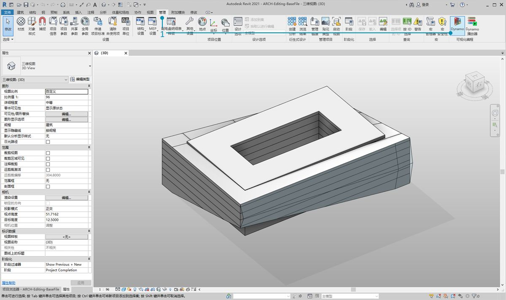
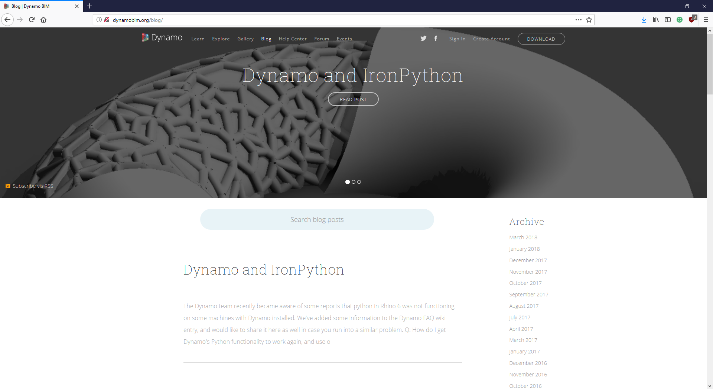

## Revit 连接

Dynamo for Revit 使用图形算法编辑器的数据和逻辑环境扩展建筑信息模型。它的灵活性与强大的 Revit 数据库相结合可以提供全新的 BIM 视角。

本章着重介绍适用于 BIM 的 Dynamo 工作流。各部分主要基于练习，因为直接进入项目是熟悉 BIM 图形算法编辑器的最佳方式。首先，我们来谈谈程序的开头部分。

####

#### Revit 版本兼容性

由于 Revit 和 Dynamo 都在不断发展，您可能会注意到，您使用的 Revit 版本与您计算机上安装的 Dynamo for Revit 版本不兼容。下面概述了哪些 Dynamo for Revit 版本与 Revit 兼容。

|Revit 版本|第一个稳定的 Dynamo 版本|上次支持的 Dynamo for Revit 版本|
| -- | -- | -- |
|2013|[0.6.1](http://dyn-builds-data.s3-us-west-2.amazonaws.com/DynamoInstall0.6.1.exe)|[0.6.3](http://dyn-builds-data.s3-us-west-2.amazonaws.com/DynamoInstall0.6.3.exe)|
|2014|[0.6.1](http://dyn-builds-data.s3-us-west-2.amazonaws.com/DynamoInstall0.6.1.exe)|[0.8.2](http://dyn-builds-data.s3-us-west-2.amazonaws.com/DynamoInstall0.8.2.exe)|
|2015|[0.7.1](http://dyn-builds-data.s3-us-west-2.amazonaws.com/DynamoInstall0.7.1.exe)|[1.2.1](http://dyn-builds-data.s3-us-west-2.amazonaws.com/DynamoInstall1.2.1.exe)|
|2016|[0.7.2](http://dyn-builds-data.s3-us-west-2.amazonaws.com/DynamoInstall0.7.2.exe)|[1.3.2](http://dyn-builds-data.s3-us-west-2.amazonaws.com/DynamoInstall1.3.2.exe)|
|2017|[0.9.0](http://dyn-builds-data.s3-us-west-2.amazonaws.com/DynamoInstall0.9.0.exe)|[1.3.4](http://dyn-builds-data.s3-us-west-2.amazonaws.com/DynamoInstall1.3.4.exe) / [2.0.3](https://dyn-builds-data.s3-us-west-2.amazonaws.com/DynamoInstall2.0.3.exe)|
|2018|[1.3.0](http://dyn-builds-data.s3-us-west-2.amazonaws.com/DynamoInstall1.3.0.exe)|[1.3.4](http://dyn-builds-data.s3-us-west-2.amazonaws.com/DynamoInstall1.3.4.exe) / [2.0.3](https://dyn-builds-data.s3-us-west-2.amazonaws.com/DynamoInstall2.0.3.exe)|
|2019|[1.3.3](http://dyn-builds-data.s3-us-west-2.amazonaws.com/DynamoInstall1.3.3.exe)|[1.3.4](http://dyn-builds-data.s3-us-west-2.amazonaws.com/DynamoInstall1.3.4.exe) / [2.0.3](https://dyn-builds-data.s3-us-west-2.amazonaws.com/DynamoInstall2.0.3.exe)|
|2020|2.1.0 - Revit 2020 现在包含 Dynamo 并像 Revit 那样接收更新。)|不适用|

####

#### Dynamo 的历史

> 该项目最初非常简单，但凭借专门的开发者团队和充满激情的社区，已经发生了很大变化。

最初，Dynamo 旨在简化 Revit 中的 AEC 工作流。尽管 Revit 为每个项目创建了一个强大的数据库，但普通用户可能难以在界面约束之外访问此信息。Revit 托管全面的 API（应用程序程序界面），使第三方开发者可以创建自定义工具。程序员多年来一直在使用此 API，但并非所有人都可以访问基于文本的脚本。Dynamo 希望通过易得到的图形算法编辑器使 Revit 数据大众化。

使用核心 Dynamo 节点与自定义 Revit 节点，用户可以显著扩展参数化工作流以实现互操作性、文档编制、分析和生成。使用 Dynamo，可以自动执行繁琐的工作流，同时设计探索可以蓬勃发展。

### 在 Revit 中运行 Dynamo

> 1. 在 Revit 项目或族编辑器中，导航到“附加模块”,然后单击 *Dynamo*。注意：Dynamo 仅在已打开的文件中运行。

> 1. 在 Revit 中打开 Dynamo 时，有一个名为*“Revit”*的新类别。这是对用户界面完全新增的功能，可提供专门针对 Revit 工作流的节点。*

**注意 - 通过使用 Revit 特定的节点族，Dynamo 图形仅当在 Dynamo for Revit 中打开时起作用。例如，如果在 Dynamo 沙盒中打开 Dynamo for Revit 图形，Revit 节点将丢失。*

### 冻结节点

由于 Revit 是一个提供强大项目管理的平台，因此 Dynamo 中的参数化操作可能非常复杂且计算速度缓慢。如果 Dynamo 计算节点需要较长时间，可能需要使用“冻结”节点功能，以便在开发图形时暂停执行 Revit 操作。有关冻结节点的详细信息，请查看[“实体”章节](../05_Geometry-for-Computational-Design/5-6_solids.md#freezing)中的“冻结”部分。

### 社区

由于 Dynamo 最初是为 AEC 开发的，因此其庞大且不断壮大的社区是一个绝佳资源，可供从业内专家处学习并与之联系。Dynamo 的社区由那些热衷于分享和创作的建筑师、工程师、程序员以及设计师组成。

Dynamo 是一个不断发展的开源项目，而且许多开发与 Revit 相关。如果您对于该游戏是新手，请访问论坛并开始[发布问题](http://dynamobim.org/forums/forum/dyn/)!如果您是程序员并想参与 Dynamo 开发，请查看 [GitHub 页面](https://github.com/DynamoDS/Dynamo)。此外，[Dynamo 软件包管理器](http://dynamopackages.com/)是第三方库的绝佳资源。其中许多软件包都是由 AEC 制作的，我们将在本章中查看用于镶板的第三方软件包。

> Dynamo 还维护着一个活跃的[博客](http://dynamobim.com/blog/)。可阅读最近的帖子，了解最新进展！

