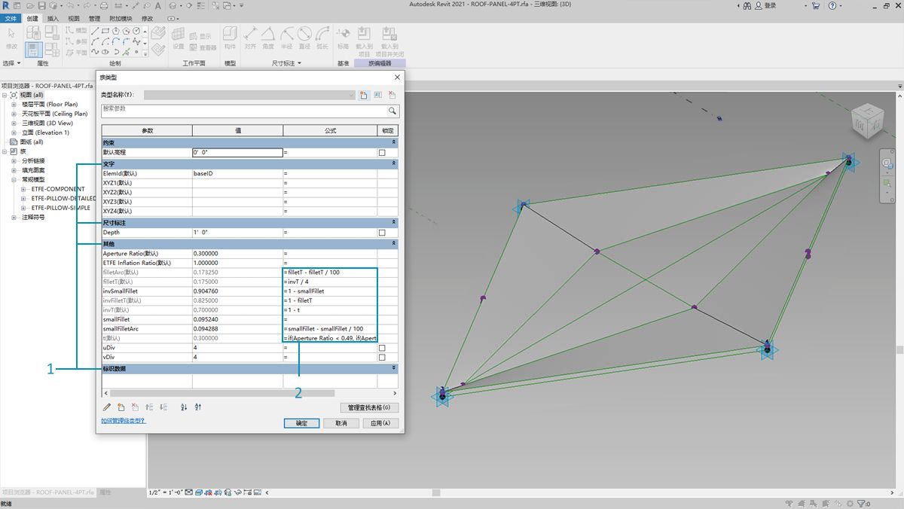
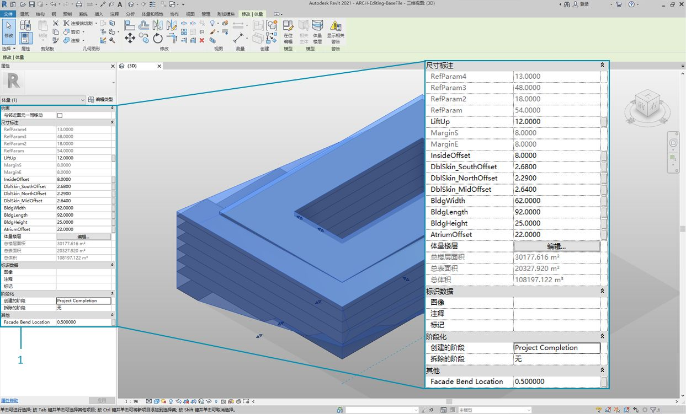
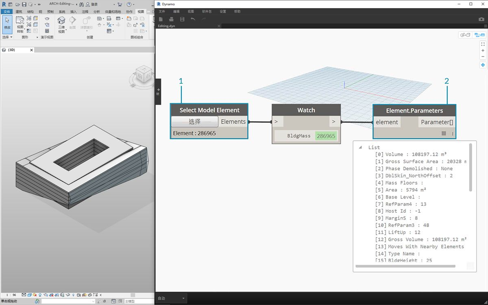
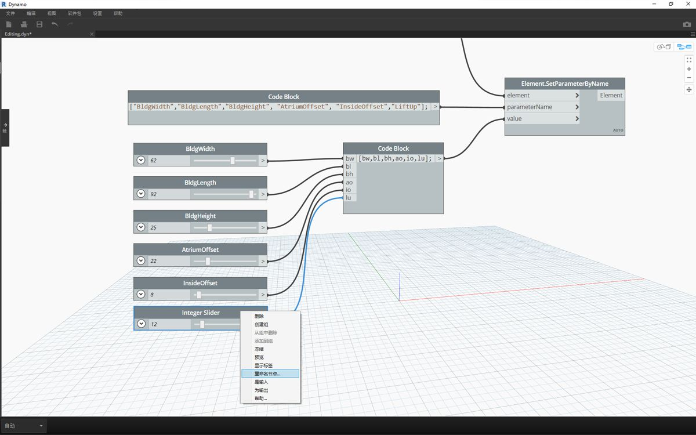
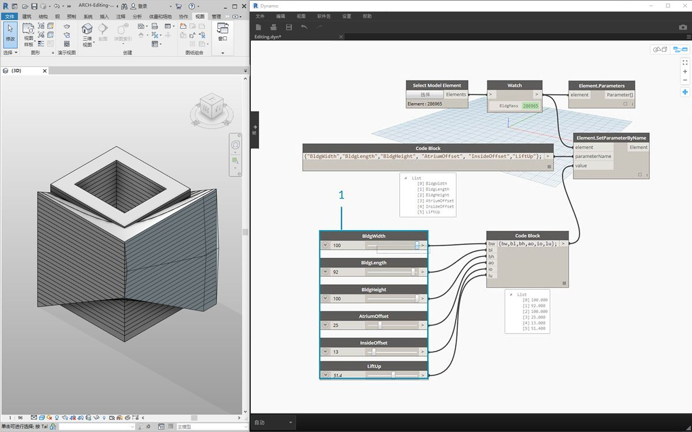
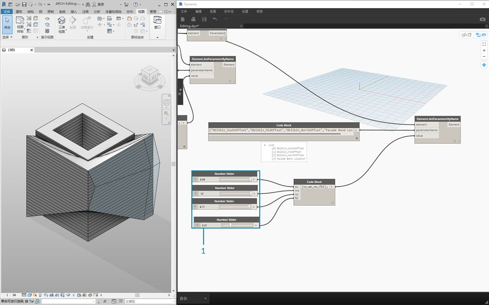

## 编辑

Dynamo 的一个强大功能是，可以在参数化级别上编辑参数。例如，衍生式算法或模拟结果可用于驱动元素阵列的参数。这样，同一族中的一组实例可以在 Revit 项目中具有自定义特性。

### 类型和实例参数


> 1. 实例参数定义屋顶表面上嵌板的孔径，Aperture Ratio 的范围介于 0.1 到 0.4 之间。
2. 基于类型的参数将应用于表面上的每个图元，因为它们的族类型相同。例如，每个嵌板的材质都可以由基于类型的参数驱动。



> 1. 如果之前已设置过 Revit 族，请记住，需要指定参数类型（字符串、数字、尺寸标注等）在 Dynamo 中指定参数时，请务必使用正确的数据类型。
2. 还可以将 Dynamo 与在 Revit 族的特性中定义的参数化约束结合使用。

在 Revit 中快速查看参数时，我们要记得有类型参数和实例参数。这两个参数在 Dynamo 中都可以进行编辑，但我们在下面的练习中使用的是实例参数。

注意：在发现了编辑参数的广泛应用后，您可能想在 Revit 中使用 Dynamo 编辑大量图元。这可能是*计算成本高昂*的操作，这意味着它的速度可能会很慢。如果要编辑大量图元，可能需要使用“冻结”节点功能，以便在开发图形时暂停执行 Revit 操作。有关冻结节点的详细信息，请查看[“实体”章节](../05_Geometry-for-Computational-Design/5-6_solids.md#freezing)中的“冻结”部分。

#### 单位

从版本 0.8 开始，Dynamo 基本上是无单位的。这样，Dynamo 便可保持抽象的可视化编程环境。与 Revit 尺寸标注交互的 Dynamo 节点将参照 Revit 项目的单位。例如，如果在 Revit 中从 Dynamo 设置长度参数，则 Dynamo 中的值数值将对应 Revit 项目中的默认单位。下面的练习以米为单位。


> 要快速转换单位，请使用*“Convert Between Units”*节点。这是一个方便工具，可用于即时转换长度、面积和体积单位。

### 练习

> 下载本练习随附的示例文件（单击鼠标右键，然后单击“将链接另存为...”）。可以在附录中找到示例文件的完整列表。

> 1. [Editing.dyn](datasets/8-3/Editing.dyn)
2. [ARCH-Editing-BaseFile.rvt](datasets/8-3/ARCH-Editing-BaseFile.rvt)

本练习重点介绍如何编辑 Revit 图元，而无需在 Dynamo 中执行几何操作。我们在此处不会输入 Dynamo 几何图形，只需在 Revit 项目中编辑参数即可。本练习是基本练习，对于更高级的 Revit 用户，请注意这些是体量的实例参数，但可以将相同逻辑应用于图元阵列以进行大规模自定义。这全部是通过“Element.SetParameterByName”节点完成的。



> 从本部分的 Revit 示例文件开始。我们已从上一部分中删除了结构图元和自适应桁架。在本练习中，我们将重点介绍 Revit 中的参数化装备，以及 Dynamo 中的操作。

> 1. 在 Revit 中，选择体量中的建筑，我们可以在“特性”面板中看到实例参数的阵列。



> 1. 使用*“Select Model Element”*节点选择建筑体量。
2. 我们可以使用*“Element.Parameters”*节点查询此体量的所有参数。这包括类型和实例参数。


> 1. 参考 *Element.Parameters* 节点以查找目标参数。或者，我们可以查看上一步中的“特性”面板，以选择要编辑的参数名称。在本例中，我们将查找影响建筑体量上较大几何移动的参数。
2. 我们将使用 *Element.SetParameterByName* 节点对 Revit 图元进行更改。
3. 使用*代码块*，我们定义这些参数的列表，其中用引号括起来每个项目以表示字符串。我们还可以使用 List.Create 节点，其中一系列*“string”*节点已连接到多个输入。代码块简单而快捷。在 Revit 中，只需确保字符串与精确名称匹配，具体情况如下：```{"BldgWidth","BldgLength","BldgHeight", "AtriumOffset", "InsideOffset","LiftUp"};```



> 1. 我们还要为每个参数指定值。向画布添加六个*“整数滑块”*，然后重命名为列表中相应的参数。此外，根据上图设置每个滑块的值。按从上到下的顺序：```62,92,25,22,8,12```
2. 定义另一个*代码块*，其中列表与参数名称具有相同长度。在本例中，我们命名变量（不带引号），这将为*代码块创建输入。*将*滑块*连接到各自的输入：```{bw,bl,bh,ao,io,lu};```
3. 将*代码块*连接到*“Element.SetParameterByName”**节点。在选中“自动运行”后，我们将自动看到结果。

**注意 - 此演示使用的是实例参数，而不是类型参数。*

与在 Revit 中一样，其中许多参数彼此相关。当然，在这些组合中几何图形可能会中断。我们可以在参数特性中定义公式来解决这个问题，也可以在 Dynamo 中使用数学运算设置类似逻辑（如果您想扩展练习，这也是一项额外的挑战）。

> 1. 此组合为建筑体量提供了功能强大的新设计：```100,92,100,25,13,51.4```


> 1. 我们复制图形，并重点介绍将容纳桁架系统的外立面玻璃。在本例中，我们将隔离四个参数：```{"DblSkin_SouthOffset","DblSkin_MidOffset","DblSkin_NorthOffset","Facade Bend Location"};```
2. 此外，我们还会创建*数字滑块*，然后重命名为相应的参数。前三个滑块（从上到下）应重新映射到 [0,10] 的域，而最后一个滑块（*“外立面弯曲位置”*）应重新映射到 [0,1] 的域。这些值（从上到下）应从以下这些值开始（尽管它们是任意值）：```2.68,2.64,2.29,0.5```
3. 定义新的*代码块*并连接滑块：```{so,mo,no,fbl};```



> 1. 通过更改图形此部分中的*滑块*，我们可以使外立面玻璃更加实质：```9.98,10.0,9.71,0.31```

