## 创建

可以在 Dynamo 中使用完全参数化控制创建 Revit 图元阵列。Dynamo 中的 Revit 节点支持将常规几何图形中的图元输入到特定类别类型（如墙和楼板）。在本部分中，我们将重点介绍如何以参数化方式输入具有自适应构件的灵活图元。


### 自适应构件

自适应构件是一种灵活的族类别，非常适用于衍生应用程序。实例化后，即可创建复杂的几何图元，该图元由自适应点的基本位置驱动。

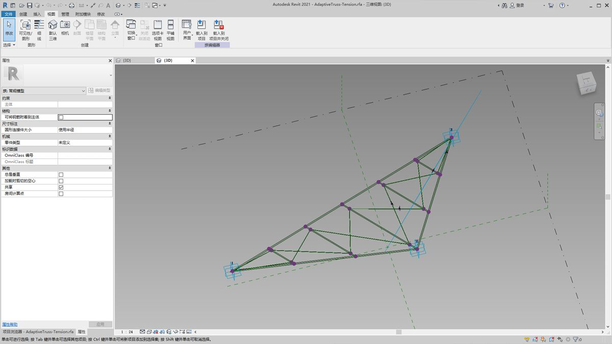

> 族编辑器中三点自适应构件的示例。这将生成一个桁架，该桁架由每个自适应点的位置定义。在下面的练习中，我们将使用此构件在外墙上生成一系列桁架。

#### 互操作性原则

自适应构件是实现互操作性最佳实践的一个很好示例。我们可以通过定义基本自适应点来创建自适应构件阵列。在将该数据传输到其他程序时，我们能够将几何图形简化为简单数据。使用类似 Excel 的程序输入和输出遵循类似的逻辑。

假定外墙顾问想要知道桁架图元的位置，而无需通过完全铰接的几何图形进行解析。在准备制造时，顾问可以参照自适应点的位置，以在类似 Inventor 的程序中重新生成几何图形。

我们将在下面练习中设置的工作流允许我们在创建 Revit 图元创建定义的同时访问所有这些数据。通过此流程，我们可以将概念化、文档编制和制造合并为一个无缝工作流。这将为互操作性创造更智能、更高效的流程。

#### 多个元素和列表

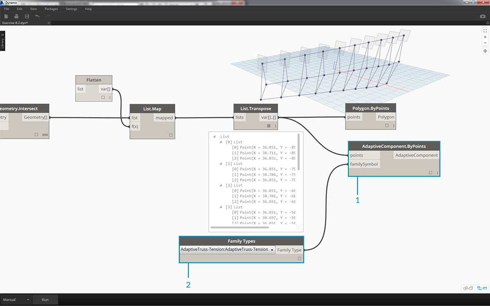

下面的练习将分步介绍 Dynamo 如何参照 Revit 图元创建数据。为了生成多个自适应构件，我们会定义一列列表，其中每个列表中都有表示自适应构件的每个点的三个点。在 Dynamo 中管理数据结构时，我们要记住这一点。

### 练习

> 下载本练习随附的示例文件（单击鼠标右键，然后单击“将链接另存为...”）。可以在附录中找到示例文件的完整列表。

> 1. [Creating.dyn](datasets/8-4/Creating.dyn)
2. [ARCH-Creating-BaseFile.rvt](datasets/8-4/ARCH-Creating-BaseFile.rvt)


> 从本部分的示例文件开始（或从上一任务中的 Revit 文件继续操作），我们会看到相同的 Revit 体量。

> 1. 这是已打开的文件。
2. 这是我们用 Dynamo 创建的桁架系统，与 Revit 体量智能链接。

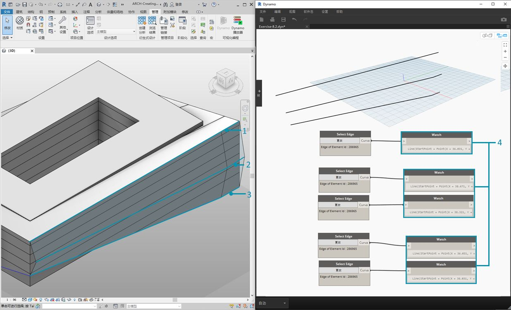

> 我们已使用*“选择模型图元”*和*“选择面”*节点，现在我们在几何图形层次结构中向下进一步，并使用*“选择边”*。将 Dynamo 解算器设置为*“自动”*运行后，图形将不断更新到 Revit 文件中的更改。我们选择的边与 Revit 图元拓扑动态关联。只要拓扑* 不改变，Revit 和 Dynamo 之间的连接就会保持链接。

> 1. 选择玻璃外墙的最顶部曲线。这将跨越建筑的整个长度。如果在选择边时遇到问题，请记得在 Revit 中进行选择，方法是将光标悬停在相应边上，然后点击*“Tab”*，直到所需边亮显。
2. 使用两个*“选择边”*节点，选择表示外墙中间的斜面的每条边。
3. 在 Revit 中，对外墙的底部边执行相同的操作。
4. *观察*节点显示我们现在在 Dynamo 中有线。这会自动转换为 Dynamo 几何图形，因为边本身不是 Revit 图元。这些曲线是我们将用于实例化整个外墙的自适应桁架的参照。

**注意 - 为了保持拓扑一致，我们所指的模型没有添加额外面或边。尽管参数可以更改其形状，但构建方式仍保持一致。*


> 首先，我们需要连接曲线并将它们合并到一个列表中。这样，我们就可以*“分组”*曲线以执行几何图形操作。

> 1. 为外墙中间的两条曲线创建一个列表。
2. 通过将 *List.Create* 组件插入到 *Polycurve.ByJoinedCurves* 节点，从而将两条曲线连接到复合线。
3. 为外墙底部的两条曲线创建一个列表。
4. 通过将 *List.Create* 组件插入到 *Polycurve.ByJoinedCurves* 节点，从而将两条曲线连接到复合线。
5. 最后，将三条主要曲线（一条线和两条复合线）合并到一个列表中。


> 我们要利用顶部曲线（即一条线），它表示外墙的整个跨度。我们将沿这条线创建平面，以与我们在列表中分组在一起的一组曲线相交。

> 1. 借助*代码块*，使用以下语法定义一个范围：```0..1..#numberOfTrusses;```
2. 将*整数滑块*插入到代码块的输入。正如您猜测的，这将表示桁架数。请注意，滑块控制在 *0* 至 *1* 定义的范围内的项目数。
3. 将*代码块*插入到*“Curve.PlaneAtParameter”*节点的*参数*输入，并将顶边插入到*曲线*输入。这样，我们将获得十个平面，这些平面均匀分布在外墙的跨度上。

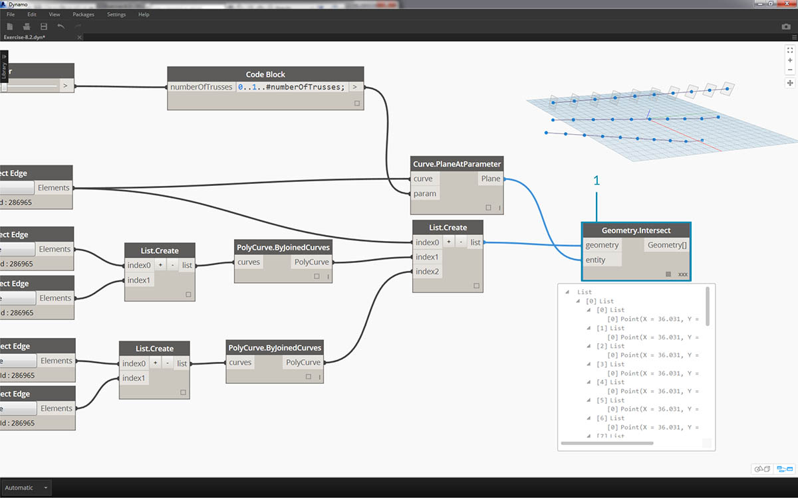

> 平面是几何图形的抽象部分，表示无限的二维空间。由于我们在此步骤中进行设置，因此平面非常适合轮廓和相交。

> 1. 使用 *Geometry.Intersect* 节点（注意笛卡尔积连缀），将 *Curve.PlaneAtParameter* 插入到 *Geometry.Intersect* 节点的*实体*输入。将主 *List.Create* 节点插入到*几何图形*输入。现在，我们在 Dynamo 视口中会看到代表每个曲线与定义平面相交的点。


> 请注意，输出是一列列表的列表。对于我们的目的而言，列表过多。我们想在这里进行部分展平。我们需要在列表中向下一步，然后展平结果。为此，我们使用 *List.Map* 操作，如入门手册的列表章节中所述。

> 1. 将 *Geometry.Intersect* 节点插入到 *List.Map* 的列表输入。
2. 将*“展平”*节点插入到 *List.Map* 的 f(x) 输入。结果给出 3 个列表，每个列表的计数等于桁架数。
3. 我们需要更改此数据。如果要实例化桁架，我们需要使用在族中定义的相同数量的自适应点。这是一个三点自适应构件，因此我们想要的不是三个列表（每个列表 10 个项目 (numberOfTrusses)），而是 10 个列表（每个列表三个项目）。这样，我们就可以创建 10 个自适应构件。
4. 将 *List.Map* 插入到 *List.Transpose* 节点。现在，我们得到了所需的数据输出。
5. 要确认数据正确无误，请将 *Polygon.ByPoints* 节点添加到画布，然后使用 Dynamo 预览仔细检查。


> 采用创建多边形的相同方式，我们对自适应构件进行排列。

> 1. 将 *AdaptiveComponent.ByPoints* 节点添加到画布，将 *List.Transpose* 节点插入到*点*输入。
2. 使用*族类型*节点，选择*“自适应桁架”*族，然后将其插入到 *AdaptiveComponent.ByPoints* 节点的*族符号*输入。

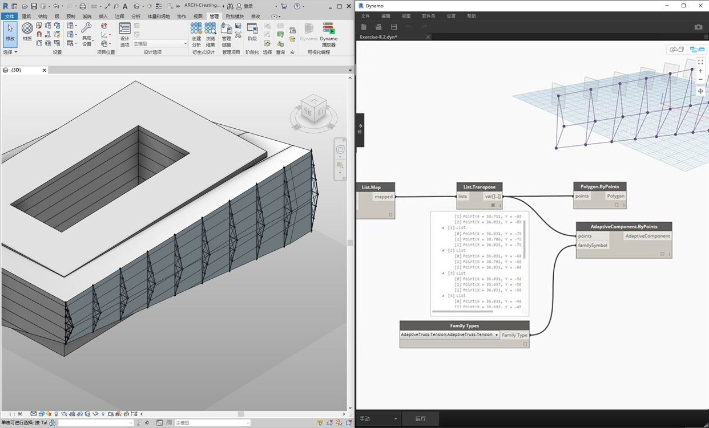

> 检入 Revit，我们现在有十个桁架均匀分布在外墙上！

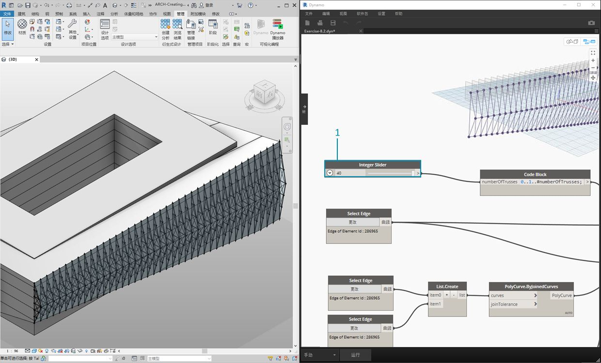

> 1. “调整”图形，我们通过更改*滑块*将 *numberOfTrusses* 调大为 *40*。许多桁架，不太真实，但参数化链接仍起作用。

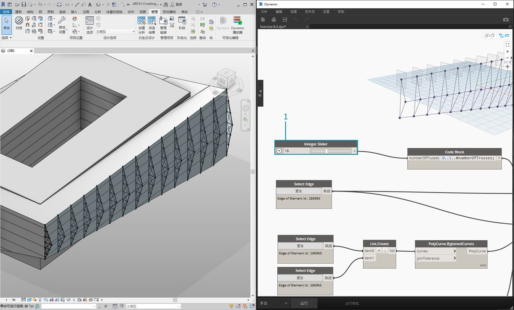

> 1. 设置桁架系统，让我们为 *numberOfTrusses* 采用折中值 *15*。

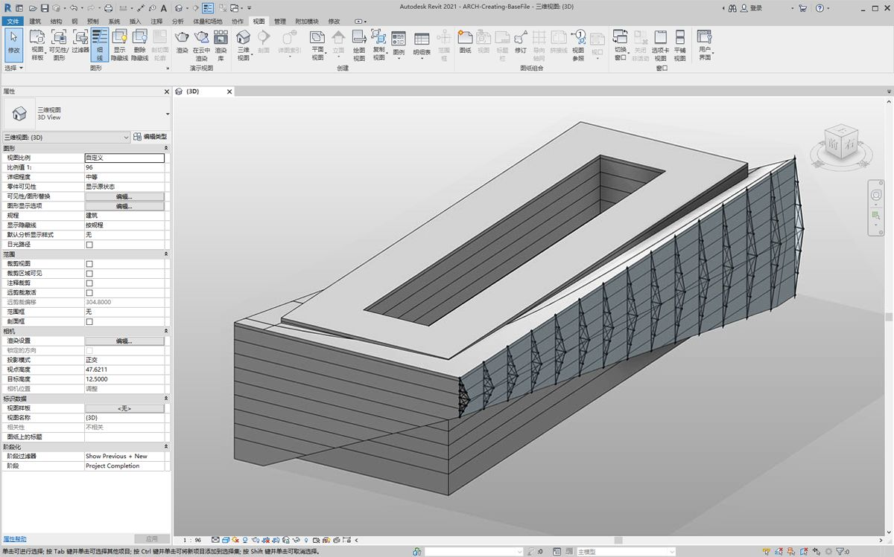

> 在最后的测试中，通过在 Revit 中选择体量并编辑实例参数，我们可以修改建筑的形状，并观察桁架的跟随效果。请记住，必须打开此 Dynamo 图形才能看到此更新，并且链接在该图形关闭后会立即断开。

### DirectShape 图元

将参数化 Dynamo 几何图形输入 Revit 的另一种方法是使用 DirectShape。总之，DirectShape 图元和相关类支持将外部创建的几何形状存储在 Revit 文档中。几何图形可以包含闭合实体或网格。DirectShape 主要用于从 IFC 或 STEP 等其他数据格式输入形状，这些格式中没有足够信息可用于创建“真实”的 Revit 图元。与 IFC 和 STEP 工作流程一样，DirectShape 功能非常适用于将 Dynamo 创建的几何图形作为真实图元输入 Revit 项目。

下面，我们来分步介绍并练习如何将 Dynamo 几何图形作为 DirectShape 输入 Revit 项目。使用此方法，我们可以指定输入的几何图形的类别、材质和名称，而且所有这些都可以保留到 Dynamo 图形的参数化链接。

### 练习

> 下载本练习随附的示例文件（单击鼠标右键，然后单击“将链接另存为...”）。可以在附录中找到示例文件的完整列表。

> 1. [DirectShape.dyn](datasets/8-4/DirectShape.dyn)
2. [ARCH-DirectShape-BaseFile.rvt](datasets/8-4/ARCH-DirectShape-BaseFile.rvt)

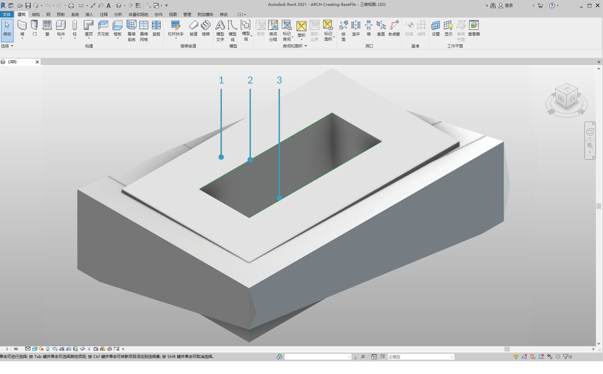

> 首先，打开本课程的示例文件 - ARCH-DirectShape-BaseFile.rvt。

> 1. 在三维视图中，我们可以看到上一课程中的建筑体量。
2. 沿着中庭的边是一条参照曲线，我们将此曲线用作 Dynamo 中的参照曲线。
3. 沿着中庭的相对边是另一条参照曲线，我们也将在 Dynamo 中参照该曲线。


> 1. 为了在 Dynamo 中参照我们的几何图形，我们将为 Revit 中的每个构件使用*“选择模型图元”*。在 Revit 中选择体量，然后使用 *Element.Faces* 将几何图形输入 Dynamo - 体量现在应该在 Dynamo 预览中可见。
2. 使用*选择模型图元*和 *CurveElement.Curve* 将一条参照曲线输入 Dynamo。
3. 使用*选择模型图元*和 *CurveElement.Curve* 将其他参照曲线输入 Dynamo。


> 1. 缩小并平移到示例图的右侧，我们会看到一组大节点 - 这些是几何操作，可生成格子架屋顶结构，并在 Dynamo 预览中可见。这些节点使用*“节点到代码”*功能生成，如入门手册的[“代码块”部分](../07_Code-Block/7-2_Design-Script-syntax.md#Node)中所述。
2. 结构由三个主要参数（对角偏移、拱形和半径）驱动。


> 缩放此图形的参数特写。我们可以进行调整，以获得不同的几何图形输出。

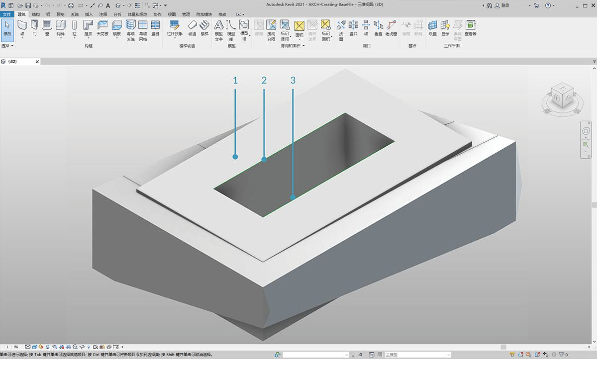

> 1. 将 *DirectShape.ByGeometry* 节点添加到画布上，我们会看到它有四个输入：**几何图形、类别、材质**和**名称**。
2. 几何图形将是从图形的几何图形创建部分创建的实体
3. 使用下拉*类别*节点选择类别输入。在本例中，我们将使用“结构框架”。
4. 通过上述节点阵列选择材质输入 - 尽管在这种情况下，可以更加简单地将其定义为“默认”。

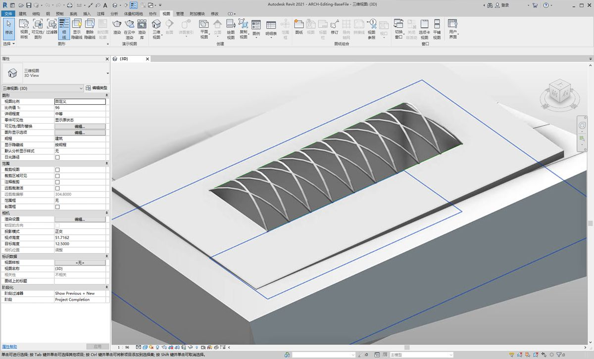

> 运行 Dynamo 后，返回 Revit，我们将输入的几何图形放置在项目的屋顶上。这是结构框架图元，而不是常规模型。到 Dynamo 的参数化链接保持不变。


