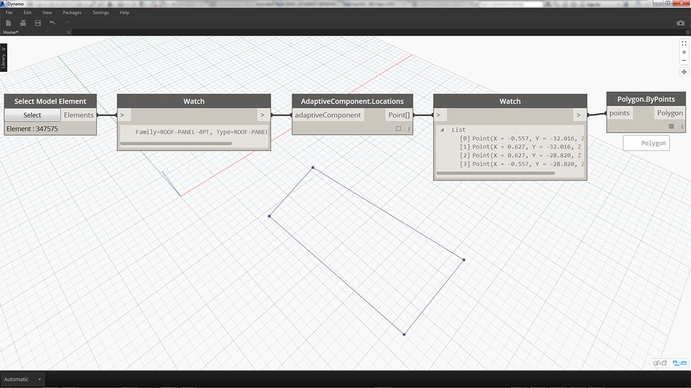
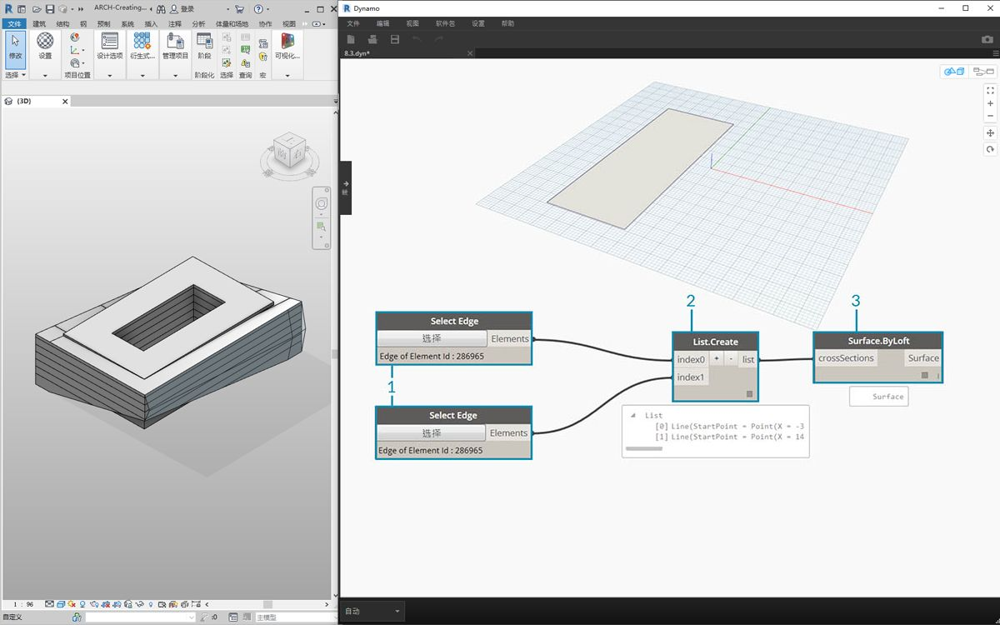
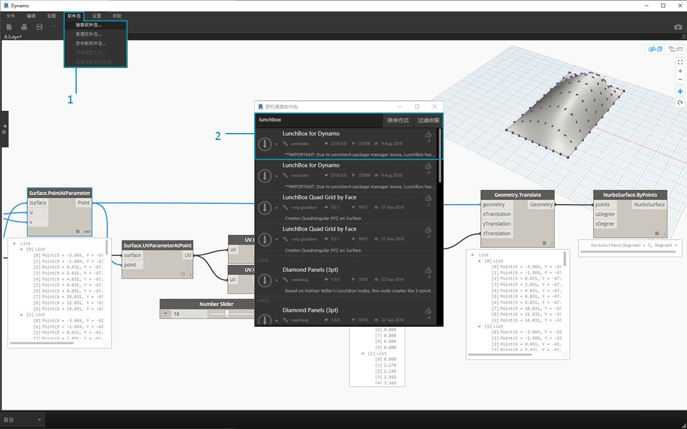
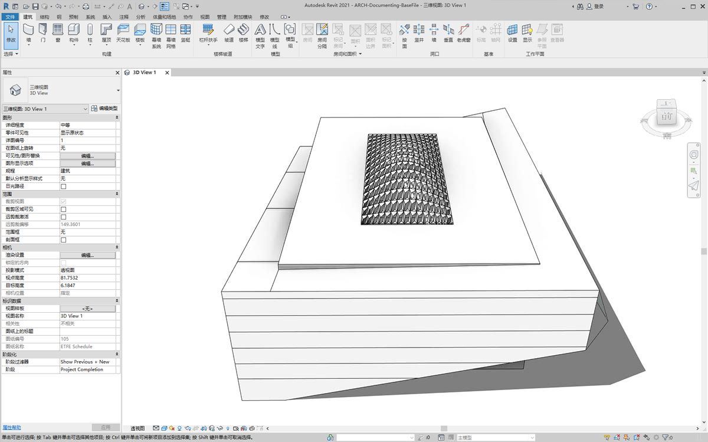
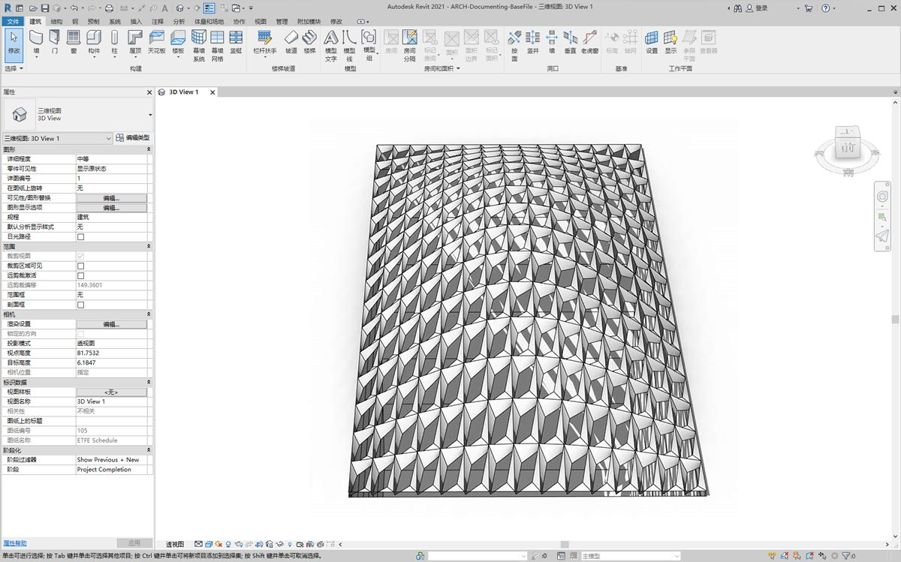
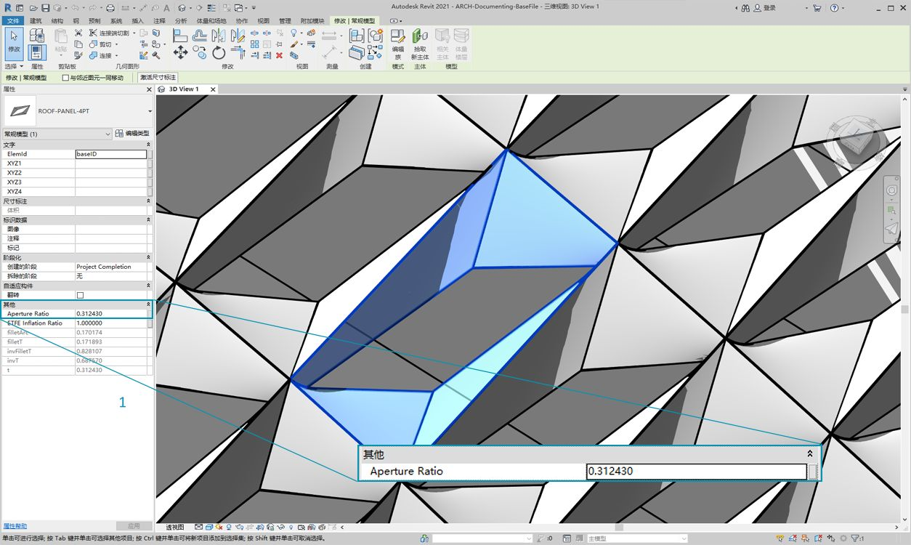
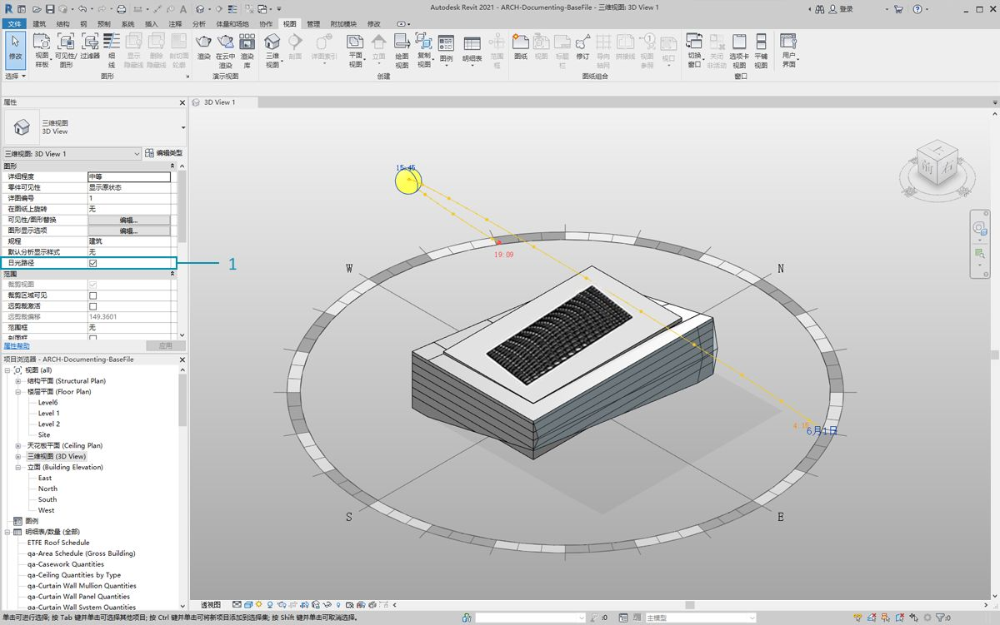
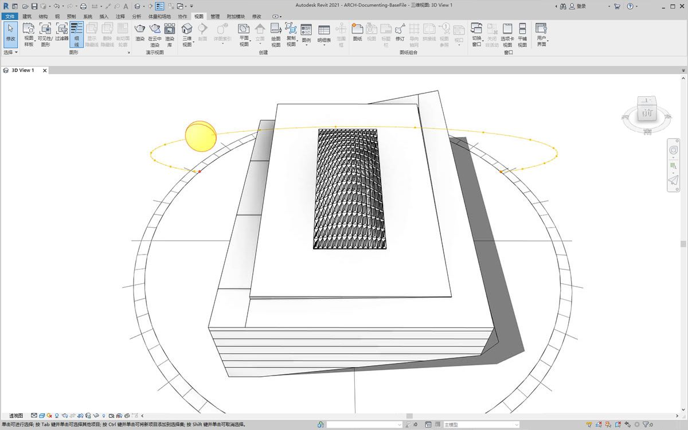
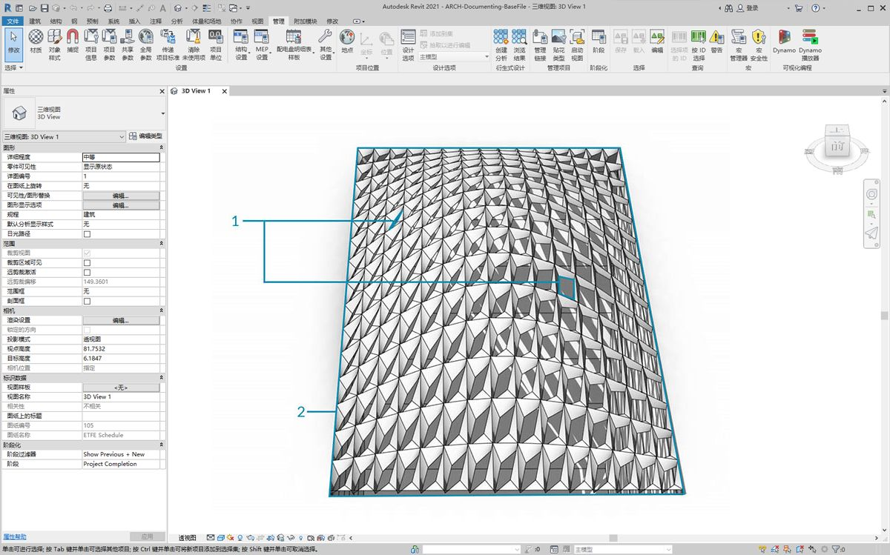

## 定制

尽管我们之前介绍了如何编辑基本建筑体量，但我们希望一次编辑大量图元，以便深入了解 Dynamo/Revit 链接。由于数据结构需要更高级的列表操作，因此大比例自定义会变得更加复杂。但是，其执行背后的基本原则在根本上是相同的。让我们基于一组自适应构件来研究一些可能的分析。

#### 点位置

假定我们创建了一系列自适应构件，并希望根据其点位置编辑参数。例如，这些点可以驱动与图元面积相关的厚度参数。或者，它们可以驱动一年内与日光曝晒相关的不透明度参数。Dynamo 支持通过几个简单步骤将分析与参数相连接，在下面的练习中，我们将探讨基本版本。



> 使用 *AdaptiveComponent.Locations* 节点查询选定自适应构件的自适应点。这样，我们便可以使用 Revit 图元的抽象版本进行分析。

通过提取自适应构件的点位置，我们可以针对该图元运行一系列分析。例如，通过四点自适应构件可以研究与给定嵌板的平面之间的偏差。

#### 日光方向分析


> 使用“重映射”将一组数据映射到参数范围。这是参数化模型中所使用的基本工具，我们将在下面的练习中进行演示。

使用 Dynamo，自适应构件的点位置可用于创建每个图元的最佳拟合平面。我们还可以在 Revit 文件中查询太阳位置，并研究该平面与太阳的相对方向与其他自适应构件的比较。让我们在下面的练习中通过创建算法屋顶图来进行设置。

### 练习

> 下载本练习随附的示例文件（单击鼠标右键，然后单击“将链接另存为...”）。可以在附录中找到示例文件的完整列表。

> 1. [Customizing.dyn](datasets/8-5/Customizing.dyn)
2. [ARCH-Customizing-BaseFile.rvt](datasets/8-5/ARCH-Customizing-BaseFile.rvt)

本练习将进一步介绍上一节中演示的技术。在本例中，我们将基于 Revit 图元定义参数化曲面，实例化四点自适应构件，然后根据太阳的方向对其进行编辑。



> 1. 首先，使用*“选择边”*节点选择两条边。这两条边是中庭的长跨度。
2. 使用 *List.Create* 节点将两条边合并为一个列表。
3. 使用 *Surface.ByLoft* 在两条边之间创建曲面。


> 1. 使用*代码块*，定义介于 0 到 1 之间的一个范围，等间距值为 10：```0..1..#10;```
2. 将*代码块*连接到 *Surface.PointAtParameter* 节点的 *u* 和 *v* 输入，并将 *Surface.ByLoft* 节点连接到*曲面*输入。在节点上单击鼠标右键，并将*“连缀”*更改为*“叉积”*。这将在曲面上提供点栅格。

该点栅格用作参数化定义的曲面的控制点。我们要提取其中每个点的 u 和 v 位置，以便可以将它们连接到参数化公式并保持相同的数据结构。可以通过查询刚才创建的点的参数位置来执行此操作。


> 1. 将 *Surface.ParameterAtPoint* 节点添加到画布，连接输入，如上所示。
2. 使用 *UV.U* 节点查询这些参数的 *u* 值。
3. 使用 *UV.V* 节点查询这些参数的 *v* 值。
4. 输出显示曲面每个点对应的 *u* 和 *v* 值。现在，在正确的数据结构中，每个值的范围介于 *0* 到 *1* 之间，因此我们准备好应用参数算法。


> 1. 将*代码块*添加到画布，然后输入代码：```Math.Sin(u*180)*Math.Sin(v*180)*w;```，这是一个参数化函数，可从平面创建正弦平滑。
2. *u* 输入连接到 *UV.U*。
3. *v* 输入连接到 *UV.V*。
4. *w* 输入表示形状的*振幅*，因此我们向其附加*数字滑块*。


> 1. 现在，我们得到了算法定义的一列值。让我们使用该列值在 *+Z* 方向上上移点。使用 *Geometry.Translate*，将*代码块*连接到 *zTranslation*，将 *Surface.PointAtParameter* 连接到*几何图形*输入。您应该会看到新点显示在 Dynamo 预览中。
2. 最后，我们使用 *NurbsSurface.ByPoints* 节点创建曲面，从而将上一步中的节点连接到点输入。我们自己有一个参数化曲面。可以随意拖动滑块来观察多边形收缩和扩展。

使用参数化曲面，我们需要定义一种方法来进行镶板，以便布置四点自适应构件。Dynamo 没有现成的功能来进行曲面镶板，因此我们可以向社区寻求有用的 Dynamo 软件包。



> 1. 转到*“软件包”>“搜索软件包...”*
2. 搜索*“LunchBox”*，然后下载*“LunchBox for Dynamo”*。对于此种情况，这是一组非常有用的几何图形操作工具。


> 1. 完成下载后，现在即可完全访问 LunchBox 套件。搜索*“四边形栅格”*，然后选择*“LunchBox 四边形栅格(按面)”*。将参数化曲面连接到*曲面*输入，并分别将 *U* 和 *V* 设置为 *15*。您应该会在 Dynamo 预览中看到四分面板的曲面。


> 如果您对其设置很满意，可以双击*“Lunch Box”*节点，查看其设置。


> 返回 Revit，让我们快速看一下在此处使用的自适应构件。无需再继续，但这是我们要实例化的屋顶嵌板。它是四点自适应构件，它是 ETFE 系统的粗略表示。中心空心的光圈位于名为*“ApertureRatio”*的参数上。


> 1. 我们要在 Revit 中实例化许多几何图形，因此确保将 Dynamo 解算器转换为*“手动”*。
2. 向画布添加*“族类型”*节点，然后选择*“ROOF-PANEL-4PT”*。
3. 将 *AdaptiveComponent.ByPoints* 节点添加到画布，将*“LunchBox 四边形栅格(按面)”*输出中的 *Panel Pts* 连接到*点*输入。将*“族类型”*节点连接到*“familySymbol”*输入。
4. 点击*“运行”*。创建几何图形时，Revit 必须*考虑*一下。如果需要太长时间，请将*代码块的“15”*减少到较小数字。这将减少屋顶上嵌板的数量。

*注意：如果 Dynamo 计算节点需要较长时间，可能需要使用“冻结”节点功能，以便在开发图形时暂停执行 Revit 操作。有关冻结节点的详细信息，请查看[“实体”章节](../05_Geometry-for-Computational-Design/5-6_solids.md#freezing)中的“冻结”部分。*



> 返回 Revit，屋顶上有一组嵌板。



> 放大后，可以更仔细地查看其曲面质量。

### 分析



> 1. 从上一步开始，我们进一步根据每个面板到太阳的曝光来驱动其光圈。放大 Revit 并选择一个嵌板，我们在特性栏中可以看到有一个名为*“Aperture Ratio”*的参数。设置族，以便使光圈范围大致介于 *0.05* 到 *0.45* 之间。



> 1. 如果打开日光路径，可以在 Revit 中看到当前的太阳位置。


> 1. 我们可以使用 *SunSettings.Current* 节点来参照此太阳的位置。
2. 将“日光”设置连接到 *Sunsetting.SunDirection* 以获得太阳向量。
3. 基于用来创建自适应构件的 *Panel Pts*，使用 *Plane.ByBestFitThroughPoints* 以近似计算构件的平面。
4. 查询此平面的*法线*。
5. 使用*点积*计算太阳方向。点积是一个用于确定两个向量的平行度或反平行度的公式。我们采用每个自适应构件的平面法线，并将其与太阳向量进行比较以粗略模拟太阳方向。
6. 获取结果的*绝对值*。这可确保点积在平面法线朝向反转方向时是准确的。
7. 点击*“运行”*。


> 1. 我们看一下*点积*，这里有很多数字。我们想要使用它们的相对分布，但是我们需要将数字压缩到计划编辑的*“Aperture Ratio”*参数的适当范围。
2. *Math.RemapRange* 是一个适用于此种情况的优秀工具。它采用输入列表并将其边界重新映射到两个目标值。
3. 在*代码块*中，将目标值定义为 *0.15* 和 *0.45*。
4. 点击*“运行”*。


> 1. 将重映射的值连接到 *Element.SetParameterByName* 节点。
2. 将字符串*“Aperture Ratio”*连接到 *parameterName* 输入。
3. 将*自适应构件*连接到*图元*输入。
4. 点击*“运行”*。



> 返回 Revit，从远处我们可以看出太阳方向对 ETFE 嵌板光圈的影响。



> 放大，我们看到 ETFE 嵌板在面对太阳时更加闭合。此处，我们的目标是减少因日光曝晒而导致的过热情况。如果我们要根据日光曝晒让更多光线进入，只需切换 *Math.RemapRange* 上的域即可。

