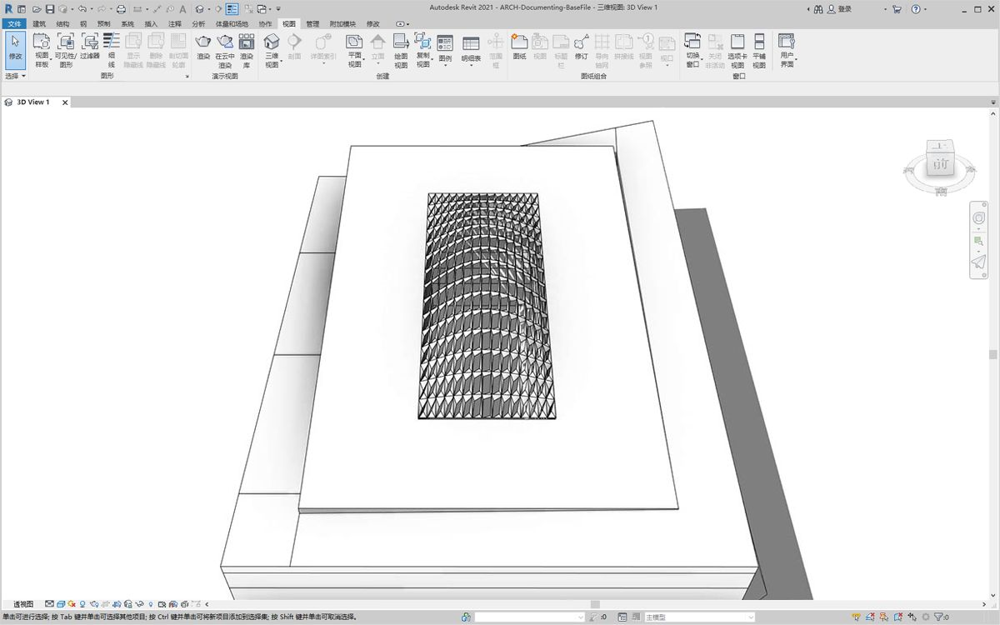
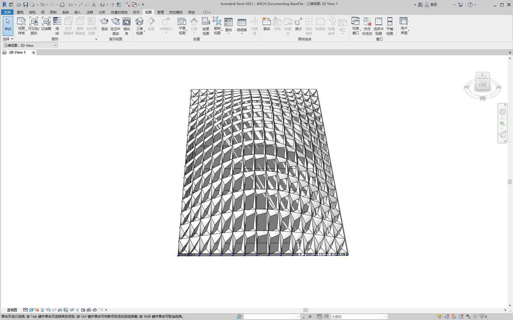
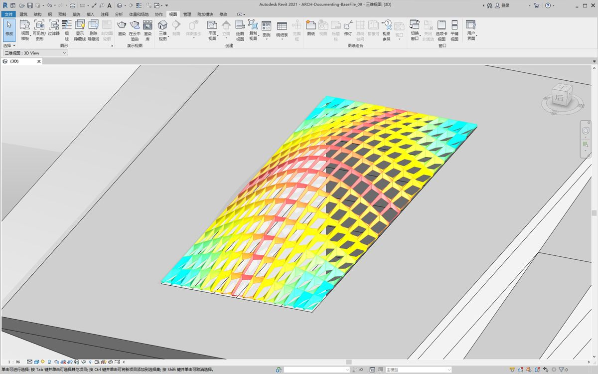
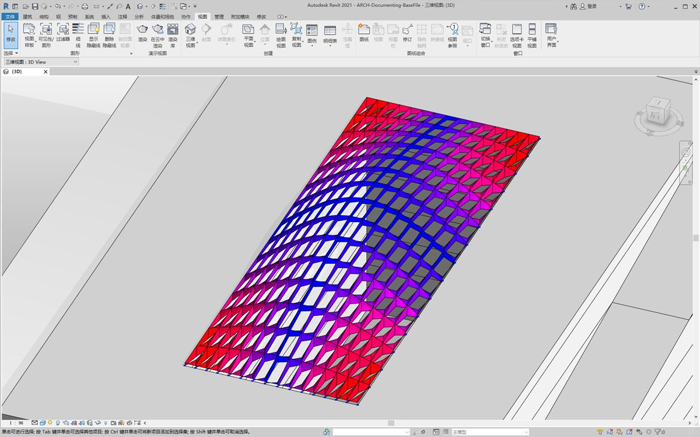
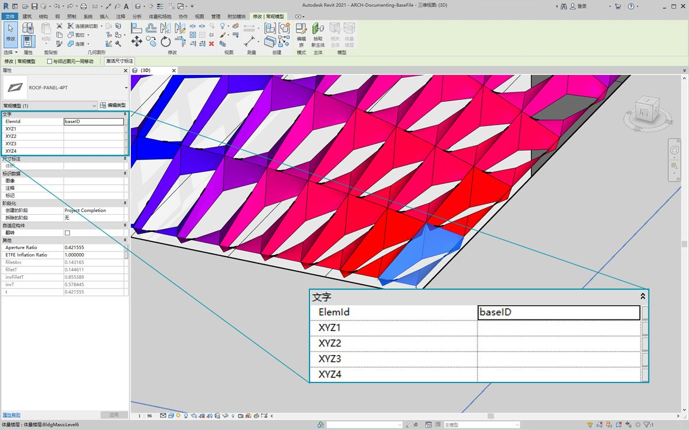
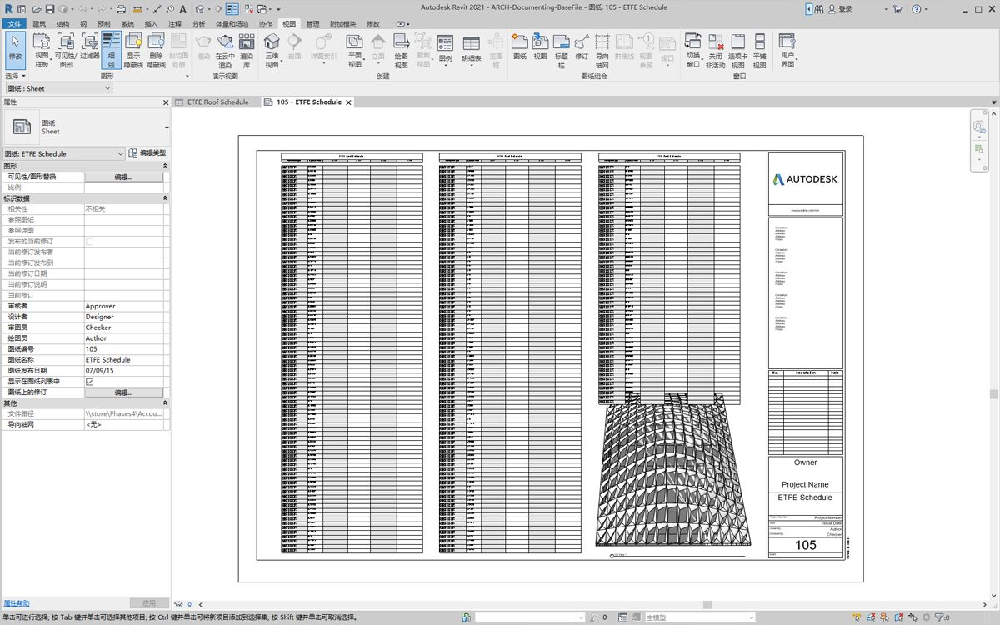
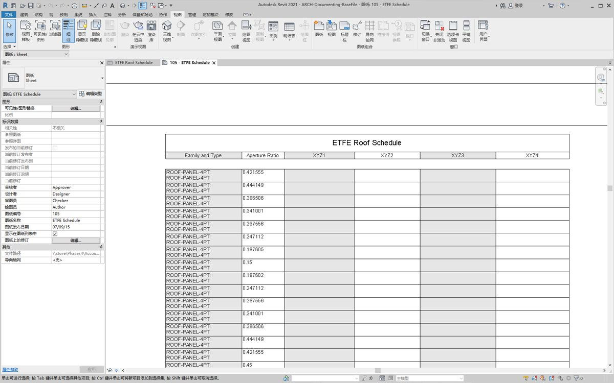
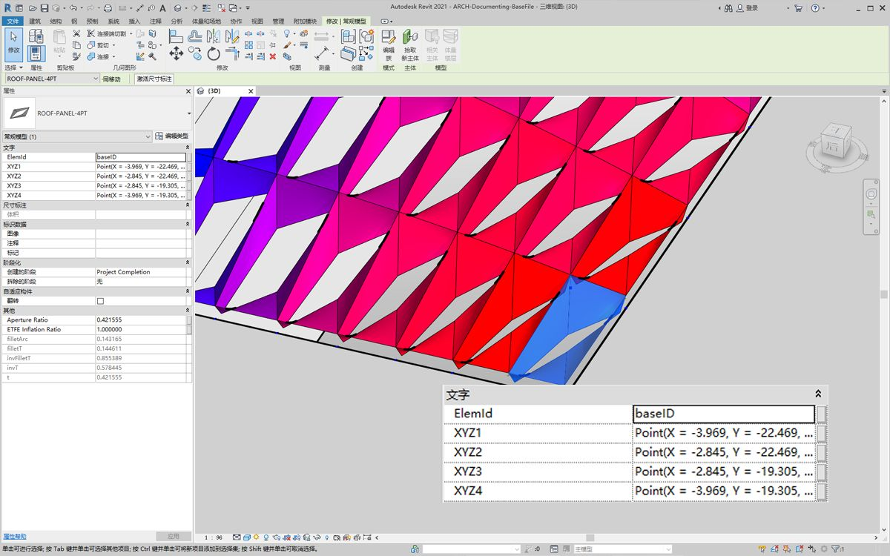
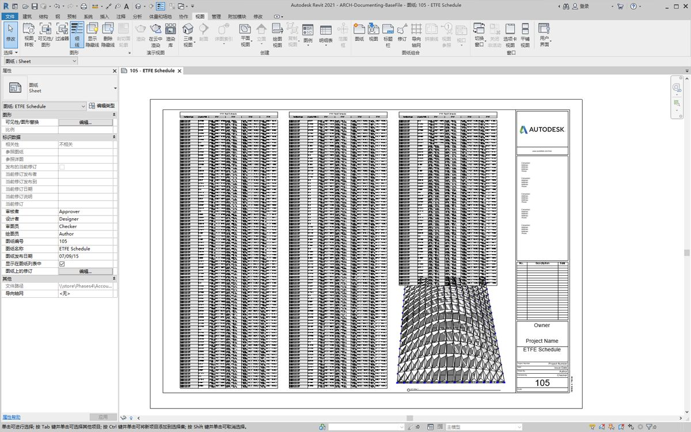
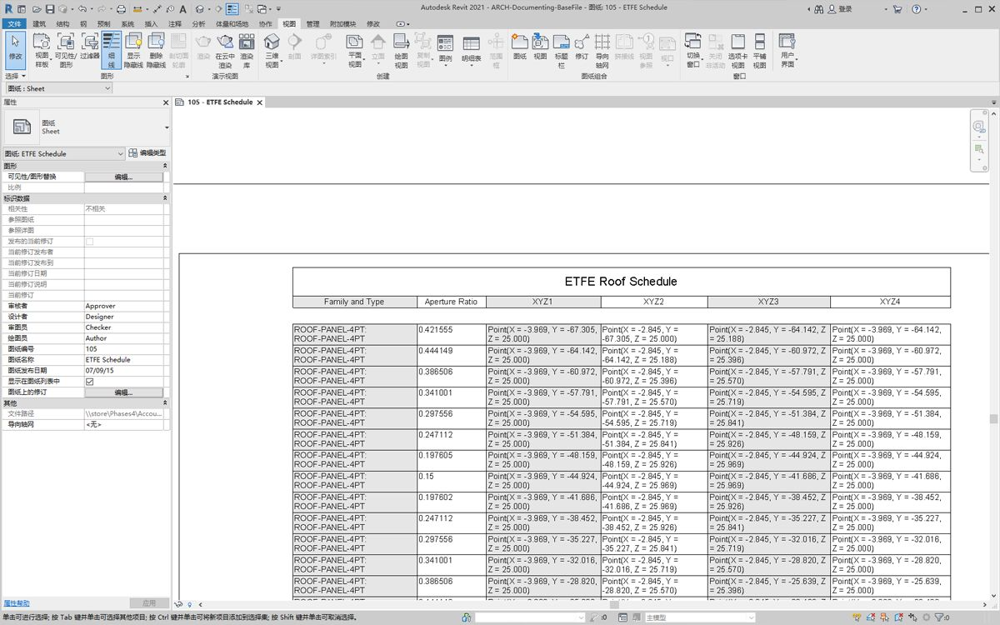

## 记录

编辑文档记录的参数时遵循前面几节课程中学到的经验教训。在本节中，我们将查看编辑参数，这些参数不会影响图元的几何特性，而是为文档记录准备 Revit 文件。

#### 偏离

在下面的练习中，我们将使用与平面节点的基本偏差，来为文档记录创建 Revit 图纸。参数化定义的屋顶结构上的每个嵌板都有不同的偏差值，我们希望使用颜色来突出值的范围，并通过安排自适应点来移交给外立面顾问、工程师或承包商。


> “与平面的偏差”节点将计算四个点集与它们之间的最佳拟合平面之间的距离。这是一种研究可施工性快速而简便的方法。

### 练习

> 下载本练习随附的示例文件（单击鼠标右键，然后单击“将链接另存为...”）。可以在附录中找到示例文件的完整列表。

> 1. [Documenting.dyn](datasets/8-6/Documenting.dyn)
2. [ARCH-Documenting-BaseFile.rvt](datasets/8-6/ARCH-Documenting-BaseFile.rvt)

从本部分的 Revit 文件开始（或从上一节继续）。此文件中具有屋顶上 ETFE 嵌板的阵列。在本练习中，我们将参照这些嵌板。


> 1. 向画布添加*“族类型”*节点，然后选择*“ROOF-PANEL-4PT”*。
2. 将此节点连接到“选择*族类型的所有图元*”节点，以将所有图元从 Revit 输入到 Dynamo。


> 1. 使用 *AdaptiveComponent.Locations* 节点查询每个图元的自适应点位置。
2. 使用 *Polygon.ByPoints* 节点基于这四个点创建多边形。请注意，我们现在在 Dynamo 中拥有镶板系统的抽象版本，无需输入 Revit 图元的完整几何图形。
3. 使用 *Polygon.PlaneDeviation* 节点计算平面偏差。


> 接下来，与上一练习一样，我们会根据每个嵌板的平面偏差设置其 *Aperture Ratio*。

> 1. 将 *Element.SetParameterByName* 节点添加到画布，然后将自适应构件连接到 *element* 输入。将读取*“Aperture Ratio”*的*代码块*连接到 *parameterName* 输入。
2. 我们无法直接将偏差结果连接到值输入，因为我们需要将这些值重新映射到参数范围。


> 1. 使用 *Math.RemapRange*，将偏差值重新映射到介于 *.15* 和 *.45* 之间的域。
2. 将这些结果连接到 *Element.SetParameterByName* 的值输入。



> 返回 Revit，我们可以*稍微*了解表面上孔径的变化。



> 放大后，可以更清楚地看到闭合的嵌板在表面的各个角落上都具有权重。开口角点朝向顶部。角点表示较大偏差的区域，而凸度具有最小曲率，因此这很有意义。

### 颜色和文档

设置“Aperture Ratio”并不能清楚地显示屋顶上嵌板的偏差，而且我们还要修改实际图元的几何图形。假定我们只想研究制造可行性的偏差。根据我们文档的偏差范围对嵌板进行着色会很有帮助。我们可以通过以下一系列步骤实现，并且流程与上述步骤非常相似。


> 1. 删除 *Element.SetParameterByName* 节点，然后添加 *Element.OverrideColorInView*。
2. 将 *Color Range* 节点添加到画布，然后连接到 *Element.OverrideColorInView* 的颜色输入。为了创建渐变，我们仍需将偏差值连接到颜色范围。
3. 将光标悬停在 *value* 输入上，我们可以看到输入值必须介于 *0* 和 *1* 之间，以便将颜色映射到每个值。我们需要将偏差值重新映射到此范围。


> 1. 使用 *Math.RemapRange*，将平面偏差值重新映射到介于 *0* 和 *1* 之间的范围（注意：也可以使用*“MapTo”*节点定义源域）。
2. 将结果连接到 *Color Range* 节点。
3. 请注意，我们的输出是颜色范围，而不是数字范围。
4. 如果设置为“手动”，请单击*“运行”*。此时，应该能够无需再设置为“自动”。



> 返回 Revit，我们看到了更清晰的渐变，它代表了基于我们颜色范围的平面偏差。如果我们要自定义颜色，该怎么办？请注意，最小偏差值以红色表示，这似乎与我们的预期相反。我们希望最大偏差以红色表示，最小偏差以较柔和的颜色表示。我们返回 Dynamo，然后修复此问题。


> 1. 使用*代码块*，在两个不同代码行上添加两个数字：```0;``` 和 ```255;```。
2. 通过将相应值连接到两个 *Color.ByARGB* 节点，即可创建红色和蓝色。
3. 以这两种颜色创建列表。
4. 将此列表连接到 *Color Range* 的 *colors* 输入，然后观察自定义颜色范围更新。



> 返回 Revit，我们现在可以更好地了解角点处最大偏差的区域。请记住，此节点用于替代视图中的颜色，因此如果我们在专注于特定分析类型的工程图集中有特定图纸，这将非常有用。

### 调度



> 1. 在 Revit 中选择一个 ETFE 嵌板，我们会看到有四个实例参数：*XYZ1、XYZ2、XYZ3* 和 *XYZ4*。创建这些参数后，它们的内容都为空。这些是基于文字的参数，都需要值。我们会使用 Dynamo 将自适应点位置写入每个参数。如果需要将几何图形发送给外立面顾问工程师，这有助于实现互操作性。



> 在样例图纸中，我们有一个大的空明细表。XYZ 参数是 Revit 文件中的共享参数，这样我们便可将它们添加到明细表中。



> 放大后，XYZ 参数尚未填充。前两个参数由 Revit 处理。


> 要写入这些值，我们将执行复杂的列表操作。该图本身很简单，但是这些概念在列表一章中讨论的列表映射的基础上进行了大量构建。

> 1. 选择具有两个节点的所有自适应构件。
2. 使用 *AdaptiveComponent.Locations* 提取每个点的位置。
3. 将这些点转换为字符串。请记住，参数基于文字，因此我们需要输入正确的数据类型。
4. 创建四个字符串列表，该列表定义要更改的参数：*XYZ1、XYZ2、XYZ3* 和 *XYZ4*。
5. 将此列表连接到 *Element.SetParameterByName* 的 *parameterName* 输入。
6. 将 *Element.SetParameterByName* 连接到 *List.Combine* 的 *combinator* 输入。
7. 将*自适应构件*连接到 *list1*。
8. 将 Object 的 *String* 连接到 *list2*。
9. 我们在此处进行列表映射，因为我们要为每个元素编写四个值，从而创建一个复杂的数据结构。*List.Combine* 节点在数据层次结构中定义一个向下步骤的操作。这就是元素和值输入保留为空的原因。*List.Combine* 将根据其连接顺序将其输入的子列表连接到 *List.SetParameterByName* 的空输入。



> 在 Revit 中选择一个嵌板后，现在会看到每个参数都有字符串值。实际上，我们将创建更简单的格式来写入点 (X,Y,Z)。这可以在 Dynamo 中使用字符串操作完成，但是我们会绕过此处以停留在本章的范围内。



> 样例明细表的视图，其中已填充参数。



> 现在，每个 ETFE 嵌板都为每个自适应点写入了 XYZ 坐标，从而表示每个嵌板的角点以进行预制。

