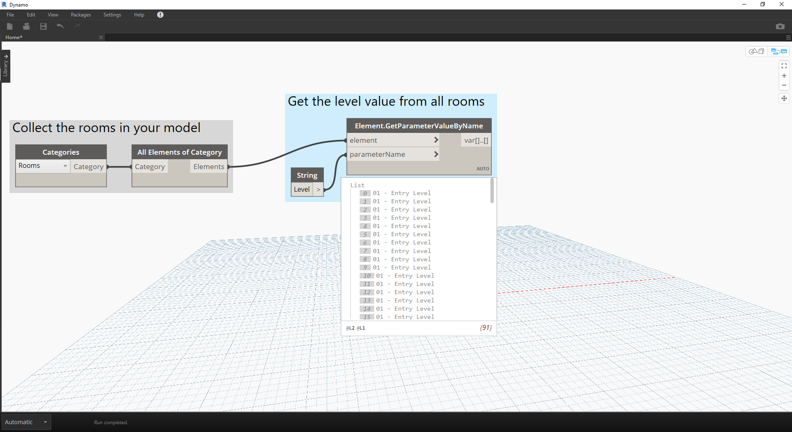

# 词典 - Revit 使用案例

您是否曾想过使用 Revit 中包含的数据查找内容？

#### 如果您已执行如下操作，则很可能：


> 在上图中，我们收集 Revit 模型中的所有房间，获取所需房间的索引（按房间编号），最后在索引处抓取房间。

### 现在，让我们使用词典重建这个想法。

> 下载本练习随附的示例文件（单击鼠标右键，然后单击“将链接另存为...”）：[RoomDictionary.dyn](datasets/9-4_roomDictionary.dyn)。可以在附录中找到示例文件的完整列表。

 首先，我们需要收集 Revit 模型中的所有房间。

> * 我们选择要处理的 Revit 类别（在本例中，我们处理的是房间）。
* 我们告诉 Dynamo 收集所有这些元素

 接下来，我们需要决定要使用哪些键来查找这些数据。（与键相关的信息可以在 [9-1 什么是词典](9-1_What-is-a-dictionary,md)中找到）。

> * 我们将使用的数据是房间编号。

 现在，我们将使用给定的键和元素创建词典。

> * 节点 ```Dictionary.ByKeysValues``` 将根据相应的输入创建词典。
* ```Keys``` 需要是字符串，而 ```values``` 可以是多种对象类型。

 最后，我们现在可以使用房间编号从词典中检索房间。

> * ```String``` 将是用于从词典查找对象的键。
* ```Dictionary.ValueAtKey``` 现在将从词典中获取对象。

---

### 使用相同的词典逻辑，我们还可以使用分组对象创建词典。如果我们希望在给定级别查找所有房间，可以按如下所示修改上图。



> * 我们现在可以使用参数值（在本例中，我们将使用 Level），而不是将房间编号用作键。


> * 现在，我们可以按房间所在的标高对房间进行分组。


> * 按标高对元素进行分组后，我们现在可以使用共享键（唯一键）作为词典的键，以及将房间列表作为元素。


> * 最后，使用 Revit 模型中的标高，我们可以在词典中查找位于该标高的房间。```Dictionary.ValueAtKey``` 将获取标高名称并返回该标高的房间对象。

使用词典的机会确实是无限的。在 Revit 中将 BIM 数据与元素本身关联的功能可用于各种使用案例。

