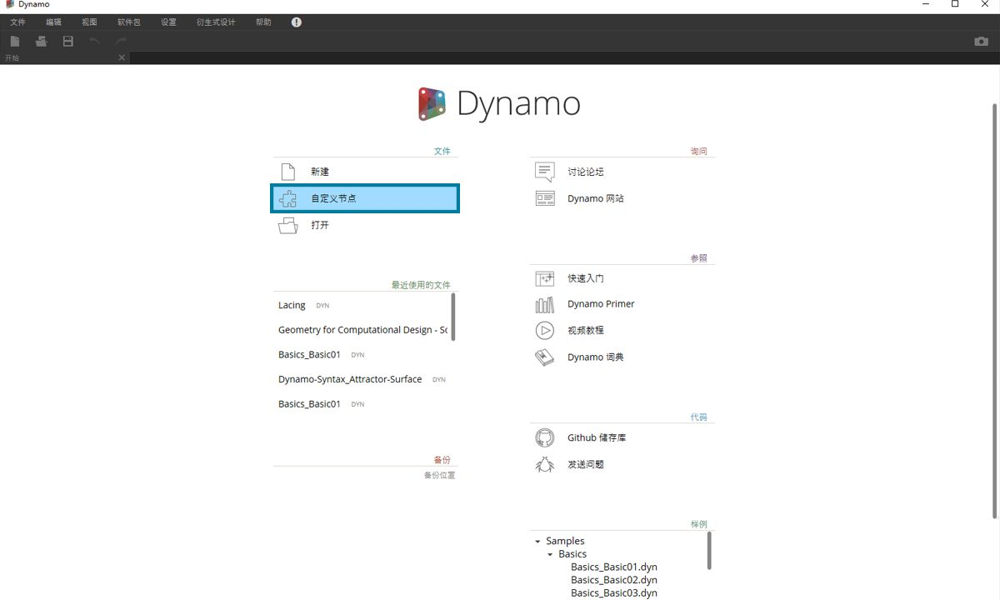
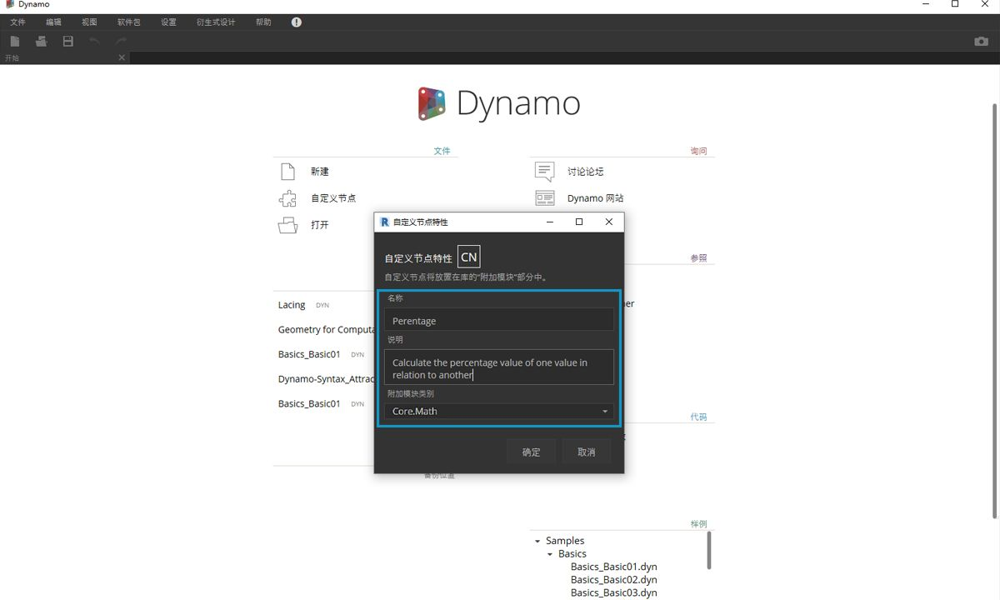
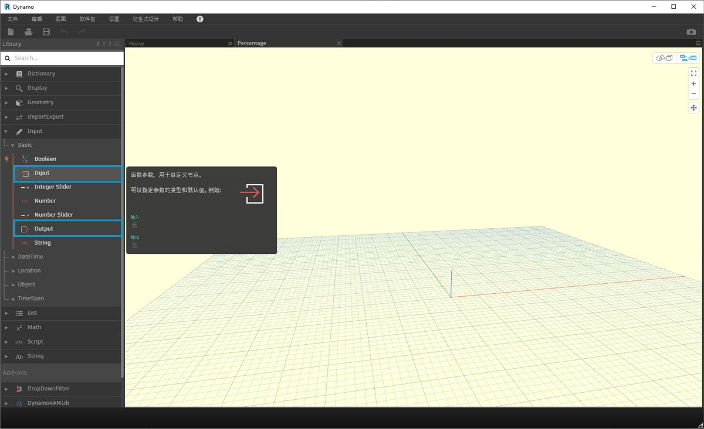

## 自定义节点

Dynamo 为各种可视化编程任务提供了许多核心节点。有时，更快速、更简洁或更轻松共享的解决方案是构建自己的节点。这些节点可以在不同项目中重用，使图形更清晰、更简洁，并且可以将它们推送到软件包管理器，并与全局 Dynamo 社区共享。

### 清理图形

自定义节点通过在“Dynamo 自定义节点”内嵌套其他节点和自定义节点来构建，我们可以从概念上将其看作容器。在图形中执行该容器节点时，将执行其中的所有内容，以允许您重用和共享有用的节点组合。

### 适应变化

如果图形中有自定义节点的多个副本，可以通过编辑基础自定义节点更新所有副本。这样，您可以通过适应工作流或设计中可能发生的任何更改来无缝更新图形。

### 工作共享

可以说，自定义节点的最佳功能是其工作共享功能。如果“超级用户”创建复杂的 Dynamo 图形，并将其交给 Dynamo 的新手设计师，则他/她可以将图形压缩为用于设计交互的基本要素。可以打开自定义节点来编辑内部图形，但“容器”可以保持简单。借助此过程，自定义节点可让 Dynamo 用户设计清晰且直观的图形。

### 构建节点的多种方法

在 Dynamo 中，有多种方法可构建自定义节点。在本章的示例中，我们将直接从 Dynamo 用户界面创建自定义节点。如果您是程序员并且对 C# 或 Zero-Touch 格式感兴趣，则可以参考 Dynamo Wiki 上的[此页面](https://github.com/DynamoDS/Dynamo/wiki/How-To-Create-Your-Own-Nodes)进行更深入的了解。

### 自定义节点环境

我们跳到自定义节点环境，并创建一个简单节点来计算百分比。自定义节点环境与 Dynamo 图形环境不同，但交互基本相同。说到这里，让我们创建第一个自定义节点！

> 若要从头开始创建自定义节点，请启动 Dynamo 并选择“自定义节点”,或者从画布键入 Ctrl + Shift + N。

> 在“自定义节点属性”对话框中指定名称、说明和类别。

> 1. **名称：**百分比
2. **说明：**计算一个值相对于另一个值的百分比。
3. **类别：**Core.Math

> 这将打开一个带黄色背景的画布，表示您正在自定义节点内部工作。在此画布中，您可以访问所有核心 Dynamo 节点，以及**“输入”**和**“输出”**节点，这些节点标记自定义节点的数据流入和流出。可以在*“核心”>“输入”*中找到它们。

> 1. **输入：**输入节点在自定义节点上创建输入端口。输入节点的语法为 *input_name : datatype = default_value（可选）*。

2. **输出：**与输入类似，这些输出将在自定义节点上创建和命名输出端口。考虑将**“自定义注释”**添加到输入和输出端口，以提示输入和输出类型。这将在[“创建自定义节点”部分](10-2_Creating.md)中详细介绍。

您可以将此自定义节点另存为 .dyf（与标准 .dyn 相反）文件，并且该文件将自动添加到您的会话和将来的会话中。您将在库中找到自定义节点，该节点位于在自定义节点的属性中指定的类别中。

> 左：默认库的“核心”>“数学”类别 
右：包含新的自定义节点的“核心”>“数学”

### 前进

现在，我们已创建了第一个自定义节点，接下来的部分将更深入地介绍自定义节点功能以及如何发布常规工作流。在以下部分中，我们将介绍如何开发将几何体从一个曲面传输到另一个曲面的自定义节点。

