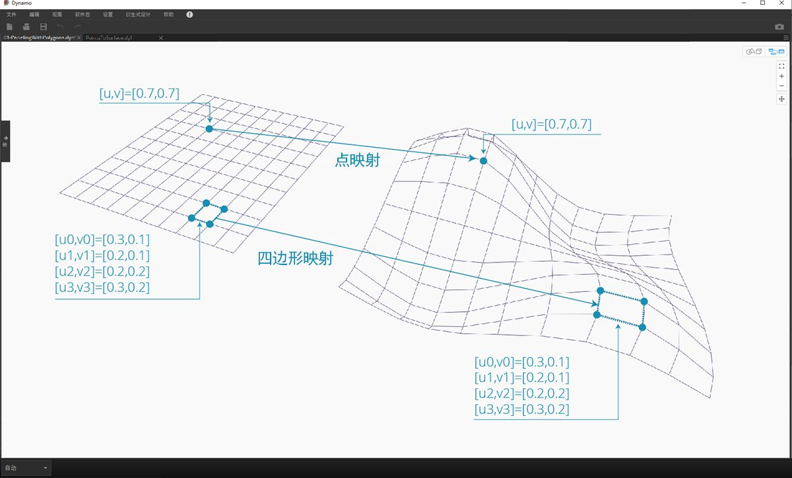
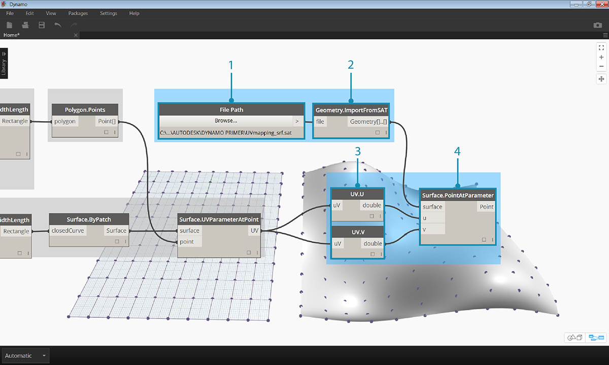
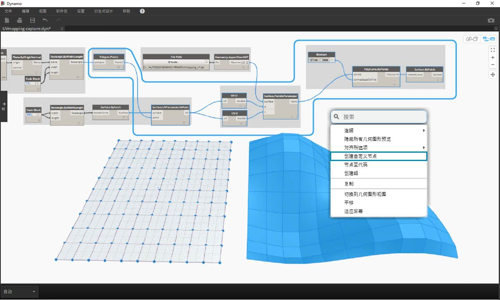
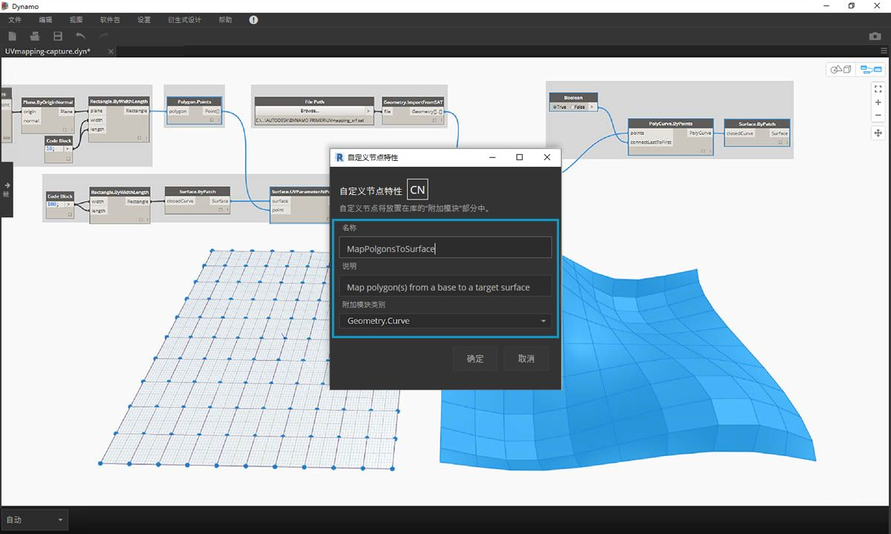

## 创建自定义节点

Dynamo 提供了几种不同方法来创建自定义节点。可以从头开始构建自定义节点、从现有图形构建自定义节点，也可以在 C# 中显式构建自定义节点。在本节中，我们将介绍如何在 Dynamo UI 中基于现有图形构建自定义节点。此方法非常适用于清理工作空间，以及打包一系列节点以在其他位置重用。

### UV 映射的自定义节点

在下图中，我们使用 UV 坐标将某个点从一个曲面映射到另一个曲面。我们将利用此概念创建镶板曲面，该曲面参照 XY 平面中的曲线。我们将在此处创建四边形嵌板以进行镶板，但是使用相同的逻辑，我们可以使用 UV 映射创建各种嵌板。这是开发自定义节点的绝佳机会，因为我们将能够在此图形或其他 Dynamo 工作流中更轻松地重复类似过程。

### 基于现有图形创建自定义节点

> 下载并解压缩本练习的示例文件（单击鼠标右键，然后选择“将链接另存为...”）。可以在附录中找到示例文件的完整列表。[UV-CustomNode.zip](datasets/10-2/UV-CustomNode.zip)

首先，我们创建一个要嵌套到自定义节点的图形。在本示例中，我们将使用 UV 坐标创建一个图形，该图形会将多边形从基础曲面映射到目标曲面。我们经常使用此 UV 映射过程，使其成为用于自定义节点的理想候选过程。有关曲面和 UV 空间的详细信息，请参见第 5.5 节。完整的图形是来自上述下载的 .zip 文件中的 *UVmapping_Custom-Node.dyn*。

> 1. **代码块**：使用代码块在 45 到负 45 之间创建 10 个数字的范围。
2. **Point.ByCoordinates**：将代码块的输出连接到“x”和“y”输入，并将连缀设置为“交互参考”。现在，您应该有了点栅格。
3. **Plane.ByOriginNormal**：将*“Point”*输出连接到*“origin”*输入，以在每个点处创建一个平面。将使用默认法向矢量 (0,0,1)。
4. **Rectangle.ByWidthLength**：将上一步中的平面连接到*“plane”*输入，并使用值为 *10* 的代码块指定宽度和长度。

现在，您应该看到矩形栅格。让我们使用 UV 坐标将这些矩形映射到目标曲面。

> 1. **Polygon.Points**：将上一步中的“Rectangle”输出连接到*“polygon”*输入以提取每个矩形的角点。这些点是我们要映射到目标曲面的点。
2. **Rectangle.ByWidthLength**：使用值为 *100* 的代码块指定矩形的宽度和长度。这将是基础曲面的边界。
3. **Surface.ByPatch**：将上一步中的矩形连接到*“closedCurve”*输入以创建基础曲面。
4. **Surface.UVParameterAtPoint**：连接 *Polygon.Points* 节点的*“Point”*输出和 *Surface.ByPatch* 节点的*“Surface”*输出，以返回每个点处的 UV 参数。

现在，我们已拥有一个基础曲面和一组 UV 坐标，可以输入目标曲面并在曲面之间映射点。

> 1. **文件路径**：选择要输入的曲面的文件路径。文件类型应为 .SAT。单击*“浏览...”*按钮，然后从上述下载的 .zip 文件导航到 *UVmapping_srf.sat* 文件。
2. **Geometry.ImportFromSAT**：连接文件路径以输入曲面。您应该在几何图形预览中看到输入的曲面。
3. **UV**：将 UV 参数输出连接到 *UV.U* 和 *UV.V* 节点。
4. **Surface.PointAtParameter**：连接输入的曲面以及 U 和 V 坐标。现在，您应该会在目标曲面上看到三维点栅格。

最后一步是使用三维点来构造矩形曲面修补。

> 1. **PolyCurve.ByPoints**：连接曲面上的点，以通过这些点构造复合线。
2. **布尔**：将布尔值添加到工作空间，并将其连接到*“connectLastToFirst”*输入，然后切换到 True 以关闭复合线。现在，您应该看到映射到曲面的矩形。
3. **Surface.ByPatch**：将复合线连接到*“closedCurve”*输入以构建曲面修补。

现在，我们选择要嵌套到自定义节点中的节点，以考虑我们希望哪些内容作为节点的输入和输出。我们希望自定义节点尽可能灵活，以便它应该能够映射任何多边形，而不仅仅是矩形。

> 选择上述节点（以 *Polygon.Points* 开头），在工作区上单击鼠标右键，然后选择*“选择中的节点”*。

> 在“自定义节点特性”对话框中，为“自定义节点”指定名称、描述和类别。

> “自定义节点”已显着清理工作空间。请注意，已基于原始节点命名输入和输出。让我们编辑“自定义节点”，以使名称更具描述性。

> 双击“自定义节点”以对其进行编辑。这将打开一个工作空间，该工作空间具有表示节点内部的黄色背景。

> 1. **输入**：将输入名称更改为 *baseSurface* 和 *targetSurface*。
2. **输出**：为映射的多边形添加附加输出。
> 保存自定义节点，然后返回到主工作空间。

> **MapPolygonsToSurface** 节点反映了我们刚才所做的更改。

我们还可以通过添加**自定义注释**来增加“自定义节点”的稳定性。注释有助于提示输入和输出类型或解释节点的功能。用户将光标悬停在“自定义节点”的输入或输出上时，将显示注释。

> 双击“自定义节点”以对其进行编辑。这将重新打开黄色背景的工作空间。

> 1. 开始编辑“输入代码块”。要开始注释，请键入“//”，后跟注释文字。键入可能有助于阐明节点的任何内容 - 在此处，我们将介绍 *targetSurface*。
2. 我们还将通过设置输入类型等于某个值，来设置 *inputSurface* 的默认值。在此处，我们将默认值设置为原始 Surface.ByPatch 集。

> 注释也可以应用于输出。开始编辑“输出代码块”中的文字。要开始注释，请键入“//”，后跟注释文字。在此处，我们将通过添加更深入的描述来阐明*“Polygons”*和*“surfacePatches”*输出。

 >

1. 将光标悬停在“自定义节点输入”上即可查看注释。
2. 在对 *inputSurface* 设置默认值后，我们还可以运行定义，无需输入曲面。

